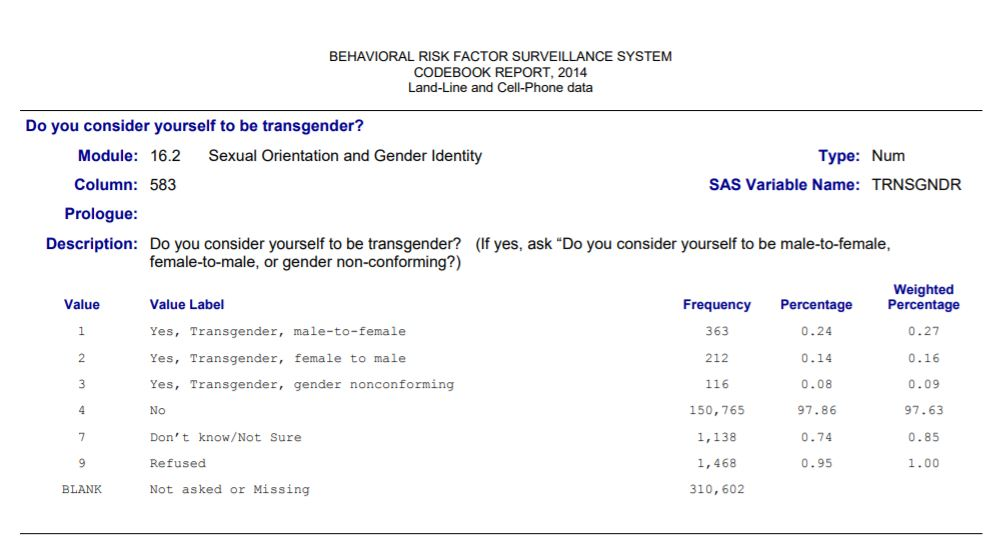
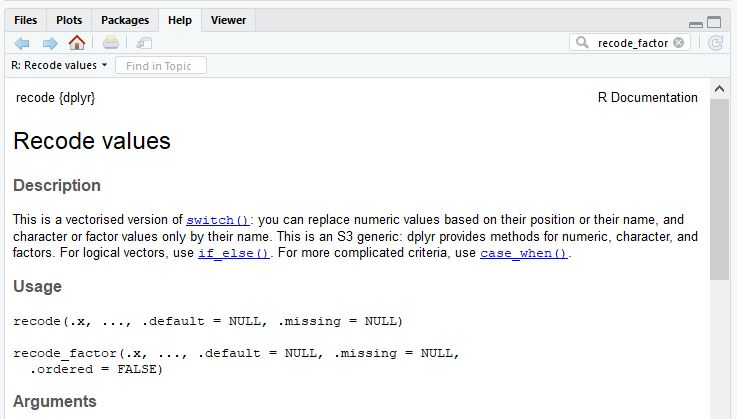

# The R team computes and reports descriptive statistics (Shelly Test 3)

## Achievements to unlock

Leslie is excited to keep her R education going while she works with Nancy and Kiara to understand some more tricky problems. Nancy explains that the next step is to learn about **descriptive statistics.** Consistent with the name, she explained, **descriptive statistics** are statistics that *describe* whatever is being studied, like people or organizations. Descriptive statistics are important since they provide information on the characteristics of the observations in a data set and provide context for interpretation of the results from complex statistical tests. Descriptive statistics may also be used to help choose the correct statistical test to use to answer your questions.

After getting used to the R environment and preparing data for analysis with the tricky weed problem, Leslie wonders if the group can tackle something she heard about on a podcast. Specifically, Leslie is interested in the issue of transgender health and how transgender patients are treated in a system that has traditionally focused on two sexes. Nancy and Kiara think this is a great idea and develops a list of R acheivements to improve Leslie's R skills while they work on understanding transgender healthcare. To work on this issue, Nancy and Kiara create an outline for what they will discuss:

* The tricky transgender healthcare problem
* Achievement 1: Understanding variable types and data types
* Achievement 2: Choosing and conducting descriptive analyses for categorical (factor) variables
* Achievement 3: Choosing and conducting descriptive analyses for continuous (numeric) variables
* Achievement 4: Developing clear tables for reporting descriptive statistics

Before opening R and getting started, Leslie does some reading on the problem including a recent paper on mammography that demonstrates some of the challenges for transgender people in the current system. She summarizes what she found for Nancy and Leslie. 

## The transgender healthcare problem

Leslie first wants to clarify the definition of transgender to make sure they are all all on the same page. First, there is a difference between sex and gender that is important for understanding the term transgender and other terms related to gender identity and sexual orientation. The term _sex_ refers to biology and the term _gender_ refers to identity. Nancy agrees with the definition of sex, but had heard broader definitions of _gender_ that include aspects of biology, psychosocial factors, and culture along with identity [@mayer2008sexual]. She looks up the World Health Organization (WHO) definition for gender:

> "Gender refers to the socially constructed characteristics of women and men – such as norms, roles and relationships of and between groups of women and men. It varies from society to society and can be changed. While most people are born either male or female, they are taught appropriate norms and behaviours – including how they should interact with others of the same or opposite sex within households, communities and work places." [@WHOGender-2019-04-23] 

Leslie is glad they looked this up, it is much more clear than her initial description. She goes on to explain that *transgender* people are people whose *biological sex* is not consistent with their *gender* [@mayer2008sexual]. She quotes an older article from 2008 that she thinks has a clear definition that might help:

> "Transgender is an inclusive term to describe people who have gender identities, expressions, or behaviors not traditionally associated with their birth sex." ([@mayer2008sexual], page 990)

The 2008 paper gives a few examples of transgender including a person who is biologically female but identifies as a man, a person who is biologically male but identifies as a woman, or someone who feels like both or neither gender [@mayer2008sexual]. Nancy is looking at the Centers for Disease control and Prevention (CDC) website and clarifies that gender identity is the gender a person identifies as and gender expression is the gender a person outwardly shows [@TransgenderPersons]. Now that they have a clearer idea of who is considered transgender, Leslie has some background on health and healthcare for transgender people.

Transgender people face serious physical and mental health disparities [@safer2016barriers], often related to discrimination [@bradford2013experiences]. Among the most prevalent and concerning disparities are extremely high rates of HIV and other sextually transmitted infections, poor mental health, and high rates of substance use and abuse. For example, transgender women have a 19.1% prevalence of HIV worldwide [@baral2013worldwide] while reproductive age adults have an HIV prevalence of .4%. A survey of transgender adults in the United States found 44.1% with clinical depression, 33.2% with anxiety, and 27.5% with somatization, which are physical symptoms stemming from depression, anxiety, or another psychiatric condition [@lombardi2010transgender]. Attempted suicide rates range from 32% to 50% of transgender people worldwide, with higher rates among younger age groups [@virupaksha2016suicide]. 

In 2011, the Institute of Medicine (IOM) report found 35.5% of transgender adults are current smokers; this is more than twice the percentage of straight adults (14.9% smoking rate) [@stratton2001institute]. Transgender adults also have higher rates of alcohol and substance abuse [@benotsch2013non; @santos2014alcohol] and of overweight and obesity [@boehmer2007overweight]. Exacerbating these health disparities are limitations on access to healthcare [@RefWorks:2299] and limitations of the healthcare system to effectively address the unique health needs of transgender people [@reisner2016global; @daniel2015lesbian]. 

Given the high smoking rate, substance and alcohol use, and the prevalence of overweight and obesity, it is important that transgender people are adequately screened for cancer and other health conditions. One study found that transgender had 47% lower odds of breast cancer screening than cisgender adults (i.e., not transgender) attending an urban clinic [@bazzi2015adherence]. The findings from 2017 mammogram paper that Leslie read are not consistent with the 2015 study, finding that transgender and cisgender adults have comparable rates of mammography screening [@RefWorks:2300]. Nancy thinks maybe the rate is increasing over time since the 2017 study uses slightly newer data, but Kiara suggests that the Behavioral Risk Factor Surveillance Survey (BRFSS) data used in the second study likely measures people with different characteristics than the 2015 study which relied on people seeking care at an urban clinic. Both of these factors may contribute to the higher rate of screening in the more recent study. 

Leslie looks up the BRFSS and finds that it is a large national survey conducted by the CDC in the US by phone every year [@CDCBRFSS-2019-04-22]. The 2017 mammogram paper analyzed data from participants in the the 2014 BRFSS. The 2014 BRFSS included 464,664 participants and the sampling process was designed so that the sample would represent the US population as much as possible. The survey included questions about characteristics like age, sex, and income, along with questions about health behaviors and outcomes. 

In 2014, 19 states and Guam included a question about transgender transition status including male to female (MtF), female to male (FtM), or non-conforming. The entire sample from the 19 states and Guam included 151,456 people. Of the 151,456 participants, the study authors identified 222 survey participants who reported they were transgender, were 40-74 years old (the age range when mammograms are recommended), and were asked about having a mammogram. The mammogram question was only asked of those who describe themselves as being female sex.

Leslie shared the first table of statistics from the study with Kiara and Nancy:

```{r c2intro1, echo=FALSE}
library("knitr")
library("kableExtra")
library("tidyverse")
brfss.trans.2014 <- read.csv("data/transgender_hc_ch2.csv")

brfss.2014.cleaned <- brfss.trans.2014 %>% 
  mutate(TRNSGNDR, TRNSGNDR = recode_factor(TRNSGNDR, 
                                            `1` = 'Male to female',
                                            `2` = 'Female to male',
                                            `3` = 'Gender non-conforming',
                                            `4` = 'Not transgender',
                                            `7` = 'Not sure',
                                            `9` = 'Refused')) %>%
  mutate(PHYSHLTH, PHYSHLTH = na_if(PHYSHLTH, 77)) %>%
  mutate(PHYSHLTH, PHYSHLTH = na_if(PHYSHLTH, 99)) %>%
  mutate(PHYSHLTH, PHYSHLTH = as.numeric(recode(PHYSHLTH, `88` = 0L)))

# complete data management code
brfss.2014.small <- brfss.2014.cleaned %>%
  filter(TRNSGNDR == 'Male to female'|
           TRNSGNDR == 'Female to male'|
           TRNSGNDR ==  'Gender non-conforming') %>%
  filter(X_AGEG5YR > 4 & X_AGEG5YR < 12) %>% 
  filter(!is.na(HADMAM)) %>%
  mutate(TRNSGNDR = if_else(HADMAM != 9, TRNSGNDR, factor(NA))) %>%
  select(TRNSGNDR, X_AGEG5YR, X_RACE,X_INCOMG, X_EDUCAG, HLTHPLN1, PHYSHLTH) %>%
  mutate(X_AGEG5YR, X_AGEG5YR = recode_factor(X_AGEG5YR,
                                              `5` = '40-44',
                                              `6` = '45-49',
                                              `7` = '50-54',
                                              `8` = '55-59',
                                              `9` = '60-64',
                                              `10` = '65-69',
                                              `11` = '70-74')) %>%
  mutate(X_INCOMG, X_INCOMG = recode_factor(X_INCOMG,
                                            `1` = 'Less than $15,000',
                                            `2` = '$15,000 to less than $25,000',
                                            `3` = '$25,000 to less than $35,000',
                                            `4` = '$35,000 to less than $50,000',
                                            `5` = '$50,000 or more',
                                            `9` = 'Don\'t know/not sure/missing')) %>%
  mutate(X_EDUCAG, X_EDUCAG = recode_factor(X_EDUCAG,
                                            `1` = 'Did not graduate high school',
                                            `2` = 'Graduated high school',
                                            `3` = 'Attended College/Technical School',
                                            `4` = 'Graduated from College/Technical School',
                                            `9` = NA_character_)) %>%
  mutate(HLTHPLN1, HLTHPLN1 = recode_factor(HLTHPLN1, 
                                            `1` = 'Yes',
                                            `2` = 'No',
                                            `7` = 'Don\'t know/not sure/missing',
                                            `9` = 'Refused')) %>%
  mutate(X_RACE, X_RACE = recode_factor(X_RACE,
                                        `1` = 'White',
                                        `2` = 'Black',
                                        `3` = 'Native American',
                                        `4` = 'Asian/Pacific Islander',
                                        `5` = 'Other',
                                        `6` = 'Other',
                                        `7` = 'Other',
                                        `8` = 'Other',
                                        `9` = 'Other')) %>%
  droplevels()

# add variable labels to print in table
labelled::var_label(brfss.2014.small) <- c("Transition status (n = 220)",
                                           "Age category",
                                           "Race/ethnicity",
                                           "Income category",
                                           "Education category",
                                           "Health insurance?",
                                           "Days/month good physical health")

# finding percentages and rounding to one decimal place
# putting all percentages in one column with cbind
TableFun <- function(x){
    data.frame(round(prop.table(table(x))*100, 1))
}

( table.data <- do.call(rbind, (lapply(brfss.2014.small[ , -7], TableFun))) )
table.data <- data.frame(table.data[c(1:26), ])

#label the columns
colnames(table.data) <- c("Survey participant demographics","Percent")
```

```{r echo=FALSE}
table.data %>%
  kable("html", caption = "Transgender Survey Participant Demographics (n=222)", 
      row.names = FALSE) %>%
  kableExtra::group_rows("Transition status (n=220)", 1, 3) %>%
  kableExtra::group_rows("Age category", 4, 10) %>%
  kableExtra::group_rows("Race/ethnicity", 11, 15) %>%
  kableExtra::group_rows("Income category", 16, 21) %>%
  kableExtra::group_rows("Education category", 22, 25) %>%
  kableExtra::group_rows("Health insurance?", 26, 26) 
```

Leslie explains that, prior to examining statistical relationships among variables, published studies in academic journals usually present **descriptive statistics** like the ones in Table 1. She adds that descriptive statistics are often displayed in the first table in a published article or report and are therefore sometimes referred to as the **Table 1** statistics or, even more commonly, as the **descriptives**. She also points out that, in this case, all the descriptives in the transgender health paper are percentages showing the percentage of people in each category. She explains that percentages were computed for this table because of **the types of variables** the researchers examined. Now that they have some background and an idea of the topic and data they are working with, Nancy and Kiara are ready to get started. 

## Achievement 1: Understanding variable types and data types

### Data types for categorical variables

In Section \@ref(achievement-3:-understanding-and-changing-data-types) Kiara introduced Leslie to several data types including factor, numeric, integer, and string. Arguably, the two data types most commonly used in social science research are **factor** and **numeric.** Kiara reminds Leslie that the **factor** data type is used for information that is measured or coded in categories, or **categorical variables**. Leslie knows from her statistics courses that there are two types of categorical variables, **nominal** and **ordinal.** Nominal categorical variables are variables measured in categories that do not have any logical order, like marital status, religion, sex, and race. 

Leslie then describes **ordinal categorical variables**, which are different from nominal because the categories have a logical order. One way Leslie likes to remember this is to notice that ordinal and order both start with *o-r-d*, so ordinal variables have an order. For example, income can be measured in categories such as: < \$10k, \$10k - \$24,999, \$25k - \$99,999, \$100k+. These categories have a logical order from the lowest income group to the highest income group.

Another common ordinal way of measuring things is the use of the **Likert scale**. Likert scale categories go in a logical order from least to most or most to least. For example, Leslie suggests that measuring agreement with the statement that *R is awesome* could use a Likert scale with the following options: Strongly agree, somewhat agree, neutral, somewhat disagree, strongly disagree. Leslie explains to the rest of the R team that often people refer to the number of categories as the *points* in a Likert scale. So, the agreement scale shown here is a 5-point Likert scale.

### Data types for continuous variables

On the other hand, explains Kiara, the **numeric** data type in R is used for continuous variables. Leslie confirms that **continuous** variables are the variables that can take *any* value along some *continuum*, hence **continuous**. Just like *o-r-d* is in *order* and **ordinal**, *c-o-n* is in *continuum* and **continuous**, which can be a good way to remember this variable type as well. Examples of continuous variables include age, height, weight, distance, blood pressure, temperature, etc. 

Kiara explains that the **numeric** data type is also used for variables that do not technically qualify as continuous but are measured along some sort of a continuum. Age in years would be one example since it falls along a continuum from 0 years old to over 100. However, by specifying age _in years_ the values for this variable cannot be any value between 0 and over 100, but instead are limited to the whole numbers in this range. Likewise, the number of cars in a parking lot, or the number of coins in a piggy bank, would be numeric but not truly continuous.

Leslie remembers that each different type of variable requires a different approach for analysis. Before getting into any complex statistical modeling, she remembers that descriptive statistics are key for understanding who or what is in the data set and often help in choosing an appropriate statistical test and refining analysis planning. 

### unlock achievement 1: Check your understanding

Identify the most appropriate R data type for the following variables: 

* number of healthy days per month 
* marital status
* religious affiliation
* smoking status
* number of alcohol beverages per week

## Achievement 2: Choosing and conducting descriptive analyses for categorical (factor) variables

Since the table from the paper (Figure \@ref(fig:c2intro1)) shows all categorical variables, the team starts there. Leslie knows that the two most commonly used and reported descriptive statistics for categorical (or factor) data types are frequencies and percents. For a categorical variable, frequencies are the number of observations--often people or organizations--that fall into a given category and percents are the proportion of all observations that fall into a given category.

### Computing frequencies and frequency distributions

Leslie also remembers that a **frequency distribution** shows the number of observations in each category for a factor or categorical variable. Leslie suggests that they could use a frequency distribution to examine how many observations there are for each transgender transition category in the BRFSS data set from the mammogram paper.

Before opening the data, Leslie examines the codebook for the 2014 data set on the Centers for Disease Control and Prevention (CDC) BRFSS website [@CDCBRFSS-2019-04-22]. The team looks through the codebook [@brfss-2014-codebook] together and find the transgender transition status information on page 83. The frequencies in this **frequency distribution** are 363 MtF transgender, 212 FtM transgender, 116 gender nonconforming, 150,765 not transgender, 1,138 don't know/not sure, 1,468 refused, and 310,602 not asked or missing.

```{r echo = FALSE, fig.cap="Screenshot of 2014 BRFSS codebook page 83."}

```

Kiara suggests that Leslie recreate this frequency distribution in R by first opening the BRFSS data file and then using an R command for frequencies. On the BRFSS website [@@CDCBRFSS-2019-04-22], the data file is available in **XPT** or **ASCII** format. The XPT is a *transport* file type from SAS statistical software; Kiara explains that one of the great features of R is that it can open most data sets from most software packages. This is one of the features of R that make it easier to do reproducible work. She says R can open the XPT file type by using the <span style="font-family:Lucida Console, monospace;font-weight:bold">haven</span> package that is part of the <span style="font-family:Lucida Console, monospace;font-weight:bold">tidyverse</span> in R. For now, Kiara says she has already downloaded, opened, and cleaned the data so they do not need to do all of that. Leslie is interested in understanding how she did this, so Kiara shares the code she used to download and clean the data with Leslie to review later (see Box \@ref(ch2kiara)).

After cleaning the data, Kiara created a **.csv** (comma separated values) file with the variables needed to recreate the table. Nancy introduces Leslie to the `read.csv()` command to import the data. Leslie writes a line of code, being sure to use the object naming recommendations she learned in the data preparation lesson. To follow along, download the **transgender_hc_ch2.csv** data set from edge.sagepub.com/harris1e and save it. Enter the location where the data file is saved in place of `data` in the `read.csv()` command. 
 
```{r c2main1}
# read the 2014 BRFSS data
brfss.trans.2014 <- read.csv(file = "data/transgender_hc_ch2.csv")
```

Leslie then highlights the code and uses the run button to import the data. The data show up in the Environment pane in the top right corner of R Studio. The entry in the Environment tab is under the *Data* heading and  reads **brfss.trans.2014** (the name given to the file). Next to the data frame name, Leslie can see that there are 464,664 observations and 9 variables in the data frame. This indicates that the data set contains 464,664 observations, which are people in this case, and this is consistent with the codebook, so Leslie is assured that the file is the data she needs.

### Making a basic table of frequencies and percents

Nancy is delighted to start coding! She starts by showing Leslie the easiest way to get a frequency distribution in R, which is to use `table()`. Using `table()` results in a plain table listing each value of a variable and the number of observations that have that value. The `table()` command takes the name of the data frame followed by a dollar sign and then the name of the variable to make a table with. In this case, it would look like:

```{r c2main2}
# frequency distribution for transgender
# participants in the 2014 BRFSS
table(brfss.trans.2014$TRNSGNDR)
```

The results show a set of numbers with the top row representing the categories and the bottom row giving the number of observations; the number of observations in each category is the **frequency**. It looks like the frequencies in this simple table match the frequencies in the 2014 BRFSS codebook [@@brfss-2014-codebook]. For example, the first category of MtF---where MtF stands for Male to Female---transgender shows 363 in the codebook and 363 in the table in R. 

While the numbers look ok, Nancy suggests that this table is poorly formatted and there is no way to know what any of the numbers stand for without more information. She explains that a table should include several features to make the contents of the table clear. These features include: 

* A main title indicating what is in the table
    + the overall sample size 
    + the year of data collection 
* Clear column and row labels
    + row/column sample size if different from overall
    
### Data management {#datamgmt}
    
In order to format this table so it is clear, Nancy advises that Leslie use some of the tools from Chapter 1 and some new tools. The first thing to do might be to add **labels** to the transgender variable so that it is clear which categories the frequencies represent. Leslie reminds herself that **labels** are the words that describe each category of a categorical or factor type variable. Before she can add labels, Leslie needs to know what type of variable the transgender variable is. Leslie starts by examining the data type of the variable with the `class()` command: 

```{r c2main3}
# check data type for transgender variable
class(x = brfss.trans.2014$TRNSGNDR)
```

The class is `r class(brfss.trans.2014$TRNSGNDR)`, which does not seem right to Leslie. She knows that this variable has categories and so should be the **categorical** data type, which is **factor** in R. She starts her data management by changing the data type of TRNSGNDR to a factor using the tidyverse package with the `mutate()` command and `as.factor()`.

```{r c2main4}
# open tidyverse for data management
library(package = "tidyverse")

# change variable from numeric to factor
brfss.2014.cleaned <- brfss.trans.2014 %>%
  mutate(TRNSGNDR, TRNSGNDR = as.factor(TRNSGNDR))

# check data type again
class(x = brfss.2014.cleaned$TRNSGNDR)
```

It worked! Now Leslie wants to add the category labels to the variable. She decides to add this onto the data management code she has already started. Nancy says this sounds great, but that the `recode_factor()` they used in the preparing data activities will work to recode AND to change the variable to a factor, so she can save a line of code and just use `recode_factor()` with `mutate()` instead of using `as.factor()` and then `recode_factor()`. Leslie looks up the category names in the codebook [@@brfss-2014-codebook] and finds that the categories are: 

* 1 = Male to female 
* 2 = Female to male 
* 3 = Gender non-conforming 
* 4 = Not transgender 
* 7 = Not sure 
* 9 = Refused 
* NA 

While Leslie is distracted, Nancy sees her chance to do some of the coding. She slides the laptop over and changes the `mutate()` code to use `recode_factor()` with the category labels. When she is done, she shares her work with Leslie and shows her that `recode_factor()` requires the original value of the variable on the left side of the `=` and that the original values are enclosed in backticks because the values are considered **names** rather than quantities. In R, **names** are labels given to a category or a variable or another object. Names that begin with a number are enclosed in backticks (or quote marks) in order to be recognized by R as a name and not a quantity or value. 

```{r c2main5}
# cleaning the TRNSGNDR variable
brfss.2014.cleaned <- brfss.trans.2014 %>% 
  mutate(TRNSGNDR, TRNSGNDR = recode_factor(TRNSGNDR, 
                                            `1` = 'Male to female',
                                            `2` = 'Female to male',
                                            `3` = 'Gender non-conforming',
                                            `4` = 'Not transgender',
                                            `7` = 'Not sure',
                                            `9` = 'Refused'))
```

Leslie wonders aloud how she would ever be able to remember the rule about putting numbers in backticks for  `recode_factor()`. Nancy says that some code is easy to remember, especially if she uses it a lot, but otherwise she uses the help documentation almost every day she is coding. She reminds Leslie that the help documentation is easy to use directly from R Studio and can be found as one of the tabs in the bottom right pane. She shows Leslie how to type recode_factor in the search box at the top of the help pane and the documentation for `recode_factor()` appears in the pane. 

While she has this open, she shows Leslie one features of the help documentation, which is that the package for a command  shows at the top left of the help documentation. In this case, the documentation lists *{dplyr}* in the top left so `recode_factor()` is in the <span style="font-family:Lucida Console, monospace;font-weight:bold">dplyr</span> package. Occasionally, Kiara says, she remembers some code but not the package it comes from, so the help documentation can be useful for that as well. 

```{r echo = FALSE, fig.cap="Screenshot of recode_factor help documentation."}

```

Once they are done looking at the help pane, Nancy suggests Leslie re-run `table()` from above. After re-running `table()` with the new labels, the frequencies are:

```{r c2main6}
# table of transgender status frequencies
table(brfss.2014.cleaned$TRNSGNDR)
```

It looks better, but it still needs some work on the formatting before it is ready to share with others. The <span style="font-family:Lucida Console, monospace;font-weight:bold">descr</span> (short for descriptives) package has a good option for a basic frequencies table with the `freq()` command. Since they are only using this one command, Nancy wants to use the `::` structure to open the package and run `freq()`. Nancy also knows that a graph is automatically printed with the `freq()` output and it is not useful at this point, so she shows Leslie how she uses the `plot = FALSE` option to stop the graph from printing with the output.

```{r c2main7}
# use freq from the descr package to make a table of frequencies and percents
# suppress the bar plot that automatically prints
descr::freq(x = brfss.2014.cleaned$TRNSGNDR, plot = FALSE)
```

Leslie notices that there are two columns in the output that show percents. She reviews the columns and finds that the **Percent** column includes the missing data (**NA**) in the calculation of the percent of observations in each category. The **Valid Percent** column removes the **NA** values and calculates the percent of observations that falls into each category **excluding the observations missing values on this variable**. 

Nancy thinks this is ok, but since they are already using the <span style="font-family:Lucida Console, monospace;font-weight:bold">tidyverse</span> package, they might try using it for this instead of opening a new package. She writes some alternate code to show Leslie how she might create this table:

```{r c2main8}
# use tidyverse to make table of frequency and percent
brfss.2014.cleaned %>%
  group_by(TRNSGNDR) %>%
  summarise(n = n()) %>%
  mutate(perc = 100*(n / sum(n)))
```

Leslie is not impressed, this looks like a lot more work to get the same information. Nancy agrees that, in this situation, the code seems more complicated to get the same table. She explains that sometimes it might be worth the time to use the more complicated code in order to keep a consistent style or in order to be able to use the code or its output for other things later. Leslie nods but remains skeptical.

Nancy notes that both the `freq()` and <span style="font-family:Lucida Console, monospace;font-weight:bold">tidyverse</span> tables include the information you might need for reporting, they are still not formatted in a way that is useful for incorporating directly into a report or other document. Leslie suggests that they copy these results into a word processing program and format the table there. 

Kiara cringes at this suggestion. Copying from statistical output into another document is where many errors occur in scientific reporting [@RefWorks:2301] and is a major reason why research results are not reproducible. It is more efficient and accurate to create a formatted table in R and use it without transcribing or changing the contents. Nancy suggests there are two great options for creating reproducible tables directly in R using the <span style="font-family:Lucida Console, monospace;font-weight:bold">tableone</span> and <span style="font-family:Lucida Console, monospace;font-weight:bold">kable</span> packages (see Box \@ref(ch2nancy2).

Leslie starts thinking about the information they get from `summary()` and wonders if that might also be a good way to get frequencies. Nancy thinks this is an interesting idea and they decide to try using `summary()` and saving the results as a data frame:

```{r c2main9}
# save summary to an object 
desc.from.summary <- summary(object = brfss.2014.cleaned)
desc.from.summary

# convert the object to a data frame
desc.from.summary.df <- data.frame(desc.from.summary)
desc.from.summary.df

```

After looking over the results, the team decides *desc.from.summary* table and *desc.from.summary.df* do not look very easy to use. Leslie wonders if there is any other code like `summary()` that summarizes all the variables at once. Nancy says she has used `describe()` from the <span style="font-family:Lucida Console, monospace;font-weight:bold">Hmisc</span> package. She suggests they load the package and try it: 

```{r c2main10}
# trying fivenum for descriptive statistics
Hmisc::describe(x = brfss.2014.cleaned)
```

They look through the information and see that percents are included, which is something that is not in the `summary()` output, however, there is a lot of output to read through in order to find specific information. Kiara says she prefers to use more targeted statistics and just uses `summary()` and `describe()` to get a sense of the data or to confirm her data management tasks have worked. Leslie thinks this is a good strategy, although she is curious what other packages might be out there and whether any of them and have the perfect descriptive statistics code. Kiara says she might like the <span style="font-family:Lucida Console, monospace;font-weight:bold">tableone</span> package they will use later.

### unlock achievement 2: Check your understanding

Use one of the methods shown to create a table of the HADMAM variable, which indicates whether or not the survey participant had a mammogram. Review the question and response options in the codebook and recode to ensure that the correct category labels show up in the table (see link in references [@brfss-2014-codebook]) before you begin. 
 
## Achievement 3: Choosing and conducting descriptive analyses for continuous (numeric) variables 

### Why frequency distributions do not work for numeric variables

Now that they have a good table of descriptive statistics for a **factor** variable, Nancy and Leslie move on to **numeric** variables. Numeric variables are measured on a continuum, and can be truly continuous or just close to continuous. Leslie knows these types of variables are not well described using **frequency distributions**. For example, a frequency table of the age variable looks like this:

```{r c2main11}
# table with frequencies from the age variable
table(brfss.2014.cleaned$X_AGE80)
```

Nancy agrees that this display of age data provides very little useful information. Nancy explains that one option to use frequency tables with variables like age is to divide the variable up into groups and examine the frequencies in each group. For example, to divide the frequency distribution of age into five groups, Nancy shows Leslie the `cut()` command which she uses to divide the age variable into five groups. Once she has the five groups, she makes a table showing frequencies from the five groups with the `count()` command:

```{r c2main12}
# cut age into five intervals
# check the frequencies
brfss.2014.cleaned %>% 
  mutate(X_AGE80 = cut(x = X_AGE80, breaks = 5)) %>%
  count(vars = X_AGE80)
```

Nancy asks Leslie if she knows what the different types of parentheses stand for; Leslie indicates that she does not know how these are different. Nancy explains that the five groups are shown with a round parenthesis on one side **(** and a square bracket **]** on the other. When using `cut()`, the round parenthesis indicate that the group *includes* observations with this number, while a square bracket indicates the intervals goes up to *but does not include* the value next to the square bracket. So, the first interval shows 48,812 people have an age from 17.9 years old up to--but not including--30.4 years old.

While dividing variables that are continuous or **numeric** data type into groups can be useful in some cases, Nancy suggests that there are descriptive statistics to examine numeric variables directly. Leslie knows all about these statistics, which include measures of the **central tendency** and **spread** of the values for a **numeric** variable.

### Defining and calculating central tendency {#centtend}

Leslie remembers from her statistics courses that central tendency is a measure of the center, or typical value, of a variable and that there are three measures of central tendency: mean, median, and mode. 

* The **mean** is the sum of the values divided by the number of values 
* The **median** is the middle value 
* The **mode** is the most common value  

#### Using the mean

The most well-understood and widely used measure of central tendency is the mean. Leslie knows that the mean is calculated by adding up all the values of a variable and dividing by the number of values. She writes out the formula:

$$
\begin{equation}
m_x=\frac{\sum_{i=1}^n{x}}{n}
 (\#eq:mean)
\end{equation}
$$

Nancy is not as interested in the statistical theory, but Leslie explains anyway. She says that the numerator (top of the fraction) is the sum ($\sum$) of all the values of $x$ from the first value ($i = 1$) to the last value ($n$) divided by the number of values ($n$) Leslie remembers that, to use the mean, a variable should look **normally distributed**, or have values that resemble a bell curve when plotted. Nancy quickly codes a normal distribution to show Leslie. Leslie is impressed and confirms that this is how a variable should be distributed in order to use the mean.

```{r c2main13, echo=FALSE, fig.cap="Histogram showing the shape of a normally distributed variable."}
set.seed(123456)
u <- rnorm(10000)
m <- mean(u)
std <- sqrt(var(u))
hist(u, prob=T, main = "", xlab = "Values of variable", ylab = "Probability")
```

Nancy decides to show off a little and adds the bell-shaped curve that signifies a normal distribution:

```{r c2main14, echo=FALSE, fig.cap="Normally distributed variable with bell curve added."}
set.seed(123456)
u <- rnorm(10000)
m <- mean(u)
std <- sqrt(var(u))
hist(u, prob=T, main = "", xlab = "Values of variable", ylab = "Probability")
curve(dnorm(x, mean=m, sd=std), col='deeppink', lwd=2, add=T)
```

Leslie recognizes the underlying graph that Nancy has coded as a **histogram** which shows the values of a variable along the **x-axis** (horizontal axis) and the probability of each value of the variable along the **y-axis** (vertical axis). That is about all Leslie can remember about this graph and Kiara assures her that they will talk more about **histograms** in detail next time they meet. For now, they can just remember that normality is signified by the bell shape of the graph. 

Leslie does remember that, for a variable with a distribution that is normal, or near normal, the mean value will be a good representation of the middle of the data. But, if the data look skewed, with some very large values on the right (right skewed) or left (left skewed), the median is more appropriate. Nancy gets her coding fingers ready and makes a couple of skewed histograms as examples: 

```{r c2main15, echo=FALSE, fig.cap="Examples of skewed distributions."}
set.seed(789456)
par(mfrow=c(1,2))
x1=rbeta(10000, 8,1.5)
hist(x1, main="Left skewed distribution", xlab="Values of variable", ylab = "Count",prob=F)
x2=rbeta(10000, 1.5,8)
hist(x2, main="Right skewed distribution", xlab="Values of variable", ylab = "Count", prob=F)
```

Leslie explains that the reason the mean is not a good representation of the data when it is skewed, is that adding together a set of values that includes a few very large or very small values like those on the far left of a left skewed distribution or the far right of the a right skewed distribution will result in a large or small total value in the numerator and therefore the mean will be a large or small value relative to where the middle of the data is. 

That is, she says, the mean is influenced by the very large values and does not do a good representation of a typical value or the middle of the data, instead it is larger or smaller than the middle values in the data. Nancy remembers one example of this that is often used is income in the US. Say you collected the incomes of five of your friends and Bill Gates. Your friends made the following annual salaries in US dollars: 25,000; 62,000; 41,000; 96,000; and 62,000. Adding these five values together and dividing by five would result in a mean salary among your friends of $53,000. Given the salaries listed, this seems like a reasonable value that accurately represents a typical salary of your friends.

While she is explaining the example to Leslie, Nancy introduces the `mean()` command:

```{r c2main16}
# create salaries vector and find its mean
salaries <- c(25000, 41000, 41000, 96000, 53000)
mean(x = salaries)
```

However, Nancy explains, if Bill Gates just happened to be a friend of yours, you would include his $11.5 billion dollar salary by adding it to the existing salaries vector. Adding a value to a vector can be done by concatenating the existing values with the new values in a new vector, like this:

```{r c2main17}
# add Bill Gates and find the mean
salariesGates <- c(salaries, 11500000000)
mean(x = salariesGates)
```

Now it appears that your friends make a mean salary of $`r mean(salariesGates)`. While technically this may be true (if you count Bill Gates among your friends), Leslie can see that it is not a good representation of a typical salary for one of your friends (although she wishes it were!). In the case of skewed data, Leslie reminds Nancy, the **median** is a better choice. 

Leslie looks away for a minute and when she looks back, Nancy has coded a normal distribution with the mean represented by a green line. Leslie thinks this looks great. Visually, the mean for a normally distributed variable would be in the middle like the green line in Nancy's fancy distribution.

```{r c2main18, echo=FALSE, fig.cap="Normally distributed variable with mean."}
set.seed(123456)
u <- rnorm(10000)
m <- mean(u)
std <- sqrt(var(u))
hist(u, prob=T, main = "", xlab = "Values of variable", ylab = "Probability", border = 'gray60')
curve(dnorm(x, mean=m, sd=std), col="deeppink", lwd=2, add=T)
abline(v=mean(u), col="#78A678", lwd=5)
```

Why stop there! Nancy adds means to the skewed variables graphic. This demonstrates that the mean is not in the middle, but instead is toward the longer **tail** of data. The tails of a distribution are the values to the far right and far left in the distribution. Often there are fewer values in these parts of the distribution, so they taper off and look like a tail.

```{r c2main19, echo=FALSE, fig.cap="Examples of skewed distributions showing mean values in orange."}
set.seed(789456)
par(mfrow=c(1,2))
x1=rbeta(10000, 8,1.5)
hist(x1, main="Left skewed distribution", xlab="Values of variable", ylab = "Probability",prob=T,border = 'gray60')
abline(v=mean(x1), col="#78A678", lwd=5)
x2=rbeta(10000, 1.5,8)
hist(x2, main="Right skewed distribution", xlab="Values of variable",ylab = "Probability", prob=T,border = 'gray60')
abline(v=mean(x2), col="#78A678", lwd=5)
```

#### Using the median {#median}

Leslie reminds everyone that the **median** is the middle number when numbers are in order from smallest to largest. When there are an even number of numbers, the median is the mean of the middle two numbers. Nancy types some quick code to show that, in the examples above, the median for the friend groups with and without Bill gates would be:

```{r c2main20}
# median salary with and without Bill Gates
median(x = salaries)
median(x = salariesGates)
```

While Leslie noticed that the median increased with the addition of Bill Gates to her friend group, the result was still a reasonable representation of the middle of the salaries of this group of friends, unlike the mean of $`r mean(salariesGates)`.

Leslie goes on to explain that in a perfect normal distribution, the median would be exactly the same as the mean. In skewed distributions, the median will not be the same as the mean. For a variable that is left skewed, the median will usually be to the right of the mean [@vonHippel2005]. For a variable that is right skewed, the median will usually be to the left of the mean. Nancy is not paying close attention but realizes she could write some code to show the mean in green and the median in purple on the skewed distribution to demonstrate Leslie's point:

```{r c2main21, echo=FALSE, fig.cap="Examples of skewed distributions with means in green and medians in purple."}
set.seed(789456)
par(mfrow=c(1,2))
left.skewed=rbeta(10000, 8,1.5)
hist(left.skewed, main="Left skewed distribution", xlab="Values of variable", ylab = "Probability", prob=T,border = 'gray60')
abline(v=mean(left.skewed), col="#78A678", lwd=4)
abline(v=median(left.skewed), col="#7463AC", lwd=4)
right.skewed=rbeta(10000, 1.5,8)
hist(right.skewed, main="Right skewed distribution", xlab="Values of variable", ylab = "Probability",  prob=T,border = 'gray60')
abline(v=mean(right.skewed), col="#78A678", lwd=4)
abline(v=median(right.skewed), col="#7463AC", lwd=4)
```

In this case, the median is not too far from the mean. Leslie is curious about how different from normal a distribution has to be before people use the median instead of the mean. From the examples so far, she thinks that it is very clear for the salary data. The median salary is definitely a more accurate representation of the middle of the salaries than the mean salary is. For the days of poor physical health, the median of zero days also seems more accurate since more than half of people reported zero days. However, for the two skewed distribution histogram examples in the figure, the median and mean are very close to each other and, since the mean seems like a more widely used and understood measure, might it be a better choice?

She looks through her statistics materials and find that one way some people make this decision is to calculate a measure of **skewness**. **Skewness** is a measure of the extent to which a distribution is skewed. There are a few variations on the formula, but she finds one that is commonly used [@vonHippel2005]. She asks if Nancy could code the formula in R and Nancy takes on the challenge: 

$$
\begin{equation}
skewness_x=\frac{1}{n}\frac{\sum_{i=1}^n{({x_i-m}})^3}{s}
 (\#eq:skew)
\end{equation}
$$
This equation finds the **skewness** of variable x by summing the cubed differences between each observed value of x (i.e., $x_i$) and the mean value of $\bar{x}$, dividing by the standard deviation (i.e., $s$) and multiplying by one over the sample size (i.e., $\frac{1}{n}$). The resulting value is usually *negative* when the skew is to the left and usually *positive* when the skew is toward the right. Because skewness is strongly impacted by the sample size, the value of skew considered to indicate a serious departure from normality differs as sample size differs. 

Leslie finds this helpful, and asks if there is a way to compute skewness in R. Nancy says the <span style="font-family:Lucida Console, monospace;font-weight:bold">semTools</span> package has `skew()` to compute this value and a few related values. Leslie is about to install the package and try it, but Nancy slides the laptop away, installs the package, and tries `skew()` for the salary variable (with Bill Gates) and the two variables used to create the skewed histograms above: 

```{r c2main22}
# skewness of salaries variable
semTools::skew(object = salariesGates)

# skewness of left skewed distribution variable 
semTools::skew(object = left.skewed)

# skewness of right skewed distribution variable 
semTools::skew(object = right.skewed)
```

Leslie was expecting a single statistic, but instead each row contains four values. She looks in the help documentation and finds that the first value is the **skewness** and the second value is $se$, or the **standard error** of the skew. Leslie remembers that the standard error is often used to quantify how much variation there is in data, but she decides to leave that for later. The third number, $z$, is the value of the $skew$ divided by its $se$. She determines from some of the readings she has in her statistics materials that is the number that is useful for determining if the level of skew is too much for the variable to be treated as normally distributed [@kim2013statistical]. If the sample size is small (n < 50), $z$ values outside the -2 to 2 range are a problem. It the sample size is medium, between 50 and 300, $z$ values outside the -3.29 to 3.29 range are a problem. For large samples (n > 300), using a visual is recommended over the statistics, but generally $z$ values outside the range of -7 to 7 can be considered problematic.

Leslie looks back at the $se$, $z$, and $p$ statistics in the output and decides that these statistics are a little too much for what they are doing today and she will focus gaining a little more foundation in descriptive statistics and sampling before working on these stats. For now, she decides to just rely on graphs and the general rules.

#### Using the mode

Finally, the **mode** is the most common value in a data set. Leslie suggests that the mode is not widely used in the research she has read, but it is still good to know that it exists as an option. She does remember that, for numeric variables, the mode can be used along with the mean and median as an additional indicator of a normal distribution. In a perfect normal distribution, the mean, median, and mode are all exactly the same.

Nancy explains that, unfortunately, consistent with it begin scarcely used, there is no **mode** command. Instead, she shows Leslie how to use `sort()` with `table()` to sort a table from highest to lowest (decreasing order) or lowest to highest (increasing order). Nancy walks Leslie through computing the mode in R. Start with a table, `table(salaries)`, which will show the frequencies of each value in the data:  

```{r c2main23}
# table showing salaries frequencies
table(salaries)
```

There is one salary of 25000, 2 salaries of 41000, and so on. With data this simple, we could stop here. However, most data sets will be much larger and it will be more efficient to have a set of R commands to use. Next, put the table in order from largest frequency to smallest frequency using `sort()` with `decreasing = TRUE`, which puts the salaries in order from lowest to highest:

```{r c2main24}
# table showing salaries frequencies
sort(x = table(salaries), decreasing = TRUE)
```

This shows the table starting with the salary with the highest frequency, or, the most common salary. To just have R print the salary (not its frequency), use `names()`, which will print the salarly category names shown in the top row of the table:

```{r c2main25}
# table showing salaries frequencies
names(x = sort(x = table(salaries), decreasing = TRUE))
```

Finally, to just print the first category name, use the square brackets, `[ ]`, which are used to get a **subset** or some part of the data. Here it is the first value only, so `[1]` will work:

```{r c2main26}
# no mode command so find the mode using a table
# and sort values in decreasing order
# so the most common value comes first
names(x = sort(x = table(salaries), decreasing = TRUE))[1]

```

Altogether the three measures can be computed:

```{r c2main27}
# mean, median, and mode of salaries
mean(x = salaries)
median(x = salaries)
names(x = sort(x = table(salaries), decreasing = TRUE))[1]
```

The mean is 51,200, the median and mode are both 41,000. So the mean, median, and mode in this case are not exactly the same, and Leslie concludes that the data are not *perfectly* normally distributed. 

The mode is sometimes used is to identify the most common (or typical) category of a **factor** variable. For example, she says, in the tables above, the mode of the transgender variable is *Not transgender* with over 150 thousand observations in that category. 

### Messy data and computing measures of central tendency {#messy}

Using these commands with variables from a data frame is similar. Nancy wants to show Leslie how to create a histogram and compute the mean, median, and mode for the PHYSHLTH variable from the BRFSS data set. PHYSHLTH is the number of physically unhealthy days a survey participant has had in the last 30 days. Looking at page 11 of the BRFSS codebook it appears that the values of 77 and 99 should be coded as missing before examining the variable. It also looks like 88 should be coded as zero. Leslie copies and pastes her data management code from much earlier in the day. Nancy is eager to keep coding and slides the laptop over to type in the new code for changing 77 and 99 to NA. She also recodes PHYSHLTH to be 0, which is a little complicated:

```{r c2main28, fig.cap = "Distribution of the PHYSHLTH variable."}
# recode 77, 88, 99 on PHYSHLTH
brfss.2014.cleaned <- brfss.trans.2014 %>% 
  mutate(TRNSGNDR, TRNSGNDR = recode_factor(TRNSGNDR, 
                                            `1` = 'Male to female',
                                            `2` = 'Female to male',
                                            `3` = 'Gender non-conforming',
                                            `4` = 'Not transgender',
                                            `7` = 'Not sure',
                                            `9` = 'Refused')) %>%
  mutate(PHYSHLTH, PHYSHLTH = na_if(PHYSHLTH, 77)) %>%
  mutate(PHYSHLTH, PHYSHLTH = na_if(PHYSHLTH, 99)) %>%
  mutate(PHYSHLTH, PHYSHLTH = as.numeric(recode(PHYSHLTH, `88` = 0L)))
```

Once Nancy has completed the code, she checks the recoding of PHYSHLTH:

```{r}
# examine PHYSHLTH to check data management
summary(object = brfss.2014.cleaned$PHYSHLTH)
```

Everything looks good, so she shows Leslie how to make a histogram from the cleaned data. The code is similar to what they used at the end of the data preparation day, but the `geom_` layer this time is `geom_histogram()` to make a histogram:

```{r}

# make a histogram 
brfss.2014.cleaned %>% 
  ggplot(aes(x = PHYSHLTH)) + 
  geom_histogram() 

```

The histogram shows most people have between 0 and 10 unhealthy days per 30 days. Leslie is tired of Nancy doing all the coding and she pulls the laptop back and writes the code for the measures of central tendency for the PHYSHLTH variable: 

```{r c2main29}
# get mean, median, mode
mean(x = brfss.2014.cleaned$PHYSHLTH)
median(x = brfss.2014.cleaned$PHYSHLTH)
names(x = sort(x = table(brfss.2014.cleaned$PHYSHLTH), decreasing = TRUE))[1]
```

Well that didn't work very well! The mode looks like 0 unhealthy days. The mean and the median show *NA*, though. Nancy explains that the `mean()` and `median()` commands require removal of NA values. She adds the option `na.rm = TRUE`, where na stands for NA and rm stands for remove:

```{r c2main30}
# get mean, median, mode
mean(x = brfss.2014.cleaned$PHYSHLTH, na.rm = TRUE)
median(x = brfss.2014.cleaned$PHYSHLTH, na.rm = TRUE)
names(x = sort(table(brfss.2014.cleaned$PHYSHLTH), decreasing = TRUE))[1]
```

Kiara suggests that <span style="font-family:Lucida Console, monospace;font-weight:bold">tidyverse</span> code might be clearer here since the name of the data frame would not have to be included in all three commands. To pipe the data frame into the central tendency commands, use `summarise()`.

```{r c2main31}
# get mean, median, mode
brfss.2014.cleaned %>%
  summarise(mean.days = mean(x = PHYSHLTH, 
                             na.rm = TRUE),
            med.days = median(x = PHYSHLTH, 
                              na.rm = TRUE),
            mode.days = names(x = sort(table(PHYSHLTH), 
                                           decreasing = TRUE))[1])
```

So the mean number of unhealthy days per month is 4.22 and the median is 0. This makes sense given the right skew of the histogram. The small number of people with 30 unhealthy days are pulling the mean to the right and making it higher than the median. A few very large (or very small) values relative to the rest of the data can make a big difference for a mean.

Leslie wants to calculate the skewness to see what it is for a variable that looks this skewed. Based on what she learned above, she is expecting it to be a positive number and greater than seven. She writes the code:

```{r c2main32}
# skewness for PHYSHLTH
semTools::skew(object = brfss.2014.cleaned$PHYSHLTH)
```

What? The skew value is negative! Kiara explains that the has seen this happen in some rare occasions during her years of data managment. In this case, the variable has a lot of zero values. In looking at the numerator of the skewness formula, these zeros would be entered in as $x_i$ and then the mean of 4.22 would be subtracted from each zero. Because there are so many zeros, this overwhelms the contribution of the large positive values to the skewness. Leslie looks back at the skewness formula that Nancy typed in and she sees what Kiara means.  

Regardless of the skewness value being unexpected, the $z$ is very high and the graph shows a clear right skew, so there is plenty of evidence that this variable is not normally distributed. Kiara suggests that this is a good thing to remember, often a single statistic will not tell the whole story and examining a graph can add value to the interpretation and decision-making process. In fact, she says, this is another great lesson for reproducibility. Had they taken the skewness value alone and not graphed the variable they might have assumed that it was left skewed and written results that were incorrect and therefore not reproducible. Leslie thinks this makes sense and vows to visualize her data even when she thinks she knows what it looks like.

### Defining and calculating spread

In addition to using central tendency to characterize a variable, Leslie remembers that reporting a corresponding measure of how spread out the values are around the central value is also important to understanding numeric variables. Each measure of central tendency has one or more corresponding measures of spread.

* mean: use **variance** or **standard deviation** to measure spread
* median: use **range** or **interquartile range (IQR)** to measure spread
* mode: use the **index of qualitative variation** to measure spread

#### Spread to report with the mean {#mean.spread}

The variance is the average of the squared differences between each value of a variable and the mean of the variable. Leslie shows Nancy the formula from an old statistics textbook and Nancy writes the R code so Leslie can review how it works:

$$
\begin{equation}
s^2=\frac{{\sum_{i=1}^n}({x_i-\bar{x}})^2}{n-1}
 (\#eq:variance)
\end{equation}
$$

Leslie sees that the $s^2$ is the variance, the $\sum$ symbol is sum, the $x_i$ is each individual value of $x$, the $\bar{x}$ is the mean of $x$, and $n$ is the sample size. So, the variance is the sum of the squared differences between each value of $x$ and the mean of $x$, divided by the sample size minus one.

Nancy shows her that, in R, the `var()` command finds the variance, which she finds a lot more fun than looking at formulas:

```{r c2main33}
# variance of unhealthy days
var(x = brfss.2014.cleaned$PHYSHLTH, na.rm = TRUE)                     
```

After looking it up in her statistics textbook and online, Leslie determines there is no direct interpretation of the variance. It is a general measure of how much variation there is in the values of the variable. She does find some indication that a more useful measure of spread is the standard deviation, which is the square root of the variance. She asks Nancy if she can code the formula in R and Nancy obliges:

$$
\begin{equation}
s=\sqrt{\frac{{\sum_{i=1}^n}({x_i-\bar{x}})^2}{n-1}}
 (\#eq:stddev)
\end{equation}
$$

Nancy continues her coding and adds the standard deviation to the <span style="font-family:Lucida Console, monospace;font-weight:bold">tidyverse</span> version of the descriptive statistics they have been accumulating:

```{r c2main34}
# get mean, median, mode and spread
brfss.2014.cleaned %>%
  summarise(mean.days = mean(x = PHYSHLTH, na.rm = TRUE),
            sd.days = sd(x = PHYSHLTH, na.rm = TRUE),
            var.days = var(x = PHYSHLTH, na.rm = TRUE),
            med.days = median(x = PHYSHLTH, na.rm = TRUE),
            mode.days = names(x = sort(x = -table(PHYSHLTH)))[1])
```
                      
Leslie remembers that the standard deviation is sometimes interpreted as the average amount an observation differs from the mean. After walking through the formula one more time, Leslie concludes that this is conceptually close and a good way to think about it, but is not 100% accurate. Regardless, she finds that the standard deviation is the best measure of spread to report with means. Nancy thinks a visual representation might help and adds lines to the normal distribution graph showing how far away one standard deviation is from the mean of in this histogram. She has the mean in green and the standard deviation lines in purple:

```{r c2main35, echo=FALSE, fig.cap="Normally distributed variable showing mean in green and one standard deviation in purple."}
set.seed(123456)
u <- rnorm(10000)
m <- mean(u)
std <- sqrt(var(u))
hist(u, prob=T, main = "", xlab = "Values of variable", ylab = "Probability", border = 'gray60')
curve(dnorm(x, mean=m, sd=std), col="deeppink", lwd=2, add=T)
abline(v=m, col="#78A678", lwd=4)
abline(v=m+std, col="#7463AC", lwd=4)
abline(v=m-std, col="#7463AC", lwd=4)
```

The team notices that most of the observations of the variable are between the two purple lines. Most observations are within one standard deviation away from the mean. This reminds Kiara of a picture she took in Brussels at an R conference there in 2017: 

```{r echo = FALSE, fig.cap="I saw a sign."}

```

Nancy and Leslie love the picture. 

Leslie has this feeling that there is something else they need to look at before they are done discussing normal distributions. Kiara suggest that maybe she is remembering **kurtosis**. Kiara explains that kurtosis is about how many observations are in the tails of a distribution. She says that some distributions look bell shaped, but have a lot of observations in the tails (platykurtic) or very few observations in the tails (leptokurtic) [@westfall2014]. Leslie asks Kiara whether she is remembering correctly that **platykurtic** distributions are more *flat* and **leptokurtic** distributions are more *pointy*. Kiara says this is a common way of describing the shapes of these distributions, but that, technically, kurtosis measures whether there are many or few observations in the tails of the distribution [@westfall2014].

Nancy sees an opening for more coding and makes a couple of histograms that have problems with kurtosis so the team can get an idea of what they are looking for:

```{r c2main36, echo=FALSE, fig.cap="Examples of different shaped distributions with means of 55."}
set.seed(789456)
par(mfrow=c(1,2))
platy.plot=rnorm(10000, mean = 55, sd = 20)
hist(platy.plot, main="Platykurtic distribution (m = 55)", xlab="Values of variable", ylab = "Probability",  prob=T,border = 'gray60', ylim = c(0,.1), xlim=c(0,140))
abline(v=55, col="#78A678", lwd=3)
lepto.plot=rnorm(10000, mean = 55, sd = 4.5)
hist(lepto.plot, main="Leptokurtic distribution (m = 55)", xlab="Values of variable", ylab = "Probability", prob=T,border = 'gray60', ylim = c(0,.1), xlim=c(0,140))
abline(v=55, col="#78A678", lwd=3)
```

From her data management work, Kiara has learned that **platykurtic** and **leptokurtic** deviations from normality do not necessarily influence the mean, since it will still be a good representation of the middle of the data *if the distribution is symmetrical and not skewed*. However, platykurtic and leptokurtic distributions will have smaller and larger values of variance and standard deviation, respectively, than a normal distribution. The variance and standard deviation are used not only to quantify spread, but are also used in many of the common statistical tests.

Leslie finds the formula for kurtosis and shows Nancy, who codes it in R so they can all review:

$$
\begin{equation}
kurtosis=\frac{1}{n}\sum_{i=1}^{n}{\bigg(\frac{x_i-m}{s}\bigg)^4}
 (\#eq:kurtosis)
\end{equation}
$$

Leslie reads that, in this equation [@westfall2014], $n$ is the sample size, $s$ is the standard deviation of $x$, $x_i$ is each value of $x$, and $m$ is the mean of $x$. The $\sum_{i=1}^{n}$ symbol indicates the values from the first value of $x$ ($i = 1$) to the last value of $x$ $i = n$ should be summed.  A normal distribution will have an $kurtosis = 3$; distributions with $kurtosis = 3$ are described as **mesokurtic**. If $kurtosis$ is above or below 3, there is **excess kurtosis**. Values of kurtosis above 3 indicate the distribution is **leptokurtic**, with fewer observations in the tails than a normal distribution would have given the mean, standard deviation, and sample size. Values of kurtosis below 3 indicate the distribution is **platykurtic**, with more observations in the tails than a normal distribution would have given the mean, standard deviation, and sample size. 

Leslie looks at the <span style="font-family:Lucida Console, monospace;font-weight:bold">semTools</span> package documentation and finds `kurtosis()` to compute the kurtosis and a few related values. The `kurtosis()` command subtracts 3 from the kurtosis, so positive values will indicate a **leptokurtic** distribution and negative will indicate a **platykurtic** distribution. The same cutoff values apply for the $z$ for small, medium, and large sample sizes. Leslie installs the package and tries it for the two variables used in the leptokurtic and platykurtic graph above: 

```{r c2main37}
# kurtosis of leptokurtic distribution variable 
semTools::kurtosis(object = lepto.plot)

# kurtosis of platykurtic distribution variable
semTools::kurtosis(object = platy.plot)
```

The values of $z$ for the two variables used in the example graphs are relatively small and so are not problematic regardless of sample size, so using statistics that rely on a normal distribution seems ok. Kiara mentions that they will learn some additional statistical tests later that are useful for identifying non-normal distributions. Often values of kurtosis and skewness will be reported with these statistical tests as additional information describing the nature of the non-normality [@decarlo1997meaning], rather than as the only piece of information on which to base a decision about normality.

#### Spread to report with the median

When distributions are not normally distributed, the median is often a better choice than the mean. For medians, however, they need something different to report for spread. The variance and standard deviation will not work. Just like the very large values influence the mean, they also influence the standard deviation since the mean is part of the standard deviation formula. They find two options for reporting spread for non-normal variables. First, the **range** is the span between the largest and smallest values of a variable. 

Nancy adds the ranges to the skewed distributions:

```{r c2main38, echo=FALSE, fig.cap="Examples of skewed distributions with medians in green and range in purple."}
set.seed(789456)
par(mfrow=c(1,2))
x1=rbeta(10000, 8,1.5)
hist(x1, main="Left skewed distribution", xlab="Values of variable", ylab = "Probability", prob=T,border = 'gray60')
abline(v=median(x1), col="#78A678", lwd=4)
abline(v=min(x1), col="#7463AC", lwd=4)
abline(v=max(x1), col="#7463AC", lwd=4)
x2=rbeta(10000, 1.5,8)
hist(x2, main="Right skewed distribution", xlab="Values of variable", ylab = "Probability",  prob=T,border = 'gray60')
abline(v=median(x2), col="#78A678", lwd=4)
abline(v=min(x2), col="#7463AC", lwd=4)
abline(v=max(x2), col="#7463AC", lwd=4)
```

The range does not seem too informative, Leslie notes, because it gives the very highest and very lowest values for a variable but no indication of how the observations are spread out between these values. Nancy jumps in and writes the code to compute the range for the PHYSHLTH variable:

```{r c2main39}
# range of days of physical health
range(brfss.2014.cleaned$PHYSHLTH, na.rm = TRUE) 
```

Leslie notices that they finally have values that are easy to interpret: the range of unhealthy days in a month is 0 to 30. For the PHYSHLTH variable, the ends of the range are the highest and lowest possible values of the variable. The range does not provide any indication of how the data are distributed across the possible values. For example, maybe there is one person who has 30 days of poor physical health and everyone else is between 0 and 10. Or, maybe half the people have 0 and half the people have 30 and no people have anything in between. Leslie thinks another option might be better.

Leslie looks up the **interquartile range** or **IQR** and finds that it might be more appropriate for this sort of data, or for data that are highly skewed. The IQR is the difference between the first and third quartiles. A quartile is one-quarter of the data, so the difference betwee the first and third quartiles would be the boundaries around the middle 50% of the data. Nancy plots the IQR on the skewed distributions:

```{r c2main40, echo=FALSE, fig.cap="Examples of skewed distributions with medians in green and IQR in purple."}
set.seed(789456)
par(mfrow=c(1,2))
x1=rbeta(10000, 8,1.5)
hist(x1, main="Left skewed distribution", xlab="Values of variable", ylab = "Probability", prob=T,border = 'gray60')
abline(v=median(x1), col="#78A678", lwd=4)
abline(v=median(x1)+IQR(x1), col="#7463AC", lwd=4)
abline(v=median(x1)-IQR(x1), col="#7463AC", lwd=4)
x2=rbeta(10000, 1.5,8)
hist(x2, main="Right skewed distribution", xlab="Values of variable", ylab = "Probability",  prob=T,border = 'gray60')
abline(v=median(x2), col="#78A678", lwd=4)
abline(v=median(x2)+IQR(x2), col="#7463AC", lwd=4)
abline(v=median(x2)-IQR(x2), col="#7463AC", lwd=4)
```

This seems more useful to Leslie. To find the IQR of PHYSHLTH, Nancy uses `IQR()` and adds it to the <span style="font-family:Lucida Console, monospace;font-weight:bold">tidyverse</span> descriptive statistics list:

```{r c2main41}
# get mean, median, mode and spread
brfss.2014.cleaned %>%
  summarise(mean.days = mean(x = PHYSHLTH, na.rm = TRUE),
            sd.days = sd(x = PHYSHLTH, na.rm = TRUE),
            var.days = var(x = PHYSHLTH, na.rm = TRUE),
            med.days = median(x = PHYSHLTH, na.rm = TRUE),
            iqr.days = IQR(x = PHYSHLTH, na.rm = TRUE),
            mode.days = names(x = sort(x = -table(PHYSHLTH)))[1])
```

Leslie notices that they have typed `na.rm = TRUE` for all but one of the statistics in the `summarise()` code. She asks Nancy if there is some code they might use to remove the NA that is not so repetitive. Nancy is delighted that Leslie is starting to think about the format of her code. She says that there is a way to omit the NA using `na.omit()` with the name of the variable of interest, like this:

```{r c2main42}
# get descriptive statistics
brfss.2014.cleaned %>%
  na.omit(PHYSHLTH) %>%
  summarise(mean.days = mean(x = PHYSHLTH),
            sd.days = sd(x = PHYSHLTH),
            var.days = var(x = PHYSHLTH),
            med.days = median(x = PHYSHLTH),
            iqr.days = IQR(x = PHYSHLTH),
            mode.days = names(x = sort(x = -table(PHYSHLTH)))[1])
```

Leslie examines the statistics so far. She notes that the IQR value is logical; there is a 3 day difference between the first and third quartiles for unhealthy days. She remembers she has usually seen the IQR reported without much interpretation, like this: IQR = 3. 

Leslie would rather see the upper and lower bounds of the IQR. Nancy says there is no way to do this in the `IQR()` command, but the `quantile()` command can be used to find the bounds around the middle 50%:  

```{r c2main43}
#interquartile range of unhealthy days
quantile(x = brfss.2014.cleaned$PHYSHLTH, na.rm = TRUE)

```

Leslie can now report the the bounds around the middle 50% of unhealthy days, 0 to 3. So, 50% of observations (people) in this data set have between 0 and 3 physically unhealthy days per month. Nancy adds the median and IQR boundaries to the PHYSHLTH plot with new layers and does a little formatting so they are easier to see:

```{r c2main44, echo = FALSE, fig.cap = "Distribution of days of poor physical health showing median in green and IQR boundaries in purple."}
# make a histogram 
options(scipen = 999)
brfss.2014.cleaned %>% 
  ggplot(aes(x = PHYSHLTH)) + 
  geom_histogram(color="gray60", fill="white") + 
  geom_vline(xintercept = -.15, col="#7463AC", lwd=2) +
  geom_vline(xintercept = .15, col="#78A678", lwd=2) +
  geom_vline(xintercept = 3, col="#7463AC", lwd=2) +
  theme_minimal()

options(scipen = 0)

```

Leslie notices that the lower boundary of the IQR is the same as the median in the graph. Kiara says this is likely due to so many values being zero and this being the lowest possible value of the variable. Leslie is curious about the graph code, but Nancy says it has some complex features and suggests they save it for next time when they are working on graphs.

#### Spread to report with the mode

Leslie remembers that spread is not often reported for categorical variables. Leslie and Kiara discuss what the idea of spread or variability even means for a categorical variable. They find some answers in textbooks that describe how observations are spread across categories, sometimes described as *diversity*.

Kiara and Leslie find several options for measuring how observations are spread across categories. These **indices of qualitative variation** quantify how much the observations are spread across categories of a categorical variable. While these indices are computed in different ways, they all have a range of 0 to 1. The resulting values are *high* when values are spread out among categories and *low* when they are not. For example, if a data set included 3 people in each marital status category, the data would be considered perfectly spread across groups and the index value would be 1. Likewise if everyone in the data set was in one category (e.g., unmarried), the index value would be 0 for no spread at all.

After reading through the R help documentation for the <span style="font-family:Lucida Console, monospace;font-weight:bold">qualvar<span> package, which includes several options, Kiara and Leslie find the **B index** to be their favorite.

They share their find with Nancy, who is playing on her phone because she has run out of things to code for the moment. Nancy has not used the **B index**, but finds `B()` in the <span style="font-family:Lucida Console, monospace;font-weight:bold">qualvar<span> package. The `B()` command takes a numeric variable, so Nancy checks the TRNSGNDR variable type using the `class()` command and finds that it is a factor. Fortunately, she can use the `as.numeric()` command to change the factor to numeric for the `B()` command.

```{r c2main45}
# check data type for transgender
class(x = brfss.2014.cleaned$TRNSGNDR)

# B index of transgender variable
# convert transgender to numeric 
# for calculating B
qualvar::B(x = as.numeric(x = brfss.2014.cleaned$TRNSGNDR))
```

The resulting value of `r round(qualvar::B(as.numeric(brfss.2014.cleaned$TRNSGNDR)), 2)` indicates that observations in this data set are well spread out among the six categories. While it is true that there are people in all categories, the *Not transgender* category contains a much larger group than any of the other categories. Leslie tries a few of the other indices and starts to think that the indices of qualitative variation tend to have higher values than she would have expected. She and Kiara agree that it is important to include other information for context when using one of these indices.

### Unlock achievement 3: Check your understanding

Find central tendency and spread for the number of unhealthy mental health days (MENTHLTH). Review the possible values for the variable in the BRFSS codebook first and clean the data so 77, 88, and 99 are handled appropriately.

## Achievement 4: Developing clear tables for reporting descriptive statistics

Finally, although Leslie feels like she now has a great grasp of descriptive statistics, Kiara explains that they are only half way done! After all, Kiara states, statistics are only useful when people can understand them. In the case of descriptive statistics, she says, making a clear table is the key. Clear tables tend to have the following features:

* A title that explains what is in the table
    * The number of observations if possible
    * The year the data were collected if possible 
    * The units of measurement (people, organizations, etc)
* Consistent use of the same number of decimal places throughout the table 
* Numbers aligned to the right so that the decimal points line up  
* Words aligned to the left 
* Indentation and shading to differentiate rows or sections 
* Limited internal lines
* Clearly labelled rows and columns

If the table contains only factor type variables, Kiara explains, it may look like the table from the beginning of this chapter including only percentages. To recreate that table, she has Leslie note the variables included in the table and find them in the BRFSS codebook [@brfss-2014-codebook]. After she reviews the variables in the codebook, the team gets to work to reproduce the table.

### Data cleaning before analysis 

#### Creating a smaller data frame to work with

Looking back at the table, Leslie and Kiara determine that it contains only those who answered the transgender status question, were in the 40-74 year old age groups, and were asked the mammogram question. They find the three variables in the codebook:

* TRNSGNDR: page 83  
* _AGEG5YR: page 108  
* HADMAM: page 37 

Kiara shares one of her favorite data management tips with Leslie, which is to create a smaller data set to work with by limiting the data to the observations that will be analyzed. Leslie re-reads the subsetting section of Chapter 1 and looks over the data frame before she works with Nancy to write some subsetting code. She notices that the _AGEG5YR variable was imported with an X at the beginning of the variable name, so she incorporates this into the code:

```{r c2main46}
# subset the data set to keep 
# transgender status of MtF, FtM, Gender non-conforming
# age group higher than group 4 and lower than group 12
# was asked mammogram question
brfss.2014.small <- brfss.2014.cleaned %>%
  filter(TRNSGNDR == 'Male to female'|
           TRNSGNDR == 'Female to male'|
           TRNSGNDR ==  'Gender non-conforming') %>%
  filter(X_AGEG5YR > 4 & X_AGEG5YR < 12) %>% 
  filter(!is.na(HADMAM))

# check the new data frame
summary(object = brfss.2014.small)
```

The resulting smaller data frame now includes 222 individuals. Leslie notices that the breast cancer screening article shows 220 people who fit the criteria and wonders why she and Nancy have 2 additional people in their data frame. She decides she will review the percentages closely in creating the table to see where these 2 people fit in or should be excluded. 

Kiara tells Leslie that small mistakes seem to be common in published research, often due to errors in transferring numbers from statistical software into a word processing program. She suggests creating fully formatted tables directly in R or another software program could reduce errors and increase the reproducibility of published research.

Now that the data set contains the **observations** used to create the table, Kiara suggests that it may be useful to reduce the data set to contain only the **variables** used to create the table. In addition to transgender status, age categories, and mammogram information, the table contains percentages for race/ethnicity, income category, education category, and health insurance status. Altogether, the variables are:

* TRNSGNDR
* X_AGE5YR
* X_RACE 
* X_INCOMG 
* X_EDUCAG 
* HLTHPLN1 
* HADMAM 

Nancy helps Leslie write some variable selection code to add to the observation selection code they just wrote: 

```{r c2main47}
# subset observations and variables
brfss.2014.small <- brfss.2014.cleaned %>%
  filter(TRNSGNDR == 'Male to female'|
           TRNSGNDR == 'Female to male'|
           TRNSGNDR ==  'Gender non-conforming') %>%
  filter(X_AGEG5YR > 4 & X_AGEG5YR < 12) %>% 
  filter(!is.na(HADMAM)) %>%
  select(TRNSGNDR, X_AGEG5YR, X_RACE,X_INCOMG, X_EDUCAG, HLTHPLN1, HADMAM)
```

Leslie uses the `summary()` command to examine the new data set to see what it contains:

```{r c2main48}
# summary statistics for the new data frame
summary(object = brfss.2014.small)
```

Leslie notices that some of the variables are the wrong data type since R has computed the mean and median for each one when they are all categorical and should all be factor data type.

#### Fixing data types 

Luckily, Nancy knows a command in the `apply()` family of commands (see Box \@ref(ch2nancy1)) for more on `apply()` commands) that can be used to change all the variables in this small data set to *factor* types:

```{r c2main49}
# change variables to factor data types
brfss.2014.small <- brfss.2014.cleaned %>%
  filter(TRNSGNDR == 'Male to female'|
           TRNSGNDR == 'Female to male'|
           TRNSGNDR ==  'Gender non-conforming') %>%
  filter(X_AGEG5YR > 4 & X_AGEG5YR < 12) %>% 
  filter(!is.na(HADMAM)) %>%
  select(TRNSGNDR, X_AGEG5YR, X_RACE,X_INCOMG, X_EDUCAG, HLTHPLN1, HADMAM) %>%
  lapply(X = ., FUN = factor)
```

She explains to Leslie that the command `lapply()` is used to apply some function to every item in a list (list + apply = lapply). Since a data frame is a type of list made up of variables, `lapply()` can be used to change each item (each variable in this case) to a factor. When using `lapply()` with the `%>%`, the data frame name is already passed through the `%>%`, but `lapply()` still needs a placeholder, so `.` is used as a dummy name.  

#### Adding labels to variables 

Leslie notices that, while the variables are all factors now, they do not have labels for each category. Nancy reminds Leslie that instead of `lapply()` they could use `mutate()` and `recode_factor()` to add the category labels like they did for the transgender variable. Leslie and Nancy review the codebook and write a set of commands to add the labels:

```{r c2main50}
# add labels to factor variables
brfss.2014.small <- brfss.2014.cleaned %>%
  filter(TRNSGNDR == 'Male to female'|
           TRNSGNDR == 'Female to male'|
           TRNSGNDR ==  'Gender non-conforming') %>%
  filter(X_AGEG5YR > 4 & X_AGEG5YR < 12) %>% 
  filter(!is.na(HADMAM)) %>%
  select(TRNSGNDR, X_AGEG5YR, X_RACE,X_INCOMG, X_EDUCAG, HLTHPLN1, HADMAM) %>%
  mutate(X_AGEG5YR, X_AGEG5YR = recode_factor(X_AGEG5YR,
                                              `5` = '40-44',
                                              `6` = '45-49',
                                              `7` = '50-54',
                                              `8` = '55-59',
                                              `9` = '60-64',
                                              `10` = '65-69',
                                              `11` = '70-74')) %>%
  mutate(X_INCOMG, X_INCOMG = recode_factor(X_INCOMG,
                                            `1` = 'Less than $15,000',
                                            `2` = '$15,000 to less than $25,000',
                                            `3` = '$25,000 to less than $35,000',
                                            `4` = '$35,000 to less than $50,000',
                                            `5` = '$50,000 or more',
                                            `9` = 'Don\'t know/not sure/missing')) %>%
  mutate(X_EDUCAG, X_EDUCAG = recode_factor(X_EDUCAG,
                                            `1` = 'Did not graduate high school',
                                            `2` = 'Graduated high school',
                                            `3` = 'Attended College/Technical School',
                                            `4` = 'Graduated from College/Technical School',
                                            `9` = NA_character_)) %>%
  mutate(HLTHPLN1, HLTHPLN1 = recode_factor(HLTHPLN1, 
                                            `1` = 'Yes',
                                            `2` = 'No',
                                            `7` = 'Don\'t know/not sure/missing',
                                            `9` = 'Refused')) 
  
#check your work so far
summary(object = brfss.2014.small)
```

Everything looks good so far, with X_RACE and HADMAM still needing to be recoded. Leslie notes that, based on the percentages reported in the table, *Pacific Islanders* were included in the *Other race* category and not in the *Asian/Pacific Islander category*. To reproduce the exact percentages in the table, she will have to include *Pacific Islanders* as *Other*. Reviewing the BRFSS codebook page 106 she finds:

#. White only, non-Hispanic
#. Black only, non-Hispanic  
#. American Indian or Alaskan Native only, Non-Hispanic 
#. Asian only, non-Hispanic 
#. Native Hawaiian or other Pacific Islander only, Non-Hispanic 
#. Other race only, non-Hispanic 
#. Multiracial, non-Hispanic 
#. Hispanic 
#. Don't know/Not sure/Refused 

The table in the 2017 manuscript included the following categories:

#. White 
#. Black 
#. Native American 
#. Asian/Pacific Islander 
#. Other 

Leslie maps the categories in the codebook into the categories in the table. She finds:

* Category 1 from the BRFSS data was labeled as *White* in the table 
* Category 2 from the BRFSS data was labeled as *Black* in the table 
* Category 3 from BRFSS was *Native American* 
* Category 4 from BRFSS was *Asian/Pacific Islander* 
* Due to the mistake in labeling in the paper, categories 5, 6, 7, and 8 from BRFSS were *Other* in the table 

With Nancy looking over her shoulder, Leslie changes the recoding for the levels of X_RACE for the purposes of reproducing the table:

```{r c2main51}
# add labels to factor variables
brfss.2014.small <- brfss.2014.cleaned %>%
  filter(TRNSGNDR == 'Male to female'|
           TRNSGNDR == 'Female to male'|
           TRNSGNDR ==  'Gender non-conforming') %>%
  filter(X_AGEG5YR > 4 & X_AGEG5YR < 12) %>% 
  filter(!is.na(HADMAM)) %>%
  select(TRNSGNDR, X_AGEG5YR, X_RACE,X_INCOMG, X_EDUCAG, HLTHPLN1, HADMAM) %>%
  mutate(X_AGEG5YR, X_AGEG5YR = recode_factor(X_AGEG5YR,
                                              `5` = '40-44',
                                              `6` = '45-49',
                                              `7` = '50-54',
                                              `8` = '55-59',
                                              `9` = '60-64',
                                              `10` = '65-69',
                                              `11` = '70-74')) %>%
  mutate(X_INCOMG, X_INCOMG = recode_factor(X_INCOMG,
                                            `1` = 'Less than $15,000',
                                            `2` = '$15,000 to less than $25,000',
                                            `3` = '$25,000 to less than $35,000',
                                            `4` = '$35,000 to less than $50,000',
                                            `5` = '$50,000 or more',
                                            `9` = 'Don\'t know/not sure/missing')) %>%
  mutate(X_EDUCAG, X_EDUCAG = recode_factor(X_EDUCAG,
                                            `1` = 'Did not graduate high school',
                                            `2` = 'Graduated high school',
                                            `3` = 'Attended College/Technical School',
                                            `4` = 'Graduated from College/Technical School',
                                            `9` = NA_character_)) %>%
  mutate(HLTHPLN1, HLTHPLN1 = recode_factor(HLTHPLN1, 
                                            `1` = 'Yes',
                                            `2` = 'No',
                                            `7` = 'Don\'t know/not sure/missing',
                                            `9` = 'Refused')) %>%
  mutate(X_RACE, X_RACE = recode_factor(X_RACE,
                                        `1` = 'White',
                                        `2` = 'Black',
                                        `3` = 'Native American',
                                        `4` = 'Asian/Pacific Islander',
                                        `5` = 'Other',
                                        `6` = 'Other',
                                        `7` = 'Other',
                                        `8` = 'Other',
                                        `9` = 'Other')) %>%
  mutate(HADMAM, HADMAM = recode_factor(HADMAM,
                                        `1` = 'Yes',
                                        `2` = 'No',
                                        `7` = 'Don\'t know/not sure/missing',
                                        `9` = 'Refused'))

  
#check your work so far
summary(object = brfss.2014.small)
```

Nancy thinks this looks good, but to make sure the race variable is coded consistently with the manuscript, she tries changing some of the labels and seeing what happens. After a few tests, she agrees that Leslie has the proper recoding.

#### Checking work and recoding problematic values

Leslie is now finally ready for computing percentages in each category for each variable. Nancy suggests using a function since they are doing the same thing several times. One general rule is that anything you want to do three times or more should be done with a function. A function works by applying a command or set of commands to an object. In this case, Nancy and Leslie want to get percentages for each of the seven variables in the **brfss.2014.small** data set.

Leslie remembers that percentages are produced with the `prop.table()` command, which needs a `table()` command result as input. To get a table of transgender status percentages, she uses:

```{r c2main52}
# get percentages for one variable
prop.table(x = table(brfss.2014.small$TRNSGNDR))
```

These values are slightly different from those in the original table. Could this be due to the 2 extra people? After a little bit of exploring, Kiara finds this difference is because two observations where the HADMAM variable was coded as *9* (representing Refused) were dropped before computing percents of the transgender variable but were kept for computing the percents of all the other variables. 

This is a really tricky data management problem! Leslie asks if they can change TRNSGNDR to NA for when the HADMAM variable is category 9, which is the code for "Refused." This seems to Kiara like it might work, but it will require a new command. The first one that comes to Kiara from her data management work is `if_else()`. The `if_else()` code takes three arguments. The first argument is a statement that can be true or false. The second argument is what happens when the statement is true. The third argument is what happens with the statement is false. The second and third arguments have to be the same data type. 

This seems good, so they add a line to the data management before `select()` and test it: 

```{r c2main53}
# complete data management code
brfss.2014.small <- brfss.2014.cleaned %>%
  filter(TRNSGNDR == 'Male to female'|
           TRNSGNDR == 'Female to male'|
           TRNSGNDR ==  'Gender non-conforming') %>%
  filter(X_AGEG5YR > 4 & X_AGEG5YR < 12) %>% 
  filter(!is.na(HADMAM)) %>%
  mutate(TRNSGNDR = if_else(condition = HADMAM != 9, 
                            true = TRNSGNDR, 
                            false = factor(NA))) %>%
  select(TRNSGNDR, X_AGEG5YR, X_RACE,X_INCOMG, X_EDUCAG, HLTHPLN1) %>%
  mutate(X_AGEG5YR, X_AGEG5YR = recode_factor(X_AGEG5YR,
                                              `5` = '40-44',
                                              `6` = '45-49',
                                              `7` = '50-54',
                                              `8` = '55-59',
                                              `9` = '60-64',
                                              `10` = '65-69',
                                              `11` = '70-74')) %>%
  mutate(X_INCOMG, X_INCOMG = recode_factor(X_INCOMG,
                                            `1` = 'Less than $15,000',
                                            `2` = '$15,000 to less than $25,000',
                                            `3` = '$25,000 to less than $35,000',
                                            `4` = '$35,000 to less than $50,000',
                                            `5` = '$50,000 or more',
                                            `9` = 'Don\'t know/not sure/missing')) %>%
  mutate(X_EDUCAG, X_EDUCAG = recode_factor(X_EDUCAG,
                                            `1` = 'Did not graduate high school',
                                            `2` = 'Graduated high school',
                                            `3` = 'Attended College/Technical School',
                                            `4` = 'Graduated from College/Technical School',
                                            `9` = NA_character_)) %>%
  mutate(HLTHPLN1, HLTHPLN1 = recode_factor(HLTHPLN1, 
                                            `1` = 'Yes',
                                            `2` = 'No',
                                            `7` = 'Don\'t know/not sure/missing',
                                            `9` = 'Refused')) %>%
  mutate(X_RACE, X_RACE = recode_factor(X_RACE,
                                        `1` = 'White',
                                        `2` = 'Black',
                                        `3` = 'Native American',
                                        `4` = 'Asian/Pacific Islander',
                                        `5` = 'Other',
                                        `6` = 'Other',
                                        `7` = 'Other',
                                        `8` = 'Other',
                                        `9` = 'Other')) %>%
  droplevels()

  
#check your work
prop.table(x = table(brfss.2014.small$TRNSGNDR))
```

Leslie is concerned after finding this error in the paper and vows to Kiara that she will use good practices for organizing and annotating her code! Kiara tells Leslie about another strategy that is useful for ensuring reproducibility, working with a **co-pilot** whenever coding. A co-pilot can write the code with you or run the code you have written and let you know if it worked!

#### Creating a table from the clean data 

Creating well-formatted tables easily is one of the few things that R does not do very well. Nancy thinks the <span style="font-family:Lucida Console, monospace;font-weight:bold">tableone</span> package [@Whatistableone-2019-02-17] is the best place to start, even though the tables it creates are not in the easiest format to use for formal reporting. The <span style="font-family:Lucida Console, monospace;font-weight:bold">tableone</span> package can create a table that includes all the variables in a data frame and it automatically selects descriptive statistics to report based on the variable type. Nancy writes a little code and shows Leslie how easy it is to create a table using `CreateTableOne()`.

```{r c2main54, eval = FALSE}
# open tableone
library(package = "tableone")

# create a basic table 
CreateTableOne(data = brfss.2014.small)
```

Table: (\#tableOneTest)<caption>Title of table</caption>

```{r c2main55, echo = FALSE}
# open tableone
library(package = "tableone")

# create a basic table 
CreateTableOne(data = brfss.2014.small)
```

After all the complicated data management, that was surprisingly easy! Leslie compares the table to the one in the article and notices a few things to work on to reproduce the table more closely to how it looks in the manuscript:

* The one in the article only has percents and not frequencies 
* The HLTHPLN1 variable shows the "Yes" group in the article
* The headings for different sections are not variable names 
* The percent signs can be removed from the section headers

Nancy has only used <span style="font-family:Lucida Console, monospace;font-weight:bold">tableone</span> a few times so she does not know if these things can be changed. She checks the help documentation and notices a `print()` command that has some options for changing how the table prints, including an option to add variable labels, which will address the third bullet. To use this feature, the variables must have labels in the data frame, though. 

To check and see if the variables have labels, Nancy uses `str(brfss.2014.small)` which shows the *structure* of the data frame:

```{r c2main56}
# check the labels for the data frame
str(object = brfss.2014.small)
```

The **brfss.2014.small** data frame does not seem to have any labels. Nancy notices that the <span style="font-family:Lucida Console, monospace;font-weight:bold">tableone</span> package uses labels created in the <span style="font-family:Lucida Console, monospace;font-weight:bold">labelled</span> package. She reads the documentation for the <span style="font-family:Lucida Console, monospace;font-weight:bold">labelled</span> package and writes some code to add labels to the **brfss.2014.small** data frame using `var_label()` and listing the labels for the table in a vector:  

```{r c2main57}
# add variable labels to print in table
labelled::var_label(x = brfss.2014.small) <- c("Transition status (n = 220)",
                                               "Age category",
                                               "Race/ethnicity",
                                               "Income category",
                                               "Education category",
                                               "Health insurance?")

# check data frame for labels
str(object = brfss.2014.small)
```

The data frame now shows labels with each variable. Yay! Now that there are labels, Nancy shows Leslie the `print()` used with `CreateTableOne()`. To use `print()`, the table is first saved as an object with a name. 

```{r c2main58}
# create a basic table as an object
trans.hc.table <- CreateTableOne(data = brfss.2014.small) 

# use print to show table with labels
print(x = trans.hc.table, varLabels = TRUE)

```

Now that the labels are working, they want to limit the numbers reported to just percents. Nancy and Leslie read through all the documentation and Nancy notices a way to just print the percents. She adds the `format = "p"` argument to the `print()` command. She then sees that the percent (%) symbols can be removed with `explain = FALSE`, so she adds this as well:

```{r c2main59}
# use print to show table with labels and percent
print(x = trans.hc.table, 
      varLabels = TRUE, 
      format = "p", 
      explain = FALSE)
```

The last thing they would like to do is show the "Yes" category for the health insurance variable, however, they do not see an option to do this. Kiara reads that the table will show the second category of any two-category variable, so the only way to change it for this table would be to change the order of the categories. Kiara thinks Leslie has had enough data management for the day, so they decide to leave this for another day. 

Nancy and Leslie review the table and find that it looks ready to use in a report or manuscript. Leslie complains that it seems like a lot more work than just re-typing the numbers from R into a word processing program. Kiara reminds her that there are (at least) three reasons to spend the time developing tables directly in your software program:

#.  Transcribing the numbers can (and does) result in errors 
#.  Small changes to table contents can be made more easily 
#.  Code can be reused, so developing new tables will take less time after the first one is complete  
Leslie begrudgingly agrees and asks Nancy if they can try creating a table that also includes means and standard deviations as well. She explains that many of the articles she reads have long tables with both categorical and continuous variables displayed together.

Nancy thinks this is a great idea, especially since it will allow her to write some more code. In order to create this table, they will need the data frame to include continuous variables. Leslie goes back to the data management code they created and adds the PHYSHLTH variable to the `select()` list. PHYSHLTH shows the number of days of poor physical health in the last 30 days, so it is not categorical.

```{r c2main60}
# complete data management code
brfss.2014.small <- brfss.2014.cleaned %>%
  filter(TRNSGNDR == 'Male to female'|
           TRNSGNDR == 'Female to male'|
           TRNSGNDR ==  'Gender non-conforming') %>%
  filter(X_AGEG5YR > 4 & X_AGEG5YR < 12) %>% 
  filter(!is.na(HADMAM)) %>%
  mutate(TRNSGNDR = if_else(HADMAM != 9, TRNSGNDR, factor(NA))) %>%
  select(TRNSGNDR, X_AGEG5YR, X_RACE,X_INCOMG, X_EDUCAG, HLTHPLN1, PHYSHLTH) %>%
  mutate(X_AGEG5YR, X_AGEG5YR = recode_factor(X_AGEG5YR,
                                              `5` = '40-44',
                                              `6` = '45-49',
                                              `7` = '50-54',
                                              `8` = '55-59',
                                              `9` = '60-64',
                                              `10` = '65-69',
                                              `11` = '70-74')) %>%
  mutate(X_INCOMG, X_INCOMG = recode_factor(X_INCOMG,
                                            `1` = 'Less than $15,000',
                                            `2` = '$15,000 to less than $25,000',
                                            `3` = '$25,000 to less than $35,000',
                                            `4` = '$35,000 to less than $50,000',
                                            `5` = '$50,000 or more',
                                            `9` = 'Don\'t know/not sure/missing')) %>%
  mutate(X_EDUCAG, X_EDUCAG = recode_factor(X_EDUCAG,
                                            `1` = 'Did not graduate high school',
                                            `2` = 'Graduated high school',
                                            `3` = 'Attended College/Technical School',
                                            `4` = 'Graduated from College/Technical School',
                                            `9` = NA_character_)) %>%
  mutate(HLTHPLN1, HLTHPLN1 = recode_factor(HLTHPLN1, 
                                            `1` = 'Yes',
                                            `2` = 'No',
                                            `7` = 'Don\'t know/not sure/missing',
                                            `9` = 'Refused')) %>%
  mutate(X_RACE, X_RACE = recode_factor(X_RACE,
                                        `1` = 'White',
                                        `2` = 'Black',
                                        `3` = 'Native American',
                                        `4` = 'Asian/Pacific Islander',
                                        `5` = 'Other',
                                        `6` = 'Other',
                                        `7` = 'Other',
                                        `8` = 'Other',
                                        `9` = 'Other')) %>%
  droplevels()

  
#check your work
prop.table(x = table(brfss.2014.small$TRNSGNDR))
```

To include PHYSHLTH in the table, they will need a variable label for it as well. Leslie adds the variable label to the labelling code:

```{r c2main61}
# add variable labels to print in table
labelled::var_label(x = brfss.2014.small) <- c("Transition status (n = 220)",
                                               "Age category",
                                               "Race/ethnicity",
                                               "Income category",
                                               "Education category",
                                               "Health insurance?",
                                               "Days/month poor physical health")

# check data frame for labels
str(object = brfss.2014.small)
```

Then, Leslie copies the table code and runs it to see what happens:

```{r c2main62}
# create a basic table as an object
trans.hc.table <- CreateTableOne(data = brfss.2014.small) 

# use print to show table with labels
print(x = trans.hc.table, varLabels = TRUE)

```

Great! The mean and standard deviation are added to the table! Kiara reminds Leslie that the mean and standard deviation are only good measures for the more continuous variables when the variables are **normally distributed.** Leslie remembers that they looked at the distribution of PHYSHLTH with a histogram. She copies the code to take another look:

```{r c2main63, fig.cap="Distribution of PHYSHLTH variable."}
# make a histogram 
brfss.2014.small %>% 
  ggplot(aes(x = PHYSHLTH)) + 
  geom_histogram() 
```

The histogram confirms that the variable is not normally distributed. Leslie remembers that median and IQR are good options for descriptive statistics when a variable that is numeric data type but not normally distributed. She looks in the documentation for the `print()` options for her table to see if there is any way to include the median and IQR instead of the mean and standard deviation. She finds an option for `nonnormal = ` for adding the names of any numeric variables that are not normally distributed. Adding this to the print options, she gets:

```{r c2main64}
# use print to show table
print(x = trans.hc.table, 
      varLabels = TRUE, 
      nonnormal = 'PHYSHLTH')
```

The R team is happy with the final product. Nancy explains that there is an R package called <span style="font-family:Lucida Console, monospace;font-weight:bold">kable</span> that is more difficult to use but also more flexible to format. Nancy wants to show Leslie the alternate way using <span style="font-family:Lucida Console, monospace;font-weight:bold">kable</span>, but it seems like it might be overwhelming. Leslie says she is up for it after a quick coffee break. Kiara says that sounds perfect and they caffeinate and regroup to figure out a <span style="font-family:Lucida Console, monospace;font-weight:bold">kable</span> table.

#### Creating a table from the clean data (another way)

Nancy starts by explaining that the <span style="font-family:Lucida Console, monospace;font-weight:bold">kable</span> package requires **summary statistics** rather than **raw data** to make a table. To use the package, they will have to put together a table of frequencies, percents, medians, and IQRs to use in creating the table. Leslie thinks they should make two tables, the first one that reproduces the manuscript table and the second one that includes a numeric type variable in addition to all the factors. Nancy agrees and they get started.  

##### Creating a new data frame with summary statistics

Instead of continuing to work with the <span style="font-family:Lucida Console, monospace;font-weight:bold">tidyverse</span> formatting, Nancy suggests working in base R to get the summary statistics. She finds this to be more straightforward for categorical variables and valuable to know in general. Nancy explains that what they need is a data frame with all the descriptive statistics they want listed in the table. Leslie starts by creating a table of the percents for the TRNSGNDR variable:

```{r c2main65}
# get percents for TRNSGNDR
( trans.p <- prop.table(x = table(brfss.2014.small$TRNSGNDR)) )
```

These percents need some work. Leslie tries multiplying them by 100 and then rounding them to one decimal place, like the percents in the table in the manuscript:

```{r c2main66}
# get percents for TRNSGNDR
( trans.perc <- round(x = 100*prop.table(x = table(brfss.2014.small$TRNSGNDR)), 1) )
```

Perfect! However, there are six more variables in the table. Nancy explains they can easily merge the percentages from all the variables in the **brfss.2014.small** data frame by converting each table of percents into a data frame, giving the data frame a name, and using `rbind()` to merge the data frames, like this:

```{r c2main67}
# get percentages and assign a name for trans and race
# turn into data frames for easier merging
( trans.perc <- data.frame(round(x = prop.table(x = table(brfss.2014.small$TRNSGNDR))*100, 1)) )

( race.perc <- data.frame(round(x = prop.table(x = table(brfss.2014.small$X_RACE))*100, 1)) )

# merge together into one data frame
( table.perc <- rbind(trans.perc, race.perc) )
```

#### Using a function for repeated commands 

Leslie notes that `rbind()` works great to create a data frame with each category and the percent in that category. However, with seven variables to work with, Nancy suggests that they be more efficient by using a **function**. 

Nancy shows Leslie that she can put the commands used to get the percents into a function with the name of the object being replaced by `x`. She reminds Leslie that function names are in camel case:

```{r c2main68}
# finding percents and rounding to one decimal place
# putting all percents in one column with cbind
TableFun <- function(x){
    data.frame(round(x = prop.table(x = table(x))*100, 1))
}

```

This creates a function called **TableFun** to apply the commands from above to more than one variable at a time. The commands to be applied are inside the curly brackets *{}*. To use the function on a single variable, Nancy shows Leslie she can just type the function name with the name of the variable in parentheses, like this:

```{r c2main69}
# using the TableFun function for the transgender variable
TableFun(x = brfss.2014.small$TRNSGNDR)
```

#### Using the apply family 

However, says Nancy, it is a little more complicated to use the function on all the variables in the **brfss.2014.small** data set at one time. First, use the `lapply()` command. The `lapply()` command is used to apply a function to each item in a list. In this case, use `lapply()` to apply the TableFun function to each variable in the **brfss.2014.small** data frame. Nancy reminds Leslie that data frames are a special type of list where each variable is an element of the list.

Nancy goes on to explain that using `lapply()` to apply the TableFun function to the brfss.2014.small data frame will result in a list of tables of percentages, one table for each variable in the data frame. Once this list of tables is ready, she says, combine the tables using `rbind()` to merge objects by rows. Because there are seven tables to merge together, use the `do.call()` command to apply the rbind function to each item in the list. The `do.call()` command acts like a loop, conducting the specified analyses for each element in the object, then starting over on the next element. So, Nancy summarizes, the TableFun function is applied to each item in the brfss.2014.small list and then the `do.call()` command puts the resulting tables together using `rbind()` by going through and adding each table to the others one at a time.

Nancy explains that this results in a new data frame containing each of the categories for each variable and the percent of survey participants in the category. Leslie remembers that the **brfss.2014.small** data frame includes the PHYSHLTH variable, which is not in the table. To exclude the PHYSHLTH variable from the calculations, take a subset of the variables by using the square brackets and subtracting the column where the variable is stored from the data frame. Leslie opens the data frame by clicking on it once in the Environment and counts to see that the PHYSHLTH variable is in column 7. They add -7 to the code to remove this column.

```{r c2main70}
# use lapply to apply the tableFun function to 
# all the variables in the data frame
# use the do.call command to call the rbind function
# to combine the list items into rows
( table.data <- do.call(rbind, (lapply(X = brfss.2014.small[ , -7], FUN = TableFun))) )
```

Once the table.data data frame is created, Leslie sees that it has more categories listed than what appeared in the published version. She uses subsetting to remove the *No* category from the healthcare variable since it was not in the table. 

After looking at the table.data object, Leslie notes that there are 27 observations (or rows) of 2 variables. The last row is the the *No* category for healthcare. She removes the last row by subsetting the data frame so it includes just rows 1 through 26.

Finally, Leslie labels the columns of the data frame to be consistent with the table columns.

```{r c2main71}
#remove Healthcare No category 
table.data <- data.frame(table.data[c(1:26), ])

#label the columns
colnames(x = table.data) <- c("Survey participant demographics","Percent")
```

Nancy reassures her that all of the commands used here will be used and explained multiple times throughout the text, so if Do not worry if `rbind()` or `do.call()` or anything else is not yet 100% clear, there will be additional opportunities to use these and all the other commands. Nancy suggests copying and pasting any new commands Leslie is trying to use and changing little things to see what the result is. In this way the purpose of each little piece of the code might become more familiar. Nancy also suggests that the help documentation and Google can be useful for finding examples of code in the early stages of learning R. 

Finally, with a clean data frame containing all the information for the table, Nancy shows Leslie how to use the *pipe* structure to send the data frame to `kable()` for formatting. The pipe, or `%>%` allows sending existing objects into function without creating new objects and saving them to the environment. Two packages are used in creating well-formatted kable tables, <span style="font-family:Lucida Console, monospace;font-weight:bold">knitr</span> and <span style="font-family:Lucida Console, monospace;font-weight:bold">kableExtra</span>. The <span style="font-family:Lucida Console, monospace;font-weight:bold">knitr</span> package is used to get the basic table while the <span style="font-family:Lucida Console, monospace;font-weight:bold">kableExtra</span> package is used for some of the formatting options like adding sections.

```{r c2main72, echo=FALSE}
# load knitr package
library(package = "knitr")
library(package = "kableExtra")

# send the table.data to kable and add a title
table.data %>%
  kable("html", booktabs = TRUE,
      caption = "Transgender Survey Participant Demographics (n=222)") 
```

```{r c2main73, eval=FALSE}
# send the table.data to kable and add a title
table.data %>%
  kable(format = "html", caption = "Transgender Survey Participant Demographics (n=222)") 
```

Well, it's a start, says Leslie. She then tries removing the row names:

```{r c2main74}
# send the table.data without row names
table.data %>% 
  kable(format = "html", caption = "Transgender Survey Participant Demographics (n=222)",
      row.names = FALSE) 
```

For the final formatting, Nancy shows Leslie how to add labels by using the pipe structure. For each variable use the `group_rows()` argument with the name of the variable and the rows the variable categories are in. For example, rows 1 to 3 are the transition status, so the first `group_rows()` argument shows: `group_rows("Transition status (n=220)", 1, 3)`.

Unfortunately, `group_rows()` is one of those commands that is in more than one R package. It is in the <span style="font-family:Lucida Console, monospace;font-weight:bold">dplyr</span> package, which is part of the <span style="font-family:Lucida Console, monospace;font-weight:bold">tidyverse</span>, and it is in the <span style="font-family:Lucida Console, monospace;font-weight:bold">kableExtra</span> package. There are a couple of options to avoid the *conflict*: remove the <span style="font-family:Lucida Console, monospace;font-weight:bold">dplyr</span> package while creating the table or use the `::` format to specify that the `group_rows()` command should be from the <span style="font-family:Lucida Console, monospace;font-weight:bold">kableExtra</span> package. Since <span style="font-family:Lucida Console, monospace;font-weight:bold">dplyr</span> is used for most of the data management tasks, Leslie decides to go with the `::` option:


```{r c2main75, echo=FALSE}
# send the table.data and add better row names 
table.data %>%
  kable(format = "html", caption = "Transgender Survey Participant Demographics (n=222)",
        row.names = FALSE) %>%
  kableExtra::group_rows(group_label = "Transition status (n=220)", 
             start_row = 1, end_row = 3) %>%
  kableExtra::group_rows(group_label = "Age category", start_row = 4, end_row = 10) %>%
  kableExtra::group_rows(group_label = "Race/ethnicity", start_row = 11, end_row = 15) %>%
  kableExtra::group_rows(group_label = "Income category", start_row = 16, end_row = 21) %>%
  kableExtra::group_rows(group_label = "Education category", start_row = 22, end_row = 25) %>%
  kableExtra::group_rows(group_label = "Health insurance?", start_row = 26, end_row = 26) 
```


```{r c2main76, eval=FALSE}
# send the table.data and add better row names 
table.data %>%
  kable(format = "html", caption = "Transgender Survey Participant Demographics (n=222)",
      row.names = FALSE) %>%
  kableExtra::group_rows(group_label = "Transition status (n=220)", 
             start_row = 1, end_row = 3) %>%
  kableExtra::group_rows(group_label = "Age category", 
             start_row = 4, end_row = 10) %>%
  kableExtra::group_rows(group_label = "Race/ethnicity", 
             start_row = 11, end_row = 15) %>%
  kableExtra::group_rows(group_label = "Income category", 
             start_row = 16, end_row = 21) %>%
  kableExtra::group_rows(group_label = "Education category", 
             start_row = 22, end_row = 25) %>%
  kableExtra::group_rows(group_label = "Health insurance?", 
             start_row = 26, end_row = 26) 
```

Now that she has the manuscript table reproduced, Leslie is interested in making the bigger table with frequencies, and the median and IQR of PHYSHLTH. The first step, says Nancy, is to create a function (or expand TableFun) to compute both frequencies and percentages. The `table()` command computes frequencies, so add the table command to TableFun and rename it something logical like *TableFreqPerc*:

```{r c2main77}
# revise the TableFun function to compute both
# frequencies and percentages
TableFreqPerc<- function(x){
    data.frame(table(x), round(x = prop.table(x = table(x))*100, 1))
}

# apply new function to brfss.2014.small data frame
bigger.table <- do.call(rbind, (lapply(X = brfss.2014.small, FUN = TableFreqPerc)))

# click on the biggerTable object in the environment
# pane to see the resulting table
# note that the categories show up twice in the data frame
# delete the second occurance by subsetting the data
bigger.table <- bigger.table[-3]

# remove Healthcare No category and PHYSHLTH numbers
bigger.table <- data.frame(bigger.table[c(1:26), ])

#add variable names
names(x = bigger.table) <- c("Survey participant demographics", "Frequency", "Percent")
```

Now with a clean data frame, Leslie uses the code from above to create a table with both frequencies and percentages:

```{r c2main78, echo=FALSE}
# use pipe to send the bigger.table into kable
bigger.table %>%
  kable("html", caption = "Transgender Survey Participant Demographics (n=222)",
      row.names = FALSE) %>%
  kableExtra::group_rows(group_label = "Transition status (n=220)", 1, 3) %>%
  kableExtra::group_rows(group_label = "Age category", 4, 10) %>%
  kableExtra::group_rows("Race/ethnicity", 11, 15) %>%
  kableExtra::group_rows("Income category", 16, 21) %>%
  kableExtra::group_rows("Education category", 22, 25) %>%
  kableExtra::group_rows("Health insurance?", 26, 26) 
```

```{r c2main79, eval=FALSE}
# use pipe to send the bigger.table into kable
bigger.table %>%
  kable(format = "html", caption = "Transgender Survey Participant Demographics (n=222)",
      row.names = FALSE) %>%
  kableExtra::group_rows(group_label = "Transition status (n=220)", 
             start_row = 1, end_row = 3) %>%
  kableExtra::group_rows(group_label = "Age category", 
             start_row = 4, end_row = 10) %>%
  kableExtra::group_rows(group_label = "Race/ethnicity", 
             start_row = 11, end_row = 15) %>%
  kableExtra::group_rows(group_label = "Income category", 
             start_row = 16, end_row = 21) %>%
  kableExtra::group_rows(group_label = "Education category", 
             start_row = 22, end_row = 25) %>%
  kableExtra::group_rows(group_label = "Health insurance?", 
             start_row = 26, end_row = 26) 
```

Although the original table creation seemed tedious, Leslie found adding frequencies and re-running the table code was not nearly as time consuming.

The last thing, says Nancy, is to try adding continuous variables to the table. Leslie decides to add measures of the central tendency and spread of PHYSHLTH since it is in the data frame. She remembers that this variable is not normally distributed, so the median and IQR are a better choice than the mean and standdard deviation. Leslie uses the commands learned earlier in this chapter to re-check the median and IQR:

```{r c2main80}
# descriptive statistics for age
median(x = brfss.2014.small$PHYSHLTH, na.rm = TRUE)
IQR(x = brfss.2014.small$PHYSHLTH, na.rm = TRUE)
```

The median days of poor physical health per month in this group is 1 and the IQR shows that there is a 11 day spread that encompasses the middle half of the people in this group. Now that she knows what she is looking for in the table, Nancy tells her that adding this to the table requires will require a few steps. She writes the code and then walks Leslie through it:

```{r c2main81}
# revise the TableFreqPerc function to compute
# frequencies and percentages for factors
# median and IQR for numeric data types
TableFreqPerc<- function(x){
  if(is.factor(x))
    data.frame(table(x), round(x = prop.table(x = table(x))*100,1))
}

# apply new function to brfss.2014.small data frame
bigger.table <- do.call(rbind, (lapply(X = brfss.2014.small, FUN = TableFreqPerc)))

# note that the categories show up twice in the data frame
# delete the second occurance by subsetting the data
bigger.table <- bigger.table[-3]

# remove Healthcare No category
bigger.table <- data.frame(bigger.table[c(1:26),])

# add the age summary data
# make a small data frame for the age information
bigger.table <- rbind(bigger.table, data.frame(x="Poor health (days/mo)",
                                            Freq = median(x = brfss.2014.small$PHYSHLTH,
                                                          na.rm = TRUE),
                                            Freq.1=IQR(x = brfss.2014.small$PHYSHLTH,
                                                       na.rm = TRUE)))

# add variable names
names(bigger.table) <- c("Survey participant demographics", "Frequency", "Percent")

```

Once the values are all together in the new data frame, Nancy tells Leslie that she can again use the same code to create the formatted table:

```{r c2main82, echo=FALSE}
#use pipe to send the bigger.table into kable
bigger.table %>%
  kable("html", caption = "Transgender Survey Participant Demographics (n=222)", 
      row.names = FALSE) %>%
  kableExtra::group_rows("Transition status (n=220)", 1, 3) %>%
  kableExtra::group_rows("Age category", 4, 10) %>%
  kableExtra::group_rows("Race/ethnicity", 11, 15) %>%
  kableExtra::group_rows("Income category", 16, 21) %>%
  kableExtra::group_rows("Education category", 22, 25) %>%
  kableExtra::group_rows("Health insurance?", 26, 26) %>%
  kableExtra::group_rows("Days poor physical health (median, IQR)", 27, 27)
```

```{r c2main83, eval=FALSE}
#use pipe to send the bigger.table into kable
bigger.table %>%
  kable(format = "html", caption = "Transgender Survey Participant Demographics (n=222)",
        row.names = FALSE) %>%
  kableExtra::group_rows(group_label = "Transition status (n=220)", 
             tart_row = 1, end_row = 3) %>%
  kableExtra::group_rows(group_label = "Age category", 
             start_row = 4, end_row = 10) %>%
  kableExtra::group_rows(group_label = "Race/ethnicity", 
             start_row = 11, end_row = 15) %>%
  kableExtra::group_rows(group_label = "Income category", 
             start_row = 16, end_row = 21) %>%
  kableExtra::group_rows(group_label = "Education category", 
             start_row = 22, end_row = 25) %>%
  kableExtra::group_rows(group_label = "Health insurance?", 
             start_row = 26, end_row = 26) %>%
  kableExtra::group_rows(group_label = "Days poor physical health (median, IQR)", 
             start_row = 27, end_row = 27)
```

Everyone is exhausted, but before quitting for the day, they go back through all their work and put the code together into a well-formatted and annotated code file to save and use later.

## Chapter summary

### Achievements unlocked in this chapter: Recap

After reading this chapter and following along, Leslie (and you) has learned and practiced:

#### Achievement 1 recap: Understanding variable and data types

The main variable types in social science are continuous and categorical which are *numeric* and *factor* data types in R. True continuous variables can take any value along a continuum (e.g., the height of a human) while categorical variables are measured in categories (e.g., the marital status of a human). 

#### Achievement 2 recap: Choosing and conducting descriptive analyses for factor variables 

Descriptive statistics most appropriate for factor type variable are frequencies, which show the number of observations for each category, and percents, which show the percent of observations for each category.

#### Achievement 3 recap: Choosing and conducting descriptive analyses for numeric variables 

If a numeric variable is normally distributed, the appropriate descriptive statistics to report are the mean and standard deviation. The mean is a measure of central tendency that provides some idea of where the middle of the data is. The standard deviation is a measure of spread that indicates how spread out the values are. If a numeric variable is not normally distributed, the median and range or median and IQR are reported. The median is the middle value, while the IQR is the boundaries around the middle 50% of values.

#### Achievement 4 recap: Developing clear tables for reporting descriptive statistics 

Computing the correct statistics is a great start, but organizing statistics in formats that are easy to understand is a key part of being an effective analyst. Creating tables that follow good formatting practices is one way to do this. Good formatting practices include number alignment, use of descriptive titles, choosing and reporting a consistent number of decimal places, and other formatting options.

### Chapter exercises 

The coder and hacker exercises are an opportunity to apply the skills from this chapter to a new scenario or a new data set. The coder edition will evaluate your application of the commands learned in this chapter (and earlier chapters) to similar scenarios to those in the chapter; the hacker edition will evaluate your use of the procedures from this chapter in new scenarios, usually going a step beyond what was explicitly explained. 

Before picking the coder or hacker version, check your knowledge. We recommend the coder edition if you answer all 5 questions correctly by your third try and the hacker edition if you answer at least 3 of the 5 questions correctly on your first try the rest correctly on your first or second try. Visit edge.sagepub.com/harris1e to complete the multiple choice questions and download the materials for the exercises.

Q1: What is a measure of spread that is appropriate for each central tendency? 

a. mean 
b. median 
c. mode 

Q2: Which of the following measures would be most appropriate for describing the central tendency of a variable that is continuous and normally distributed?

a. mean 
b. variance 
c. median 
d. mode 

Q3: Which of the following measures would be most appropriate for describing the spread of a variable that is extremely right skewed?

a. standard deviation
b. range  
c. IQR
d. mode 

Q4: In R, categorical variables are best represented by the data type of _____________ and continuous variables are best represented by the data type of _____________.

Q5: Functions are useful when:

a. loading a library
b. visualizing the distribution of one variable
c. working with continuous variables 
d. doing the same thing multiple times

#### Chapter exercises: Coder edition

Use the BRFSS data in the **transgender_hc_ch2.csv** file at edge.sagepub.com/harris1e to create a table of appropriate descriptive statistics for *all* transgender participants in the 2014 BRFSS. Spend a few minutes looking through the BRFSS website before you begin. Include variables representing transition status, health status, healthy days (PHYSHLTH), healthy days (MENTHLTH), sex, race, and age category. Write a paragraph using the numbers in the table to describe the characteristics of the transgender participants of the 2014 BRFSS.

1) Open the **transgender_hc_ch2.csv** 2014 BRFSS data file 
2) Select the data including only transgender participants  
3) Select the data including only the variables of interest 
4) (**A1**) Check the data types of all the variables and fix any that seem incorrect
5) Based on the BRFSS codebook, code missing values and add category labels appropriately
6) (**A2** **A3**) Choose and conduct appropriate descriptive statistics for all variables in the small data set
7) (**A4**) Develop a well-formatted table of results including all variables in the small data set
8) Add a prolog and comments to your code
9) Following the final set of R commands in your code file, use comments to summarize the characteristics of transgender survey participants in the 2014 BRFSS 

#### Chapter exercises: Hacker edition

Use the BRFSS data in the **transgender_hc_ch2.csv** file at edge.sagepub.com/harris1e to create a table of appropriate descriptive statistics for *all* transgender participants in the 2014 BRFSS. Spend a few minutes looking through the BRFSS website before you begin. Include variables representing transition status, health status, healthy days (PHYSHLTH), healthy days (MENTHLTH), sex, race, and age category. Write a paragraph using the numbers in the table to describe the characteristics of the transgender participants of the 2014 BRFSS.

Complete tasks 1-5 from the coder edition, then:
6) (**A3**) Find the mean or median value of PHYSHLTH (whichever is most appropriate) and recode to create a new factor variable with values above the mean or median as "good physical health" and values below the mean as "poor physical health". Check your coding.
7) (**A2**) Find the mean or median value of MENTHLTH (whichever is most appropriate) and recode to create a new factor variable with values above the mean or median as "good mental health" and values below the mean as "poor mental health". Check your coding.
8) (**A2** **A3**) Choose and conduct appropriate descriptive statistics for all variables in the small data set
9) (**A4**) Develop a well-formatted table of results including all variables in the small data set
10) Add a prolog and comments to your code
11) Following the final set of R commands in your code file, use comments to summarize the characteristics of transgender survey participants in the 2014 BRFSS

#### Instructor note

Solutions to exercises can be found on the book website, along with *Ideas for Gamification* for those who want to *take it further*.

### BOXES

#### Nancy's fancy code: apply & lapply (#ch2nancy1)


The *apply* family of commands can be used to do something to every **row** or **column** or **both** of a data frame or matrix or list. For example, if you had a small data frame that included the number of hot dogs your cousins ate each year for the last two years, you could use *apply* to find the mean for each cousin (the rows) or each year (the columns):

```{r c2end1}
#vectors for each variable
hotdogs.2016 <- c(6,2,0,3,9,1)
hotdogs.2017 <- c(8,3,0,2,6,2)
cousins <- c("Bob", "Amy", "Bruce", "Kate", "Wayne", "Sandy")

#make a data frame from vectors
#use cousins vector as row name rather than variable
cuz.hot.dogs <- data.frame(hotdogs.2016, hotdogs.2017)
row.names(x = cuz.hot.dogs) <- cousins
cuz.hot.dogs
```

To find the mean for each cousin, use *apply* for rows. Apply takes 3 arguments: data frame or matrix name (`X =`), rows or columns (`MARGIN = `), and function name (`FUN =`). For rows, the `MARGIN = ` argument would be 1. For columns, the `MARGIN = ` argument would be 2.

```{r c2end2}
# mean by observation
apply(X = cuz.hot.dogs, MARGIN = 1, FUN = mean)
```

To find the mean for each year, use *apply* for columns:

```{r c2end3}
# mean by variable
apply(X = cuz.hot.dogs, MARGIN = 2, FUN = mean)
```

Use *lapply* instead if you have a list rather than a data frame. Perhaps you have a list of the pets your cousins have and also the favorite ice cream flavor.

```{r c2end4}
# make a list
cuz.list <- list(pet = c('cat', 'dog', 'dog', 'cat', 'bird', 'cat'), 
                ice.cream = c('vanilla', 'chocolate', 'chocolate', 'chocolate',
                             'strawberry', 'strawberry'))
# print the list
cuz.list

```

To create a frequency table for each variable, use *lapply* with two arguments. The first argument is the name of the list, the second is the function to use on each element of the list:

```{r c2end5}
# make a table for each 
# variable in cuzList list 
lapply(X = cuz.list, FUN = table)
```

#### Kiara's reproducibility resource: Bringing data in directly from the internet (#ch2kiara)


The more that can be done in R with documented and organized code, the more reproducible analyses will be. If the entire process of importing, managing, analyzing, and reporting result can all be together in a single document, the opportunity for errors is greatly decreased. 

The BRFSS data set can be found on the CDC website in a zipped SAS transport file with the file extension of *XPT*. It is possible to bring data directly into R from websites. One of the ways to do this is with the <span style="font-family:Lucida Console, monospace;font-weight:bold">haven</span> package. The process is not straightforward like the `read.csv()` or other importing commands are. The <span style="font-family:Lucida Console, monospace;font-weight:bold">haven</span> package cannot unzip and import an *XPT* file in directly from the web, so the file has to be imported into a temporary location on a local computer and then read using `read_xpt()` from <span style="font-family:Lucida Console, monospace;font-weight:bold">haven</span>. Kiara writes out the steps for downloading, importing, and exporting the data from a zipped XPT file online. Note that the `download.file()` command will take several minutes to run on most personal computers. 

```{r c2end6, eval = FALSE}
# open the haven package to read an xpt
library(package = "haven")

# create a temporary file to store the zipped file
# before you open it
temp <- tempfile(fileext = ".zip")

# use download.file to put the zipped file in the temp file
# this will take a couple of minutes depending on computer speed
download.file(url = "http://www.cdc.gov/brfss/annual_data/2014/files/LLCP2014XPT.zip",
              destfile = temp)

# unzip it and read it
brfss.2014 <- read_xpt(file = temp)

# export the data set to a csv file in a local folder called data
write.csv(x = brfss.2014, file = "data/brfss_2014.csv")

```

#### Nancy's fancy code: Formatting kable tables (#ch2nancy2)


While the final version of the reproduced table looks great, Nancy suggests that there is a lot more they could do with table formatting in <span style="font-family:Lucida Console, monospace;font-weight:bold">kable</span>. For example, by piping the `kable()` table into `kable_styling()`, many formatting options open up. One option would be to shade the rows, which could be useful for very long tables that are difficult to follow:

```{r c2end7}
# piping the full table to kable_styling
bigger.table %>%
  kable(format = "html", caption = "Transgender Survey Participant Demographics (n=222)",
      row.names = FALSE) %>%
  kableExtra::group_rows(group_label = "Transition status (n=220)", 
             start_row = 1, end_row = 3) %>%
  kableExtra::group_rows(group_label = "Age category", 
             start_row = 4, end_row = 10) %>%
  kableExtra::group_rows(group_label = "Race/ethnicity", 
             start_row = 11, end_row = 15) %>%
  kableExtra::group_rows(group_label = "Income category", 
             start_row = 16, end_row = 21) %>%
  kableExtra::group_rows(group_label = "Education category", 
             start_row = 22, end_row = 25) %>%
  kableExtra::group_rows(group_label = "Health insurance?", 
             start_row = 26, end_row = 26) %>%
  kableExtra::group_rows(group_label = "Days poor physical health (median, IQR)", 
             start_row = 27, end_row = 27) %>%
  kable_styling(bootstrap_options = c("striped"))
```

Nancy is not fond of how wide this table is and suggests that `full_width = FALSE` option might allow the table to be narrower, removing some of the empty space: 

```{r c2end8}
# using kable_styling to format tables
bigger.table %>%
  kable(format = "html", caption = "Transgender Survey Participant Demographics (n=222)",
      row.names = FALSE) %>%
  kableExtra::group_rows(group_label = "Transition status (n=220)", 
             start_row = 1, end_row = 3) %>%
  kableExtra::group_rows(group_label = "Age category", 
             start_row = 4, end_row = 10) %>%
  kableExtra::group_rows(group_label = "Race/ethnicity", 
             start_row = 11, end_row = 15) %>%
  kableExtra::group_rows(group_label = "Income category", 
             start_row = 16, end_row = 21) %>%
  kableExtra::group_rows(group_label = "Education category", 
             start_row = 22, end_row = 25) %>%
  kableExtra::group_rows(group_label = "Health insurance?", 
             start_row = 26, end_row = 26) %>%
  kableExtra::group_rows(group_label = "Days poor physical health (median, IQR)", 
             start_row = 27, end_row = 27) %>%
  kable_styling(bootstrap_options = c("striped"))
```

Nancy is satisfied with this final version of the table, although she knows there are several other options that she can search for online if she wants to play with the look of her tables.

