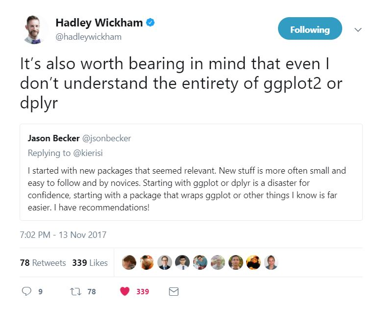

# The R team creates a lot of graphs

## Achievements to unlock

Now that Leslie is getting more familiar with R coding, Nancy thinks it is time to learn one of the biggest strengths of R, making graphs! As the team saw in the previous chapter, graphs are very important for adding context to the numbers. For example, the negative skewness value for the PHYSHLTH variable in the previous chapter could have led an analyst to believe the variable was left skewed rather than right since negative skewness *almost always* means left skewed. A quick histogram plot showed otherwise and allowed the team to interpret the skewness accurately and identify the appropriate descriptive statistics to use for the situation. In addition to clarifying statistical results, graphs are one of the best way to communicate about data with various audiences. 

This chapter will primarily use the <span style="font-family:Lucida Console, monospace;font-weight:bold">ggplot2</span> package, which is part of the <span style="font-family:Lucida Console, monospace;font-weight:bold">tidyverse</span> to create and format common graphs used to display data. The chapter will cover which graphs are appropriate for different data types, the important features of a well-formatted graph, ways to avoid creating a misleading graph, and how to interpret graphs. Nancy and Kiara made a list of tasks for Leslie: 

* Achievement 1: Choosing and creating graphs for a single categorical variable 
* Achievement 2: Choosing and creating graphs for a single continuous variable 
* Achievement 3: Choosing and creating graphs for two variables at once 
* Achievement 4: Ensuring graphs are well-formatted with appropriate and clear titles, labels, colors, and other features 
    
Follow the R team through the examples and exercises to build some great graphics.
  
## The tricky trigger problem 
  
One of Leslie's best friends is very involved in an activist group called *Moms Demand Action* [@MomsDemandAction]. She has been sending Leslie information about guns and gun violence in the United States. Leslie emails Kiara and Nancy some of what she understands about this problem and the lack of research related to gun violence.

### Comparing gun deaths to other causes of death in the US

The United States has a high rate of gun ownership and a similarly high rate of gun injury and death [@StatisticsonGunDeaths]. However, there has been relatively little research into gun injury and gun violence in recent decades after government funding was limited by the Dickey Amendment, a 1996 appropriations bill that cut \$2.6 million from the from the Centers for Disease Control and Prevention (CDC) budget [@kellermann2013silencing]. The Dickey Amendment, named after the Arkansas representative who introduced it, removed the funds in an effort by some members of the US Congress to eliminate the the National Center for Injury Prevention and Control [@kellermann2013silencing]. On page 245, the Dickey Amendment stated "None of the funds made available for injury prevention and control at the Centers for Disease Control and Prevention may be used to advocate or promote gun control." [@dickeyAmendment; @rubin2016tale] So, while the bill failed to eliminate the center, it was successful in eliminating funding for gun research. 

A 2017 article published in the Journal of the American Medical Association (JAMA) [@RefWorks:2302] used publicly available data to compare the amount of money spent on research between 2004 and 2015 for the top 30 causes of death in the US, including gun violence. The authors also examined the number of publications describing research findings for the top 30 causes of death in the US over the same time period. With the exception of *falls*, research on *gun violence* as a cause of death has had the lowest research funding level of any of the top 30 causes of death. With the exception of *drowning* and *asphyxia*, *gun violence* was the topic of the fewest publications of any of the 30 top causes of death in the US. Nancy and Kiara request the data for the gun violence article from the author and reproduce some of the figures Leslie sends in order to get a closer look.

The figures in the article are **scatterplots** which show one dot for each observation in the data set. In this case, each dot represents one of the top 30 causes of death in the US. There is a label on each dot showing which cause of death it represents. The x-axis (horizontal) is the *mortality rate* or number of deaths per 100,000 people per year in the US. The y-axis (vertical) shows the amount of funding spent on research. So, the relative position of each dot on the graph shows how many people it kills and how many dollars of funding are available for research. Causes with dots in the lower left have lower levels of mortality and lower levels of funding. Causes with dots in the upper right have higher mortality and higher research funding. Overall, as the mortality rate rises, the amount of research funding also rises. There are two exceptions: falls and gun violence, which are toward the middle of the group for rate of mortality but at the bottom for research funding levels. Overall, gun violence has the second lowest funding for research of the top 30 mortality causes.

```{r c3intro1, echo=FALSE, fig.cap = "Reproduced figure showing Mortality Rate vs Funding from 2004 to 2015 for 30 Leading Causes of Death in the United States."}

#bring in the data
#use readxl package
library(readxl)
gunResearch <- read_excel("data/gun_violence_results.xlsx")

#some variable names are hard to work with
#rename
names(gunResearch)[2] <- "Mortality"
names(gunResearch)[1] <- "Cause"

#start with a basic scatterplot
#mortality on x-axis, funding on y-axis
library(ggplot2)
library(ggrepel)
library(scales)
fig1 <- ggplot(gunResearch, aes(x=Mortality, y=Funding/1000000000))+
    stat_smooth(method="lm", colour="darkgray") +
    geom_point(size=3, color=ifelse(as.numeric(gunResearch$Cause=='Gun violence')+1==1,"#006666","#FF8C00")) +
  scale_x_log10(breaks=c(0.4,1.0,10,100,200), labels = comma) + 
  scale_y_log10(breaks=c(0.002,0.01,1.0,10,100), labels = comma) +  
  geom_text_repel(aes(label = Cause), size = 3.5) +
  annotation_logticks() +
  theme_bw(base_size = 10) +
  theme(axis.line = element_line(colour = "black"),
        panel.border = element_blank(), 
        panel.grid.major.x = element_blank(), 
        panel.grid.minor.x = element_blank()) +
  labs(y = "Funding, $US Billion") + 
  labs(x = "Mortality Rate, per 100 000 population")
fig1
```

The second figure reproduced from the paper shows a similar pattern of number of publications on each topic on the y-axis and mortality rate on the x-axis. This time there are four mortality causes that do not fit the pattern of more publications when mortality rate increases: drowning, asphyxia, aspiration, and gun violence. Of these, gun violence has the highest mortality rate. Overall, gun violence has the third lowest publication rate of the 30 top mortality causes.

```{r c3intro2, echo=FALSE, fig.cap = "Reproduced figure showing Mortality Rate vs Publication Volume from 2004 to 2015 for 30 Leading Causes of Death in the United States."}

ggplot(gunResearch, aes(x=Mortality, y=Publications/1000))+
    stat_smooth(method="lm", colour="darkgray") +
    geom_point(size=3, color=ifelse(as.numeric(gunResearch$Cause=='Gun violence')+1==1,"#006666","#FF8C00")) +
  scale_x_log10(breaks=c(0.4,1.0,10,100,200), labels = comma) + 
  scale_y_log10(breaks=c(0.8,1.0,10,100,1000,2000), labels = comma) +  
  geom_text_repel(aes(label = Cause), size = 3.5) +
  annotation_logticks() +
  theme_bw(base_size = 10) +
  theme(axis.line = element_line(colour = "black"),
        panel.border = element_blank(), 
        panel.grid.major.x = element_blank(), 
        panel.grid.minor.x = element_blank()) +
  labs(y = "Publications, in Thousands") + 
  labs(x = "Mortality Rate, per 100 000 population")
```

### Weapons used in homicide

To get a sense of the extent of gun violence in the US, Nancy and Kiara look up the annual Federal Bureau of Investigation (FBI) crime data reported in the Uniform Crime Reporting program [@UniformCrime]. They find one of the data sources includes the types of weapons used in homicide including *firearms*, *knives or cutting instruments*, *blunt objects*, and several other categories. Kiara and Nancy decide to make a bar graph of gun and non-gun homicides from the FBI data for the most recent five years reported. They flip the axes so that the bars are horizontal. The x-axis shows the number of homicides, while the y-axis shows the year. In each year, the number of homicides by gun (green bars) was more than 2.5 times higher than all non-gun weapons combined (purple bars). For more one of the years, there were three times as many homicides by gun than by all non-gun weapons combined.

```{r c3intro3, echo=FALSE, hide=TRUE, include=FALSE}
library(readxl)
library(httr)
library(ggplot2)
url1 <- "https://ucr.fbi.gov/crime-in-the-u.s/2016/crime-in-the-u.s.-2016/tables/expanded-homicide-data-table-4.xls/output.xls"
GET(url1, write_disk(tf <- tempfile(fileext = ".xls")))
fbiDeaths <- data.frame(read_excel(tf, 1, skip=3, n_max=18))
```

```{r c3intro4, echo=FALSE, fig.cap = "Homicides by guns and known non-gun weapons per year in the United States, 2012-2016."}
#turn column 1 into rownames
rownames(fbiDeaths) <- fbiDeaths$Weapons
fbiDeaths <- subset(fbiDeaths, select=-Weapons)
fbiDeaths["notGuns",] <- fbiDeaths["Total",] - fbiDeaths["Total firearms:",] - fbiDeaths["Other weapons or weapons not stated",]
fbiDeathsSmall <- fbiDeaths[c(2,19),]
fbiDeathsSmall$Weapon <- rownames(fbiDeathsSmall)
library(tidyr)
fbiSmallLong <- gather(fbiDeathsSmall, year, number, X2012, X2013, X2014, X2015, X2016)
fbiSmallLong$year <- substring(fbiSmallLong$year, 2, nchar(fbiSmallLong$year))

#plot
ggplot(fbiSmallLong, aes(x=year, y=number, fill=Weapon)) +
  geom_bar(stat="identity",position="dodge") +
  labs(x="Year", y="Number of homicides commited with weapon")+
  theme_minimal() +
  coord_flip() +
  scale_fill_manual(labels = c("Not gun","Gun"),
                    values=c('#7463AC', '#78A678'))
```

Nancy and Kiara are interested in finding other patterns that might be useful in understanding gun violence. 

### Types of guns used in homicide

Looking a little deeper into the FBI data, Nancy and Kiara find that, within the *firearms* category are handguns, rifles, shotguns, other guns, and unknown gun type. They make another bar graph that suggests handguns were the most widely used type of gun for homicide in 2016. The graph includes all the homicides by gun for 2016 and shows the number of homicides by each type of gun. The x-axis has the number of homicides, while the y-axis has the type of gun.

```{r c3intro5, echo=FALSE, fig.cap = "Types of firearms used in homicides in the US, 2016."}

fbiDeathsGunType <- fbiDeaths[c(3:7),]
fbiDeathsGunType$Weapon <- rownames(fbiDeathsGunType)
library(tidyr)
fbiGunTypeLong <- gather(fbiDeathsGunType, year, number, X2012, X2013, X2014, X2015, X2016)
fbiGunTypeLong$year <- substring(fbiGunTypeLong$year, 2, nchar(fbiGunTypeLong$year))

ggplot(subset(fbiGunTypeLong, fbiGunTypeLong$year=='2016'), 
       aes(x=reorder(Weapon, number), y=number, fill=Weapon)) +
  geom_bar(stat="identity",position="dodge") +
  labs(x="Type of gun", y="Number of homicides by gun where weapon used, 2016")+
  theme_minimal() +
  coord_flip() +
  scale_fill_manual(values=c("gray","#7463AC","gray",
                             "gray","gray","gray"), guide=FALSE) +
  scale_x_discrete(labels=c("Other gun","Shotgun",
                            "Rifle", "Unspecified firearm","Handgun"))

```

### The role of gun manufacturers in reducing gun deaths

Leslie remembers another article she read recently from her friend in Moms Demand Action. It was about the role that gun manufacturers could potentially play in reducing gun violence [@RefWorks:2297]. The authors of this article argued that there is little information about how gun manufacturing is related to gun ownership or gun violence. They suggested that a better understanding of manufacturing could identify changes in manufacturing practices to increase safety and reduce injury and death. The authors used publicly available data from the Bureau of Alcohol, Tobacco, Firearms, and Explosives to examine how many guns were manufactured in the United States over a 25-year period from 1990 to 2015. The authors also examined the types of guns manufactured during this time period and the types of guns confiscated after use in crime. Kiara and Nancy work together to reproduce the graph from the article. This time it is a line graph, which is the type of graph often used to show change over time. In this case, time is on the x-axis and the number of firearms manufactured is on the y-axis. Different types of lines show different types of guns being produced over time. Although the article used the line types to differentiate, Nancy and Kiara find it difficult to tell some of the line types apart, so they add color to the graph instead of line types for easier reading. The resulting graph shows a sharp increase in gun manufacturing after 2010, with the increase mostly being in the production of pistols and rifles.

```{r c3intro6, echo=FALSE, fig.cap = "Firearm types manufactured in the US from 1990 to 2015."}
library(data.table)

#bring in the data copied from Table 1 and saved as csv
gunsManu <- fread("data/total_firearms_manufactured_US_1990to2015.csv")

#recode Year to be a character variable
gunsManu$Year <- as.character(gunsManu$Year)

#make the data long instead of wide
gunsManuLong <- melt(gunsManu, id.vars = "Year",
                     measure.vars = c("Pistols","Revolvers","Rifles","Shotguns","Total firearms"))

#rename the vars
names(gunsManuLong) <- c("Year","gunType","numGunsManu")

#plot it
ggplot(gunsManuLong, aes(x=Year, y=numGunsManu, group=gunType, linetype=gunType)) + 
  geom_line(size=1, ) +
  theme_classic() +
  scale_y_continuous(labels = scales::comma, name="Number of firearms",
                     breaks=seq(0,11000000, by=1000000), limits=c(0,11000000)) +
  scale_x_discrete(name="") +
  scale_linetype_manual(values=c("longdash","twodash",
                                 "dotted","dashed","solid"),
                       name="") +
  #scale_color_brewer(palette = 'Dark2', )+
  theme(legend.position="bottom", axis.text = element_text(size = 7),
        axis.line = element_line(color = 'gray',size=0.1),
        axis.ticks = element_line(size=1,color='gray'),
        axis.ticks.length = unit(-.1, "cm"),
        axis.text.y = element_text(margin=margin(0,5,0,0,"pt")),
        axis.text.x = element_text(margin=margin(5,0,0,0,"pt")),
        legend.box.margin=margin(c(-20,0,0,0)),
        axis.title=element_text(size=9)) +theme(legend.title = element_blank())


```

Although it looks like the original graph, the reproduced version is difficult to read due to the line types being unclear in the legend. Instead of trying to read this version, Kiara adds color and uses regular lines:

```{r c3intro7, echo = FALSE, fig.cap = "Firearm types manufactured in the US from 1990 to 2015."}
#plot it
ggplot(gunsManuLong, aes(x=Year, y=numGunsManu, group=gunType, color=gunType)) + 
  geom_line(size=1, ) +
  theme_classic() +
  scale_y_continuous(labels = scales::comma, name="Number of firearms",
                     breaks=seq(0,11000000, by=1000000), limits=c(0,11000000)) +
  scale_x_discrete(name="") +
  #scale_linetype_manual(values=c("longdash","twodash",
   #                              "dotted","dashed","solid"),
    #                   name="") +
  scale_color_brewer(palette = 'Dark2', )+
  theme(legend.position="bottom", axis.text = element_text(size = 7),
        axis.line = element_line(color = 'gray',size=0.1),
        axis.ticks = element_line(size=1,color='gray'),
        axis.ticks.length = unit(-.1, "cm"),
        axis.text.y = element_text(margin=margin(0,5,0,0,"pt")),
        axis.text.x = element_text(margin=margin(5,0,0,0,"pt")),
        legend.box.margin=margin(c(-20,0,0,0)),
        axis.title=element_text(size=9)) +theme(legend.title = element_blank())
```


Leslie, Nancy, and Kiara discuss how these four graphs tell a story about guns in the US and may suggest policy solutions such as funding research that examines the relationship, if any, between the types and quantitites of guns manufactured and number of gun homicides by weapon type. Nancy and Kiara explain to Leslie that the graphs shown here about gun research and manufacturing demonstrate just a few of the many ways to **visualize** data. **Data visualization**, or graphing, is one of the most powerful tools an analyst has for communicating information. Three graph types were demonstrated in the reproduced graphs by Nancy and Kiara: the scatterplot, the bar graph, and the line graph. Kiara explains to Leslie that these are not the only types of graphs, but they are common types. She explains that, like descriptive statistics, there are different ways to visualize data that are appropriate for each data type. 

## Achievement 1: Graphs for a single categorical variable

The first thing the team will work on are graphs appropriate for displaying single variables. Before selecting a graph type, it is useful to think about the goal of the graph. Kiara suggests that making graphs for yourself to check whether something is normally distributed is very different from making graphs to communicate a result to an audience. The team decides to start by creating graphs that convey information from a single **categorical** variable. Kiara reminds Leslie that a **categorical variable** has categories that are either **ordinal** with a logical order or **nominal** with no logical order. **Categorical** variables are the **factor** data type in R. Nancy explains that single categorical variables have several options for graphing. A few of the more commonly used graphs for a single categorical variable are:

* pie chart 
* waffle plot
* bar graph
* point chart

Pie charts and waffle plots are similar types in that they are both used for showing parts of a whole. Bar graphs and point charts tend to be used to to compare groups. Leslie is hungry so wants to start first with the pie chart since it sounds delicious.

### Pie charts

To create a pie chart for a single categorical variable, the team needs a variable to start with. Leslie suggests gun type from Figure \@ref(fig:c3intro5). There are five categories of gun type represented in the graph: Other gun, Shotgun, Rifle, Unspecified firearm, and Handgun. Kiara thinks focusing on one gun type might be one way to start understanding gun manufacturing. Maybe examining the type of gun with the highest (or lowest) number manufactured would be one strategy. One way to do this would be to create a pie chart, like this:

```{r c3main1, echo=FALSE, fig.cap = "Firearm types manufactured in 2016 in the US."}
blank_theme <- theme_minimal()+
  theme(
  axis.title.x = element_blank(),
  axis.title.y = element_blank(),
  panel.border = element_blank(),
  panel.grid=element_blank(),
  axis.ticks = element_blank(),
  plot.title=element_text(size=14, face="bold")
  )

ggplot(subset(fbiGunTypeLong, fbiGunTypeLong$year=='2016'), 
       aes(x="", y=number, fill=Weapon)) + blank_theme +
  theme(axis.text.x=element_blank()) +
  geom_bar(stat="identity",width=1) + coord_polar("y", start=0) +
  scale_fill_manual(values=c('#1b9e77','#d95f02', '#7570b3',
                             '#e7298a','#66a61e'),
                    labels=c("Unspecified firearm","Handgun","Other gun",
                            "Rifle", "Shotgun")) +
  labs(x="", y="") 


```

Pie charts are meant to show parts of a whole. The pie, or circle, represents the whole.The slices of pie shown in different colors represent the parts. While pie charts are often seen in newspapers and other popular media, they are considered by most analysts as an unclear way to display data. A few of the reasons for this were summarized in an R-bloggers post [@PieChartsinggplot2Rbloggers-2019-05-02]:  

* Pie charts are difficult to read since the relative size of pie pieces is often hard to determine 
* Pie charts take up a lot of space to convey little information 
* People often use fancy formatting like 3D, which takes up more space and makes understanding relative size of pie pieces even more difficult 


In fact, if you asked 100 data scientists, "Should I make a pie graph?", they might answer:

```{r c3main2, echo=FALSE, fig.cap = "Should I make a pie graph?"}
colorPie <- c("No", "No, but in green")
percentPie <- c(90, 10)
pieExample <- data.frame(colorPie,percentPie)

library(ggplot2)

ggplot(pieExample, aes(x="", y=percentPie, fill=colorPie)) + 
  theme(axis.text.x=element_blank()) +
  geom_bar(stat="identity",width=1) + coord_polar("y", start=0) +
  scale_fill_manual(values=c('#7463AC','#78A678')) +
  labs(x="", y="", fill="") +
  theme_void()
```

Instead, a **bar graph** or **point chart** are clear ways to present and compare the sizes of groups for a single variable.

A bar graph showing responses to "Should I make a pie graph?"

```{r c3main3, echo=FALSE, fig.cap = "Should I make a pie graph?"}
ggplot(pieExample, aes(x=colorPie, y=percentPie, fill=colorPie)) + 
  geom_bar(stat="identity",position="dodge" ) +
  scale_fill_manual(values=c('#7463AC','#78A678'), guide=FALSE) +
  labs(x="Analyst response", y="Number of analysts responding") +
  theme_minimal()
```

Nancy suggests that, if a pie chart is truly the most appropriate way to communicate data (it isn't), or if you have been directed to make a pie chart, there is guidance on creating pie charts on many websites. As an alternative, Nancy tells Leslie they will review how to make a waffle graph as a better way to show parts of a whole.

### Bar graphs

One thing that might be useful to know in better understanding guns in the US is the rate of gun use. Although publicly available data on gun use are rare because of the Dickey Amendment, Nancy knows of a few persistent researchers who have found ways to collect gun-related data.

One example she is aware of is a set of questions in the nationally representative **National Health and Nutrition Examination Survey**, or NHANES. Several administrations of the NHANES survey asked about gun use in the *audiology* section concerned with how loud noise may influence hearing loss. The most recent year of NHANES data available with a gun use question was 2011-2012 [@NHANES20112012]. Kiara has downloaded the data as a **csv** file and saved it. She uses `read.csv()` to import the data and notices that it has 82 variables, which is a lot for the `summary()` command. She checks that the import worked by using the `head()`. Download the data from edge.sagepub.com/harris1e to follow along or try downloading directly from the internet by following the instructions in Box \@ref(ch3nancy). 

```{r c3main4}
# import the data 
nhanes.2012 <- read.csv(file = "data/nhanes_2011_2012_ch3.csv")

# check the data
summary(object = nhanes.2012$AUQ300)
```

The gun use question appears to have imported as a **numeric** variable type. Reviewing the audiology data codebook [@NHANES20112012codebook], it shows five possible values for AUQ300:

* 1 = Yes 
* 2 = No 
* 7 = Refused 
* 9 = Don't know 
* . = Missing

Using her skills from the earlier chapters, Leslie recodes the variable to a factor with these five levels and a more logical variable name. She is having some trouble with the apostrophe in "don't know" and Kiara reminds her that adding the `\` character before the apostrophe (or before other punctuation that could be misinterpreted by R):

```{r c3main5}
# open tidyverse
library(package = "tidyverse")

# recode gun use variable
nhanes.2012.clean <- nhanes.2012 %>%
  mutate(AUQ300, AUQ300 = recode_factor(.x = AUQ300, `1` = 'Yes',
                `2` = 'No',
                `7` = 'Refused',
                `9` = 'Don\'t know'))

# check the recoding
summary(object = nhanes.2012.clean$AUQ300)
```

Kiara notes there is a single *Refused* response to the gun use question and no *Don't know* responses. These categories are not likely to be useful for visualizing or analyzing this variable. Leslie recodes them as *NA* for missing. Leslie thinks it would be easier to work with the gun use variable if the variable name were something more intuitive. She looks up how to change variable names in R and finds `rename()`, which works with the pipe structure. Filling the new name as the first argment of `rename()` and the old name as the second argument, Leslie ends up with the following:

```{r c3main6}
# recode gun use variable
nhanes.2012.clean <- nhanes.2012 %>%
  mutate(AUQ300, AUQ300 = na_if(x = AUQ300, y = 7)) %>%
  mutate(AUQ300, AUQ300 = recode_factor(.x = AUQ300, 
                                        `1` = 'Yes',
                                        `2` = 'No')) %>%
  rename(gun.use = AUQ300)

# check recoding
summary(object = nhanes.2012.clean$gun.use)
```

Kiara starts by showing Leslie the `ggplot()` command from the <span style="font-family:Lucida Console, monospace;font-weight:bold">ggplot2</span> package to create a bar plot of gun use. The <span style="font-family:Lucida Console, monospace;font-weight:bold">ggplot2</span> package uses the *Grammar of Graphics*, which is what the *gg* stands for. Kiara reminds Leslie that graphs build with `ggplot()` are built in layers. The first layer starts with `ggplot()` and `aes()` or *aesthetics*, which contains the basic information about which variables are included in the graph and whether each variable should be represented on the x-axis, the y-axis, as a color, as a line type, or something else. The next layer typically gives the graph type, or graph **geometry**, in the grammar of graphics language, and starts with `geom_` followed by one of the available types. In this case, Leslie is looking for a bar graph, so the `geom_bar()` is the geometry for this graph. Leslie remembers that `geom_bar()` is a layer of the plot and so is added with a `+` instead of a `%>%`. Leslie types: 

```{r c3main7, fig.cap="Gun use by NHANES 2011-2012 participants."}
# plot gun use in US 2011-2012
nhanes.2012.clean %>%
  ggplot(aes(x = gun.use)) +
  geom_bar()
```

Leslie is always surprised at how quickly she can make a graph in R. While it needs a lot of work on the format, this is already a good start. Leslie makes a list of the things she wants to change about this initial graph:

* Remove the NA bar from the graph 
* Change the labels on the axes to provide more information
* Use a theme that does not use so much ink 

Leslie also thinks she would like to: 

* Make each bar a different color 
* Show percents instead of counts on the y-axis 

Kiara thinks all of those things are do-able, although the percent on the y-axis is a little tricky. She starts with removing the NA bar using `drop_na()` for the gun.use variable before building the plot with `ggplot()`. Then she adds a custom labels layer with the `labs(x = , y = )` option to add better labels on the two axes.

```{r c3main8, fig.cap = "Gun use among 2011-2012 NHANES participants."}
# omit NA category from gun.use plot and add axis labels
nhanes.2012.clean %>%
  drop_na(gun.use) %>%
  ggplot(aes(x = gun.use)) +
  geom_bar() +
  labs(x = "Gun use", y = "Number of participants")
```

Before tackling the percent issue, Leslie works on the color. She remembers to add `fill = gun.use` to the aesthetics in `aes()` but has to go back to her earlier code to find how to assign colors and delete the legend. She finds `scale_fill_manual(values = c("#78A678", '#7463AC'), guide = FALSE)` from the code used to make Figure \@ref(fig:c1main55) from the data preparation chapter and decides to use the same colors. Kiara reminds her that `theme_minimal()` will change the look of the graph so it is cleaner and uses less ink to print. Leslie adds in these options: 

```{r c3main9, fig.cap="Gun use among 2011-2012 NHANES participants."}
# fill bars and add theme
nhanes.2012.clean %>%
  drop_na(gun.use) %>%
  ggplot(aes(x = gun.use, fill = gun.use)) +
  geom_bar() +
  labs(x = "Gun use", y = "Number of participants") +
  scale_fill_manual(values = c("#78A678", '#7463AC'), guide = FALSE) +
  theme_minimal()
```

Finally, the change from the number of people to the percent of people along the y-axis is more tricky, although Leslie has seen it before when Kiara wrote the code for her to create Figure \@ref(fig:c1main58). To get the y-axis to show percent rather than count, the y-axis uses **special variables** with double periods around them. Special variables are statistics computed from a data set; the *count* special variable counts the number of observations in the data set. After reviewing Section \@ref(using-special-variables-in-graphs), Kiara adds the special variables to the aesthetics using `..count..` to represent the frequency of a category and `sum(..count..)` to represent the sum of all the frequencies. She multiplies by 100 to get a percent: 

```{r c3main10, fig.cap = "Gun use among 2011-2012 NHANES participants."}
# formatted bar graph of gun use
nhanes.2012.clean %>%
  drop_na(gun.use) %>%
  ggplot(aes(x = gun.use,
             y = 100*(..count..)/sum(..count..),
             fill = gun.use)) +
  geom_bar() +
  labs(x = "Gun use", y = "Percent of participants") +
  scale_fill_manual(values = c("#78A678", '#7463AC'), guide = FALSE) +
  theme_minimal() 
```

Leslie is wondering about why the y-axis of the graph only goes to 60 percent. She has heard that people sometimes limit the range of the y-axis in order to make a difference between groups or a change over time look bigger (or smaller) than it actually is. Kiara shows her how to make the y-axis go to 100 percent by creating a `ylim()` layer in the `ggplot()`. The new layer with `ylim()` takes the lowest value for the range and the highest value for the range, separated by a comma. For a range that goes from 0 to 100 it looks like this: `ylim(0, 100)`.

```{r fig.cap = "Gun use among 2011-2012 NHANES participants."}
# formatted bar graph of gun use
nhanes.2012.clean %>%
  drop_na(gun.use) %>%
  ggplot(aes(x = gun.use,
             y = 100*(..count..)/sum(..count..),
             fill = gun.use)) +
  geom_bar() +
  labs(x = "Gun use", y = "Percent of participants") +
  scale_fill_manual(values = c("#78A678", '#7463AC'), guide = FALSE) +
  theme_minimal() +
  ylim(0, 100)
```

The expanded y-axis does make some difference in the look of the graph, but the difference still seems large between the groups. The purple bar for the "No" group is about twice as large as the green bar for the "Yes" group. 

### Waffle charts

Waffle charts are similar to pie charts in showing the parts of a whole. However, Nancy explained, the structure of a waffle chart visually shows the relative contributions of categories to the whole waffle more clearly. While pie may arguably be more delicious in real life, for reporting parts of a whole, *waffles > pie*.  

Kiara suggests making a graph of the *AUQ310* variable in the NHANES data set since it has more than two categories and so may be more interesting to view. *AUQ310* is the response to the question "How many total rounds have you ever fired?" for gun users who indicated they had used a gun. The audiology data codebook on the NHANES website [@NHANES20112012codebook] shows eight categories for AUQ310:

* 1 = 1 to less than 100 rounds 
* 2 = 100 to less than 1000 rounds 
* 3 = 1000 to less than 10,000 rounds 
* 4 = 10,000 to less than 50,000 rounds 
* 5 = 50,000 rounds or more 
* 7 = Refused
* 9 = Don't know 
* . = Missing

Leslie adds on to the existing data mangement code to add labels and change the AUQ310 variable to a factor. 

```{r}
# recode gun use variable
nhanes.2012.clean <- nhanes.2012 %>%
  mutate(AUQ300, AUQ300 = na_if(x = AUQ300, y = 7)) %>%
  mutate(AUQ300, AUQ300 = recode_factor(.x = AUQ300, 
                                        `1` = 'Yes',
                                        `2` = 'No')) %>%
  rename(gun.use = AUQ300) %>%
  mutate(AUQ310, AUQ310 = recode_factor(.x = AUQ310,
                                        `1` = "1 to less than 100",
                                        `2` = "100 to less than 1000",
                                        `3` = "1000 to less than 10k",
                                        `4` = "10k to less than 50k",
                                        `5` = "50k or more", 
                                        `7` = "Refused",
                                        `9` = "Don't know")) %>%
  rename(fired = AUQ310)

#check recoding
summary(object = nhanes.2012.clean$fired)
```

Now it is time to make the graph. Unfortunately, Nancy explains, there is no built-in `geom_waffle()` option for `ggplot()`, so they will use the <span style="font-family:Lucida Console, monospace;font-weight:bold">waffle</span> package instead. Leslie installs the package and reviews the documentation [@waffle].

The first argument for the `waffle()` is a table or vector of **summary statistics** used to make the waffle squares. That is, the data used by `waffle()` is not the **individual level** data with one observation per row. Instead it is a frequency table or a vector of frequencies that shows how many observations are in each category. The `table()` code works well for use with `waffle()`.

By default, `waffle()` makes one square per observation. There are more than 1,000 observations in this data frame, which seems like a lot of squares! Nancy suggests making each square represent 25 people. Finally, the last argument for `waffle()` is the number of rows of squares. Leslie suggests they start with 5 rows and see what happens. 

```{r fig.cap="Rounds shot by 1,613 gun users, NHANES 2011-12. One square represents 25 people."}
# open the waffle library
library(waffle)

# make a table of rounds fired data
rounds <- table(nhanes.2012.clean$fired)

# each square is 25 people
# 5 rows of squares
waffle(parts = rounds / 25, rows = 5)
```

It seems clear from this waffle that the **1 to less than 100** category is the biggest. 

Nancy suggests that color could be used to make a point about the size of a certain category. For example, if a goal were to examine people who own firearms but are less experienced in using firearms, highlighting the low use group in a bright color might be useful. Color is added by using a `colors = ` option and listing the colors in a vector. Leslie adds the RGB code for the purple color she has been using and then finds some different shades of gray to include:

```{r fig.cap="Rounds shot by 1,613 gun users, NHANES 2011-12. One square represents 25 people."}
# change the colors
waffle(parts = rounds / 25, rows = 5,
       colors = c("#7463AC","gray90","gray80",
                  "black","gray60","gray40"))
```

The bright color for the **1 to less than 100** category makes the waffle chart more clear. The two recommended graphs for displaying a single **categorical** or **factor** type variable are *(1) bar graph*, and *(2) waffle graph*. The bar graph is useful for showing relative group sizes. The waffle graph is an alternative to a pie chart and is best when demonstrating parts of a whole. **Pie charts** are available in R but are not recommended because they tend to be less clear for comparing group sizes. 

### Unlock achievement 1: Check your understanding

Create a bar graph and a waffle chart for the gender variable (RIAGENDR) from the NHANES 2012 data set. Examine the codebook for coding hints and clean up the data first! 

## Achievement 2: Graphs for a single continuous variable

After making it through the options for graphing a single categorical variable, Leslie wants to learn which graphs are appropriate for graphing a single continuous variable. Four commonly used options are histograms, density plots, boxplots, and violin plots. Histograms and density plots are very similar to each other and show the overall shape of the data. These two types of graphs are especially useful in  determining whether a variable has a **normal distribution** or not (see Figure \@ref(fig:c2main35)). Boxplots tend to show the central tendency and spread of the data, which are another way to determine the extent to which a variable is skewed.

Kiara notes that the gun research data includes a measure of the amount of research funding devoted to the different causes of death. While funding cannot take *any* value on a continuum--it does not fall below zero--it does fall along a continuum and would be best examined as a continuous variable using a **histogram**, **density plot**, or **boxplot**. She helps Leslie with the coding needed to create each type of graph.

### Histograms

Kiara explains that histograms can be developed in **ggplot2**. The data for this example is available at edge.sagepub.com/harris1e.

```{r fig.cap="Research funding for top 30 mortality causes in the US."}
# bring in the data
gun.research <- read.csv(file = "data/gun_publications_funds_2004_2015_ch3.csv")

# check out the data
summary(object = gun.research)

```

```{r}
# make a histogram of funding
histo.funding <- gun.research %>%
  ggplot(aes(x = Funding)) +
  geom_histogram()
histo.funding
```


The histogram shows frequency on the y-axis and mortality rate on the x-axis. Leslie notices that the x-axis is shown using scientific notation. While she is familiar with scientific notation, which is useful for printing large numbers in small spaces, she knows it is not well-understood by most audiences (see Box \@ref(ch3leslie)). Kiara suggests changing the axis to show numbers that can be more easily interpreted; this can be done in several ways. One strategy is to convert the numbers from *dollars* to *billions of dollars* by dividing the Funding variable by 1,000,000,000. To plot a histogram in <span style="font-family:Lucida Console, monospace;font-weight:bold">ggplot2</span>, use the `geom_histogram()` layer.

```{r fig.cap="Research funding in billions for top 30 mortality causes in the US."}
# make a histogram of funding
histo.funding <- gun.research %>%
  ggplot(aes(x = Funding/1000000000)) +
  geom_histogram()
histo.funding
```

Now the x-axis is easier to understand. From the histogram it appears that most mortality causes are funded at between 0 and 5 billion dollars annually. However, several causes receive more than 5 billion and up to over 25 billion. The very large values on the right of the graph suggest to Leslie that the **distribution** of the funding data is right skewed.  

Kiara explains that each of the bars shown in the histogram is called a **bin** and contains a certain proportion of the observations. To show more bins, which may help to clarify the shape of the distribution, specify how many *bins* to see by adding `bins = ` to the `geom_histogram()` layer. Leslie tries 10 bins:

```{r fig.cap="Research funding for top 30 mortality causes in the US in 10 bin histogram."}
# make a histogram of funding
# adjust the number of bins to 10
histo.funding <- gun.research %>%
  ggplot(aes(x = Funding/1000000000)) +
  geom_histogram(bins = 10)
histo.funding
```

She tries 50 bins next to see if it changes the shape:

```{r fig.cap="Research funding for top 30 mortality causes in the US in 50 bin histogram."}
# make a histogram of funding
# adjust the number of bins to 50
histo.funding <- gun.research %>%
  ggplot(aes(x = Funding/1000000000)) +
  geom_histogram(bins = 50)
histo.funding
```

The 10 bin version looks good to Leslie and she turns her attention to formatting, adding better titles for the axes in a `labs()` layer and making the graph printer-friendly by adding a `theme_minimal()` layer. 

```{r fig.cap="Research funding for top 30 mortality causes in the US."}
# make a histogram of funding
# adjust the number of bins to 10
histo.funding <- gun.research %>%
  ggplot(aes(x = Funding/1000000000)) +
  geom_histogram(bins = 10) + 
  labs(x = "Research funding for 2004-2015 (billions of dollars)",
       y = "Number causes") +
  theme_minimal()
histo.funding
  
```

This looks good to Leslie so she asks Kiara and Nancy if they have any suggestions for other formatting that might make the graph more easy to interpret. Kiara says she likes to add thin borders around the bins and fill the bins with white, similar to the plots in the last chapter (e.g., Figure \@ref(fig:c2main44)). Leslie ask her how to do this and Kiara says that `geom_histogram()` can take arguments for `fill =`, which takes a color to fill each bin, and `color =`, which takes a color for the border of each bin. Leslie adds these arguments to `geom_histogram()`.

```{r c3main12, fig.cap="Research funding for top 30 mortality causes in the US."}
# make a histogram of funding
# adjust the number of bins to 10
histo.funding <- gun.research %>%
  ggplot(aes(x = Funding/1000000000)) +
  geom_histogram(bins = 10, fill = "white", color = "gray40") + 
  labs(x = "Research funding for 2004-2015 (billions of dollars)",
       y = "Number causes") +
  theme_minimal()
histo.funding
  
```

The team is happy with this final plot. Before moving on to density plots, they pause for a minute to discuss the shape of the distribution. Leslie notes that it is right skewed and would therefore be best described using the median rather than the mean as they discussed in Section \@ref(defining-and-calculating-central-tendency). She also thinks that the IQR would probably be better than the range for reporting spread given how wide the range is (Section \@ref(spread-to-report-with-the-median)). Nancy and Kiara agree with this assessment and the team decides to move on to **density plots**.

### Density plots

A **density plot** is similar to a histogram but more fluid in appearance because it does not have the separate **bins**. Density plots can be created in <span style="font-family:Lucida Console, monospace;font-weight:bold">ggplot2</span> with a `geom_density()` layer. Leslie takes the code from the histogram and replaces the `geom_histogram()` layer to see if that would work. Before she runs the code, Nancy stops her to let her know that the y-axis is a different measure for this type of plot. Instead of frequency it is the probability density. The probability density is not too useful for interpreting what is happening at any given value of the variable on the x-axis, but it is useful in computing the percent of values that are within any given range along the x-axis. 

Leslie is confused by this interpretation. Nancy clarifies that the area under the curve adds up to 100 percent of the data and the height of the curve is determined by the distribution of the data and by scaling so that the area will be 100 percent (or 1). Leslie removes the `ylab =` option and leaves the y-axis as showing the density.

```{r fig.cap="Research funding for top 30 mortality causes in the US."}
# density plot of research funding
dens.funding <- gun.research %>%
  ggplot(aes(x = Funding/1000000000)) +
  geom_density() + 
  labs(x = "Research funding for 2004-2015 (billions of dollars)") +
  theme_minimal()
dens.funding
```

Kiara tries to clarify some more. She tells Leslie that the **area under the curve** in a density plot could be interpreted as the probability of a single observation or a range of observations. Probabilities are most useful when we have a **sample** taken from a **population** where a sample is a subgroup selected from a larger group. In this case we have all the top 30 mortality causes, so it is not a sample. The use of density plots to demonstrate probability will be covered in a later chapter with other probability concepts. 

Leslie is not happy with the way the density plot looks. She adds some color in order to be able to see the shape a little more. Nancy suggests trying a few values of `bw = ` within the `geom_density()`, noting that bw usually takes much smaller values than bin. The 'bw" stands for bandwidth in a density plot, which is similar to the bin width in a histogram. Leslie plays with the bandwidth and some color:

```{r fig.cap="Research funding for top 30 mortality causes in the US."}
# density plot of research funding
# bw = .5
dens.funding <- gun.research %>%
  ggplot(aes(x = Funding/1000000000)) +
  geom_density(bw = .5, fill = '#7463AC') + 
  labs(x = "Research funding for 2004-2015 (billions of dollars)") +
  theme_minimal()
dens.funding
```

```{r c3main15, fig.cap="Research funding for top 30 mortality causes in the US."}
# density plot of research funding
# bw = 1.5
dens.funding <- gun.research %>%
  ggplot(aes(x = Funding/1000000000)) +
  geom_density(bw = 1.5, fill = '#7463AC') + 
  labs(x = "Research funding for 2004-2015 (billions of dollars)") +
  theme_minimal()
dens.funding
```

It seems like the higher the value used as a bandwith in `bw =`, the smoother the graph looks. Leslie thinks the final version with the bandwidth of 1.5 looks good. Nancy agrees but wants to add one word of caution on density plots before they move on. While density plots are generally similar to histograms, they do have one feature that some data scientists note may be misleading. Compare Figure \@ref(fig:c3main12) with Figure \@ref(fig:c3main15). These are both from the same data; the Figure \ref(fig:c3main12) shows gaps where there are no observations, while Figure \@ref(fig:c3main15) has the appearance of data continuing without gaps across the full range of values. For this reason, data scientists sometimes recommend histograms over density plots, especially for small data sets where there are more likely to be gaps [@wilke2019fundamentals]. 

### Boxplots

Nancy explains that histograms and density plots are great was to examine the overall shape of the data for a continuous variable, but the boxplot and the violin plot are useful for identifying the middle value and the boundaries around the middle half of the data. Typically, boxplots consist of several parts:

(1) A line representing the median value, 
(2) A box containing the middle 50% of values, 
(3) Whiskers extending to 1.5 times the IQR, and 
(4) Outliers more than 1.5 times the IQR away from the median

In <span style="font-family:Lucida Console, monospace;font-weight:bold">ggplot2</span>, the boxplot uses the `geom_boxplot()`. Leslie copies her density plot commands and changes the `geom_` type. Nancy explains that the boxplot will show the values of the variable along the y-axis by default, so instead of `x = Funding/1000000000`, Leslie will need to use `y = Funding/1000000000` in the plot aesthetics, `aes()`.

```{r c3main16, fig.cap="Research funding for top 30 mortality causes in the US."}
# boxplot of research funding
box.funding <- gun.research %>%
  ggplot(aes(y = Funding/1000000000)) +
  geom_boxplot() + 
  theme_minimal() +
  labs(y = "Research funding for 2004-2015 (billions of dollars)") 
box.funding
```

This seems a little difficult to interpret, so Leslie adds a new layer of `coord_flip()`, which flips the coordinates so that what used to be on the y-axis is now on the x-axis and vice-versa:

```{r fig.cap="Research funding for top 30 mortality causes in the US."}
# boxplot of research funding
box.funding <- gun.research %>%
  ggplot(aes(y = Funding/1000000000)) +
  geom_boxplot() + 
  theme_minimal() +
  labs(y = "Research funding for 2004-2015 (billions of dollars)") +
  coord_flip()
box.funding
```

She can then see the median funding level was about 2 billion based on where the think black line in the middle of the box is. Based on the boundaries of the box, she also determines that the middle half of the data appears to be between 1 and 5 billion dollars. 

Nancy points out that the right skew shown in the histogram and density plot can also be seen in this graph, with the long whisker to the right of the box and the outliers on the far right. The left whisker coming from the box and the right whisker coming from the box both extend to 1.5 times the value of the IQR away from the median (the box ends at 1 IQR from the median). The team agrees that each of the three graphs has strengths and weaknesses in revealing how the values of a numeric variable are distributed.

Nancy suggests they plot the histogram and boxplot together in order to see the similarities and differences between the two. Kiara has just the thing for that, the `grid.arrange()` command in the <span style="font-family:Lucida Console, monospace;font-weight:bold">gridExtra</span> package allows multiple graphs to be printed together. Leslie gives it a try, using the option `nrow = 3` to display one graph per row rather than side-by-side in columns.

```{r}
# plot all three options together
gridExtra::grid.arrange(histo.funding, 
                        dens.funding,
                        box.funding,
                        nrow = 3)
```

Looking at the three graphs together, it is clear that they tell a consistent story but there are some different pieces of information to be learned from the different types of graphs. All three graphs show the right skew clearly, while the histogram and boxplot show gaps in the data toward the end of the tail. The boxplot is the only one of the three that clearly identifies the central tendency and spread of the variable. The three are satisfied that they have good options for displaying a single continuous variable.

### Unlock Achievement 2: Check your understanding

Create a histogram, a boxplot, and a density plot to show the distribution of the age variable (RIDAGEYR) from the NHANES 2012 data set. Explain the distribution including an approximate value of the median, where the middle 50% of the data lie, and a description of the skew (or lack thereof).

## Achievement 3: Choosing and creating graphs for two variables at once 

Kiara and Nancy explain that graphs are also used to examine relationships among variables. Like with single variable graphs and descriptive statistics, choosing an appropriate plot type depends on the types of the variables to display. In the case of two variables there are several different combinations of variable types:

* Two categorical or factor variables 
* Once categorical or factor and one continuous or numeric
* Two continuous or numeric

### Mosaic plots for two categorical variables

There are few options for visually examining the relationship between two categorical variables. One option is a mosaic plot, which shows the relative sizes of groups across two categorical variables. The NHANES data set used to demonstrate the waffle plot has many categorical variables that might be useful in better understanding gun ownership. Kiara and Nancy suggest Leslie re-run the code to open the RNHANES package, import the data, and recode the gun.use variable. Leslie says she still has the data open from earlier.

One of the first questions Leslie has is whether men are more likely than women to have used a gun. She has noticed that most of the mass shootings in the US have a male shooter and wonders if more men use guns overall? Nancy and Kiara think this is a good question to answer using mosaic and bar plots.

Leslie hlready has the gun.use variable ready, but needs to know more about the sex variable. She looks in the codebook [@NHANES20112012codebook] to find how sex is coded. She finds that sex was likely measured by the RIAGENDR variable, which has the text, "Gender of the participant." Leslie assumes that this is the biological sex variable and looks at the way it was categorized:

* 1 = Male 
* 2 = Female 
* . = Missing 

She adds the labels to the variable categories in her growing data management list and renames the variable sex:

```{r}
# recode gun use variable
nhanes.2012.clean <- nhanes.2012 %>%
  mutate(AUQ300, AUQ300 = na_if(x = AUQ300, y = 7)) %>%
  mutate(AUQ300, AUQ300 = recode_factor(.x = AUQ300, 
                                        `1` = 'Yes',
                                        `2` = 'No')) %>%
  rename(gun.use = AUQ300) %>%
  mutate(AUQ310, AUQ310 = recode_factor(.x = AUQ310,
                                        `1` = "1 to less than 100",
                                        `2` = "100 to less than 1000",
                                        `3` = "1000 to less than 10k",
                                        `4` = "10k to less than 50k",
                                        `5` = "50k or more", 
                                        `7` = "Refused",
                                        `9` = "Don't know")) %>%
  rename(fired = AUQ310) %>%
  mutate(RIAGENDR, RIAGENDR = recode_factor(.x = RIAGENDR,
                                            `1` = 'Male',
                                            `2` = 'Female')) %>%
  rename(sex = RIAGENDR)

#check recoding
summary(object = nhanes.2012.clean$gun.use)
summary(object = nhanes.2012.clean$sex)
```

Leslie shows Kiara and Nancy that the variables are now ready for graphing. Unfortunately, mosaic plots are not built into the <span style="font-family:Lucida Console, monospace;font-weight:bold">ggplot2</span> package. Instead, to use this type of plot, the <span style="font-family:Lucida Console, monospace;font-weight:bold">ggmosaic</span> package is needed. Leslie downloads the package and checks the documentation to see how it is used [@ggmosaic]. It looks like there is a `geom_mosaic()` layer, just like the other `geom_` options, but that the variables are added to the aesthetics in the `geom_mosaic()` layer rather than the `ggplot()` layer. She writes the basic code to see how it looks:

```{r fig.cap="Firearm use by sex in the US among 2011-2012 NHANES participants."}
# open library
library(ggmosaic)

# mosaic gun use by sex 
mosaic.gun.use.sex <- nhanes.2012.clean %>%
  mutate(gun.use, gun.use = na_if(x = gun.use, y = 7)) %>%
  ggplot() + 
  geom_mosaic(aes(x = product(gun.use, sex), fill = gun.use))
mosaic.gun.use.sex

```

The resulting graph shows boxes representing the proportion of men and women who have ever used a gun and who have not used a gun. There are a few things Leslie would like to fix to make it more clearly convey the difference in gun use between males and females in this sample:

* remove the NA category 
* add useful labels to the axes 
* remove the legend 
* change the colors to highlight the difference more clearly
* change the theme so the graph is less cluttered

Nancy thinks it is more clear with some color and titles and just recently found out the R-Ladies purple color code is #88398a. She and Leslie add a few options:

```{r fig.cap="Firearm use by sex in the US among 2011-2012 NHANES participants."}
# formatted mosaic plot of sex and gun use
# mosaic gun use by sex 
mosaic.gun.use.sex <- nhanes.2012.clean %>%
  drop_na(gun.use) %>%
  ggplot() + 
  geom_mosaic(aes(x = product(gun.use, sex), fill = gun.use)) +
  labs(x = "Participant sex", y = "Ever used firearm") +
  scale_fill_manual(values=c('#7463AC', "gray80"), 
                       guide = FALSE) +
  theme_minimal()
mosaic.gun.use.sex
```

The mosaic plot shows the proportion of males (purple bottom left) who have ever used a firearm is higher than the proportion of females who have ever used a firearm (purple bottom right). This is consistent with Leslie's observation that more men than women are involved in mass shootings in the US.

### Bar plots for two categorical variables

Kiara is not a big fan of the mosaic plot. She complains that it might be ok for variables with a small number of categories, but using a mosaic plot for variables with many categories is not useful. She says have some similarity to pie graphs to pie graphs because it is hard to tell the relative sizes of some boxes apart, especially when there are more than a few. 

Kiara prefers a bar graphs for demonstrating the relationship between two categorical variables. Bar graphs showing frequencies across groups can take two formats: (1) stacked, or (2) grouped. Like pie charts, stacked bar graphs show parts of a whole. Also like pie charts, if there are many groups or parts that are similar in size, the stacked bar graph is difficult to interpret and *not* recommended. Grouped bar plots are usually the best option. Kiara notes that stacked and grouped bar graphs can be created with `ggplot()` using the `geom_bar()` option.

```{r fig.cap="Firearm use by sex in the US among 2011-2012 NHANES participants."}
# stacked bar graph
stack.gun.use.sex <- nhanes.2012.clean %>%
  ggplot(aes(x = sex, fill = gun.use)) +
  geom_bar()
stack.gun.use.sex 
```

Kiara asks Leslie to remove the *NA* values from the bars, fix the titles, use the minimal theme, and add some better color:

```{r fig.cap="Firearm use by sex in the US among 2011-2012 NHANES participants."}
# formatted stacked bar graph
stack.gun.use.sex <- nhanes.2012.clean %>%
  drop_na(gun.use) %>%
  ggplot(aes(x = sex, fill = gun.use)) +
  geom_bar() +
  theme_minimal() +
  labs(x = "Participant sex", y = "Number of participants") +
  scale_fill_manual(values = c("#7463AC", "gray80"), 
                       name = "Firearm use")
stack.gun.use.sex
```

Leslie is curious how to change this graph to a grouped bar graph since that is the recommended option. Nancy explains that the `position =` option for the `geom_bar()` layer is the place to specify whether the bars should be stacked or grouped. The default is stacked, so to get grouped she suggests that Leslie add `position = "dodge"` to the `geom_bar()` layer. Leslie asks why *dodge* rather than *grouped* or something. Nancy is not sure but thinks it might have something to do with the use of `group = ` for other purposes within the grammar of graphics. Leslie makes this change to the code and tests it out:

```{r fig.cap="Firearm use by sex in the US among 2011-2012 NHANES participants."}
# formatted grouped bar graph
group.gun.use.sex <- nhanes.2012.clean %>%
  drop_na(gun.use) %>%
  ggplot(aes(x = sex, fill = gun.use)) +
  geom_bar(position = "dodge") +
  theme_minimal() +
  labs(x = "Participant sex", y = "Number of participants") +
  scale_fill_manual(values = c("#7463AC", "gray80"), 
                       name = "Firearm use")
group.gun.use.sex
```

Nancy notes that sometimes percentages are more useful than frequencies for a bar graph. Leslie goes back to the *Using special variables in graphs section* where they created Figure \@ref(fig:c1main58) from their first meeting to remind herself how this is done. To change to percentages, Leslie adds a percentage calculation to the y-axis in the `ggplot()`:

```{r fig.cap="Firearm use by sex in the US among 2011-2012 NHANES participants."}
# formatted grouped bar graph with percentages
group.gun.use.sex <- nhanes.2012.clean %>%
  drop_na(gun.use) %>%
  ggplot(aes(x = sex, fill = gun.use,
             y = (..count..)/sum(..count..))) +
  geom_bar(position = "dodge") +
  theme_minimal() +
  labs(x = "Participant sex", y = "Percent of total participants") +
  scale_fill_manual(values = c("#7463AC", "gray80"), 
                       name = "Firearm use")
group.gun.use.sex

```

Leslie thinks there is something funny about the percents in this graph. She starts adding them together in her head and figures out that all the bars together add up to 100%. This doesn't seem quite right for comparing males to females since there could be more males than females overall or vice versa. She wonders if Nancy knows any cool code to change the percents so that they add up to 100% *within each group*. Nancy says yes, as long as Leslie doesn't mind learning some additional <span style="font-family:Lucida Console, monospace;font-weight:bold">tidyverse</span> Leslie says she is up for one more graph, so Nancy jumps right in. Kiara worries that this code is too complicated to rely on a single comment at the top for reproducibility and she asks Nancy if she can add in some extra comments as they go. Nancy is fine with this and they get to work:

```{r}
# formatted grouped bar graph with percentages
group.gun.use.sex <- nhanes.2012.clean %>%
  drop_na(gun.use) %>%
  group_by(gun.use, sex) %>%                         # make groups of gun.use by sex
  count() %>%                                        # count how many are in each group
  group_by(sex) %>%                                  # pick the variable that will add to 100% 
  mutate(percent = 100*(n/sum(n))) %>%               # compute percents within chosen variable 
  ggplot(aes(x = sex, fill = gun.use,               
             y = percent)) +                         # use new values from mutate
  geom_bar(position = "dodge", stat = "identity") +  # add "identity" to graph values themselves
  theme_minimal() +
  labs(x = "Participant sex", 
       y = "Percent in sex group") +
  scale_fill_manual(values = c("#7463AC", 
                               "gray80"), 
                       name = "Firearm use")
group.gun.use.sex

```

Nancy is pretty pleased with herself when this runs. Kiara is not happy with the documentation, but it is a start. While the code seems long and Leslie is a little overwhelmed, Nancy reassures her that learning `ggplot()` code can be really complicated. Nancy remembers that she saw a tweet from the developer of <span style="font-family:Lucida Console, monospace;font-weight:bold">ggplot2</span> (Hadley Wickham) recently and looked it up. It turns out even experts need the help documentation!

```{r echo = FALSE, fig.cap="Screenshot of tweet from ggplot2 developer Hadley Wickham's Twitter account."}

```

Leslie found putting all of the options together in a grid to compare how well they do at conveying information was really useful for the single continuous variables, so she writes one last section of code to compare the graph types for the two categorical variables:

```{r}
# plot all three options together
gridExtra::grid.arrange(mosaic.gun.use.sex, 
                        stack.gun.use.sex,
                        group.gun.use.sex,
                        nrow = 2)
```

For Leslie, these graphs are pretty similiar in the informatin they convey. The mosaic plot and stacked bar graph are very similar, with the exception of the y-axis, which shows the number of participants for the stacked bar graph. While the difference in the percent of males and females who use firearms is clear in the mosaic and stacked bar plots, what is not clear in these two graphs is whether there is an equal number of males who have used or not used a firearm or, if it is not equal, which group is larger. The grouped bar plot seems to include everything, making it easy to compare firearm use both within the male and female group and between the two groups. In terms of communicating statistical results, Leslie thinks this graph may become one of her favorites along with the boxplot from the previous section.

### Bar graphs, point graphs, and boxplots for one categorical and one continuous {#catcont}

Leslie suggests that bar graphs can also be useful to examine how continuous measures differ across groups. For example, the NHANES data includes a measure of age in years. The team already knows that a higher percentage of men than women use firearms. They decide to also examine whether firearm users tend to be younger or older than those who do not use firearms. Age is measured in years which is not *truly continuous* since partial years are not included, but the underlying concept is a continuous one, with age spanning across a continuum of years rather than being broken up into categories. 

#### Data management

Age in years is measured along a continuum while firearm use is categorical with two categories. A bar graph could show two bars for gun use (Yes and No) with the height of each bar based on the mean or median age of gun users or gun non-users. Nancy eagerly starts to type the code but Leslie slides the laptop away from her and tries it herself by copying and editing the code from making Figure \@ref{fig:c3main10}. After a couple of minutes Nancy pulls the laptop back when she sees Leslie stuck on how to get the **mean** age on the y-axis. Nancy shows Leslie how to add summary statistics in a bar graph by adding `stat = "summary"` to the `geom_bar()` layer. Once summary is specified, the layer also needs to know which summary statistic to use. Adding `fun.y = mean` will result in the mean of whatever variable is in the aesthetics for y, which, in this case, is `y = RIDAGEYR`. Leslie nods and slides the laptop back in front of herself to edit some of the axis labels and run the code. 

```{r fig.cap="Mean age by firearm use for 2011-2012 NHANES participants."}
# bar graph with means for bar height
bar.gun.use.age <- nhanes.2012.clean %>%
  drop_na(gun.use) %>%
  ggplot(aes(x = gun.use, y = RIDAGEYR,
             fill = gun.use)) +
  geom_bar(stat = "summary", fun.y = mean) +
  theme_minimal() +
  labs(x = "Firearm use", y = "Mean age of participants") +
  scale_fill_manual(values = c("#7463AC", "gray80"), 
                       guide = FALSE)
bar.gun.use.age
```

While the graph looks good, there doesn't seem to be much of a difference in the mean age of those who have used a firearm and those who have not used a firearm. Both groups appear to be just under 45 years old as a mean. This graph is not exciting to Nancy or Leslie. Kiara is too busy looking over the code format to notice. Leslie thinks back to the descriptive statistics day and remembers that the mean is really only useful when the data are normally distributed. She suggests to Nancy that they check the distribution of age for people who do and do not use firearms. Nancy grabs the laptop and slides in front of her and starts typing immediately. Leslie gives up and just looks over her shoulder as she makes density plots:

```{r}
# density plots of age by firearm use category
dens.gun.use.age <- nhanes.2012.clean %>%
  drop_na(gun.use) %>%
  ggplot(aes(x = RIDAGEYR,
             fill = gun.use)) +
  geom_density(alpha = .8) +
  theme_minimal() +
  labs(x = "Age of participants") +
  scale_fill_manual(values = c("#7463AC", "gray80"),
                    name = "Used firearm")
dens.gun.use.age

```

Leslie is impressed! It looks like two density plots overlaid on top of each other. Nancy shows her the code and points out the `fill = gun.use` option in the `ggplot()` layer, which resulted in two plots with two colors. Nancy also points out the `alpha = .8` in the `geom_density()` layer. The alpha sets the level of transparency for color, where 1 is not transparent and 0 is completely transparent. The .8 level allows for some transparency while the colors still look about the same. The rest of the graph is familiar to Leslie since it has the same options they have been using all day.

After talking through the code, Leslie looks at the graph. The distributions definitely do not look normal. They actually do not look skewed either. Leslie remembers her stats class and looks through her old notes for distribution shapes. She finds that this graph looks more like a **uniform distribution** than any of the other options. She reads that a perfect uniform distribution has the same frequency for each value of the variable. Essentially, it looks like a rectangle. Nancy goes ahead and plots an example of a uniform distribution.

```{r echo = FALSE, fig.cap = "Example of a uniform distribution."}
x1=data.frame(var1 = runif(10000, 0,1))
x1 %>%
 ggplot(aes(x = var1)) +
  geom_histogram(fill = "white", color = "gray60") +
  theme_minimal() +
  labs(x="Values of variable")
```

Leslie is not sure they needed an example, but this confirms that the distribution of age for firearm users and non-users has a relatively uniform distribution. Since the distribution is not normally distributed, Leslie suggests they use the median instead of the mean. She slides the laptop away while Nancy is looking at her phone and starts copying the code from the previous bar graph, replacing the `mean` with `median` in the `fun.y =` option of the `geom_bar()` layer.

```{r fig.cap="Median age by firearm use for 2011-2012 NHANES participants."}
# bar graph with median for bar height
bar.gun.use.age.md <- nhanes.2012.clean %>%
  drop_na(gun.use) %>%
  ggplot(aes(x = gun.use, y = RIDAGEYR,
             fill = gun.use)) +
  geom_bar(stat = "summary", fun.y = median) +
  theme_minimal() +
  labs(x = "Firearm use", y = "Median age of participants") +
  scale_fill_manual(values = c("#7463AC", "gray80"), 
                       guide = FALSE)
bar.gun.use.age.md
```

Leslie sighs. It still does not look all that useful. The median age of those who have ever used a firearm is maybe 1 or 2 year younger than the median age of those who have not used a firearm. Nancy notices that Leslie has created this second graph and that it still does not tell them much. Leslie is deep in thought about this graph and how it might be more useful in communicating the underlying data. She remembers that measures of central tendency tend to be reported with measures of spread and she asks Nancy if there is a way to add some indication of spread to the graph? Since they have decided on the median, is there a way to show its corresponding measure of spread, the IQR?

Nancy thinks for a minute and slides the laptop back. She remembers using the `geom_errorbar()` layer to add standard deviations in the past, and thinks this might also work to add IQR. She asks Leslie if she is really up for more tidyverse. Leslie is up for it, so Nancy starts coding. Kiara notices they are on to something new and wants to make sure it is documented well for reproducibility, so she squeezes between Nancy and Leslie so she can write comments as they go.

```{r fig.cap="Median age with IQR for groups of firearm use for 2011-2012 NHANES participants."}
# bar graph with median for bar height and error bars
gun.use.age.md.err <- nhanes.2012.clean %>%
  drop_na(gun.use) %>%
  group_by(gun.use) %>%                                          # specify grouping variable
  summarise(central = median(RIDAGEYR),                          # compute central tend, spread by group
            spread = IQR(RIDAGEYR)) %>%
  ggplot(aes(x = gun.use, y = central,                           # use central tend for y-axis
             fill = gun.use)) +
  geom_bar(stat = "identity") +                                  # use the actual central value 
  geom_errorbar(aes(ymin = central-spread,                       # lower bound of error bar
                    ymax = central+spread),                      # upper bound of error bar
                width = .2) +                                    # width of error bar
  theme_minimal() +
  labs(x = "Firearm use", y = "Median age of participants") +
  scale_fill_manual(values = c("#7463AC", "gray80"), 
                       guide = FALSE)
gun.use.age.md.err
```

While Leslie is happy that they got error bars to show up in the graph, the graph still isn't all that interesting. Both groups have median ages in the early 40s and about 50% of the observations in each froup are between 18 and 65 based on the IQR error bars.  Meanwhile, Nancy and Kiara are congratulating each other on writing great code and comments. They notice Leslie is not looking as happy as they are and Kiara has an idea. She thinks the same graph types with the FBI deaths data might show more variation and could be useful to add to their understanding of the role of gun types in homicides. Specifically, they could determine if there is a difference in the mean number of gun homicides per year by gun type. Leslie thinks that is a good idea and will give her the chance to work with some of the great code that Nancy has created. 

Kiara sends Leslie the data she downloaded from the FBI. Nancy is interested in how she downloaded the file, so Kiara copies the code and puts it in a Box for Nancy to review (see Box). Leslie saves the data on her laptop and imports it into R. Since it is a small data frame with just 7 variables, she uses `summary()` to examine the data. Download the data from edge.sagepub.com/harris1e to follow along or try downloading directly from the internet by following the instructions in the Box.

```{r}
# import FBI data
fbi.deaths <- read.csv(file = "data/fbi_deaths_2016_ch3.csv")

# review the data
summary(object = fbi.deaths)
```

It looks like each year is a variable in this data frame and each observation is a type of weapon. Kiara thinks a few things need to happen before the data can be graphed. The most important thing to do is to change the data set from wide, with one variable per year, to long. A long data set would have a variable called year specifying the year. Nancy already knows what she wants to do to make this happen and slides the laptop away from Leslie to write some code: 

```{r}
# make a long data frame
fbi.deaths.cleaned <- fbi.deaths %>%
  slice(3:7) %>%                                                 
  gather(key = year, value = number, X2012, 
         X2013, X2014, X2015, X2016) %>%    
  mutate(year, year = substr(x = year, start = 2, stop = 5)) %>%
  rename(weapons = X) %>%
  mutate(weapons, weapons = droplevels(x = weapons))

```

Leslie grabs the laptop back and asks Nancy to walk her through this code. Kiara suggests Leslie add comments as they go so that the code will be easier to understand later. Leslie agrees and Nancy starts explaining. The first step was to isolate the different types of firearms in the data. One way to do this was to select the rows that had firearms in them. She suggests Leslie opens the original data, fbi.deaths, and identifies the rows with firearm information. Leslie opens the original data set and sees that rows 3 to 7 have the five firearm types in them. Nancy then introduces `slice()`, which allows the selection of observations (or rows) by their position, in this case she used `slice(3:7)` to select rows 3 through 7. Kiara nudges Leslie to write a comment next to the `slice(3:7)` line.

Next Nancy explains that `gather()` is a little tricky, but essentially it takes variables (i.e., columns) and turns them into observations (i.e., rows). The first two arguments are the new variable names and the last five arguments are the old variable names. Leslie is confused, but writes a comment and they move on. 

The third task is `mutate()`, which is just used to remove the `X` from the beginning of the year values. The years were showing up as *X2012* instead of just *2012*. Using `substr()`, or substring, allows part of the word to be removed by specifying which letters to keep. By entering 2 and 5, `substr()` kept the values of the year variable starting at the 2nd letter through the 5th letter.

Finally, `rename()` changed the variable named X to a variable named weapons and the final line dropped the factor levels for the weapons variable that were no longer used after restricting the data to the five gun types. Leslie understands and Kiara is ok with the amount of commenting, so they move on.

```{r eval = FALSE}
# make a long data frame
fbi.deaths.cleaned <- fbi.deaths %>%
  slice(3:7) %>%                                                                    # selects rows 3 to 7
  gather(key = year, value = number, X2012, 
         X2013, X2014, X2015, X2016) %>%                                            # turn columns into rows
  mutate(year, year = substr(x = year, start = 2, stop = 5)) %>%                    # remove X from front of year entries
  rename(weapons = X) %>%
  mutate(weapons, weapons = droplevels(x = weapons))

```

#### Bar plot

Kiara runs the same commands she used for graphing mean age and gun use, but with the new data frame and variable names. She also changes the titles to be appropriate to the data being graphed.

```{r  fig.cap="Annual homicides committed by gun type in US, 2012-2015."}
# plot number of homicides by gun type
bar.homicide.gun <- fbi.deaths.cleaned %>%
  ggplot(aes(x = weapons, y = number)) +
  geom_bar(stat = "summary", fun.y = mean) +
  theme_minimal() +
  labs(x = "Firearm type", y = "Mean number of homicides commited") 
bar.homicide.gun
```

Leslie thinks it might be easier to read this bar graph it it were flipped since some of the bar labels are more complicated. Nancy knows how to do that! She slides the laptop over over and flips the coordinates by adding a `coord_flip()` layer. While she is working on it, she adds some color to the bars using `scale_fill_brewer()` [@ggplotpalettes], which has a number of built in color schemes that are directly from the Color Brewer 2.0 website [@ColorBrewer]. She tries a few of the palette options before choosing to use the Set2 palette by adding `palette = "Set2"`. 

```{r fig.cap="Annual homicides by firearm type in US, 2012-2015."}
# flip the coordinates for better reading
# removed unnecessary legend
bar.homicide.gun <- fbi.deaths.cleaned %>%
  ggplot(aes(x = weapons, y = number, fill = weapons)) +
  geom_bar(stat = "summary", fun.y = mean) +
  theme_minimal() +
  labs(x = "Firearm type", y = "Mean number of homicides commited") +
  coord_flip() +
  scale_fill_brewer(palette = "Set2", guide = FALSE)
bar.homicide.gun 

```

The team agrees that this looks good! They discuss their own strategies of using different options in the commands to produce graphs that demonstrate a certain point or idea. For example, if the primary reason for creating the graph was to highlight the role of handguns in homicide, using color to call attention to the length of the handgun bar would be one way to highlight this fact. Nancy also wants to change the order of the bars so that the bars are in order by length. She starts to slide the laptop away from Leslie, but Leslie resists and asks her to just explain the code instead. Nancy says that `reorder()` can be used to order the bars from largest to smallest by the value of the number variable. She instructs Leslie to type `reorder()` in the `aes()` as part of what `x =`. Then, within the parentheses, add the variable to put in order and the variable to use to put in order, like this: `reorder(weapons, -number)`. Leslie asks why the minus sign is in there. Nancy says this is specify that the order should go from the smallest value to the largest value.

Nancy is anxious to get the laptop back so she can add the color to the bars correctly. Leslie slides it over. The colors are added to the bars in the order of the categories saved in the variable itself, not the order they appear on the graph. Nancy makes a table to show the order of the categories so she can make the colors correspond to the right categories:

```{r}
# check the order of categories for weapons
table(fbi.deaths.cleaned$weapons)
```

The handguns category is the one to be highlighted, since it is the longest bar. Nancy deletes the `scale_fill_brewer()` layer and adds a `scale_fill_manual()` layer to the code. She lists the values for the five weapons categories, with the second value in the list being the purple RGB code and all the rest being gray: `values = c('gray', '#7463AC', 'gray', 'gray', 'gray')`. This should make all the bars gray except the handguns bar, which will be purple. Crossing her fingers, she runs the code: 

```{r fig.cap="Annual homicides by firearm type in US, 2012-2015."}
# highlight handguns using color
bar.homicide.gun <- fbi.deaths.cleaned %>%
  ggplot(aes(x = reorder(x = weapons, X = -number), y = number, fill = weapons)) +
  geom_bar(stat = "summary", fun.y = mean) +
  theme_minimal() +
  labs(x = "Firearm type", y = "Mean number of homicides") +
  coord_flip() +
  scale_fill_manual(values = c('gray', '#7463AC', 'gray',
                               'gray', 'gray'), guide=FALSE) 
bar.homicide.gun 
```

The team agrees that this graph does a good job of highlighting the handguns category and provides the additional information about the order the weapons are used in homicides. Hanguns is clearly the top most used weapon, with a mean of more than 6000 per year.

#### Point graph

Nancy shows Leslie that same data can be displayed with a single point rather than a bar. She using the commands for the bar graph above and changes the `geom_bar()` layer to a `geom_point()` layer. 

```{r fig.cap="Annual homicides by firearm type in US, 2012-2015."}
# gun deaths by gun type
# highlight handguns using color
point.homicide.gun <- fbi.deaths.cleaned %>%
  ggplot(aes(x = reorder(x = weapons, X = -number), y = number, fill = weapons)) +
  geom_point(stat = "summary", fun.y = mean) +
  theme_minimal() +
  labs(x = "Firearm type", y = "Mean number of homicides") +
  coord_flip() +
  scale_fill_manual(values = c('gray', '#7463AC', 'gray',
                               'gray', 'gray'), guide=FALSE) 
point.homicide.gun
```

Looks good, but Leslie notices the colors do not show up in this new graph. Nancy fixes this by changing the term `fill =` to `color =`. She explains that fill is used to fill bars, while color works to color dots. Nancy thinks this is also be a good time to show off one more code trick; she makes the points larger using the size option in the `geom_point()` layer.

```{r fig.cap="Annual homicides by firearm type in US, 2012-2015."}
# change fill to color add size to geom_point
point.homicide.gun <- fbi.deaths.cleaned %>%
  ggplot(aes(x = reorder(x = weapons, X = -number), y = number, color = weapons)) +
  geom_point(stat = "summary", fun.y = mean, size = 4) +
  theme_minimal() +
  labs(x = "Firearm type", y = "Mean number of homicides") +
  coord_flip() +
  scale_color_manual(values = c('gray', '#7463AC', 'gray',
                               'gray', 'gray'), guide=FALSE) 
point.homicide.gun 
```

Leslie thinks the bar graph is a little better and emphasizing, although this graph is not bad and will require less ink to print. Leslie asks Nancy if she could add the error bars to this graph, like she did with the bar graph so that the graph would show the spread in addition to the central tendency. Nancy is up for that challenge and starts to code:

```{r fig.cap="Annual homicides by firearm type in US, 2012-2015."}
# change fill to color add size to geom_point
point.homicide.gun <- fbi.deaths.cleaned %>%
  group_by(weapons) %>%
  summarise(central = mean(x = number),                      # compute central tend, spread by group
            spread = sd(x = number)) %>%
  ggplot(aes(x = reorder(x = weapons, X = -central), 
             y = central, 
             color = weapons)) +
  geom_point(stat = "identity", size = 4) +
  geom_errorbar(aes(ymin = central-spread,                  # lower bound of error bar
                    ymax = central+spread),                 # upper bound of error bar
                width = .2) +
  theme_minimal() +
  labs(x = "Firearm type", 
       y = "Mean num homicides (sd)") +
  coord_flip() +
  scale_color_manual(values = c('gray', '#7463AC', 'gray',
                               'gray', 'gray'), guide=FALSE) 
point.homicide.gun 
```

Leslie's first thought is that the means with their standard deviation error bars look like TIE fighters from Star Wars! She notices that the standard deviations are very small for the Other guns, Shotguns, and Rifles groups. For these groups, the error bars do not even extend outside the dots. There is not much spread or variation in the number of homicide deaths by these three types of firearms. For handguns, the error bar shows that the observations are spread to a few hundred homicides above and below the mean of 6000. Leslie remembers that the data set is pretty small, so these statistics are based on five years of data, which might be one of the reasons there is not a lot of spread or variation in the number of homicides per type of firearm. If the data were for more years, there might (or might not) be more variation due to mass homicide events, policy changes, or other factors.  

Leslie is getting nervous that they may be using inappropriate measures of central tendency and spread since they do not know if the data are normally distributed. She thinks the boxplots might be better at showing the distribution in each group so they can be sure they are choosing the most appropriate plots to interpret and report.

#### Boxplots

Nancy is getting impatient and slides the laptop over in front of her to make the boxplots. She uses the code from the point graph and changes the `geom_` layer to make a boxplot:

```{r fig.cap = "Annual homicides by firearm type in US, 2012-2015."}
# change to boxplot
box.homicide.gun <- fbi.deaths.cleaned %>%
  ggplot(aes(x = reorder(x = weapons, X = -number), 
             y = number, 
             color = weapons)) +
  geom_boxplot() +
  theme_minimal() +
  labs(x = "Firearm type", y = "Number of homicides") +
  coord_flip() +
  scale_color_manual(values = c('gray', '#7463AC', 'gray',
                               'gray', 'gray'), guide=FALSE) 
box.homicide.gun 
```

Nancy notes that boxplot color is specified with fill in order to fill the boxplots instead of outlining them:

```{r fig.cap="Annual homicides by firearm type in US, 2012-2015."}
# fix color for boxplots
box.homicide.gun <- fbi.deaths.cleaned %>%
  ggplot(aes(x = reorder(x = weapons, X = -number), 
             y = number, 
             fill = weapons)) +
  geom_boxplot() +
  theme_minimal() +
  labs(x = "Firearm type", y = "Number of homicides") +
  coord_flip() +
  scale_fill_manual(values = c('gray', '#7463AC', 'gray',
                               'gray', 'gray'), guide=FALSE) 
box.homicide.gun  
```

Nancy pushes the laptop back to Leslie. Leslie finds that, while the bar graph and point graph were great for comparing the means of the groups, the boxplot provides more information about the distribution in each group. For example, over the 2012-2015 time period, the number of **handguns** and **unspecified firearms** used in homicides seemed to vary a lot more than the use of the other three firearm types. She can tell this is the case because the boxes encompassing the middle 50% of the data are wider, so the IQR is larger. This might suggest a closer examination of the trends in the production and use of handguns could be useful for understanding what is going on.

Leslie notices that the boxplot also suggests that the distributions for the *Firearms, type not stated* and handguns categories are skewed. She can tell because for the *Firearms, type not stated* category, the median is on the far left of the box indicating that there are some larger values on the right of this distribution. She remembers what she learned about calculating means and medians and thinks that the mean values they have been reviewing may have been misleading for this group since the large values would make the mean seem larger (just like Bill Gates salary would make the mean salary of your friends seem larger). Likewise, Leslie notices that the median is toward the right-hand side of the handguns box. This indicates there may be small values in this group that would have resulted in a smaller mean value. Given the skew, Leslie thinks they are better off using the boxplot or changing the bar graph or point graph to medians rather than means. 

Nancy sighs, she is not all that interested in the statistical concepts but wants to show Leslie one more code trick. There is a way to show the data points and the boxplots at the same time. Leslie likes this idea since it will help her to understand why the boxplots seem to show some skew. Nancy takes over the keyboard and adds a new `geom_jitter()` layer to the `ggplot()`. She also uses the `alpha = .8` option with the boxplots to make the color a little less bright so that it is easier to see the data:

```{r fig.cap="Annual homicides by firearm type in US, 2012-2015."}
# fix color for boxplots
box.homicide.gun <- fbi.deaths.cleaned %>%
  ggplot(aes(x = reorder(x = weapons, X = -number), 
             y = number, 
             fill = weapons)) +
  geom_boxplot(alpha = .8) +
  geom_jitter() +
  theme_minimal() +
  labs(x = "Firearm type", y = "Number of homicides") +
  coord_flip() +
  scale_fill_manual(values = c('gray', '#7463AC', 'gray',
                               'gray', 'gray'), guide=FALSE) 
box.homicide.gun  
```

Leslie loves the additions of the data to the plot! Although this data set is very small, she can imagine how putting the points with the boxes for a larger data set would be very useful for seeing how well the boxes are capturing the distribution of the underlying data. 

As usual, Nancy is ready to move on. Before they do, Kiara looks over the code and asks about the `geom_jitter()` layer and why Nancy did not just use `geom_point()` like they have before when they want to see points on a graph? Nancy explains that `geom_jitter()` is a shortcut code for `geom_point(position = "jitter")`. Both of these would do the same thing, which is place the points on the graph, but add some "jitter" so that they are not all along a straight line. Having points all along a line makes it difficult to see the patterns, especially in large data sets where many of the data points may be overlapping. Kiara is satisfied with this and does not think they need to add more documentation. Before they move to the last section, Leslie wants to look at the the different graph types one last time. She copies her code from the previous section and adds the new graph names:

```{r fig.cap="Graph types for one factor and one numeric variable."}
# plot all three options together
gridExtra::grid.arrange(bar.homicide.gun, 
                        point.homicide.gun,
                        box.homicide.gun,
                        nrow = 2)
```

Leslie likes all of these graphs. She thinks the purple bar in the bar graph stands out the most, probably since it is a lot of color in one place. This might be a good choice if the goal is to clearly and quickly communicate how big the mean is for the handgun group compared to all the other means. Both the point graph and the boxplot are better at showing spread in addition to the central tendency, although the error bars could be added to the bar graph if showing spread is one of the goals. The boxplot seems to give the most information about the actual data underlying the plot, so this seems like a great option to Leslie as well. Leslie reminds them that, whichever graph they choose, the median and IQR are likely better to show than the mean and standard deviation, given the skew they can see in the boxplot. 

### Line graphs and scatterplots for two continuous variables

Now that they have worked on two factor variable graphs and one factor with one numeric graphs, it is time to see what is useful for examining the relationship between two numeric variables. Nancy looks through the data they have discussed so far and finds the *number of handguns produced* and the *year* variables. She explains that the production of handguns over time can be examined using a scatterplot or a line graph. These two types of graphs are useful for examining the relationship between two numeric variables that are not officially continuous, but that behave more like continuous variables than like categorical variables. That is, they have values that are along a continuum. The number of handguns produced is most like a continuous variable because it spans a continuum from 0 to some upper limit. The year of production might be considered continuous if the underlying idea is to examine how things changed over continuous measure of time. In other cases year might be considered a categorical idea rather than continuous, with each year treated as a category. Download and save the data file from edge.sagepub.com/harris1e to follow along or try downloading directly from the internet by following the instructions in the Box.

```{r}
# bring in the data copied from Table 1 and saved as csv
guns.manu <- read.csv(file = "data/total_firearms_manufactured_US_1990to2015.csv")
summary(object = guns.manu)
```

Nancy looks at the data and notices that each firearm type is included as a different variable. Instead, she thinks that gun type should be one factor variable with each type of gun as a category of the factor. Essentially this is another case of wide data that should be long. She looks back at her code for making wide data long and applies the same code here along with a line of code to ensure that the new gun.type variable is the factor data type.

```{r}
# make wide data long 
guns.manu.cleaned <- guns.manu %>%
  gather(key = gun.type, value = num.guns, Pistols, 
         Revolvers, Rifles, Shotguns, Total.firearms) %>% 
  mutate(gun.type, gun.type = as.factor(gun.type))
```

#### Line graphs 

Once the data are formatted, Nancy hurries on to the graphing. She starts by piping the new data frame into `ggplot()` command with `geom_line()` to create a line graph. To reproduce the line graph in Figure \@ref(fig:c3intro6), Nancy uses a different line for each gun type by adding `group = gunType` and uses a different pattern for each line with `linetype = gunType`.

```{r  fig.cap="Firearms manufactured in the US over time (1990-2015)"}
# plot it
line.gun.manu <- guns.manu.cleaned %>%
  ggplot(aes(x = Year, y = num.guns, linetype = gun.type)) + 
  geom_line() 
line.gun.manu
```

The graph is a good start, but Nancy is not satisfied with it. She makes herself a list of the things to change: 

* convert the scientific notation on the y-axis to regular numbers
* add a theme to get rid of the gray background 
* make better labels for the axes and legend 
* try adding color to the lines to help differentiate between gun types


```{r fig.cap="Firearms manufactured in the US over time (1990-2015)"}
# update the y-axis, theme, line color, labels
line.gun.manu <- guns.manu.cleaned %>%
  ggplot(aes(x = Year, y = num.guns/100000, color = gun.type)) + 
  geom_line() + 
  theme_minimal() +
  labs(y = "Number of firearms (in 100,000s)") +
  scale_color_brewer(palette = "Set2", name = "Firearm type")
line.gun.manu
```
 
Kiara suggests that more formatting options could be changed to reproduce Figure \@ref(fig:c3intro6) exactly, but this graph actually seems easier to read. She wonders if Nancy knows a way to make the lines just a little thicker so they are easier to tell apart. 

Leslie is still interested in handguns after learning how many more were used in homicides. Pistols and revolvers are both types of handguns, so to see more clearly whether the number of handguns has increased, she asks if Nancy knows an easy way to sum these two values for each year. This can be done in the original data set before creating the long data set used to graph. Nancy is delighted to show off yet another of her code skills and writes:

```{r  fig.cap="Firearms manufactured in the US over time (1990-2015)"}
# make a handguns category that is pistols + revolvers
guns.manu.cleaned <- guns.manu %>% 
  mutate(Handguns = Pistols + Revolvers) %>%
  gather(key = gun.type, value = num.guns, Pistols, Revolvers, 
         Rifles, Shotguns, Total.firearms, Handguns) %>% 
  mutate(gun.type, gun.type = as.factor(gun.type))

# update the line graph with new data and thicker lines
line.gun.manu <- guns.manu.cleaned %>%
  ggplot(aes(x = Year, y = num.guns/100000, color = gun.type)) + 
  geom_line(size = 1) + 
  theme_minimal() +
  labs(y = "Number of firearms (in 100,000s)") +
  scale_color_brewer(palette = "Set2", name = "Firearm type")
line.gun.manu
```

The graph suggests the number of handguns manufactured increased steadily from 2005 to 2013 and handguns were the most manufactured type of gun from 2009 to 2015. The shape of the handgun line seems to be driven by the shape of the pistols line mostly, while revolvers shows a small steady increase over time, it is not changing as much or as drastically as the pistols line. The team is happy with this graph and finds it easier to read than Figure \@ref(fig:c3intro6), so they move on to the next graph type for two numeric variables.

#### Scatterplots

Nancy explains that a **scatterplot** is also useful to show the relationship between two continuous variables. In a scatterplot, instead of connecting data points to form a line, one dot is used to represent each data point. Leslie has recently learned about the situations where a *line graph* is more useful than a *scatterplot*: (1) when the graph is showing change over time, and (2) when there is not a lot of variation in the data. Relationships where there is no measure of time and data that include a lot of variation are better shown with a scatterplot. Nancy's eyes are glazing over, she just wants to get to the code. Leslie slides the laptop away from Nancy while she still can and starts to work on the code. Nancy suggests that they try their usual strategy of changing the `geom_line()` layer to `geom_point()` to see how a scatterplot works for the graph they just built.

```{r  fig.cap="Firearms manufactured in the US over time (1990-2015)"}
# use scatterplot instead of line
scatter.gun.manu <- guns.manu.cleaned %>%
  ggplot(aes(x = Year, y = num.guns/100000, color = gun.type)) + 
  geom_point() + 
  theme_minimal() +
  labs(y = "Number of firearms (in 100,000s)") +
  scale_color_brewer(palette = "Set2", name = "Firearm type")
scatter.gun.manu
```

The three of them look at the graph and roll their eyes in unison. It appears that the guidance Leslie received was correct, data over time is better shown with a line graph than a scatterplot. Leslie thinks about the graphs they have been examining today and remembers Figure \@ref(fig:c3intro1) and Figure \@ref(fig:c3intro2). These graphs showed the amount of funding for research for the top 30 causes of death. Both includes a lot of variation and the information they conveyed was clear with the scatterplot. Kiara checks out the **gun.research** data frame and writes some code using `ggplot()` with a `geom_point()` layer to show the variation in funding by cause of death.

```{r fig.cap="Research funding for top 30 causes of mortality in the US."}
# scatterplot of gun research by funding
scatter.gun.funding <- gun.research %>%
  ggplot(aes(x = Mortality.Rate.per.100.000.Population, y = Funding))+
    geom_point() 
scatter.gun.funding
```

Well, that does not look at all like Figure \@ref(fig:c3intro1). Leslie is curious whether changing this graph to a line graph where the dots are connected instead of separate results would be useful. 

```{r fig.cap="Research funding for top 30 causes of mortality in the US."}
# Line graph of gun research by funding
# with axes showing a natural log scale
scatter.gun.funding <- gun.research %>%
  ggplot(aes(x = Mortality.Rate.per.100.000.Population, y = Funding))+
    geom_line() 
scatter.gun.funding
```

Holy cow, that looks even worse. Clearly a scatterplot is a better idea, but why is the first graph so different from the original Figure \@ref(fig:c3intro1). In the interest of reproducibility, Kiara takes a closer look at the Figure \@ref(fig:c3intro1) graph. She notices that the x and y axes in the original figure do not have even spacing between numbers.

```{r echo = FALSE, fig.cap="Reproduced figure showing Mortality Rate vs Funding from 2004 to 2015 for 30 Leading Causes of Death in the United States."}
fig1
```

There is a large distance between 1 and 10, but the distance between 10 and 100 is about the same even though this should be nine times as far. Leslie thinks it sounds like a variable transformation. That is, the values of the variable have been transformed by adding, multiplying, or performing some other mathematical operation. Kiara looks in the methods section of the paper that reported these graphs and finds this sentence: "The predictor and outcomes were log-transformed..." ([@RefWorks:2302], page 84). As soon as they find this information, Nancy is ready to code it! Leslie wants to decide how it would be best, though. Nancy has an idea, since they are not doing any analyses, she can just use a log scale for the axes of the figure. Kiara and Leslie think this sounds good and slide the laptop to Nancy to code it. 

Leslie reminds Nancy that they might also want to add a **trend line** to provide an additional visual cues about the relationship between the variables. For example, while connecting all the dots with a line was not useful, a line showing the general relationship between cause of mortality and research funding could help. Nancy has just the trick. She will add layers for scaling with `scale_x_log10()` and `scale_y_log10()` for the axes and a layer with `stat_smooth()` for a smooth line through the dots. Nancy decides to reproduce the labels for the x and y axes from the original as well while she is working on the code. The y-axis layer appears to be in billions, so the funding variable should be divided by billions to make this true.

```{r fig.cap="Research funding for top 30 causes of mortality in the US."}
#scatterplot of gun research by funding
#with axes showing a natural log scale
scatter.gun.funding <- gun.research %>%
  ggplot(aes(x = Mortality.Rate.per.100.000.Population, y = Funding/1000000000))+
  geom_point() +
  stat_smooth() +
  scale_x_log10() + 
  scale_y_log10() +
  labs(y = "Funding, $US Billion", x = "Mortality Rate, per 100 000 population")
scatter.gun.funding

```

Oops! That line does not look right. Nancy forgot to use the `method = lm` or linear model option with the `stat_smooth()` command to make a straight line. She adds this and the theme to get rid of the gray.  

```{r fig.cap="Research funding for top 30 causes of mortality in the US."}
#scatterplot of gun research by funding
#with axes showing a natural log scale
scatter.gun.funding <- gun.research %>%
  ggplot(aes(x = Mortality.Rate.per.100.000.Population, y = Funding/1000000000))+
  geom_point() +
  stat_smooth(method = "lm") +
  scale_x_log10() + 
  scale_y_log10() +
  labs(y = "Funding, $US Billion", x = "Mortality Rate, per 100 000 population") +
  theme_minimal()
scatter.gun.funding
```

Nancy shows off one last `ggplot()` skill with some additional options to label the points, highlight the point representing gun violence, and make the formatting match the original from above:

```{r fig.cap="Research funding for top 30 causes of mortality in the US."}
# fancy graph
scatter.gun.funding.lab <- gun.research %>%
  ggplot(aes(x = Mortality.Rate.per.100.000.Population, y = Funding/1000000000))+
  geom_point() +
  stat_smooth(method = "lm") +
  scale_x_log10() + 
  scale_y_log10() +
  labs(y = "Funding, $US Billion", x = "Mortality Rate, per 100 000 population") +
  theme_minimal() +
  geom_text(aes(label = Cause.of.Death))
scatter.gun.funding.lab

```

This is pretty close to done, but Nancy notices that the y-axis is still in scientific notation and some of the labels are overlapping and cutoff. Nancy does a little research to see if she can fix these things and comes up with a new package to use to prevent label overlapping, <span style="font-family:Lucida Console, monospace;font-weight:bold">ggrepel</span>, and an idea for fixing the axes to show non-scientific notation by adding in the exact numbers for each axis.

```{r fig.cap="Research funding for top 30 causes of mortality in the US."}
# fancy graph
scatter.gun.funding.lab <- gun.research %>% 
  ggplot(aes(x = Mortality.Rate.per.100.000.Population, 
             y = Funding/1000000000)) +
  geom_point() +
  stat_smooth(method = "lm") +
  scale_x_log10(breaks = c(1,10,100), labels = comma) + 
  scale_y_log10(breaks = c(1,10,100), labels = comma) + 
  labs(y = "Funding, $US Billion", x = "Mortality Rate, per 100 000 population") +
  theme_minimal() +
  ggrepel::geom_text_repel(aes(label = Cause.of.Death), size = 3.5)
scatter.gun.funding.lab

```

Well, it's not perfect, but the team thinks it is good enough. The scatterplot pretty clearly shows the relationship between funding and mortality rate, with some outliers like falls, gun violence, and HIV. Kiara puts together the graph options for two numeric variables:


```{r fig.cap = "Graph types for two continuous or numeric variables."}
# show both graph types
gridExtra::grid.arrange(line.gun.manu,
                        scatter.gun.funding,
                        nrow = 2)
```

There are clearly better options depending on the data for graphing the relationship between two continuous or numeric variables. Line graphs are useful to show change over time or to graph data with little variation. Scatterplots are better for when there is some variation in the relationship between the two variables. Nancy thinks they are done with graphs, but Kiara has one more thing she wants to discuss. Because graphs are such an important part of communicating data, it is extremely important that they are well-formatted. Formatting graphs well is also key for making sure your work is reproducible.

### Unlocking achievement 3: Check your understanding

Plot an appropriate graph to show the relationship between transgender status and the number of unhealthy days. Explain why you chose this graph and not the others available.

## Achievement 4: Ensuring graphs are well-formatted with appropriate and clear titles, labels, colors, and other features

In addition to choosing an appropriate graph, Kiara reminds Leslie that the primary goal is to be clear and for the graph to *stand alone* without relying on additional text to explain it. For a graph to stand alone, it should have as many of these as possible:

* Clear labels and titles on both axes
* An overall title describing what is in the graph with as many of these as possible:
    * Date of data collection 
    * Units of analysis (e.g., people, organizations) 
    * Sample size

In addition, researchers often use the following to improve a graph:

* Scale variables with very large or very small values (e.g., using million or billions) 
* Use color to draw attention to important or relevant features of a graph 

Leslie reviews the graphs they created so far and sees that Nancy and Kiara have been demonstrating these concepts as they learned the graph types today and that most of the graphs they worked on has each of these features. The team is exhausted from so much graphing and ready to call it a day. Nancy and Kiara put together a brief summary and some tasks for Leslie to practice her graphing skills.

## Chapter summary

### Achievements unlocked in this chapter: Recap

After following along with the examples, Leslie has learned and practiced:

#### Achievement 1 recap:  Choosing and creating graphs for a single categorical variable

Bar graphs and waffle charts are the best options to plot a single categorical variables. Although pie graphs are sometimes used to show parts of a whole, waffle charts are a better option for this. 

#### Achievement 2 recap:  Choosing and creating graphs for a single continuous variable 

Histograms, density plots, and boxplots demonstrate the distribution of a single continuous variable.It is easier to see skew in histograms and denisty plots, but central tendency is easier to identify in boxplots.

#### Achievement 3 recap:  Choosing and creating graphs for two variables at once

For two categorical variables, a mosaic plot or a bar graph with grouped or stacked bars would work. For one categorical and one continuous variable, boxplots are a good choice and the two types of bar graphs work well. To examine distribution across groups, grouped histograms and density plots can also be used. Line graphs and scatterplots are useful for two continuous variables. Line graphs are good for graphing change over time and for when there is little variability in the data; scatterplots are better for data with a lot of variability. 

#### Achievement 4 recap: Graph formatting

Graphs should be able to stand alone. Graphs shouls include clear labels and titles on both axes and an overall title that includes date of data collection, units of analysis, and sample size. In addition, researchers could scale variables with very large or very small values (e.g., using million or billions) and use color to draw attention to important or relevant features of a graph.

### Chapter exercises

The coder and hacker exercises are an opportunity to apply the skills from this chapter to a new scenario or a new data set. The coder edition will evaluate your application of the commands learned in this chapter (and earlier chapters) to similar scenarios to those in the chapter; the hacker edition will evaluate your use of the procedures from this chapter in new scenarios, usually going a step beyond what was explicitly explained. 

Before picking the coder or hacker version, check your knowledge. We recommend the coder edition if you answer all 5 multiple choice question correctly by your third try and the hacker edition if you answer at least 3 of the 5 multiple choice questions correctly on your first try the rest correctly on your first or second try. Visit edge.sagepub.com/harris1e to complete the multiple choice questions and download the materials for the assignment.

Q1: Which of the following is appropriate to graph a single categorical variable? 

a. histogram 
b. bar plot 
c. boxplot 
d. scatterplot 

Q2: Which of the following is appropriate to graph a single continuous variable?

a. waffle chart 
b. histogram 
c. bar plot
d. pie chart

Q3: A mosaic plot is used when graphing:

a. the relationship between two continuous variables
b. the relationship between one continuous and one categorical variable 
c. the relationship between two categorical variables  
d. data that are not normally distributed by group 

Q4: Which of the following is not a recommended type of graph:

a. pie chart 
b. bar graph 
c. waffle chart
d. density plot 

Q5: Density plots, histograms, and boxplots can all be used to:

a. examine frequencies in categories of a factor
b. examine the relationship between two categorical variables
c. determine whether two continuous variables are related 
d. examine the distribution of a continuous variable 

#### Chapter exercises: Coder edition

Use the National Health and Nutrition Examination Survey (NHANES) data to examine gun use in the U.S. Spend a few minutes looking through the NHANES website before you begin. Create well-formatted appropriate graphs using the NHANES 2011-2012 data (available at edge.sagepub.com/harris1e or by following the instructions in the RNHANES Box) examining each of the variables listed below. Be sure to code missing values appropriately.

1) (**A2** **A4**) Income
2) (**A1** **A4**) Marital status
3) (**A1** **A4**) Race
4) (**A3** **A4**) Income and gun use
5) (**A3** **A4**) Race and gun use
6) (**A3** **A4**) Marital status and gun use
7) Use good code-formatting practices and include a sentence after each graph in the comments that explains what the graph shows.

#### Chapter exercises: Hacker edition

Complete the Coder edition with the following additional features:
* Format each graph to use color to highlight the group with the highest gun usage
* Change graphs of frequencies so they show percentages
* Change graphs of means so they show medians

#### Unlock chapter 3 achievement: ultra hacker edition

Use the FBI data to re-create Figure 2.

#### Instructor note

Solutions to exercises can be found on the book website, along with *Ideas for Gamification* for those who want to *take it further*.

### BOXES

#### Kiara's reproducibility resource: Bringing data in directly from the internet (#ch3kiara)


##### Excel data

Kiara explains that including the commands to download data directly from the internet improves reproducibility because it ensures that you and the human who is reproducing the work are working with the same exact data set. The FBI data used in this chapter (saved as fbi_deaths_2016_ch3.csv at edge.sagepub.com/harris1e) was downloaded directly from the FBI website uniform crime reporting database. To download this data set directly and create your own version of the fbi_deaths_2016_ch3.csv data set, follow these instructions. 

The first thing to notice before importing a data set directly from the web is the format the file is save in. This file is saved with the file extension **.xls**, which indicates that it is an Excel file. Excel files with the *.xls* extension cannot be imported using `read.csv()` because they are not **csv** files. Instead, these files can be imported using the <span style="font-family:Lucida Console, monospace;font-weight:bold">readxl</span> package. Unfortunately, Kiara explains, this package does not read things directly from the internet, so another package will have to be used to import the data first before it can be read by <span style="font-family:Lucida Console, monospace;font-weight:bold">readxl</span>. The <span style="font-family:Lucida Console, monospace;font-weight:bold">httr</span> package has `GET()`, which is useful for getting data directly from an online location (URL) and temporarily storing it. Once the data are temporarily stored in a local location, often the `tempfile`, `read_excel()` can be used to read in the data from the Excel file. 

Kiara writes out the exact instructions for downloading the data directly from its onlines source. She includes lots of comments for each step. If these instructions do not work, the data are available as a csv file at edge.sagepub.com/harris1e.

```{r eval = FALSE}
# install and then load the readxl
# and httr packages
library(readxl)
library(httr)

# create a variable that contains the web
# URL for the data set
url1 <- "https://ucr.fbi.gov/crime-in-the-u.s/2016/crime-in-the-u.s.-2016/tables/expanded-homicide-data-table-4.xls/output.xls"

# use the GET function in httr to put the URL
# in a temporary file and specify the .xls file extension
# temporary file is named tf in this example
GET(url = url1, write_disk(tf <- tempfile(fileext = ".xls")))

# use the read_excel command in readxl
# to get the temporary file tf
# skip the first 3 rows of the file because they 
# are header rows and do not contain data
# specify the number of observations using n_max
fbi.deaths <- data.frame(read_excel(path = tf, sheet = 1, skip = 3, n_max = 18))
```

##### NHANES data

The data files for NHANES are available on the CDC website. Kiara notices that each part of the survey is saved in a separate file in the *SAS Transport* or *XPT* format. Luckily, she recently learned about an R package called <span style="font-family:Lucida Console, monospace;font-weight:bold">RNHANES</span> that can be used to download demographic data and other NHANES data into a data frame for use in R. This package includes all the steps needed to download the data directly given the `file_name` and the `year` of the data of interest. These two pieces of information can be found on the NHANES website. 

To download the RNHANES data for the examples in this chapter, install the <span style="font-family:Lucida Console, monospace;font-weight:bold">RNHANES</span> package and run the code beloW: 

```{r eval = FALSE}
# open package
library(RNHANES)

# download audiology data (AUQ_G)
# with demographics
nhanes.2012 <- nhanes_load_data(file_name = "AUQ_G", year = "2011-2012", 
                               demographics = TRUE)

# examine gun use variable (AUQ300)
summary(object = nhanes.2012$AUQ300)
```

To use the <span style="font-family:Lucida Console, monospace;font-weight:bold">RNHANES</span> package to open a different NHANES data set, install the package first. Then, find the data files available for download on the NHANES website and note the name and year of the data file of interest. Use the code provided, but change the `file_name = "AUQ_G"` to include the name of the file of interest and change the `year = "2011-2012"` to the year for the data of interest. Kiara warns that the `nhanes_load_data()` process takes a few minutes on her laptop.

#### Leslie's stats stuff: scientific notation (#ch3leslie)


Scientific notation is used to display extremely large or extremely small numbers efficiently. For example, 2,500,000,000,000,000,000,000,000 is both difficult to read and difficult to use on a graph or in a table. Instead, the decimal point that is implied at the end of the number is moved to the left 20 places and the number becomes $2.5 x 10^20$ or 2.5 times 10 to the 20th power.

Likewise, .000000000000000000025 is difficult to read and display in a graph of a table. In this case, reporting the value in scientific notation would require moving the decimal point to the right 20 places. The result would be $2.5 x 10^-20$ or 2.5 times 10 to the -20 power. 

While these values are efficient ways of displaying extremely large or small values, scientific notation is not well understood. For this reason it should be used only when there is not another option for displaying the information. For example, if the reported numbers could be divided by a million or a billion and then reported in millions or billions, this is a much better option. 

When numbers are very large or very small, R will convert them to scientific notation. To turn off this option in R, type and run `options(scipen=999)`. This will result in scientific notation to be turned off until turning it back on with `options(scipen=000)`


