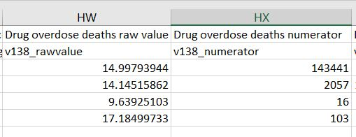

# The R team discovers distributions and inference

## Achievements to unlock

With descriptive statistics and graphs as a foundation, Kiara and Nancy decide to introduce Leslie to statistical inference. Statistical inference is one of the foundational ideas in statistics. Since it is often impossible to collect information on every single person or organization, scientists take samples of people or organizations and examine the observations in the sample. Inferential statistics are then used to take the information from the sample and use it to understand (or infer to) populations. 

Much of statistical inference is based on the characteristics of different distributions. Section \@ref(defining-and-calculating-central-tendency) introduced the normal distribution and a few of its characteristics. The normal distribution is just one of many distributions used to determine how likely it is that the characteristics of a sample are a good representation of the characteristics of the population that the sample came from. This chapter will cover two of the most commonly used distributions and how they are used to infer information about populations from samples.

Kiara creates the outline for today: 

* Achievement 1: Defining and using the probability distributions to infer from a sample
* Achievement 2: Understanding the characteristics and uses of a binomial distribution of a binary variable
* Achievement 3: Understanding the characteristics and uses of a the normal distribution of a continuous variable
* Achievement 4: Computing and interpreting z-scores to compare observations to groups 
* Achievement 5: Estimating population means from sample means using the normal distribution
* Achievement 6: Computing and interpreting confidence intervals around means and proportions

Follow Nancy, Kiara, and Leslie to learn about distributions and inference.

## The tricky overdose problem

Leslie's friend Liz has been doing a lot of work on the opioid epidemic in the United States. She and Leslie meet for coffee and Liz starts telling Leslie about the increases in drug overdoses in the US in recent years. She shows Leslie the County Health Rankings & Roadmaps website [@CountyHealthRankings], which includes data on the overdose deaths per 100,000 US residents for each year. Liz shows Leslie a graph she is working on using the County Health Rankings data that demonstrates the steady rise of opioid deaths from 2014-2017.   

```{r c4intro1, error=FALSE, message=FALSE, warning=FALSE, echo=FALSE, fig.cap = "Overdose deaths per 100,000 U.S. residents 2014-2017."}
# read in the data using read_csv
# skip one line
library("tidyverse")

# function does not work bc data is inconsistently formatted FIX
# function to skip second line with labels
# bringInData <- function(x) {
 # colNames <- names(read_csv(x, n_max = 0))
  # read_csv(x, col_names = colNames, skip = 2)
#}

# all the data
# 2014 has var names first row
# data location for citing: http://www.countyhealthrankings.org/sites/default/files/2014%20CHR%20analytic%20data.csv
colNames2014 <- names(read_csv("data/2014_CHR_analytic_data.csv", 
                               n_max = 0))
counties2014 <- read_csv("data/2014_CHR_analytic_data.csv", 
                         col_names = colNames2014, skip=2)
#2017 has var names second row
# data location for citing: http://www.countyhealthrankings.org/sites/default/files/2017CHR_CSV_Analytic_Data.csv
colNames2017 <- names(read_csv("data/2017CHR_CSV_Analytic_Data.csv", 
                               skip=1, n_max = 0))
counties2017 <- read_csv("data/2017CHR_CSV_Analytic_Data.csv", 
                         col_names = colNames2017, skip=2)
#2015 & 2016 have no var names
# URL: http://www.countyhealthrankings.org/sites/default/files/2015%20CHR%20Analytic%20Data.csv
counties2015 <- read_csv("data/2015_CHR_Analytic_Data.csv")
counties2015 <- rename(counties2015, 
                       measure_138_numerator="Drug poisoning deaths Numerator")
counties2015 <- rename(counties2015, 
                       measure_138_denominator="Drug poisoning deaths Denominator")

# URL: http://www.countyhealthrankings.org/sites/default/files/2016CHR_CSV_Analytic_Data_v2.csv
counties2016 <- read_csv("data/2016CHR_CSV_Analytic_Data_v2.csv")
counties2016 <- rename(counties2016, 
                       measure_138_numerator="Drug Overdose Deaths Numerator")
counties2016 <- rename(counties2016, 
                       measure_138_denominator="Drug Overdose Deaths Denominator")

#overdose rates function
overdoseFunc <- function(x) {
  sum(x$measure_138_numerator, na.rm = T)/sum(x$measure_138_denominator, na.rm=T)*100000
}

#overdose rates data frame
overdosePer100k <- c(overdoseFunc(counties2014),
                   overdoseFunc(counties2015),
                   overdoseFunc(counties2016),
                   overdoseFunc(counties2017))
year <- c(2014,2015,2016,2017)
odRatesYear <- data.frame(overdosePer100k, year)

#make a pretty graph
ggplot(odRatesYear, aes(year, overdosePer100k)) +
  geom_line(color='#7463AC', size=1) +
  geom_point(color='#7463AC', size=3) + 
  theme_minimal() + 
  ylim(0,18) + 
  ylab("Deaths per 100,000 people") +
  xlab("Year")


```

Leslie cannot stop thinking about this data and spends some time looking through the County Health Roadmap website later that day. She does some more searching and finds the CDC WONDER website [@UnderlyingCauseofDeath19992017], which has data on the underlying cause of each death in the US. For drug deaths, the CDC WONDER data includes the drug implicated in each death, if available. One graph shown on the CDC website demonstrates a sharp increase in opioid-related deaths, accounting for some of the increase in overall overdose deaths that Liz was working on. 

```{r echo = FALSE, fig.cap="From Centers for Disease Control and Prevention website with url of https://d14rmgtrwzf5a.cloudfront.net/sites/default/files/overdosedeaths1.jpg."}

```

Leslie is curious about policies that might address this growing problem. After a little more research she finds that states have begun to adopt a number of policies to try to combat the opioid epidemic. She finds that some of the state-level policy solutions to addressing the increasing number of opioid overdoses are [@RefWorks:2322]: 

* imposing quantity limits 
* requiring prior authorization for opioids 
* use of clinical criteria for prescribing opioids 
* step-therapy requirements, and 
* required use of prescription drug monitoring programs 

Leslie looks into these different strategies and finds that _quantity limit policies_ set limits on the supply of opioids prescribed in an intial prescription. States limit first-time prescriptions to three, five, seven, or 14 days. _Prior authorization_ is the requirement of a medical justification for an opioid prescription before an insurer will cover the prescription [@RefWorks:2321]. _Clinical criteria for prescribing opioids_ are guidelines for physicians making decisions about opioids including selection of the type, dose, duration, discontinuation, and associated potential risks. _Step-therapy_ requires patients to try certain drugs before other drugs, so certain opioids may not be available until patients have tried non-opioid or alternative opioid options. _Prescription drug monitoring programs_ are active programs that collect, monitor, and analyze data on prescriptions from prescribers and pharmacies in order to identify problematic prescribing patterns and aid in understading the epidemic.

The Kaiser Family Foundation (KFF) keeps track of the adoption of these policies across all 50 states and the District of Columbia [@KFFopioid]. After reading through the KFF website, Leslie notices that it seems like the number of state policies being adopted in states is also increasing. Leslie decides to bring the idea of opioid overdoses to the R team as a possible tricky problem for their next meeting. 

When they meet, she summarizes everything she found above and shows the team the data sources at the County Roadmaps, CDC, and KFF that they could work with. She shows them a copy of Figure \@ref(fig:c4intro1) and explains that when she was reading the KFF website she thought it showed an increase in the number of states adopting policies that might address the increases in drug overdoses and especially in opioid overdoses. Nancy is eager, as usual, to get started coding, so she goes to the KFF website and starts working on some code to see if what Leslie noticed about the number of policies increasing is supported by the data. When she gets to the website, she finds one of her very favorite things, *messy data* saved in inconsistent formats. It takes her a little time, but she eventually gets the data to cooperate and creates a line graph showing state opioid policies from 2015 to 2017. 

Leslie is interested in how she got all the data together to make the graph, so Nancy sends her the code so she can review it later (see Box \@ref(ch4nancy)).

```{r c4intro2, error=FALSE, message=FALSE, warning=FALSE, echo=FALSE, fig.cap = "Number of states adopting prescription drug policies, 2015-2017"}
opioid.policy.kff <- read.csv("data/opioid_kff_2015_2017_ch4.csv")

#make a graph
opioid.policy.kff %>% 
  mutate(policy, policy = recode_factor(policy,
                                        `quantLim` = "Opioid Quantity Limits",
                                        `priorAuth` = "Prior Authorization for Opioids",
                                        `clinCrit` = "Opioid Clinical Criteria",
                                        `therapyReq` = "Opioid Step Therapy Requirements",
                                        `monitor` = "Prescription Drug Monitoring Programs")) %>%
  mutate(year = as.factor(year)) %>%
  ggplot(aes(year, states, group=policy, color=policy)) +
  geom_line(size = 1) +
  geom_point(size = 3) + 
  ylim(0, 50) + 
  ylab("Number of states adopting policy") +
  xlab("Year") +
  theme_minimal()+
  theme(legend.position = "bottom")+
  guides(color=guide_legend(nrow = 3))+
  scale_color_brewer(name = "", palette = "Set2") 

```

 

## Achievement 1: Defining and using the probability distributions to infer from a sample

Based on Figure \@ref(fig:c4intro2), Leslie was right that the number of state-level drug monitoring programs increased over the 2015 to 2017 time period. She has heard that there is emerging evidence that prescription drug monitoring programs (PDMP) are an effective tool in understanding the opioid crisis and in reducing opioid overdoses and deaths [@RefWorks:2322]. As of 2017, just over half of states (n = 26) had adopted a PDMP, leaving 25 states without. This information can be represented in a **probability distribution**. A probability distribution is the set of probabilities that each possible value (or range of values) of a variable occurs.

Leslie starts to explain to Nancy what a probability distribution is, but Nancy does not look up from her phone, so she turns to Kiara and explains that, if she were to put the names of states on slips of paper and select one without looking, the probability that the state she selected would have a monitoring program in 2017 would be 26 out of 51 (50 states plus Washington DC), which is 51%. The probability that she selected a state with no monitoring program would be 25/51 or 49%. The set of these probabilities together is the probability distribution for the PDMP policy. A probability distribution is the numeric or visual representation of the _set of probabilities that each value or range of values of a variable occurs_. Kiara agrees with this explanation, although it has been a while since she thought about probability distributions. 

### Characteristics of probability distributions

Leslie goes on to explain that probability distributions have two important characteristics:

1) The probability of each real value of some variable is non-negative; it is either 0 or positive
2) The sum of the probabilities of all possible values of a variable is 1 

Kiara adds that there are many different probability distributions, with each one falling into one of two categories: **discrete** or **continuous**. Discrete probability distributions show probabilities for categories of a categorical variable. Continuous probability distributions show probabilities for values, or ranges of values, of a continuous variables. 

### Types of probability distributions 

These two categories of probability distributions are are the foundation for most statistical tests in social science. Kiara suggests that there are two specific probability distributions in particular that are commonly used and good examples for learning how a probability distribution works: the _binomial distribution_ and the _normal distribution_. The binomial distribution is a _discrete probability distribution_ and applies to probability for binary categorical variables with specific characteristics.  The _normal distribution_ is a _continuous probability distribution_ and applies to probability for continuous variables. 

### unlock achievement 1: Check your understanding

The _binomial distribution_ is a probability distribution for ___________ variables, while the _normal distribution_ is a probability distribution for ____________ variables.

Thirty-six of 51 states have opioid step therapy requirements. What are the probabilities that would make up the probability distribution for states having opioid step therapy requirements?

## Achievement 2: Understanding the characteristics and uses of a binomial distribution of a binary variable

The binomial distribution is a _discrete probability distribution_ used to understand what may happen when a variable has two possible outcomes. The most common example is flipping a coin, but there are many variables that have two outcomes: alive or dead, smoker or non-smoker, healthy weight or unhealthy weight, depressed or not depressed. Kiara reminds Leslie that whether a state adopted, or did not adopt, an opioid policy is another example of a variable with two possible outcomes: policy, no policy. More specifically, the _binomial distribution_ is used to represent the distribution of a _binomial random variable_, which has the following properties: 

* A variable is measured in the same way _n_ times 
* There are only two possible values of the variable, often called "success" and "failure"
* Each observed value is independent of the others 
* The probability of "success" is the same for each observation 
* The random variable is the number of successes in _n_ measurements 

The binomial distribution is defined by two things: 

* n - the number of observations (e.g., coin flips, people surveyed, states selected)   
* p - the probability of _success_ (e.g., 50% chance of heads for a coin flip, 51% chance of a state having a prescription drug monitoring program)

Leslie is thinking that this seems overly complicated so far. If she knows that 51% of states have monitoring programs and 49% do not, why not just report those percents and be done with it?

### Using distributions to learn about populations from samples 

Nancy explains that researchers often work with **samples** instead of **populations**. In the case of the state data on opioid policies, all states are included, so this is the entire **population** of states. When it is feasible to measure the entire population, reporting the percents like Leslie suggests is usually sufficient. However, populations are often expensive and logistically difficult or impossible to measure, so a subset of a population is often measured instead. This subset is a sample. If, for example, Leslie was working on her dissertation and wanted to study how the number of opioid deaths relates to one or two characteristics of states, she might choose a sample of 20 or 30 states to examine. 

### Statistical properties of a binomial random variable

If Leslie did not know which states had PDMP (she just knew it was 51% of states) and decided her sample of states needed to include exactly 10 states with PDMP, she could use the binomial distribution to decide how many states to include in a sample in order to have a good chance of picking 10 with PDMP. Before she can use the binomial distribution, she needs to ensure that the PDMP variable has the properties of a **binomial random variable**: 

* The existence of a monitoring program would be measured each state 
* The only two possible values are "success" for having a PDMP and "failure" for not having a PDMP 
* Each state is independent of the other states 
* The probability of having a program is the same for each state 

Leslie is concerned about the third and fourth assumptions of states being independent of other states and having the same probability of having a program. She thinks that states and state lawmakers are definitely separate but that she has read that often neighboring states will be more similar to each other than to states in other parts of the country. They discuss it for a few minutes and decide that the influence of geography is complex and should definitely be seriously considered before publishing any research with these data, but that they feel ok using these data to explore the statistical concepts. So, for today, they will consider the states and counties in the data they use as independent of each other. This makes Kiara a little nervous and she vows to put a big emphasis on assumption checking and meeting assumptions for all the data used in the remaining chapters. 

After that detour, they go back to their discussion of the binomial distribution. The **expected value** of a binomial random variable is $np$, where n is sample size and p is the probability of a *success*. In this example, if the sample size is 20 and the probability of success (having a PDMP) is 51%, which is formatted as a proportion rather than a percentage for the purposes of this calculation, the expected value of the binomial random variable after taking a sample of 20 states would be $20*.51$ or `r 20*.51`. 

The expected value is useful, but since the value of $p$ is a probability (not a certainty), the expected value will not occur every time a sample is taken. Leslie uses the **probability mass function** for the binomial distribution to compute the probability that any given sample of 20 states would have *exactly* 10 states with PDMP. A probability mass function is a function that computes the probability that an exact number of successes happens for a discrete random variable. Nancy's eyes start to glaze over with all this terminology. Leslie summarizes it in practical terms. She explains that the probability mass function will give them the probability of getting 10 states with a PDMP if they select 20 states at random from the population of states where the likelihood of any one state having a prescription drug monitoring program was 51%. In the probability mass function, $x$ represents the specific number of successes of interest, $n$ is the sample size, and $p$ is the probability of success. 

$$
\begin{equation}
f(x, n, p) = {{n}\choose{x}} \cdot p^x \cdot (1-p)^{(n-x)}
 (\#eq:pmfbinom)
\end{equation}
$$
$$
\begin{equation}
f(10, 20, .51) = {{20}\choose{10}} \cdot .51^{10} \cdot (1-.51)^{(20-10)}
 (\#eq:pmfbinom2)
\end{equation}
$$
$$
\begin{equation}
f(10, 20, .51) = .175
 (\#eq:pmfbinom3)
\end{equation}
$$

Leslie confirms that there is a 17.5% probability of choosing exactly 10 states with drug monitoring programs if she chooses 20 states at random from the population of states where 51% of them have a drug monitoring program. Nancy sees her chance to get some code into the discussion and shows Leslie that R has a function built in for using the binomial distribution. She shows them how to use the `dbinom()` command in base R, which uses Equation \@ref(eq:pmfbinom), to compute this probability given the number successes, the sample size (`size =` option), and the probability of successes (`prob =` option):

```{r}
# where successes = 10, n = 20, p = .51
dbinom(x = 10, size = 20, prob = .51)                  
```

### Visualizing the binomial distribution

Kiara lets Leslie know that the binomial distribution can also be displayed graphically and used to understand the probability of getting a specific number of successes or a range of successes (e.g., _10 or more successes_). She creates a plot of the *probability mass function* showing the distribution of probabilities of different numbers of successes. Nancy makes an example graph showing the probability of getting a certain number of states with monitoring programs in a sample when 20 are selected:

```{r echo=FALSE, fig.cap = "Probability mass function plot showing probability of number of selected states with PDMP out of 20 total selected when 51% have PDMP overall"}
states  <- 0:20
df <- data.frame(x = states, y = dbinom(states, 20, 0.51))

ggplot(df, aes(x = x, y = y)) + 
  geom_bar(stat = "identity", col = "gray", fill = "#7463AC") + 
  scale_y_continuous(expand = c(0.01, 0)) + 
  xlab("States with monitoring programs") +
  ylab("Probability of selection") + 
  theme_minimal()

```

Along the x-axis in the plot are the number of states selected that have a PDMP program (in a sample where $n = 20$ and $p = .51$). Along the y-axis is the probability of selecting exactly that many states. So, for example, it looks like there is about a one percent chance of exactly five successes. So, in choosing 20 states at random from all the states, there is approximately a 1% chance that exactly five of them will have a PDMP. Kiara uses the R code to confirm this observation:

```{r}
# 5 successes from a sample of 20 with 51% probability of success
dbinom(x = 5, size = 20, prob = .51)                  
```

By multiplying the result by 100, Leslie determines there is a `r round(100*dbinom(5, size = 20, prob = .51),2)`% chance of choosing 20 states at random from a population where 51% have PDMP and the sample having exactly five with a PDMP. What if the percentage of states with programs increased? If 75% of states had programs, what is the probability that exactly five out of 20 selected at random would have a program? 

Nancy sees her chance to write some more code and plots a binomial distribution for a sample size of 20 with a 75% probability of success. An examination of the graph reveals that the probability of exactly five successes is very low, near zero.

```{r echo=FALSE, fig.cap = "Probability mass function plot showing probability of number of selected states with PDMP out of 20 total selected when 75% have PDMP overall"}
states  <- 0:20
df <- data.frame(x = states, y = dbinom(states, 20, 0.75))

ggplot(df, aes(x = x, y = y, fill = states < 6)) + 
  geom_bar(stat = "identity", col = "gray") + 
  scale_y_continuous(expand = c(0.01, 0)) + 
  xlab("States with monitoring programs") +
  ylab("Probability of selection") + 
  theme_minimal() +
  scale_fill_manual(values = c("gray","#7463AC"),
                    name = "Number of states\nwith PDMP",
                    labels = c("> 5", "5 or fewer")) 

```

Leslie points out that the distribution has shifted to the right on the x-axis and getting exactly five successes is even less probable than when the probability of success was 51%. Kiara thinks this makes sense; it would be wierd to get so few states with PDMP in a sample if 75% of them had this program. Nancy just wants to code and writes `dbinom()` for checking how low the probability of five successes actually is:

```{r}
# 5 successes from 20 selections with 75% probability of success
dbinom(x = 5, size=20, prob=.75)                  
```

Leslie remembers that the -06 in the output is **scientific notation**, so, when 75% of states have drug monitoring program, she determines there is a `r format(round(100*dbinom(5, size=20, prob=.75), 5), scientific = FALSE)`% chance of choosing exactly five states with PDMP out of 20 selected.

So far the probabilities are very small for scenarios of getting exactly five or exactly 10. Nancy explains that the **cumulative distribution function** for the binomial distribution can determine the probability of getting some *range of values*, which is often more useful than finding the probability of one specific number of successes. For example, what is the probability selecting 20 states and getting five *or fewer* states with PDMP? Likewise, what is the probability of getting 10 *or more* states with PDMP in a sample of 20? Leslie writes out the equation for the cumulative distribution function: 

$$
\begin{equation}
f(x; n , p) = \sum_{x=0}^{x_{floor}} {{n}\choose{x}} \cdot p^x \cdot (1-p)^{(n-x)}
 (\#eq:cdfbinom)
\end{equation}
$$

Where $x$ is number of successes, $x_{floor}$ is the largest integer less than or equal to $x$, $n$ is the sample size, and $p$ is the probability of success. Leslie notes that the cumulative distribution function computes the probability of getting $x$ *or fewer* successes.

Leslie asks Nancy if she can edit the graph to show the probability of five or fewer states with PDMP in a sample of 20. She edits the graph so that the purple shows the range where there are five or fewer successes: 

```{r c4main10, echo=FALSE, fig.cap="Probability mass function plot showing probability of five or fewer selected states with PDMP out of 20 total selected when 51% have PDMP overall"}
states  <- 0:20
df <- data.frame(x = states, y = dbinom(states, 20, 0.51))

ggplot(df, aes(x = x, y = y)) + 
  geom_bar(stat = "identity", col = "gray", aes(fill = states < 6)) + 
  scale_fill_manual(values = c("gray","#7463AC"),
                    name = "Number of states\nwith PDMP",
                    labels = c("> 5", "5 or fewer")) +
  scale_y_continuous(expand = c(0.01, 0)) + 
  xlab("States with monitoring programs") +
  ylab("Probability of selection") + 
  theme_minimal()

```

Leslie and Kiara think it looks like less than a 2% chance of five or fewer given the size of the purple section of Figure \@ref(fig:c4main10). Nancy introduces `pbinom()`, which uses Equation \@ref(eq:cdfbinom) to compute the probability of five or fewer successes is for a sample of 20 (`size = 20`) from a population with a 51% probability of success (`prob = .51`):

```{r}
# 5 or fewer successes from 20 selections 
# with 51% probability of success
pbinom(q = 5, size = 20, prob = .51) 
```

The `r round(100*pbinom(5, size=20, prob=.51),2)`% makes sense. The purple section of Figure \@ref(fig:c4main10) appears to be quite small. Leslie wants to try computing the probability for 10 successes *or more*. Nancy creates a visual to start:  

```{r c4main11, echo=FALSE, fig.cap="Probability mass function plot showing probability of 10 or more selected states with PDMP out of 20 total selected when 51% have PDMP overall"}
states  <- 0:20
df <- data.frame(x = states, y = dbinom(states, 20, 0.51))

ggplot(df, aes(x = x, y = y)) + 
  geom_bar(stat = "identity", col = "gray", aes(fill = states > 9)) + 
  scale_fill_manual(values = c("gray","#7463AC"),
                    name = "Number of states\nwith PDMP",
                    labels = c("< 10", "10 or more")) +
  scale_y_continuous(expand = c(0.01, 0)) + 
  xlab("States with monitoring programs") +
  ylab("Probability of selection") + 
  theme_minimal()

```

Leslie thinks this looks like more than half the time. She asks Nancy to use `pbinom()` to compute the value. This time the range of values she wants to get the probability for is on the right side of the graph instead of the left side, so she looks at the help documentation and finds that there is a setting for `pbinom()` to get the right side of the graph but specifying `lower.tail = FALSE`. The `lower.tail =` option has the default value of true, so it does not need to be included when estimating the lower tail, but does need to be added when it is the upper tail on the right to be estimated:

```{r}
# 10 or fewer successes from 20 selections 
# with 51% probability of success
# get right side of graph
pbinom(q = 10, size = 20, prob = .51, lower.tail = FALSE) 
```

This does not seem right to Kiara and Leslie. It does not match the graph which clearly shows more than half of the histogram is shaded purple. Leslie has an idea. The `pbinom()` calculation with the default of `lower.tail = TRUE` is for 10 or fewer successes, maybe the `lower.tail = FALSE` is computing _higher than 10_ rather than _10 or higher_ so it is missing some of the graph in the middle. Leslie has an idea and changes the arguments for `pbinom()` to get the probability of *10 or more* successes:

```{r}
# 10 or more successes from 20 selections 
# with 51% probability of success
# pbinom computes left tail, so subtract from 1 for right tail percent
pbinom(q = 9, size=20, prob=.51, lower.tail = FALSE) 
```

This seems like a more accurate value for the purple part of Figure \@ref(fig:c4main11). Leslie interprets the results as a `r round(100*(pbinom(9, size=20, prob=.51, lower.tail=FALSE)),2)`% probability of selecting 10 or more states with PDMP in a sample of 20 from a population of states where 51% have PDMP. 

Leslie is not that excited about this day of R so far. It does not seem all that useful and there has not been much fun coding yet. Kiara thinks maybe bringing in some actual data and testing the results on the real data would help. Unfortunately, the opioid policy data from the Kaiser Family Foundation (KFF) from 2015 to 2017 was summary data on their website and did not list the specific states that had passed the opioid policies. Leslie opens the KFF website and finds a table and downloadable data is available showing the actual states and their opioid policies as of 2018. 

Nancy springs into action when she sees the opportunity to code. She tries to bring in the data directly into R from the KFF website, but the way the website is formatted it is better to download and save the data and use the saved data file. She downloads the file from the website, opens it in Excel, and removes a few rows at the top and bottom of the file that contain notes (not data), then sends it to Leslie. Kiara is a little annoyed by this because it is not a reproducible research practice, but she lets it go for now. To follow along, the data file is available at edge.sagepub.com/harris1e in the **pdmp_2018_kff_ch4.csv** file.

Leslie brings in the file and uses summary to review what is there: 

```{r}
# bring in the opioid policy 2018 data and check it out
opioid.policy.kff <- read.csv(file = "data/pdmp_2018_kff_ch4.csv") 
summary(object = opioid.policy.kff)
```

Leslie is unsure about how to proceed. Kiara explains that they can pretend that they only have a budget to collect data from a sample of states and then use the binomial distribution with that sample to see if they can get close to what the true value is. Kiara suggests they see if a sample of 25 states has 15 or more states with PDMP. First they should see what the binomial distribution tells them about the probability of getting a sample with 15 or more PDMP out of 25 states. For this they need the percent of states that currently have PDMP (the *success* rate). Leslie examines the new data and sees 32/51, or 63% of state have PDMP (up from 51% before). Leslie copies the `pbinom()` code and revises it for the new scenario: 

```{r}
# 10 or more successes from 20 selections 
# with 63% probability of success
# pbinom computes left tail, so subtract use lower.tail = FALSE
pbinom(q = 14, size=25, prob=.63, lower.tail = FALSE) 
```

The probability of selecting a sample of 25 states where 15 or more states have PDMP is `r round(100*(1 - pbinom(14, size=25, prob=.63)),2)`%. Leslie does not know what to do next. Luckily Nancy has some R code to help. Before they start sampling, Kiara chimes in to tell Leslie and Nancy that the `set.seed()` command is useful when conducting random sampling since it will result in the same sample to be taken each time the code is run, so it is useful for reproducibility (for more, see Box \@ref(ch4kiara). 

As she is writing the code, Nancy explains that `sample_n()` can be used to take a sample. The arguments for `sample_n()` are `size =` which is where to put the size of the sample to take and `replace =` which is where you choose whether or not you want R to sample **with replacement** (replacing each value after selection) or without replacement (leaving a value out of the sampling after selection). Leslie has just learned about sampling with and without replacement and shares some of her notes with Kiara and Nancy for later (see Box \@ref(ch4leslie)).

Nancy writes the code to take the sample and to get the percent of states in the sample with a PDMP:

```{r}
# set a starting value for sampling
set.seed(seed = 3)

# sample 20 states and check file
opioid.policy.kff %>% 
  select(Required.Use.of.Prescription.Drug.Monitoring.Programs) %>%
  sample_n(size = 25, replace = FALSE) %>%
  summary()

```

The sample has 17 states with PDMP, which is more than 15. Leslie is satisfied. The binomial distribution indicated there was a 70% chance they would see 15 or more states with PDMP in a sample this big, and they did. Nancy thinks they should take a few more samples with different seeds just to see what happens:

```{r}
# set a starting value for sampling
set.seed(seed = 10)

# sample 20 states and check file
opioid.policy.kff %>%
  select(Required.Use.of.Prescription.Drug.Monitoring.Programs) %>%
  sample_n(size = 25, replace = FALSE) %>%
  summary()
```

This sample has 15 states with PDMP. Nancy thinks they should try at least one more.

```{r}
# set a starting value for sampling
set.seed(seed = 999)

# sample 20 states and check file
opioid.policy.kff %>%
  select(Required.Use.of.Prescription.Drug.Monitoring.Programs) %>%
  sample_n(size = 25, replace = FALSE) %>%
  summary()
```

This one just has 14 states with PDMP. So, out of three samples of 25 states, two samples had more than 10 states with PDMP and one sample had fewer than 10 states with PDMP. This seems consistent with the binomial distribution prediction that 70% of the time a sample of size 25 will have at least 15 states with PDMP. Leslie agrees that it is a lot easier to use `pbinom()` than to take a bunch of samples to see what happens and she finally sees the value of this distribution for selecting a sample size. Kiara is glad this clarified things and they get ready to move on.

### unlock achievement 2: Check your understanding

Forty-eight states (94%) had implemented an opioid quantity limits policy in 2017. Nancy created the graph below to show the probability for having an opioid quantity policy in a sample of 30 states when the probability in the population of states is 94%. Based on the graph, how likely do you think it is that all 30 states in a sample would have this policy? 

```{r echo=FALSE, fig.cap="Probability mass function plot showing probability of number of selected states with quantity policy out of 30 total selected when 94% have the policy overall"}
states  <- 0:30
df <- data.frame(x = states, y = dbinom(states, 30, .94))

ggplot(df, aes(x = x, y = y)) + 
  geom_bar(stat = "identity", col = "gray", fill = "#78A678") +
  scale_y_continuous(expand = c(0.01, 0)) + 
  xlab("States with quantity limits policy") +
  ylab("Probability of selection") + 
 theme_minimal()

```

Use `dbinom()` to determine the probability of choosing 30 states and having exactly 30 of them with an implemented opioid quantity limits policy in 2017. Interpret the result for Leslie and note how well the result matches what could be estimated based on the graph.  

## Achievement 3: Understanding the characteristics and uses of a the normal distribution of a continuous variable

Kiara reminds Leslie that many of the variables of interest in social science are not binary so the binomial distribution and its related functions would not be all that useful. Instead, Kiara explains that the probability distribution for a continuous variable is the normal distribution. Just as the binomial distribution is determined by $n$ and $p$, the normal distribution is determined by $m$ and $s$, the mean and standard deviation of a variable. 

### Probability density function 

Kiara explains that the normal distribution is used to find the likelihood of a certain value or range of values for a continuous variable. For example, the number of drug overdose deaths in the U.S. has a mean value of 18 and a standard deviation of seven for every 100,000 people who live in a county. Leslie stops her for a minute to clarify that the number of drug overdose deaths can only be whole numbers so it is not truly continuous since the values cannot be _any value_ in the range. However, the variable is more like a continuous variable than a categorical variable since the number of deaths can take any whole number between 0 and the number of people in the group. Kiara nods and continues. Like the probabilities from the binomial distribution are shown visually in a probability mass function graph, the normal distribution has a **probability density function** graph. Using the mean and standard deviation of 18 and seven, the probability density function graph would look like: 

```{r echo=FALSE, fig.cap="Probability density for drug poisoning deaths per 100,000 residents where mean is 18 and standard deviation is 7 per 100,000 residents."}
#plot normal curve using ggplot
dat<-with(density(rnorm(1000000, mean=18, sd=7)),data.frame(x,y))
ggplot(data = dat, mapping = aes(x = x, y = y)) +
    geom_line()+
  theme_minimal() +
  xlab("Drug poisoning deaths per 100k") + ylab("Probability")
  
```


For this graph, the area under the curve represents 100% of observations. Using this **probability density function** graph to determine probabilities is a little different from using the **probability mass function** graph from the binomial distribution previous examples. With continuous variables the probability of any one certain number is going to be extremely low, often near zero. So, instead, probabilities are usually computed for a range of values. For example, the shading under the curve represents U.S. counties with 25 or more drug poisoning deaths per 100,000 residents:

```{r c4main15, echo=FALSE, fig.cap="Probability density for drug poisoning deaths per 100,000 residents where mean is 18 and standard deviation is 7 per 100,000 residents."}
# plot normal curve using ggplot
dat<-with(density(rnorm(1000000, mean=18, sd=7)),data.frame(x,y))
ggplot(data = dat, mapping = aes(x = x, y = y)) +
    geom_line()+
    geom_area(mapping = aes(x = ifelse(x>25 , x, 0)), fill = "#7463AC") + ylim(0,.06) + 
  theme_minimal() +
  xlab("Drug poisoning deaths per 100k") + ylab("Probability")

```

### Finding the area under the curve

Nancy tells Leslie that the `pnorm()` command is useful for finding the actual probability value for the shaded area under the curve. In this case, `pnorm()` can be used to determine the proportion of counties with 25 or more drug poisoning deaths per 100,000 people. The `pnorm()` command takes three arguments: the value of interest, $x$, the mean ($m$), and the standard deviation ($s$).  

```{r}
# area under normal curve for 25 
# when curve has mean of 18 and sd of 7
pnorm(q = 25, mean = 18, sd = 7)             
```

Kiara asks Leslie if 84.13% seems right. Does the shaded area in Figure \@ref(fig:c4main15) look like 84.13% of the area under the curve? Leslie shakes her head no.

Nancy lets them both know that the `pnorm()` function finds the area under the curve starting on the left up to the x value entered, in this case 25. To get the area under the right side tail of the distribution, use an option:

```{r}
# area under normal curve to the right of 25
# when curve has mean of 18 and sd of 7
pnorm(q = 25, mean = 18, sd = 7, lower.tail = FALSE)             
```

Much better! It looks like 15.9% of counties have more than 25 drug poisoning deaths per 100,000 residents. This value seems more consistent with the purple shaded area of the Figure \@ref(fig:c4main15).

### unlock achievement 3: Check your understanding

Figure \@ref(fig:c4main20) shows shading for counties with fewer than 10 drug poisoning deaths per 100,000 residents. Look at the graph and make your best estimate (without computing the answer) of the percentage of counties in the shaded area.

```{r c4main20, echo=FALSE, fig.cap="Number of counties with fewer than 10 drug poisoning deaths per 100,000 residents when mean is 18 and standard deviation is 7 per 100,000 residents"}
# plot normal curve using ggplot
dat<-with(density(rnorm(100000, mean=18, sd=7)),data.frame(x,y))
ggplot(data = dat, mapping = aes(x = x, y = y)) +
    geom_line()+
    geom_area(mapping = aes(x = ifelse(x<10 , x, 0)), fill = "#7463AC") + ylim(0,.06) +
  theme_minimal() +
  xlab("Drug poisoning deaths per 100k") + ylab("Probability")
  
```

Compute the percent of counties with fewer than 10 drug poisoning deaths per 100,000 residents given the mean and standard deviation shown. Compare your answer with the value you estimated to see if it seems accurate. Interpret the computed value and describe how you made your estimate. 

## Achievement 4: Computing and interpreting z-scores to compare observations to groups {#zscore}

Kiara chimes in at this point to show off her favorite useful feature of the normal distribution. She tells Leslie that, regardless of what the mean and standard deviation are, a normally distributed variable has approximately: 

* 68% of values within one standard deviation of the mean  
* 95% of values within two standard deviations of the mean  
* 99.7% of values within three standard deviations of the mean

These characteristics of the normal distribution can be used to describe and compare how far individual observations are from a mean value. For example, in the example above, about 68% of counties have between $18 - 7$ and $18 + 7$ drug poisoning deaths per 100,000 residents. So, about 68% of counties have between 11 and 25 drug poisoning deaths per 100,000 residents. In addition, about 95% of counties would be between $18 - 7 \cdot 2$ and $18 + 7 \cdot 2$ or 4 and 32 drug poisoning deaths annually per 100,000 residents.

Kiara explains that this information is used to create z-scores, which allow description and comparison of where an observation falls compared to the other observations for a normally distributed variable. 

### Defining the z-score {#zscore.section}

She gives Leslie the z-score formula and explains that the z-score is *the number of standard deviations an observation is away from the mean*.

$$
\begin{equation}
z=\frac{x-m}{s}
 (\#eq:zscore)
\end{equation}
$$

The $x$ in the z-score represents the value of a variable for a single observation, $m$ is the mean of the variable, $s$ is the standard deviation of the variable. So, $z$ is the difference between the observation value and the mean value for a variable and is converted by the denominator into standard deviations.

### Calculating and interpreting z-scores

Leslie first tries using Equation \@ref(eq:zscore) to calculate $z$ for a county with 20 drug poisoning deaths in a year. She finds that $z = .29$ (Equation \@ref(eq:zscore2)), which indicates that this county has a drug poisoning rate that is .29 standard deviations above the mean.

$$
\begin{equation}
z=\frac{20-18}{7}=.29
 (\#eq:zscore2)
\end{equation}
$$


Likewise, Leslie finds that a county with 15 drug poisoning deaths is .43 standard deviations below the mean (Equation \@ref(eq:zscore3); $z = -.43$):

$$
\begin{equation}
z=\frac{15-18}{7}=-.43
 (\#eq:zscore3)
\end{equation}
$$

Leslie notices that the z-score was a positive value for the county with a rate that was higher than the mean and a negative value for the county with a rate that was lower than the mean. So, the z-score not only indicates how many standard deviations away from the mean an observation is, but whether the observed value is above or below the mean. 

### unlock achievement 4: Check your understanding

Use Equation \@ref(eq:zscore) to calculate the z-score for a county with 24 drug poisoning deaths when the mean is 18 and the standard deviation is 7. Interpret your result.

## Achievement 5: Estimating population means from sample means using the normal distribution

### Samples and populations

Kiara explains that the characteristics of the normal curve are exceptionally useful in better understanding the characteristics of a population when it is impossible to measure the entire population. She states that there is no realistical way to measure the height or weight or income of every single person in the U.S. right now. Instead, researchers often use a **representative sample** from the population they are interested in and use properties of the normal distribution to understand what is likely happening to the whole population. 

A **representative sample** is a sample taken carefully so that it does a good job of maintaining the characteristics of the population. For example, if a sample of U.S. citizens were taken and the sample was 75% female, this would not be **representative** of the distribution of sex in the population. There are many strategies for sampling that help to ensure a representative sample. Kiara suggests that Leslie read about sampling if she is even going to collect her own data.

### Using the normal distribution and samples to understand populations

To see how the normal distribution can use sample data to understand the population, Kiara suggests using something with a known population mean. Leslie points out that they have the mean number of drug poisoning deaths per county for all the counties in the U.S. in 2017. She looks at the code book on the County Health Rankings website to see which variables they need [@CountyHealthRankings] and notices that the website has both SAS and CSV data sets for analysis. Sensing an opportunity to do some fancy coding, Nancy has already downloaded the data and managed it into good shape. Nancy warns Leslie that the code was really messy; Leslie is happy Nancy has the importing skills and loads the clean CSV data from Nancy using `read.csv()`. To follow along, download the **chr_2017_ch4.csv** data from edge.sagepub.com/harris1e.

```{r}
# 2017 county-level data
counties.2017 <- read.csv(file = "data/2017CHR_CSV_Analytic_Data.csv", skip = 1)
```

### Data management 

Leslie notices that all counties have different population sizes, so comparing the number of drug poisoning deaths with raw numbers is not very useful. Leslie finds the **measure_138_value** variable in the codebook, which provides the number of drug poisoning deaths per 100,000 residents. 

Remembering her data management practices, Leslie uses the `rename()` code from Section \@ref(bar-graphs) to give this variable a name that is easier to remember and use. She then uses summarize from Section \@ref(importing-a-comma-separated-values-(csv)-file)to examine the mean and standard deviation of the variable.

```{r}
# renaming overdose rate variable
counties.2017.cleaned <- counties.2017 %>%
  rename(overdose.per.100k = measure_138_value) 

# get mean and sd from cleaned data
counties.2017.cleaned %>%
  summarize(mean = mean(x = overdose.per.100k, na.rm = TRUE),
            sd = sd(x = overdose.per.100k, na.rm = TRUE))
```

Leslie finds the mean number of deaths per 100,000 people in a county was 18.08 with a standard deviation of 9.39. She also notes that there are 3,186 counties in the data set representing all the counties in the U.S. This is all the U.S. counties, so it is not a sample of counties, it is the population of counties.

Kiara then asks Leslie how close she thinks we could get to the true mean rate of deaths ($m = 18.08$) if she only had enough time and money to collect data from 500 counties rather than all 3,186 counties? 

### Examining a sample from a population

Leslie is unsure about whether a sample will have a mean death rate anywhere near the population. Luckily Nancy has some R code to help. Before they start sampling, Kiara chimes in to remind Leslie and Nancy that the `set.seed()` command is useful for reproducibility (see Box \@ref(ch4kiara). Nancy mentions that the data frame is very large with several hundred variables and it might be faster to work with if it just has the overdose variable and some unique id variable. Leslie knows the fipscode variable is an identifier used with counties, so she suggests keeping *fipscode* and *overdose.per.100k* in a smaller data frame to work with.

```{r}
# make smaller data frame
counties.2017.cleaned.small <- counties.2017.cleaned %>%
  drop_na(overdose.per.100k) %>%
  select(fipscode, overdose.per.100k)

# set a starting value for sampling
set.seed(seed = 73)

# sample 500 counties at random
counties.500 <- counties.2017.cleaned.small %>%
  sample_n(size = 500, replace = FALSE)

# compute the mean death rate in the sample
counties.500 %>%
  summarize(mean = mean(x = overdose.per.100k, na.rm = TRUE))
```

The result is 18.34, which is close to 18.08, but not exactly the same. Leslie tries it again:

```{r}
# set a different starting value for sampling
set.seed(seed = 48)

# sample 500 counties at random
counties.500.2 <- counties.2017.cleaned.small %>%
  sample_n(size = 500, replace = FALSE)

# compute the mean death rate in the sample
counties.500.2 %>%
  summarize(mean = mean(x = overdose.per.100k, na.rm = TRUE))
```

This time the value was higher than the population mean death rate of 18.08, but still fairly close.

### Examining a sample of samples from a population

Leslie wonders what would happen if she took 20 samples of counties where each sample had 500 counties in it. Nancy has done this before and has some code to work with:

```{r}
# get 20 samples
# each sample has 500 counties
# put samples in a data frame with each sample having
# a unique id called sample_num
set.seed(98)
samples.20 <- bind_rows(replicate(n = 20, counties.2017.cleaned.small %>% 
                             sample_n(size = 500, replace = FALSE), 
                             simplify = FALSE), .id = "sample_num")

# find the mean for each sample
sample.20.means <- samples.20 %>%
  group_by(sample_num) %>%
  summarize(mean.overdoses.100k = mean(x = overdose.per.100k, na.rm = TRUE)) 
sample.20.means
```

Now that they have the means from 20 samples, with each sample including 500 counties, Kiara suggests they take the mean of the sample means. Leslie wants to get her hands back on the code and slides the laptop away from Nancy to write the following:

```{r}
# find the mean of the sample means
mean(x = sample.20.means$mean.overdoses.100k)
```

The mean of the 20 sample means is much closer to 18.08 than either of the individual samples. Leslie wants to try even more samples to see if it is even closer:

```{r}
# get 100 samples
set.seed(111)
samples.100 <- bind_rows(replicate(n = 100, counties.2017.cleaned.small %>% 
                             sample_n(size = 500, replace = FALSE), 
                             simplify = FALSE), .id = "sample_num")

# find the mean for each sample
sample.100.means <- samples.100 %>%
  group_by(sample_num) %>%
  summarize(mean.overdoses.100k = mean(x = overdose.per.100k, na.rm = TRUE)) 

# find the mean of the sample means
mean(x = sample.100.means$mean.overdoses.100k)
```

The mean of 100 sample means is even closer to the true population mean of 18.08. 

Nancy tells Leslie that the larger the samples and the more samples taken, the closer to the population mean she can get using sample data. 

Leslie tries taking 1,000 samples and graphing them. She notices that the code takes a little while to run on her laptop this time. Kiara explains that taking 1,000 samples requires more processing than a single sample and might take a few minutes.

```{r fig.cap="Mean overdoses per 100k people in 1000 samples of 100 counties each"}
# get 1000 samples
set.seed(143)
samples.1000 <- bind_rows(replicate(n = 1000, counties.2017.cleaned.small %>% 
                             sample_n(size = 500, replace = FALSE), 
                             simplify = FALSE), .id = "sample_num")

# find the mean for each sample
sample.1000.means <- samples.1000 %>%
  group_by(sample_num) %>%
  summarize(mean.overdoses.100k = mean(x = overdose.per.100k, na.rm = TRUE)) 

# find the mean of the sample means
mean(x = sample.1000.means$mean.overdoses.100k)
```

```{r}
# histogram of the 1000 means
sample.1000.means %>%
  ggplot(aes(x = mean.overdoses.100k)) +
  geom_histogram(fill = "#7463AC", color = "white") +
  labs(x = "Mean overdoses per 100k from 1000 samples") +
  theme_minimal()
```

Leslie notes that the mean of the sample means is very close to the population mean of 18.08 and the graph of the sample means looks a lot like a normal distribution. Kiara explains that taking a lot of large samples and graphing their means results in a **sampling distribution** that looks like a normal distribution, and, more importantly, _the mean of the sample means is nearly the same as the population mean_. A **sampling distribution** is the distribution of summary statistics from repeated samples taken from a population.

### The Central Limit Theorem

Kiara explains that this phenomenon is called the _Central Limit Theorem_ and that it holds true for variables that are normally distributed and those that not normally distributed. The **Central Limit Theorem** is one of the most important ideas for _inferential statistics_, or statistical approaches that infer population characteristics based on sample data. 

Another characteristic of the **Central Limit Theorem** is that the standard deviation of the sample means can be estimated using the population standard deviation and the size of the samples that make up the distribution, like this: 

$$
\begin{equation}
s_{samp.dist}=\frac{\sigma}{\sqrt{n}}
 (\#eq:sdsamp)
\end{equation}
$$

where $\sigma$ is the *population* standard deviation and $n$ is the size of the samples used to make the sampling distribution. Since they have all the counties (the population), Leslie computes $\sigma$ for the population overdose variable and uses it to compute the standard deviation of the sampling distribution: 

```{r}
# compute estimated standard dev of sampling dist
counties.2017.cleaned.small %>% 
  summarize(s.samp.dist.est = sd(x = overdose.per.100k, na.rm = TRUE)/sqrt(x = 500))
```

Nancy reminds her that she could also compute the standard deviation of the sampling distribution directly since they have the 1000 sample means saved in a data frame. Leslie writes a quick line of code:

```{r}
# computing the samp dist standard devation 
# directly from the 1000 sample means
sd(x = sample.1000.means$mean.overdoses.100k, na.rm = T)                      
```

Leslie notes that the results are similar but not identical. 

### The standard error

Kiara explains that the standard deviation of the sampling distribution shows how much we expect samples to vary from the population. Specifically, 68% of sample means will be within one standard deviation of the mean of the sampling distribution and 95% of sample means will be within two standard deviations of the sampling distribution mean. Since the sampling distribution mean is a good estimate of the population mean, it follows that most of the samples will have means that are within one or two standard deviations of the population mean.  
Since it is unusual to have the entire population for computing the population standard deviation, and it is also unusual to have a large number of samples from one population, a close approximation to this value is called the _standard error_. The standard error is computed by dividing the standard deviation of a sample by the square root of the sample size: 

$$
\begin{equation}
se = \frac{s}{\sqrt{n}}
 (\#eq:se)
\end{equation}
$$

where $s$ is the sample standard deviation and $n$ is the sample size.

Leslie tries computing the standard error for the first sample of 500 counties she took:

```{r}
# mean, sd, se for first sample
counties.500 %>%
  drop_na(overdose.per.100k) %>%
  summarize(mean = mean(x = overdose.per.100k),
            sd = sd(x = overdose.per.100k),
            se = sd(x = overdose.per.100k)/sqrt(x = length(x = overdose.per.100k)))

```

She can also compute the mean, standard deviation, and standard error for the second sample she took:

```{r}
# mean, sd, se for second sample
counties.500.2 %>%
  drop_na(overdose.per.100k) %>%
  summarize(mean = mean(x = overdose.per.100k),
            sd = sd(x = overdose.per.100k),
            se = sd(x = overdose.per.100k)/sqrt(x = length(x = overdose.per.100k)))
```

Kiara wants to summarize what they have just walked through:

* The standard deviation of the sampling distribution is `r sd(sample.1000.means$mean.overdoses.100k, na.rm = T)` 
* The standard error from the first sample is `r round(sd(x = counties.500$overdose.per.100k)/sqrt(x = length(x = counties.500$overdose.per.100k)),2)` 
* The standard error from the second sample is `r round(sd(x = counties.500.2$overdose.per.100k)/sqrt(x = length(x = counties.500.2$overdose.per.100k)),2)` 

Most of the time, she explains, researchers have a single sample and so the only feasible way to determine the standard deviation of the sampling distribution is by computing the standard error of the single sample. This value tends to be a good estimate of the standard deviation of sample means. So, Kiara explains, since: 

- about 68% of sample means are within one standard deviation of the sampling distribution mean (i.e., mean-of-sample-means),  
- about 95% of sample means are within two standard deviations of the sampling distribution mean (i.e., mean-of-sample-means),  
- The mean of a sampling distribution tends to be close to the population mean, and 
- The standard error is a good estimate of the sampling distribution standard deviation, 

...the mean of any given sample (given good data collection practices) is *likely to be within two standard erors of the population mean for that variable*. This is one of the foundational ideas of **inferential statistics**. 

### Standard deviation vs. standard error

Leslie stops Kiara to make sure she understands the difference is between a sample standard deviation and a sample standard error. Kiara says the standard deviation is a measure of the **variability in the sample** while the standard error is an estimate of **how closely the sample represents the population.**  

So, if there were no way to measure the population mean for the number of opioid deaths per 100k people in a county, Leslie could use the first sample of 500 counties to estimate that there is a good chance it is between $18.34-.44$ and $18.34+.44$ or `r 18.34-.44` and `r 18.34+.44`. There is an even higher probability that the population mean is between $18.34-.44\cdot 2$ and $18.34+.44\cdot 2$ or `r 18.34-.44*2` and `r 18.34+.44*2`. While it is unusual to have the population mean to compare results to, this time the team has it and can see that the population mean of 18.08 opioid deaths per 100k people in a county is represented well by the sample mean of 18.34 and the standard error of .44.

### unlock achievement 5: Check your understanding

Take a sample of 200 counties and compute the mean, standard deviation, and standard error for the drug poisoning death rate in 2017. BAsed on the sample mean and standard error, fine the range of values where the population mean drug poisoning death rate could be. Explain your results.

## Achievement 6: Computing and interpreting confidence intervals around means and proportions

Leslie wants to be sure she has the standard error concept correct because it seems important. Kiara states that the sample mean and the range around it where the population mean might be show the *uncertainty* of computing a mean from a sample.

These ranges around the sample mean, Kiara goes on, are reported as **confidence intervals**. Leslie looks confused. Kiara clarifies that **confidence** in this context is not about an emotion or feeling, but about how much uncertainty there is in the results. Most of the time, social scientists report 95% intervals or **95% confidence intervals** which show the range where the population value will likely be 95 times if the study were conducted 100 times. Sometimes smaller or larger intervals are reported, like a _68% confidence interval_ or a _99% confidence interval_.

Leslie clarifies the 95% interval idea as she understands it: 

* about 95% of values lie within 2 standard deviations of the mean  
* the standard error of a sample is a good estimate of the standard deviation of the sampling distribution 
* so, most sample means will be within 2 standard errors of the population mean 

Perfect, says Kiara, with one minor correction. While two is often used, the number of standard deviations away from the mean containing 95% of observations in a normal curve is actually 1.96. Kiara draws Leslie's attention to how Nancy just explained the 1.96 as the number of standard deviations away from the mean. She reminds Leslie that the number of standard deviations some value is away from the mean is called a z-score. 

So, Leslie confirms, when we took the first sample of 500 counties and found the mean drug poisoning death rate was `r round(mean(counties.500$overdose.per.100k, na.rm=T),2)` per 100,000 with a standard error of `r round(sd(counties.500$overdose.per.100k, na.rm=T)/sqrt(500),2)`, we can use this information to report this as a mean and its 95% confidence interval? Kiara nods yes. The 95% confidence interval for a mean is constructed from the mean, its standard error, and 1.96.

### Computing and interpreting a 95% confidence interval for a mean

Kiara agrees and Leslie starts to compute the CI by hand, but Nancy has a better idea:  

```{r}
# add CI to summary statistics
summ.500.counties <- counties.500 %>%
  summarize(smean = mean(x = overdose.per.100k),
            sd = sd(x = overdose.per.100k),
            se = sd(x = overdose.per.100k)/sqrt(x = length(x = overdose.per.100k)),
            lower.ci = smean - 1.96*se,
            upper.ci = smean + 1.96*se)
summ.500.counties
```

The 95% confidence interval for the mean is `r round(summ.500.counties$lower.ci, 2)` - `r round(summ.500.counties$upper.ci,2)`. Kiara interprets the results for the team: 

>The mean number of drug poisoning deaths in this sample of 500 counties is `r round(summ.500.counties$smean, 2)` per 100,000 residents; the true or population mean number of opioid deaths per 100,000 residents in a county likely lies between `r round(summ.500.counties$lower.ci, 2)` - `r round(summ.500.counties$upper.ci,2)` (m = `r round(summ.500.counties$smean, 2)`; 95% CI = `r round(summ.500.counties$lower.ci, 2)` - `r round(summ.500.counties$upper.ci,2)`).

Nancy thinks now is a good time to go back to the visuals and examine this confidence interval with a histogram. She creates a histogram of the overdose deaths showing the mean and the 95% confidence interval around the mean:

```{r echo = FALSE, fig.cap = "Overdose deaths per 100k with mean and 95% CI from a 2017 sample of 500 counties in the US."}
counties.500 %>% 
  ggplot(aes(x = overdose.per.100k)) + 
  geom_histogram(fill = "white", color = "gray60") + 
  geom_vline(aes(xintercept = mean(overdose.per.100k)), color = "#7463AC", size = 1) +
  geom_vline(aes(xintercept = mean(overdose.per.100k)-1.96*sd(overdose.per.100k)/sqrt(length(overdose.per.100k))), color = "#7463AC", size = 1, 
             linetype = "dashed") +
  geom_vline(aes(xintercept = mean(overdose.per.100k)+1.96*sd(overdose.per.100k)/sqrt(length(overdose.per.100k))), color = "#7463AC"
             , size = 1, 
             linetype = "dashed") +
  labs(x = "Overdose deaths per 100k", y = "Number of counties") + 
  theme_minimal()
```


Wow, the confidence interval is really narrow. Leslie notices that the mean seems to be a little to the right of where she would have guessed, but also notices that the histogram is right skewed, so it makes sense that the mean is a little larger than it seems like it should be. She remembers back to Section \@ref(defining-and-calculating-central-tendency), which explained what skew does to the value of the mean and why the median might be a better measure of central tendency in this situation.

Since they have the unusual benefit of knowing the population mean of the overdose variable, Nancy thinks it might be a good idea to add the mean for the population to see how well this sample is doing at representing the popultion. She adds another vertical line to show where the population mean is in relation to the sample mean and its confidence interval:

```{r echo = FALSE, fig.cap = "Overdose deaths per 100k in a sample of 500 counties (2017)."}
counties.500 %>% 
  ggplot(aes(x = overdose.per.100k)) + 
  geom_histogram(fill = "white", color = "gray60") + 
  geom_vline(aes(xintercept = mean(overdose.per.100k), color = "sampmean", linetype = "sampmean"), size = 1) +
  geom_vline(aes(xintercept = mean(overdose.per.100k)-1.96*sd(overdose.per.100k)/sqrt(length(overdose.per.100k)),
                 color = "sampci", linetype = "sampci"), size = 1) +
  geom_vline(aes(xintercept = mean(overdose.per.100k)+1.96*sd(overdose.per.100k)/sqrt(length(overdose.per.100k)), color = "sampci", linetype = "sampci"), size = 1) +
  geom_vline(aes(xintercept = 18.08, color = "popmean", linetype = "popmean"), size = 1) +
  labs(x = "Overdose deaths per 100k", y = "Number of counties") + 
  #xlim(10, 25) +
  theme_minimal() +
  scale_colour_manual(name = '',
         values = c('sampmean'='#7463AC','sampci'='#78A678','popmean'='deep pink'), labels = c('population mean', 'confidence interval', 'sample mean')) +
scale_linetype_manual(values = c('sampmean'= 1,'sampci'= 2,'popmean'=1), labels = c('population mean', 'confidence interval', 'population mean','distribution mean'), guide = FALSE) +
  theme(legend.position="top")

```

The population mean is definitely inside the confidence interval and it is just below the sample mean. Leslie wonders what the mean and confidence interval look like for the second sample, so she uses Nancy's trick to calculate it:

```{r}
# add CI to summary statistics other sample
counties.500.2 %>%
  summarize(mean = mean(x = overdose.per.100k),
            sd = sd(x = overdose.per.100k),
            se = sd(x = overdose.per.100k)/sqrt(x = length(x = overdose.per.100k)),
            lower.ci = mean - 1.96*se,
            upper.ci = mean + 1.96*se)
```

This mean is a smaller value than the first sample mean. Leslie asks Nancy if she could plot the mean with its CI and the population mean again so she can see the sample mean, confidence interval, and population mean altogether.  

```{r echo = FALSE, fig.cap = "Overdose deaths per 100k in a sample of 500 counties (2017)."}
counties.500.2 %>% 
  ggplot(aes(x = overdose.per.100k)) + 
  geom_histogram(fill = "white", color = "gray60") + 
  geom_vline(aes(xintercept = mean(overdose.per.100k), color = "sampmean", linetype = "sampmean"), size = 1) +
  geom_vline(aes(xintercept = mean(overdose.per.100k)-1.96*sd(overdose.per.100k)/sqrt(length(overdose.per.100k)),
                 color = "sampci", linetype = "sampci"), size = 1) +
  geom_vline(aes(xintercept = mean(overdose.per.100k)+1.96*sd(overdose.per.100k)/sqrt(length(overdose.per.100k)), color = "sampci", linetype = "sampci"), size = 1) +
  geom_vline(aes(xintercept = 18.08, color = "popmean", linetype = "popmean"), size = 1) +
  labs(x = "Overdose deaths per 100k", y = "Number of counties") + 
  theme_minimal() +
  scale_colour_manual(name = '',
         values = c('sampmean'='#7463AC','sampci'='#78A678','popmean'='deep pink'), labels = c('population mean', 'confidence interval', 'sample mean')) +
scale_linetype_manual(values = c('sampmean'= 1,'sampci'= 2,'popmean'=1), labels = c('population mean', 'confidence interval', 'population mean','distribution mean'), guide = FALSE) +
  theme(legend.position="top")
```

This time population mean is inside the confidence interval but is above the sample mean. This makes Leslie wonder about the confidence intervals when they took 20, 100, and 1000 samples. Nancy thinks they can find these values by using `group_by()` and `summarize()`. Nancy tries the 20 samples data:

```{r}
# add CI to summary statistics other sample
samp.20.stats <- samples.20 %>%
  group_by(sample_num) %>%
  summarize(means = mean(x = overdose.per.100k),
            sd = sd(x = overdose.per.100k),
            se = sd(x = overdose.per.100k)/sqrt(x = length(x = overdose.per.100k)),
            lower.ci = means - 1.96*se,
            upper.ci = means + 1.96*se)
samp.20.stats
```

The confidence intervals that Leslie can see all contain the population mean of 18.08 overdose deaths per 100k people in a county. Nancy thinks a graph would be easier to examine and goes back to Section \@ref(point-graph) to copy the code using `geom_errorbar()` with `geom_point()`. She creates a graph showing the population mean of 18.08 overdose deaths per 100k people and the means and 95% confidence intervals for the 20 samples:

```{r fig.cap = "Mean and 95% confidence interval of overdose deaths for 20 samples of 500 counties each with horizontal line showing population mean of 18.08 deaths."}
# graph means and CI for 20 samples
samp.20.stats %>%  
  ggplot(aes(y = means, x = sample_num)) +
  geom_point(stat = "identity", color = "#7463AC") +
  geom_errorbar(aes(ymin = lower.ci, 
                    ymax = upper.ci),
                color = "#7463AC") +
  geom_hline(yintercept = 18.08, color = "deeppink") +
  labs(y = "Mean overdose deaths per 100k (95% CI)",
       x = "Sample number") +
  theme_minimal()
```

Leslie notices that the 95% confidence intervals for all 20 samples contain the population mean and wonders about the 100 samples. She copies Nancy's graphing code and starts editing it. Nancy suggests that 100 samples is a lot to put on one graph, especially to read the sample numbers on the x-axis. Leslie tries it and agrees. Nancy shows her a little trick to remove the text from the x-axis with one more layer in her graph code. 

```{r}
# get sample statistics
samp.100.stats <- samples.100 %>%
  group_by(sample_num) %>%
  summarize(means = mean(x = overdose.per.100k),
            sd = sd(x = overdose.per.100k),
            se = sd(x = overdose.per.100k)/sqrt(x = length(x = overdose.per.100k)),
            lower.ci = means - 1.96*se,
            upper.ci = means + 1.96*se)

# graph means and CI for 100 samples
samp.100.stats %>%  
  ggplot(aes(y = means, x = sample_num)) +
  geom_point(stat = "identity", color = "#7463AC") +
  geom_errorbar(aes(ymin = lower.ci, 
                    ymax = upper.ci),
                color = "#7463AC") +
  geom_hline(yintercept = 18.08, color = "deeppink") +
  labs(y = "Mean overdose deaths per 100k (95% CI)",
       x = "Sample") +
  theme_minimal() +
  theme(axis.text.x = element_blank())

```

Leslie reviews the graph and sees a couple of confidence intervals that do not cross over the population mean. She asks Nancy if there is any way to highlight these in the graph. Nancy looks at the graph and sees the confidence intervals Leslie has noticed. For one of them, the lower boundary of the confidence interval is higher than 18.08 and for the other one, the upper boundary is lower than 18.08. Nancy thinks they can add to the summary statistics in order to highlight any confidence intervals that end above or below the population mean. She plays with the code a little:

```{r c4main50}
# get sample statistics
samp.100.stats <- samples.100 %>%
  group_by(sample_num) %>%
  summarize(means = mean(x = overdose.per.100k),
            sd = sd(x = overdose.per.100k),
            se = sd(x = overdose.per.100k)/sqrt(x = length(x = overdose.per.100k)),
            lower.ci = means - 1.96*se,
            upper.ci = means + 1.96*se,
            differs = lower.ci > 18.08 | upper.ci < 18.08)

# graph means and CI for 100 samples
samp.100.stats %>%  
  ggplot(aes(y = means, x = sample_num, color = differs)) +
  geom_point(stat = "identity") +
  geom_errorbar(aes(ymin = lower.ci, 
                    ymax = upper.ci)) +
  geom_hline(yintercept = 18.08, color = "deeppink") +
  labs(y = "Mean overdose deaths per 100k (95% CI)",
       x = "Sample") +
  theme_minimal() +
  scale_color_manual(values = c("#7463AC", "deeppink"), guide = FALSE) +
  theme(axis.text.x = element_blank())

```

Leslie is delighted by this new graph. It shows clearly how the means of samples from a population can come close to the population mean much of the time. For two of the 100 samples, the population mean was outside the confidence interval, but for 98 of the 100 samples, the population mean was within 1.96 standard errors of the sample mean. Being able to say with some certainty *how close* the characteristics of a sample are to the population seems powerful to Leslie. Kiara agrees that the **Central Limit Theorem** is awesome. 

### Confidence intervals for percents 

Leslie starts thinking about the binomial distribution and the data from earlier in the day. She wonders if they can learn anything more about the percentage of states that are implementing opioid policies. She asks Kiara if there is such a thing as a confidence interval around the proportion of *successes* for a binary variable. Kiara says that this absolutely exists and they do not even need a new strategy to be able to compute the 95% confidence interval around a proportion since the sampling distribution for a binary variable is **normally distributed**. Given the normally distributed sampling distribution, the same strategy for computing confidence intervals can be used. Leslie is a little confused since confidence intervals require means and standard errors, which do not seem like measures to compute for binary variables. Kiara explains that, for variables that only have two values, Yes and No, Success and Failure, 1 and 0, the mean of the variable is the same as the percent of the group of interest. For example, consider a survey of 10 people which asked if they drink coffee or do not drink coffee where drinking coffee is coded as 1 and not drinking coffee is coded as 0. The data set might look like this:

```{r}
# do you drink coffee?
coffee <- c(1, 0, 1, 1, 0,
            0, 0, 1, 1, 1)
```


Finding the mean of this data set, like finding any other mean, would entail adding up the values and dividing by how many observations there were. Adding up the ones and zeros would $1+0+1+1+0+0+0+1+1+1$ or 6. Six divided by 10 is .6. This is also the proportion or, after multiplying by 100, the percent of people in this sample who drink coffee. 

```{r}
# mean of coffee variable
mean(x = coffee)

```

This means that the percent of people in a sample who have the variable category of interest is the mean of the sample for that variable. The mean of a binary variable like this one is typically abbreviated as $p$ for proportion rather than $m$ for mean. Nancy imports the data and does a little data management so that it is easier to work with. Leslie stops her to explain why she subtracted 1 from the pdmp variable after making it numeric with `as.numeric()`. Nancy explains that R does not use zero for `as.numeric()`, so the two categories get recoded to be No is 1 and Yes is 2. These values will not work for computing the mean, the variable needs to be coded as 0 and 1 for this. So, by subtracting one, the variable is coded 0 for No and 1 for Yes, which works for computing the mean. After explaining, Nancy computes the mean, which is .6275, so 62.75% of the states have a PDMP.  

```{r}
# open state opioid program data
state.opioid.pgm.2018 <- read.csv(file = "data/pdmp_2018_kff_ch4.csv")

# recode Yes to 1 and No to 0 
# change long name to pdmp
state.opioid.pgm.2018.cleaned <- state.opioid.pgm.2018 %>%
  rename(pdmp = Required.Use.of.Prescription.Drug.Monitoring.Programs) %>%
  mutate(pdmp = as.numeric(x = pdmp) - 1)

# find the mean of pdmp
state.opioid.pgm.2018.cleaned %>%
  summarize(p = mean(x = pdmp))

```

Now that the data are imported and they know the mean, Nancy copies her earlier code to take some samples of the states and compute the sample means. Using `bind_rows()` to combine the samples taken with `replicate()`, which repeats some task $n$ times (as specified), Nancy takes 100 samples with each sample having 30 states in it. The `replicate()` code includes the $n$ argument, the task to be completed, a `simplify =` argument that keeps all the results, and an `.id =` argument to give the replication number a variable name in the object that results from the code. She then finds the means of all the samples.

```{r}
# get 100 samples
# each sample has 30 states
# put samples in a data frame with each sample having
# a unique id called sample_num
set.seed(48)
samples.30.states <- bind_rows(replicate(n = 100, state.opioid.pgm.2018.cleaned %>% 
                             sample_n(size = 30, replace = FALSE), 
                             simplify = FALSE), .id = "sample_num")

# find the mean for each sample
sample.30.means.states <- samples.30.states %>%
  group_by(sample_num) %>%
  summarize(p.pdmp = mean(x = pdmp, na.rm = TRUE)) 
sample.30.means.states
```

Nancy then graphs the sampling distribution of 100 sample means from samples with 30 states.

```{r echo = FALSE, fig.cap = "Histogram of 100 samples of states with PDMP (2018)."}
sample.30.means.states %>% 
  ggplot(aes(x = 100*p.pdmp)) + 
  geom_histogram(fill = "#78A678", color = "white", binwidth = 4) +
  theme(legend.position="top") +
  labs(x = "Percent of states with PDMP", y = "Number of samples") +
  theme_minimal()
```

Leslie notices that the sampling distribution looks relatively normally distributed. Kiara explains that it would look even more normally distribution with more samples. Given that the sampling distribution is normally distributed, 95% of sample means will be within two standard deviations of the mean of the means. For any given sample, then, the 95% confidence interval for the mean (which is the percent in the category of interest) can be computed using the same formula of $m + 1.96 \cdot se$ and $m - 1.96 \cdot se$. The only thing we need now, Kiara explains, is the standard error. For binary variables, the standard error is computed:

$$
\begin{equation}
se_p=\sqrt{\frac{p\cdot(1-p)}{n}}
 (\#eq:seprop)
\end{equation}
$$

Where $p$ is the mean (proportion of 1s) and $n$ is the sample size. This seems almost too easy to Leslie. She copies some of Nancy's code from earlier and makes some revisions to get the means and confidence intervals for the samples and to plot the results like they did for the overdose variable in Figure \@ref(fig:c4main50).

```{r echo = FALSE, fig.cap = "Mean and 95% CI for proportion of states with PDMP from 100 samples of 30 states from a population where 62.75% of states have PDMP."}
# get sample statistics
samp.100.stats.states <- samples.30.states %>%
  group_by(sample_num) %>%
  summarize(p = mean(x = pdmp),
            n = n(),
            se = sqrt(x = (p*(1-p))/n()),
            lower.ci = p - 1.96*se,
            upper.ci = p + 1.96*se,
            differs = lower.ci > .627451 | upper.ci < .627451)

# graph means and CI for 100 samples
samp.100.stats.states %>%  
  ggplot(aes(y = p, x = sample_num, color = differs)) +
  geom_point(stat = "identity") +
  geom_errorbar(aes(ymin = lower.ci, 
                    ymax = upper.ci)) +
  geom_hline(yintercept = .627451	, color = "deeppink") +
  labs(y = "Percent of states with PDMP",
       x = "Sample") +
  theme_minimal() +
  scale_color_manual(values = c("#7463AC", "deeppink"), guide = FALSE) +
  theme(axis.text.x = element_blank())

```

Leslie notes that just one of the 100 samples has a 95% confidence interval that does not include the population mean of 62.75% of states with PDMP. 

### Other confidence intervals 

Kiara wants to mention two last things before they are done for the day. While 95% confidence intervals are very commonly used, sometimes confidence intervals that are wider or narrower are useful. To compute a wider or narrower confidence interval, replace the 1.96 with the z-score for the interval of interest. The three most common intervals have the following z-scores: 

* 90% confidence interval $z$-score is 1.645 
* 95% confidence interval $z$-score is 1.96 
* 99% confidence interval $z$-score is 2.576 

Kiara suggests that other $z$-scores for other confidence intervals can be found on many statistics websites. The last thing Kiara wants to mention is that confidence intervals for small samples, usually defined as samples with fewer than 30 observations [@field2013discovering], use a $t$-statistic instead of a $z$-statistic in computing confidence intervals for means and in other types of analyses. 

The $t$-statistic is from the $t$-distribution and, like the $z$-score, the $t$-statistic measures the distance from the mean. However, the $t$ statistic does this using the _standard deviation of the sampling distribution_, also known as the _standard error_, rather then the _standard deviation of the sample_. Specifically, the t-statistic is computed:

$$
\begin{equation}
t=\frac{m}{\frac{s}{\sqrt{n}}}
 (\#eq:seprop)
\end{equation}
$$
Where $m$ is the sample mean, $s$ is the sample standard deviation, and $n$ is the sample size. Note that the denominator for $m$ is $\frac{s}{\sqrt{n}}$, which is the standard error.

The main practical difference between the two is that the $t$-statistic works better when samples are small; once samples are very large ($n$ > 1000), the two will be virtually identical. The t-statistic and t-distribution will be discussed in much more detail in Chapter \@ref(t-tests-and-non-parametric-alternatives). 

Leslie feels like she learned a lot today about statistics and about the seriousness of the opioid problem with more than 18.08 people out of every 100,000 dying of opioid overdose in 2017. She also learned that, while there are some effective policies for reducing opioid use, not all states have adopted these policies. However, she is keeping in mind that the assumptions that they made about states being independent and the continuous nature of the deaths variable need more attention before adopting the conclusions from today as facts. As she starts to learn more about how to use statistics from samples to learn about populations, Leslie thinks she will be better able to contribute to the research on all of these tricky problems. She starts to review the concepts from the day while Nancy and Kiara put together a brief summary and some tasks to work on. 

### unlock achievement 6: Check your understanding

Describe what a confidence interval is in your own words. 

## Chapter summary

### Achievements unlocked in this chapter: Recap

After following along with the examples, Leslie has learned and practiced:

#### Achievement 1 recap: Probability distributions

A probability distribution is the numeric or visual representation of the _probability of a value or range of values of a variable occuring_. 

#### Achievement 2 recap: The binomial distribution

The _binomial distribution_ is the probability distribution used to represent the distribution of a _binomial random variable_, which has the following properties:

* A variable is measured in the same way _n_ times 
* There are only two possible values of the variable, often called "success" and "failure"
* Each observed value is independent of the others 
* The probability of "success" is the same for each observation 
* The random variable is the number of successes in _n_ measurements 

The binomial distribution is defined by two things: 

* n - the number of observations (e.g., coin flips, people surveyed, states selected)   
* p - the probability of _success_ (e.g., 50% chance of heads for a coin flip, 51% chance of a state having a prescription drug monitoring program)

#### Achievement 3 recap: The normal distribution

The _normal distribution_ is the probability distribution used to represent the distribution of a continuous variable. The normal distribution is defined by $m$ and $s$, the mean and standard deviation of a variable. 

A normally distributed variable has 68% of its values within one standard deviation of the mean and 95% of its values within two standard deviations of the mean.

#### Achievement 4 recap: Computing and interpreting z-scores

A $z-score$ is the number of standard deviations away from the mean an observation is. 

#### Achievement 5 recap: Estimating population means from sample means

The _Central Limit Theorem_ demonstrates that a sample mean will be within one standard error of the population mean 68% of the time and within two standard errors 95% of the time. So, a sample mean is often a good approximation of a population mean.

#### Achievement 6 recap: Computing and interpreting confidence intervals

Confidence intervals quantify where the population value likely lies with some level of probability based on how the interval is computed. Most of the time, social scientists report 95% intervals or _95% confidence intervals_ which show the range where the population value will likely be 95 times if the study were conducted 100 times. Sometimes smaller or larger intervals are reported, like a _68% confidence interval_ or a _99% confidence interval_. Small samples use $t$ instead of $z$ to compute the confidence interval upper and lower values. 

### Chapter exercises

The coder and hacker exercises below are an opportunity to apply the skills from this chapter to a new scenario or a new data set. The coder edition will evaluate your application of the commands learned in this chapter (and earlier chapters) to similar scenarios to those in the chapter; the hacker edition will evaluate your use of the procedures from this chapter in new scenarios, usually going a step beyond what was explicitly explained. 

Before picking the coder or hacker version, check your knowledge. We recommend the coder edition if you answer all 5 multiple choice question correctly by your third try and the hacker edition if you answer at least 3 of the 5 multiple choice questions correctly on your first try the rest correctly on your first or second try. Visit edge.sagepub.com/harris1e to complete the multiple choice questions and download the materials for the assignment.

Q1: The binomial distribution depends on which of the following? 

a. mean and standard distribution 
b. sample size and probability of success 
c. standard distribution and number of successes 
d. mean and probability of success 

Q2: The normal distribution depends on which of the following?

a. mean and standard distribution 
b. sample size and probability of success
c. standard distribution and number of successes 
d. mean and probability of success 

Q3: In a normal distribution, 95% of observations are:

a. within one standard deviation of the mean 
b. included in computing the mean 
c. within two standard deviations of the mean 
d. divided by the sample size to get the standard deviation 

Q4: A sampling distribution shows:

a. the distribution of means from multiple samples 
b. the distribution of sample sizes over time 
c. the distribution of scores in the population
d. the distribution of observations from a single sample 

Q5: The z-score is:

a. the number of standard errors between the mean and some observation
b. the difference between the sample mean and population mean
c. the width of the 95% confidence interval 
d. the number of standard deviations an observation is from the mean 

#### Chapter exercises: Coder edition

Bring in the **pdmp_2018_kff_ch4.csv** file that is saved at edge.sagepub.com/harris1e and examine the opioid step therapy requirements variable. This variable is coded as Yes if the state listed had adopted Step Therapy guidelines as of 2018 and is coded as No if the state listed had not adopted Step Therapy guidelines. Recode the variable so that it is 1 for Yes and 0 for no. Give the variable a new name that is easier to use. Answer the following questions:

1. **(A1)** What percentage of states (include Washington DC) adopted the Step Therapy guideline as of 2018? What percentage of states did not adopt the Step Therapy?
2. **(A2)** If you were to choose 10 states at random, what is the probability that exactly five of them would have adopted the Step Therapy policy? 
3. **(A2)** If you chose five more states for a total of 15 states, what is the probability that five of the 15 would have adopted Step Therapy policy? 
4. **(A6)** Take a sample of 30 states, compute the proportion of states in the sample that have Step Therapy guidelines, and compute the 95% confidence interval for the proportion. Interpret your results. Compare the sample proportion to the population proportion computed in #1. Was the population proportion in the 95% confidence interval?

Use the County Health Rankings data from 2014 to examine opioid deaths in the U.S. in an earlier year. Bring in the **chr_2014_ch4.csv** file from from edge.sagepub.com/harris1e.

5. **(A6)** Find the population mean and standard deviation drug deaths per 100,000 residents in a county in 2014. The variable name is measure_138_value.
6. **(A3, A4)** Find the value of drug deaths for one county in the sample and compute its z-score. Interpret the z-score. 
7. **(A6)** Take a random sample of 500 counties and find the mean, standard deviation, and standard error of measure_138_value for the sample. 
8. **(A6)** Compare the population mean for measure_138_value with the sample mean and sample standard error. 
9. **(A6)** Compute a 95% confidence interval around the sample mean for drug deaths per 100,000 people. Interpret the mean and confidence interval. 

#### Chapter exercises: Hacker edition

Complete questions 1 and 4-9 from the coder edition.

10. **(A6)** For each data set, take 100 samples with an adequate number of observations per sample. Compute and graph the distribution of the sample means (the sampling distribution). Discuss the process, the shape of the distribution, and how the shape of the distribution is related to the Central Limit Theorem.

#### Instructor note

Solutions to exercises can be found on the book website, along with *Ideas for Gamification* for those who want to *take it further*.

### BOXES

#### Nancy's fancy code: importing data directly from CSV files on the internet {#ch4nancy}


The County Health Rankings data sets are saved on the *Rankings Data & Documentation* section of the County Health Rankings & Roadmaps website [@CountyHealthRankings]. While the links on the website look consistent over time, the data files have been saved inconsistently. This is very common for online data sources and often requires some extra time to understand the data and write code to import it in a useful way. 

For example, the 2017 data file from website has labels for the variables in the first row and the variable names in the second row:

```{r echo = FALSE, fig.cap="Example from first two rows in County Health Rankings 2017 data set."}


```

The 2014 file with the same name from the same website has the variable names in the first row and the variable labels in the second row:

```{r echo = FALSE, fig.cap="Example from first two rows in County Health Rankings 2014 data set."}

```

Although the data are essentially the same, the data files require different code to import in order to be consistent. The `skip =` argument for the `read_csv()` command from the <span style="font-family:Lucida Console, monospace;font-weight:bold">tidyverse</span> allows skipping any number of rows at the beginning of a file, which works well to bring in the 2017 data directly from the website. This will bring in the data with variable names but without labels: 

```{r eval = FALSE}
# load data skip first row
counties.2017.demo <- read_csv(file = "http://www.countyhealthrankings.org/sites/default/files/2017CHR_CSV_Analytic_Data.csv", skip = 1)

# check the first few observations 
head(counties.2017.demo)
```

For the 2014 data, the first row is important to keep because it has the variable names. However, the second row can be skipped because it is variable labels and not actual data. The `read_csv` code can be used, but the `skip = ` feature is not useful here since it skips rows at the beginning of the file. Instead, try using a subset:

```{r eval = FALSE}
# load data skip first row after header
counties.2014.demo <- read_csv(file = "http://www.countyhealthrankings.org/sites/default/files/analytic_data2014.csv")[-1, ]

# check the first few observations 
head(counties.2014.demo)
```

#### Leslie's stats stuff: sampling with replacement {#ch4leslie}


It is often difficult or even impossible to measure even a single characteristic of a population, even for a characteristic that does not seem complex. For example, consider measuring the age of every person in the US. With more than 325 million people and people being born and dying constantly, there is just no feasible way. Instead, researchers take **samples** or subsets of the population. There are many methods of sampling that serve different purposes, but one common choice researcher have to make is whether they will sample with or without replacement. 

In sampling **with replacement** a person selected to be in a sample would then be **replaced** into the population before the next selection. This means the same person could be selected multiple times, which is a problem for some types of statistics. Most of the time in statistics, samples should be selected **without replacement** so that each person in the population can only be represented in the sample one time.

#### Kiara's reproducibility resource: Using set.seed() {#ch4kiara}


Kiara never misses an opportunity to teach Leslie about reproducibility. While she thinks it is a little early in Leslie's statistical education to introduce the `set.seed()` command, she decides to do it anyway.

Kiara explains that many procedures in statistics are conducted by first selecting a subset of values at random from a larger group of values. If the random values are selected When these values are randomly selected, there is no way to find the same set of random values again. However, the command `set.seed` allows the analyst to set a starting point for the random selection process. The selection process can then be reproduced by setting the same seed. When a random selection process starts in the same place, the same random sample of values is selected.

Try an example to see what happens when no `set.seed()` command is used:

```{r}
# sample 100 counties at random and get mean
counties.2017.cleaned.small %>%
  drop_na(overdose.per.100k) %>%
  sample_n(size = 100, replace = FALSE) %>%
  summarize(mean = mean(x = overdose.per.100k))
```

```{r}
# sample another 100 counties at random using the same code
counties.2017.cleaned.small %>%
  drop_na(overdose.per.100k) %>%
  sample_n(size = 100, replace = FALSE) %>%
  summarize(mean = mean(x = overdose.per.100k))
```

The means for the two samples are different because they include different counties. 

Now choose a seed value before each sample:

```{r}
# set seed value
set.seed(seed = 35)

# sample 100 counties at random
counties.2017.cleaned.small %>%
  drop_na(overdose.per.100k) %>%
  sample_n(size = 100, replace = FALSE) %>%
  summarize(mean = mean(x = overdose.per.100k))
```

```{r}
# set seed value
set.seed(seed = 35)

# sample another 100 counties at random using the same code
counties.2017.cleaned.small %>%
  drop_na(overdose.per.100k) %>%
  sample_n(size = 100, replace = FALSE) %>%
  summarize(mean = mean(x = overdose.per.100k))
```

The means are the same because the same counties are in each sample. 

Being able to select the same value as a starting point for sampling or analyses is useful if you want people to be able to reproduce your results. Without the starting seed for the samples in this chapter, reproduced results would be close but not the same as the results shown. In addition to sampling, there are other uses for `set.seed()` in some sophistocated statistical models that use similation to estimate values.


 
