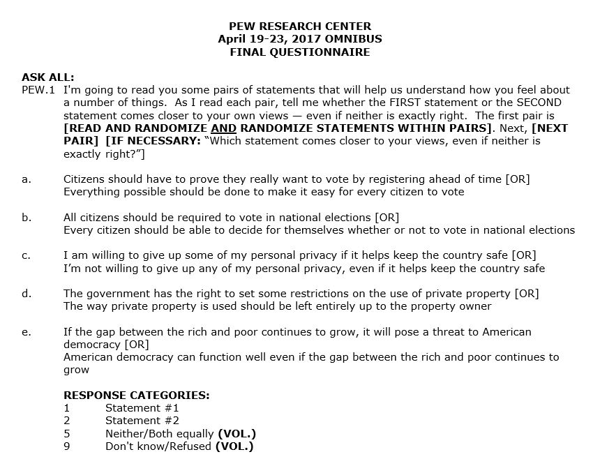
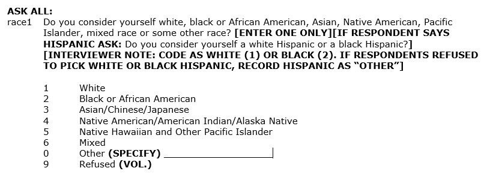
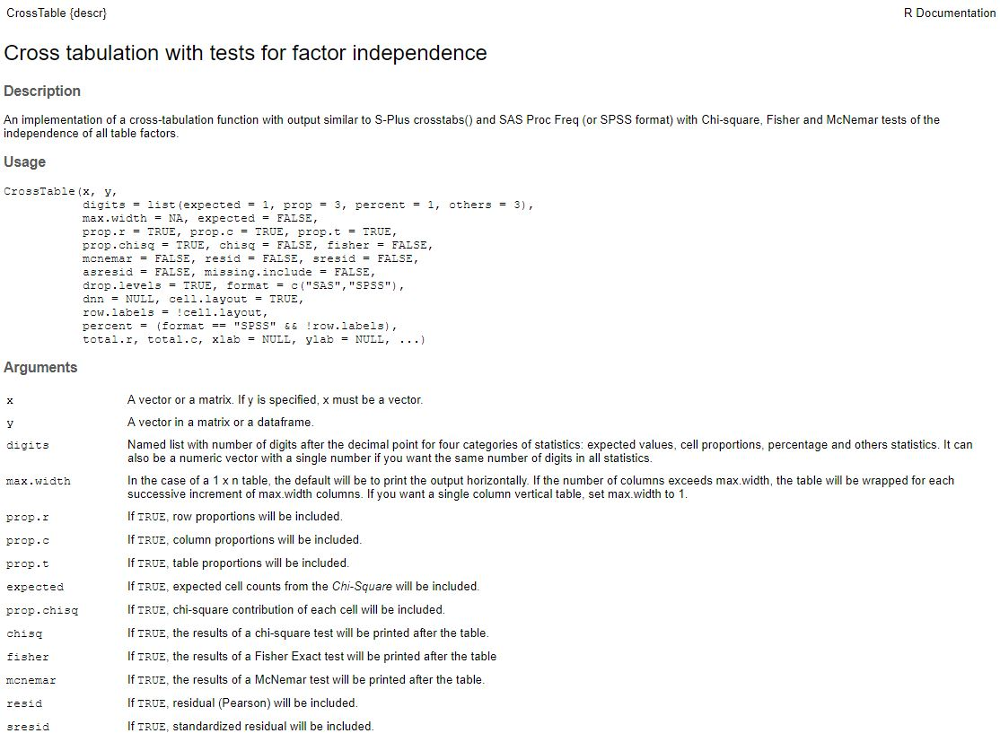

# The R team considers chi-squared 

## Achievements to unlock

After learning about how sampling distributions can be used to compute confidence intervals that provide insight into a population based on the characteristics of a sample, Leslie is hooked. Kiara reminds her that using information from a sample to make claims about a population is called **inference** and statistical methods used for **inference** are inferential statistics. For example, the confidence intervals for the sample mean and sample percent were ranges where the population mean or population percent likely lies. Essentially, the idea of inferential statistics is that samples can be used to understand populations.

Kiara explains that this is just the beginning when it comes to inference. She and Nancy decide it is time to start teaching Leslie how to conduct commonly used inferential statistical tests in R. They decide to start with chi-squared, which is a statistical test to understand whether there is a relationship between two categorical variables. Chi-squared is one of a few **bivariate**, or two variable, tests that are widely used in statistical analyses across many fields. Kiara also mentions that, When a chi-squared test indicates that there may be a relationship between two things, there are several follow-up tests to find out more about the relationship. 

Kiara puts together a list of achievements for today: 

* Achievement 1: Understanding the relationship between two categorical variables using bar graphs, frequencies, and percents  
* Achievement 2: Computing and comparing observed and expected values for the groups 
* Achievement 3: Calculating the chi-squared statistic by hand and with R
* Achievement 4: Interpreting the chi-squared statistic and making a conclusion about whether or not there is a relationship
* Achievement 5: Using Null Hypothesis Significance Testing (NHST) to organize statistical testing 
* Achievement 6: Using standardized residuals to understand which groups contributed to significant relationships
* Achievement 7: Computing and interpreting effect sizes to understand the strength of a significant chi-squared relationship  

Follow Nancy, Kiara, and Leslie through the examples and exercises to test some relationships.

## The voter fraud problem 

Leslie has been noticing a lot of news related to voting rights and voter registration with another big election coming up. Her good friend Kristen lives in Oregon and mentioned that Oregon passed the *Oregon Motor Voter* act [@OregonMotorVoter], which made it the first state to use Automatic Voter Registration where Oregon residents who get a drivers' license, permit, or state-issued identification card are automatically registered to vote. Residents of Oregon are then sent a notification so that they can opt-out of being registered to vote if they want to opt-out. Given how annoying it was for her stand in line to get her drivers' license, Nancy thinks Oregon has the right idea. This is very different from what Leslie experienced in her home state, which was to fill out a form and send it through the mail [@RegistertoVote] and just wait what seemed like forever to get a reply. She is currently debating whether to change her voter registration from her home state to where she is going to school and it just seems like a big hassle.

Kiara remembers hearing several stories in the news after the 2018 midterm elections about how some state laws are making it more difficult, rather than more easy, to register and vote. Leslie looks up voting laws and finds a website from the Brennan Center for Justice [@BrennanCenter] showing that 99 bills making it more difficult to vote, mostly through stricter voter identification requirements, were introduced across 31 states in 2017 and 25 states have put in new voting restrictions since 2010. Nancy pulls up the website and finds that it is not all bad news, 531 bills to expand voting access were introduced in 30 states in 2017 including several Automatic Voter Registration bills [@BrennanCenter]. 

Kiara and Leslie feel like they understand why the bills making it easier to register and vote are being introduced and passed, but are interested in why states are simultaneously introducing and supporting bills that make it more difficult to vote. Nancy thinks she understands what is going on with the new voter identification laws. She visted her uncles last summer and they were adamant that people should be required to show identification and prove who they are in order to vote because of voter fraud. Leslie looks up some information on voter fraud and finds that the evidence suggests voter fraud does happen but is rare [@WhoCanVote; @minnite2017myth; @levitt2014]. She also finds that Nancy's uncles are not the only ones who feel that fraud is a problem. She reads one paper that shows 23% of people think that people voting more than once in an election is very common (8%) or occasionally (15%) happens, 30% think that noncitizens voting is very common (13%) or occasionally (17%) happens, 24% think voter impersonation is very common (8%) or occasionally (16%) happens, with similar percentages for vote theft (21%), and absentee ballot fraud (28%) [@stewart2016revisiting]. 

Nancy finds some additional research that is not related directly to voter registration, but to election fraud instead. Specifically, just over 70% of people in one survey think election officials are fair *very often* or *fairly often* and 80% think votes are counted fairly *very often* or *fairly often* [@bowler2015election] leaving a large percent of US citizens believing officials and vote counting are not fair. Republicans are more likely to believe voter fraud is widespread [@stewart2016revisiting] and found elections to be unfair [@bowler2015election; @wolak2014campaigns]. However, they are not the only ones. About half the percent of Democrats as Republicans think voter fraud is frequent [@stewart2016revisiting] and women, minorities, younger people, people with less education, and "sore losers" (people whose candidate lost an election) are more likely to think that elections were unfair [@bowler2015election; @wolak2014campaigns]. Some research shows that people who believe voter fraud is widespread are more likely to support voter identification laws [@stewart2016revisiting] although this relationship differs a lot by political party and by the amount and sources of information a person has  [@stewart2016revisiting; @wilson2013foundations; @kane2017can].

Given the ongoing policy battles over voter registration and all the information out there about voting fraud and voter identification, Nancy and Kiara think it is a great topic to focus on for learning about chi-squared. Before they begin, Kiara wants to get everyone on the same page with the basics so she shows Nancy and Leslie the $\chi^2$ symbol and confirms that it is pronounced kai-squared, not chai squared! Nancy, ever eager to get to the actual coding, finds some data from 2017 on the Pew Internet & American Life website with two questions that ask participants to choose which statement best represents their views on voting:

* Citizens should have to prove they really want to vote by registering ahead of time [OR] Everything possible should be done to make it easy for every citizen to vote 

* All citizens should be required to vote in national elections [OR] Every citizen should be able to decide for themselves whether or not to vote in national elections 

She downloads the data set, which includes 1,028 observations, and quickly writes some code to graph the responses to these two questions. It looks like about 40% of people think that citizens should have to prove they want to vote by registering and another 60% think voting should be made as easy as possible. The split is bigger with making voting a requirement, with about 80% of people thinking voting should be a choice. 

With this background and data, the team feels ready to tackle a chi-squared adventure.

```{r echo = FALSE}
library(tidyverse)
library(haven)
vote <- read_sav(file = "data/pew_apr_19-23_2017_weekly_ch5.sav")
vote.cleaned <- vote %>%
  as_factor() %>%
  mutate(race = recode_factor(.x = race, 
                                    `White Non-Hispanic` = 'White Non-Hispanic',
                                    `Black Non-Hispanic` = 'Black Non-Hispanic',
                                    `White Hispanic` = 'Hispanic',
                                    `Black Hispanic` = 'Hispanic',
                                    `Unspecified Hispanic` = 'Hispanic',
                                    `Native American/American Indian/Alaska Native` = 'Other',
                                    `Native Hawaiian and other Pacific Islander` = 'Other',
                                    `Other Race` = 'Other',
                                    `Mixed` = 'Other',
                                    `Asian/Chinese/Japanese` = 'Other',
                                    `Refused` = NA_character_)) %>%
mutate(pew1a, pew1a = recode_factor(.x = pew1a, 
                                    `Citizens should have to prove they really want to vote by registering ahead of time` = 'Prove want to vote',
                                    `Everything possible should be done to make it easy for every citizen to vote` = 'Make easy to vote',
                                    `Don't know/Refused` = NA_character_,
                                    `Neither/Both equally` = NA_character_)) %>%
  mutate(pew1b, pew1b = recode_factor(.x = pew1b, 
                                    `All citizens should be required to vote in national elections` = 'Required to vote',
                                    `Every citizen should be able to decide for themselves whether or not to vote in national elections` = 'Decide to vote',
                                    `Don't know/Refused` = NA_character_,
                                    `Neither/Both equally` = NA_character_))
```

```{r, fig.cap="Opinions about ease of voting registration and mandatory voting from a Pew Research Center April 2017 survey (n = 1028)."}
library(ggplot2)
library(gridExtra)
#graph voting funding
vote.easy <- vote.cleaned %>%
  drop_na(pew1a) %>%
  ggplot(aes(x = pew1a, fill = pew1a)) +
  geom_bar(position = "dodge") +
  theme_minimal() +
  labs(x = "Ease of voting registration", y = "Survey participants") +
  scale_fill_manual(values = c("gray", "#7463AC"),
                    guide = FALSE) +
  ylim(0, 800)
vote.mandatory <-  vote.cleaned %>% 
  drop_na(pew1b) %>%
  ggplot(aes(x = pew1b, fill = pew1b)) +
  geom_bar(position = "dodge") +
  theme_minimal() +
  labs(x = "Mandatory voting", y = "Survey participants") +
  scale_fill_manual(values = c("gray", "#7463AC"),
                    guide = FALSE)

grid.arrange(vote.easy, vote.mandatory,
             nrow = 1)
```

## Achievement 1: Understanding the relationship between two categorical variables using bar graphs, frequencies, and percents 

Before conducting any sort of inferential analyses that use sample data to understand a population, it is a best practice to get to know the sample data using descriptive statistics and graphics. This step in research is often called **exploratory data analysis** or **EDA**. The best descriptive statistics for EDA examining categorical variables are frequencies and percentages (see Section \@ref(computing-frequencies-and-frequency-distributions)).  

Kiara has downloaded the April data directly from the Pew Internet & American Life website. The download feature on this website results in a zipped folder with the codebook, data, and a few other documents, so she did not impore the the data directly into R from the website. The data set is saved with a **.sav** file extension, which means it is **SPSS** formatted data. There are several ways to import SPSS data into R. Kiara suggests to Leslie that she use the <span style="font-family:Lucida Console, monospace;font-weight:bold">haven</span> package because the format of the data from this package works well with <span style="font-family:Lucida Console, monospace;font-weight:bold">tidyverse</span>. To follow along, download the **pew_apr_19-23_2017_weekly_ch5.csv** data set from edge.sagepub.com/harris1e and save it. 

Leslie brings in the data with <span style="font-family:Lucida Console, monospace;font-weight:bold">haven</span>. She notices that there are 49 variables in the data frame, which is more than they need to work with today. To make the data frame more manageable, Leslie decides to keep just the variables of interest. She looks at the codebook included when she downloaded the data and decides to keep the two voting questions, pew1a and pew1b, along with race, sex, mstatus (marital status), ownhome (home ownership), employ, and polparty (political party affiliation). All of the variables she decides to keep are categorical and nominal. Leslie reminds herself that nominal variables are categorical varibles that have no inherent order to the categories, while ordinal variables are categorical variables that do have an inherent order to the categories.

```{r}
# import the April 17-23 Pew Research Center data
library(haven)
vote <- read_sav(file = "data/pew_apr_19-23_2017_weekly_ch5.sav")

# select variables of interest
vote.cleaned <- vote %>% 
  select(pew1a, pew1b, race, sex, mstatus, ownhome, employ, polparty) 

# check data
summary(vote.cleaned)
```

Leslie sighs and leans back. Based on `summary()` showing means and medians, it seems like ALL of the variables imported into R as numeric variables when they should be factors. Kiara shrugs and suggests that they were probably going to have to recode most of them anyway to make sure the missing values and features are appropriately handled. Leslie gets out the codebook to start the data management. 

### Data cleaning 

Leslie decides to star with the voting variables and the race, sex, and ownhome variables. The codebook shows the coding of the voting variables as:

```{r echo = FALSE, fig.cap="Screenshot of Pew voting data codebook page 1."}

```

Nancy takes one look at the codebook and wants to fix something before Leslie continues her coding. Nancy slides the laptop over and starts to type. She knows that `read_sav()` imports the file in a "haven labelled" format, which is a little tricky to use and that changing the variables to factors will result in using the current labels, which are extremely long! Nancy uses `zap_labels()` to remove the super-long labels and then applies `as_factor()` to change everything to a factor. She slides the laptop back to Leslie so she can get some practice with `recode_factor()`. Leslie works on the voting variables first: 

```{r}
# open tidyverse
library(tidyverse)

# select variables of interest and clean them
vote.cleaned <- vote %>% 
  select(pew1a, pew1b, race, sex, mstatus, ownhome, employ, polparty, educ, income) %>%
  zap_labels() %>%
  as_factor() %>%
  mutate(pew1a, pew1a = recode_factor(.x = pew1a, 
                                    `1` = 'Prove want to vote',
                                    `2` = 'Make easy to vote',
                                    `5` = NA_character_,
                                    `9` = NA_character_)) %>%
  rename(ease.vote = pew1a) %>%
  mutate(pew1b, pew1b = recode_factor(.x = pew1b, 
                                    `1` = 'Required to vote',
                                    `2` = 'Decide to vote',
                                    `5` = NA_character_,
                                    `9` = NA_character_)) %>%
  rename(require.vote = pew1b)

# check voting variables
summary(vote.cleaned)
```

Leslie is happy with the recoding so far. She works on the race, sex, and own home variables next. Luckily, these variable names are already easy to understand so the recoding is more straightforward. Before recoding race, Leslie examines a table to see how many people are in each category:

```{r}
# examine race variable before recoding
table(vote.cleaned$race)
```

Leslie looks at the codebook to see what these category numbers represent. She is concerned about some of the categories with so few people in them. Kiara suggests she collapse the variable into four categories: Black Non-Hispanic, Hispanic, Other, and White Non-Hispanic. Leslie feels uncomfortable collapsing the other categories together but goes ahead since the frequencies are too small to use all the categories as they currently are.

```{r echo = FALSE, fig.cap="Screenshot of Pew voting data codebook page 5."}

```

Leslie adds the race recoding to the data management so far and then goes ahead with the sex and ownhome variables:

```{r}
# select variables of interest and clean them
vote.cleaned <- vote %>% 
  select(pew1a, pew1b, race, sex, mstatus, ownhome, employ, polparty, educ, income) %>%
  zap_labels() %>%
  as_factor() %>%
  mutate(pew1a, pew1a = recode_factor(.x = pew1a, 
                                    `1` = 'Prove want to vote',
                                    `2` = 'Make easy to vote',
                                    `5` = NA_character_,
                                    `9` = NA_character_)) %>%
  rename(ease.vote = pew1a) %>%
  mutate(pew1b, pew1b = recode_factor(.x = pew1b, 
                                    `1` = 'Required to vote',
                                    `2` = 'Decide to vote',
                                    `5` = NA_character_,
                                    `9` = NA_character_)) %>%
  rename(require.vote = pew1b) %>%
  mutate(race = recode_factor(.x = race,
                              `1` = 'White Non-Hispanic',
                              `2` = 'Black Non-Hispanic',
                              `3` = 'Hispanic',
                              `4` = 'Hispanic',
                              `5` = 'Hispanic',
                              `6` = 'Other',
                              `7` = 'Other',
                              `8` = 'Other',
                              `9` = 'Other',
                              `10` = 'Other',
                              `99` = NA_character_)) %>%
  mutate(sex = recode_factor(.x = sex,
                              `1` = 'Male',
                              `2` = 'Female')) %>%
  mutate(ownhome = recode_factor(.x = ownhome,
                              `1` = 'Owned',
                              `2` = 'Rented',
                              `8` = NA_character_,
                              `9` = NA_character_))

# check recoding
summary(vote.cleaned)
  
```

The recoding looks good! Leslie thinks they are ready to move on.

### Using descriptive statistics to examine the relationship between two categorical variables

Leslie decides first to examine the relationship between ease of voting and sex. The first step is examining frequencies and a graph in order to make an informed guess about whether there is a relationship. Leslie starts to type `table()` and Nancy scoots the laptop away. She wants to show Leslie some more options in the from <span style="font-family:Lucida Console, monospace;font-weight:bold">tidyverse</span>. Nancy introduces `spread()`, which can be used to spread data out into columns. Leslie does not understand what she is talking about, so Nancy shows her how it looks without `spread()`:

```{r}
# voting ease by race
vote.cleaned %>% 
  drop_na(ease.vote) %>%
  drop_na(race) %>%
  group_by(ease.vote, race) %>%
  summarise(n = n()) 
```

Nancy then shows her how it looks with `spread()`:

```{r}
# voting ease by race
vote.cleaned %>% 
  drop_na(ease.vote) %>%
  drop_na(race) %>%
  group_by(ease.vote, race) %>%
  summarise(n = n()) %>%
  spread(key = race, value = n)
```

Leslie rolls her eyes and types:

```{r}
# voting ease by race with table
table(vote.cleaned$ease.vote, vote.cleaned$race)
```

Nancy nods. She agrees that, in this situation, this solution to examining the values is probably better. However, there may come times when `spread()` will be the easier solution, so it is good to know that it exists. Leslie agrees and they move on.

Leslie notices that it is not super easy to interpret quickly whether there is a higher percent of people in either vote category across the four race ethnicity groups. Leslie thinks that some percentages might help make this comparison easier. Nancy lets her know about an option she can use to label her table better. Row and column labels can be added to the table command and will be printed in the output.

```{r}
# table of percents voting ease by race
prop.table(x = table(Voting.ease = vote.cleaned$ease.vote, 
                 Race.eth = vote.cleaned$race))
```

It is still difficult to interpret since these percentages look like they add up to 100% and so are out of the total rather than within each category of race ethnicity. It is not all that useful to know that 29.88% of all participants are both White Non-Hispanic and think people should prove that they want to vote. What Leslie wants to know is whether people who are White Non-Hispanic are more in favor of having people prove they want to vote or making it as easy as possible for people to vote. Kiara checks the help documentation, which shows an additional argument for `prop.table()` that computes either the row percentages with `margin = 1` or the column percentages with `margin = 2`. Since Leslie is interested in column percentages, she adds the option to make these appear:

```{r}
# table of percents voting ease by race
prop.table(x = table(Voting.ease = vote.cleaned$ease.vote, 
                 Race.eth = vote.cleaned$race), 
           margin = 2)
```

To make sure she has the right percentages, Leslie adds up the columns. Each column adds up to one or 100%, so the `margin = 2` argument worked as expected.

Leslie notices that White Non-Hispanic participants are fairly evenly divided between thinking people should prove they want to vote and making it as easy as possible to vote. The other three race ethnicity groups have larger percentages in favor of making it as easy as possible to vote, with Black Non-Hispanic participants at 77.78% in favor of making it easy to vote. From this initial table, it seems like there may be a relationship between race ethnicity and which voting registration policies a person favors. Leslie uses the same code to examine the voting requirement variable as well:

```{r}
# table of percents voting ease by race
prop.table(x = table(Voting.requirement = vote.cleaned$require.vote, 
                 Race.eth = vote.cleaned$race), 
           margin = 2)
```

This time most participants from the White Non-Hispanic group are in favor of letting people decide whether to vote while the percentage in favore of being required to vote is more than twice as high for Black Non-Hispanic and Hispanic participants. The Other group was more similar to the Non-Hispanic White group. Being required to vote or deciding to vote also appears to be related to race ethnicity. 

### Using graphs to examine the relationship between two categorical variables

Leslie decides to go ahead with a graph of these relationships to see if a visual provides any additional information. Kiara says that grouped bar graphs like the ones in Section \@ref(bar-plots-for-two-categorical-variables) are the best option here. Nancy suggests using `grid.arrange()` to put the two plots together and slides the laptop over to work on the code. 

```{r fig.cap="Opinion on voter registration and voting requirements by race ethnicity from Pew survey (n = 1028; 2017)."}
# open gridExtra to put graphs together
library(gridExtra)

# graph the relationship between registration ease and race eth
ease.graph <- vote.cleaned %>%
  drop_na(ease.vote) %>%
  drop_na(race) %>%
  group_by(ease.vote, race) %>%
  count() %>%
  group_by(race) %>%
  mutate(perc = 100*n/sum(n)) %>%
  ggplot(aes(x = race, y = perc, fill = ease.vote)) +
  geom_bar(position = "dodge", stat = "identity") +
  theme_minimal() +
  scale_fill_manual(values = c("gray", "#7463AC"), name = "Opinion on\nvoter registration") +
  labs(x = "Race ethnicity group", y = "Percent within group")


# graph the relationship between required voting and race eth
req.graph <- vote.cleaned %>%
  drop_na(require.vote) %>%
  drop_na(race) %>%
  group_by(require.vote, race) %>%
  count() %>%
  group_by(race) %>%
  mutate(perc = 100*n/sum(n)) %>%
  ggplot(aes(x = race, y = perc, fill = require.vote)) +
  geom_bar(position = "dodge", stat = "identity") +
  theme_minimal() +
  scale_fill_manual(values = c("gray", "#7463AC"), name = "Opinion on voting") +
  labs(x = "Race ethnicity group", y = "Percent within group")


grid.arrange(ease.graph, req.graph, nrow = 2)

```

This seems easier to examine than the tables and the differences are quickly clear. Based on the descriptive and visual exploratory data analyses (EDA) examining the relationship between these categorical variables, it looks like race ethnicity is related to opinions about voter registration and voting requirements. Specifically, it seems that there was a much higher percent of White Non-Hispanic participants supporting no requirement for voting, while the highest percent supporting making it easy to vote were Black Non-Hispanic participants.

### Unlocking achievement 1: Check your understanding

Make an appropriate table or a graph to examine the relationship between sex and voting requirements. Explain your results.

## Achievement 2: Computing and comparing observed and expected values for the groups

### Observed values

Kiara examines what Leslie has done so far and agrees that it looks there are some differences among the race ethnicity groups in support for easy of voter registration and for voter requirements. Kiara explains that the chi-squared test is useful for testing to see if there may be a relationship between two categorical variables. The chi-squared test is based on the observed values, like the ones in the tables in \@ref(using-descriptive-statistics-to-examine-the-relationship-between-two-categorical-variables), and the values *expected* to occur if there were no relationship between the variables. 

```{r echo = FALSE}
# voting ease by race with table
table(vote.cleaned$ease.vote, vote.cleaned$race)
```

That is, given overall frequencies for the two variables, how many people would Leslie *expect* to be in each of the cells of the table just shown?

### Expected values

So, given these, what would you expect to see in the blank cells of this table:

```{r echo = FALSE}
library(descr)
library(stargazer)
row.col.vals <- matrix(c('', '','', '', 292+28+51+27,
                          '', '','', '', 338+98+97+46,
                         292+338,28+98,51+97,27+46,292+338+28+98+51+97+27+46), 
                        nrow = 3, ncol = 5, byrow = TRUE, dimnames = list(Regist.ease = c("Prove want to vote", "Make easy to vote","Total"),
                                           Race.eth = c("White Non-Hispanic",
                                                        "Black Non-Hispanic",
                                                        "Hispanic",
                                                        "Other", "Total")))


stargazer(row.col.vals, type = 'text', out = 'out.text')


```

Without knowing anything else, it would be tempting to just put half the White Non-Hispanic people in the "Prove want to vote" category and half in the "Make easy to vote" category. However, overall about 60% of the people want to make it easy to vote and about 40% want the other option. This complicates things. Kiara lets Leslie think about how she would fill in this table for a few minutes before letting her know that there is an easy way to compute the expected values and taking the overall percentages into consideration by using the row and column totals.

For each cell in the table, multiply the row total for that row by the column total for that column and divide by the overall total:

$$
\begin{equation}
\frac{{row.total}\cdot{column.total}}{total}
 (\#eq:expected)
\end{equation}
$$

```{r echo = FALSE}
expect.values <- matrix(c('398x630/977', '398x126/977','398x148/977', '398x73/977', 292+28+51+27,
                          '579x630/977', '579x126/977','579x148/977', '579x73/977', 338+98+97+46,
                         292+338,28+98,51+97,27+46,292+338+28+98+51+97+27+46), 
                        nrow = 3, ncol = 5, byrow = TRUE, dimnames = list(Regist.ease = c("Prove want to vote", "Make easy to vote","Total"),
                                           Race.eth = c("White Non-Hispanic",
                                                        "Black Non-Hispanic",
                                                        "Hispanic",
                                                        "Other", "Total")))
stargazer(expect.values, type = 'text', out = 'out.text')


```

In multiplying it all out, the expected values will be somewhat different from the observed values. The table below shows expected values *below* the observed values for each cell. Note that many of the cells have observed and expected values that are very close to each other. For example, the observed number of Other race ethnicity people who want to make it easy to vote is 46 while the expected is 43.3. Some categories show bigger differences. For example, the number of Black Non-Hispanic who think people should prove they want to vote is 28 and the expected value is nearly twice as high at 51.3.

```{r echo = FALSE, message = FALSE}
library(descr)
CrossTable(vote.cleaned$ease.vote, vote.cleaned$race, 
           expected = TRUE, prop.r = FALSE,
           prop.c = FALSE, prop.t = FALSE, 
           prop.chisq = FALSE,
           dnn = c("Ease of voting", "Race ethnicity"))

```

### Comparing observed and expected values

Kiara explains that, if there were no relationship between opinions on voting ease and race ethnicity, the observed and expected would be the same. That is, the observed data would show that here would have 373.4 White Non-Hispanic obese people who wanted to make it easy to vote.

Differences between observed values and what is expected indicates that there may be a relationship between the variables. In this case it looks like there are more than expected who want to make voting easier in all the categories except Non-Hispanic White. In the Non-Hispanic White category there are more than expected who want people to prove they want to vote. This suggests that there may be some relationship between opinions about the ease of voting and race ethnicity.

### Unlocking achievement 2: Check your understanding

Which of the following is true about the observed and expected values for voting ease and race ethnicity? (choose all that apply)

* There are more people than expected who want to make it easy to vote and are Hispanic 
* There are more people than expected who want to make it easy to vote and are Black Non-Hispanic 
* There are more people than expected who want people to prove they want to vote and are Black Non-Hispanic

## Achievement 3: Calculating the chi-squared statistic by hand and with R

### Summing the differences between observed and expected values

The differences between observed values and expected values can be combined into an overall statistic showing how much observed and expected differ across all the categories. However, since some expected values are higher than observed values, some are lower, and the expected and observed both have the same total when summed, just combining the differences will result in a zero, like this:

$(292 - 256.6) + (28 - 51.3) + ... + (46-43.3) = 0$

### Squaring the summed differences

Squaring the differences before adding them up will result in a positive value that is larger when there are larger differences and smaller when there are smaller differences. 

$(292 - 256.6) + (28 - 51.3) + ... + (46-43.3) = $ 

This value does seem to demonstrate better the magnitude of the difference between observed and expected values for this situation. Kiara notes that there is one additional step to compute a chi-squared value. In order to account for situations when the observed and expected values are very large, which could result in extremely large differences between observed and expected, the squared differences are divided by the expected value in each cell, like this:

$$
\begin{equation}
\chi^2=\frac{(observed-expected)^2}{expected}
 (\#eq:chisq)
\end{equation}
$$

$$
\begin{equation}
\frac{(292-256.6)^2}{256.6}+\frac{(28-51.3)^2}{51.3}+\frac{(51-60.3)^2}{60.3}+\frac{(338-373.4)^2}{373.4}+\frac{(98-74.7)^2}{74.7}+\frac{(97-87.7)^2}{87.7}+\frac{(46-43.3)^2}{43.3} = 28.952
\end{equation}
$$

### Using R to compute the chi-squared

This is a chi-squared statistic, computed by hand. The same statistic can be computed by R through a number of different methods. In base R, the `chisq.test()` command is useful. Looking at the help documentation, Leslie notices that the test takes arguments for x and y along with some other possible choices. Nancy suggests starting simply and specifying x and y as ease.vote and race.

```{r}
# chi-squared statistic for ease of voting
# and race
chisq.test(x = vote.cleaned$ease.vote, 
           y = vote.cleaned$race)
```

Leslie notes that the "X-squared" value is the same as the hand-calculated results. However, there appear to be two other values, df = 3 and p-value < 2.2e-16. Leslie recognizes the scientific notation but is still unclear what these two pieces of information mean. Kiara asks Leslie how much she remembers about probability distributions from last chapter? The same concepts can be applied to interpret a chi-squared statistic and the corresponding p-value. 

### Unlocking achievement 3: Check your understanding

The way to compute a chi-squared statistic is to add up all the observed values and subtract the sum of all the expected values. Then, square the total. 

* True 
* False 

When computing a chi-squared statistic, square any negative values but not the positive ones. 

* True 
* False 

## Achievement 4: Interpreting the chi-squared statistic and making a conclusion about whether or not there is a relationship

### Visualizing the chi-squared distribution

Kiara explains that the chi-squared distribution is made up of all the possible values of the chi-squared statistic and how often each value will occur **when there is no relationship between the variables**.  The chi-squared looks different than the binomial and normal distributions. The binomial distribution has two **parameters**, $n$ and $p$, that define its shape (see Section \@ref(understanding-the-characteristics-and-uses-of-a-binomial-distribution-of-a-binary-variable)) and the normal distribution shape is defined by its mean ($m$) and standard deviation ($S$). The chi-squared distribution has a single parameter, the **degrees of freedom** or $df$, which is also the population mean and can be used to find the population standard deviation $\sqrt({2}{\cdot}{df})$. 

Since the chi-squared statistic is the sum of squared differences, it will never go below zero and extreme values are always large and positive. While Kiara is telling Leslie about chi-squared distributions, Nancy is practicing her fancy coding skills by graphing a few chi-squared distributions to show Leslie what she means:

```{r echo=FALSE}

require(gridExtra)
dat <- with(density(rchisq(100000, 1)), data.frame(x, y))
plot1 <- ggplot(data = dat, mapping = aes(x = x, y = y)) +
    geom_line()+
  theme_minimal() +
  xlab("Chi-squared statistic") + ylab("Probability")+
  ggtitle("Probability density function\nfor chi-squared (df = 1)")

dat <- with(density(rchisq(100000, 3)), data.frame(x, y))
plot3 <- ggplot(data = dat, mapping = aes(x = x, y = y)) +
    geom_line()+
  theme_minimal() +
  xlab("Chi-squared statistic") + ylab("Probability")+
  ggtitle("Chi-squared probability\ndistribution (df = 3)")

dat <- with(density(rchisq(100000, 5)), data.frame(x, y))
plot5 <- ggplot(data = dat, mapping = aes(x = x, y = y)) +
    geom_line()+
  theme_minimal() +
  xlab("Chi-squared statistic") + ylab("Probability")+
  ggtitle("Chi-squared probability\ndistribution (df = 5)")

dat <- with(density(rchisq(100000, 7)), data.frame(x, y))
plot7 <- ggplot(data = dat, mapping = aes(x = x, y = y)) +
    geom_line()+
  theme_minimal() +
  xlab("Chi-squared statistic") + ylab("Probability")+
  ggtitle("Chi-squared probability\ndistribution (df = 7)")
```

```{r echo=FALSE, fig.cap="Chi-squared probability distributions."}
grid.arrange(plot1, plot3, plot5, plot7, ncol = 2)

```

Leslie notices that the $\chi^2$ distributions are all a similar shape but are not exactly the same and that the difference seems to be related to how  many **df** or **degrees of freedom** the distribution has. This makes sense given that distributions with different **df** have different means and standard deviations and so are likely to look different. 

To get the value of the **degrees of freedom** for any chi-squared test, subtract 1 from the number of categories for each of the variables in the test, then multiply the resulting numbers together. So, for the ease of voting (2 categories) and race (4 categories), the chi-squared distribution would have $(2-1){\cdot}(4-1)$ degrees of freedom, which is 3 degrees of freedom. A chi-squared distribution with 3 degrees of freedom has a population standard deviation of $\sqrt({2}{\cdot}{3})$ or `r round(sqrt(2*3), 3)`.   

### Area under the curve 

Kiara explains that the chi-squared distribution, which is the chi-squared *probability density function*, shows the probability of a value of chi-squared occurring. For example, a chi-squared statistic of _exactly_ 10 with 5 degrees of freedom would have a probability of occurring of a little less than 3% as shown in the graph by where the vertical purple line hits the distribution.

```{r echo=FALSE, fig.cap="Chi-squared probability distribution (df = 5)"}
dat <- with(density(rchisq(100000, 5)), data.frame(x, y))
ggplot(data = dat, mapping = aes(x = x, y = y)) +
    geom_line()+
  geom_vline(xintercept = 10, color = "#7463AC", size = 1)+
    #geom_area(mapping = aes(x = ifelse(x < 10 , x, 0)), fill = "#7463AC") + ylim(0,.2) +
  theme_minimal() +
  xlab("Chi-squared statistic") + ylab("Probability")

```

So, if there were no relationship between the two variables, the probability that the differences between observed and expected values would result in a chi-squared of _exactly_ 10 is pretty small. It might be more useful to know what the probability is of getting a chi-squared of _10 or higher_. The probability of the chi-squared value being _10 or higher_ would be the area under the curve from 10 to the end of the distribution at the far right, like this:

```{r echo=FALSE, fig.cap="Chi-squared probability distribution (df = 5)."}
dat<-with(density(rchisq(100000, 5)),data.frame(x, y))
ggplot(data = dat, mapping = aes(x = x, y = y)) +
    geom_line()+
    geom_area(mapping = aes(x = ifelse(x > 10 , x, 0)), fill = "#7463AC") + ylim(0,.16) +
  theme_minimal() +
  xlab("Chi-squared statistic") + ylab("Probability")

```

While not as small as 3%, it is still a relatively small number. So, the probability of the squared differences between observed and expected adding up to 10 or more is low. The observed values, therefore, are quite different from what we would expect. Kiara reminds Leslie that the expected values are the values that would occur **if there were no relationship between the two variables**. So, when the chi-squared is large because the observed values are much different from expected, this suggests there is a relationship between the variables.

### Using the chi-squared distribution to determine probability

Leslie is a little confused. Kiara continues using the voting data as a more concrete example. The chi-squared from the voting data was 28.952 with df = 3. 

```{r echo = FALSE}
# chi-squared statistic for ease of voting
# and race
chisq.test(x = vote.cleaned$ease.vote, 
           y = vote.cleaned$race)
```

Extending the chi-squared probability distribution curve far enough to the right to capture the chi-squared value of 28.952 results in:

```{r warning = FALSE, echo=FALSE, fig.cap="Chi-squared probability distribution (df = 3)."}
dat<-with(density(rchisq(100000, 3)),data.frame(x, y))

ggplot(data = dat, mapping = aes(x = x, y = y)) +
    geom_line()+
    ylim(0, .25) +
  theme_minimal() +
  xlab("Chi-squared statistic") + ylab("Probability") +
  xlim(0,30)
```

By the time the distribution gets to 25, there is so little space under the curve that it is impossible to see and the value of this area under the curve is tiny. Obtaining a value of chi-squared as large as 28.952 or larger has an extremely low probability. Kiara reminds Leslie of the results of the chi-squared test from earlier:

```{r echo = FALSE}
# chi-squared statistic for ease of voting
# and race
chisq.test(x = vote.cleaned$ease.vote, 
           y = vote.cleaned$race)
```

The part of this output associated with the probability of a chi-squared value being 116.86 or higher is the _p-value_. In this case, the p-value is shown as < 2.293e-06. From earlier, Leslie knows that this is scientific notation and the p-value is .000002293 So, the probability of getting a chi-squared of 28.953 is very tiny, close to (but not exactly) zero. This is consistent with the graph showing very little space between the distribution curve and the x-axis. A chi-squared this big and the corresponding p-value this small means the observed values were much different from what Leslie should have expected to see _if there were no relationship between opinion on ease of voting and race-ethnicity category_. 

Probabilities this small tend to be reported as suggesting differences between observed and expected are _statistically significant_. This does not necessarily mean the differences are important or significant, just that they are bigger than what would most likely have happened if there were no relationship between the variables involved. 

While p = .000002293 would almost always be considered _statistically significant_, other probabilities might suggest that the differences are not big enough to warrant such a claim. Thresholds for what is considered _statistically significant_ are set by the analyst _before_ conducting analyses. Usually in the social sciences, a p-value less than .05 is considered _significant_. A p-value of less than .05 indicates less than a 5% probability of calculating a chi-squared statistic that big *or bigger* if the observed values were what was expected. 

### Selecting the threshold for statistical significance

Occasionally analysts will set a higher statistical significance threshold for a p-value like .10 or a lower threshold like .001. The higher threshold is easier to meet because it does not require as much of a difference between observed and expected values for the difference to be considered statistically significant. Smaller differences between observed and expected, therefore, would be reported as _statistically significant_ with a p-value threshold of .10. On the other hand, the difference between observed and expected would have to be larger to reach statistical significance if the threshold were set to .001. A low threshold like this might be set in cases where reporting _statistical significance_ could result in policy or program changes that are very expensive or have a direct impact on the health of humans. The decision about which threshold to use is made ahead of time (before analyses are completed) and is referred to in statistics as the _alpha_ or $\alpha$.

Kiara summarizes the result of the chi-squared for Leslie: 

>There was a statistically significant association between views on voting ease and race ethnicity [$\chi^2(3) = 28.95$; $p < .05$]. 

When possible, use the actual p-value rather than _p < .05_. In this case the p-value of .000002293 has too many decimal places for easy reporting, so using < .05 or using the less than symbol `<` with whatever the chosen threshold was (e.g., $<.10$ or $<.001$) will work.

### Unlocking achievement 4: Check your understanding

Which of the following is a good representation of p-value < 2.2e-4:

* p < .00022 
* p < -1.8 
* p < -8.8 
* p < .000022 

What is the most common value for an _alpha_ in most fields?

* 1 
* 0 
* .05 
* .5 

## Achievement 5: Using Null Hypothesis Significance Testing (NHST) to organize statistical testing

Kiara mentions to Leslie that one process to organize statistical tests like _chi-squared_ is _null hypothesis significance testing_ or NHST. The steps of NHST are:

#. Write the null and alternate hypotheses 
#. Compute the test statistic 
#. Calculate the probability that your test statistic is at least as big as it is if there is no relationship (i.e., the null is true) 
#. If the probability that the null is true is very small, usually less than 5%, reject the null hypothesis 
#. If the probability that the null is true is not small, usually 5% or greater, retain the null hypothesis 

### NHST Step 1: Write the null and alternate hypotheses

Kiara explains that the null hypothesis is usually a statement that claims there is _no difference_ or _no relationship_ between things. In this case, the null hypothesis is stating that opinions about how easy it should be to register and vote is no different across groups of race ethnicity. The Pew Research Center data are a sample drawn from the US population, so the data should have the same characteristics as the population from which it was drawn. If the data suggest there is no difference in opinions across groups, we can conclude that this also is likely to hold true in the population that the sample was taken from.

The alternate hypothesis is the claim that there is _a difference_ or _a relationship_ between things. The null (H0) and alternate (HA) hypotheses are written about the population and are tested using a sample from the population. Here are the null and alternate for the voting data:

**H0: People's opinions on how difficult it should be to register and vote are the same across race ethnicity groups.**  

**HA: People's opinions on how difficult it should be to register and vote are NOT the same across race ethnicity groups.** 

*Note that HA is sometimes written as H1.* 

### NHST Step 2: Compute the test statistic

The test statistic to use when examining a relationship between two categorical variables is the $\chi^$ statistic. This can be computed by hand or computed using one of the R commands available. 

```{r}
# chi-squared statistic for ease of voting
# and race
chisq.test(x = vote.cleaned$ease.vote, 
           y = vote.cleaned$race)
```

The test statistic is: $\chi^2 =$ `r round(chisq.test(x = vote.cleaned$ease.vote, y = vote.cleaned$race)$statistic, 2)`.

### NHST Step 3: Calculate the probability that your test statistic is at least as big as it is if there is no relationship (i.e., the null is true) 

The probability of seeing a $\chi^2$ as big as `r round(chisq.test(x = vote.cleaned$ease.vote, y = vote.cleaned$race)$statistic, 2)` **if there were no relationship** between opinion on voting ease and race-ethnicity group would be `r format(chisq.test(x = vote.cleaned$ease.vote, y = vote.cleaned$race)$p.value, scientific = FALSE)` or $p < .05$. 
 
### NHST Step 4: If the probability that the null is true is very small, usually less than 5%, reject the null hypothesis 

The probability that the null hypothesis, **people's opinions on how difficult it should be to register and vote are the same across race ethnicity groups**, is true is `r format(chisq.test(x = vote.cleaned$ease.vote, y = vote.cleaned$race)$p.value, scientific = FALSE)` or $p < .05$. This indicates that the null hypothesis is unlikely to be true and should be **rejected**.

### NHST Step 5: If the probability that the null is true is not small, usually 5% or greater, retain the null hypothesis

This does not apply in this situation. 

Leslie likes this way of organizing the statistical test and writes up a full interpretation of the work: 

>We used the $\chi^2$ test to test the null hypothesis that there was no relationship between opinions on the ease of voting by race ethnicity group. We rejected the null hypothesis and concluded that there was a statistically significant association between views on voting ease and race ethnicity [$\chi^2(3) = 28.95$; $p < .05$]. 

## Achievement 6: Using standardized residuals to understand which groups contributed to significant relationships

One limitation of the chi-squared statistic is that it determines whether or not there is a statistically significant relationship between two categorical variables but does not identify what makes the relationship significant. For example, is the relationship between opinions on voting ease and race ethnicity category significant because there are more Non-Hispanic White people than expected who think people should prove they want to vote, or fewer Non-Hispanic Black than expected who think people should prove they want to vote? Where are the largest differences between observed and expected? 

### Using standardized residuals following chi-squared tests

Nancy explains that standardized residuals (like z-scores) can aid analysts in determining which of the observed frequencies are significantly greater than expected. The standardized residual is computed by subtracting the expected value in a cell from the observed value in a cell and divides by the square root of the expected value:

$$
\begin{equation}
standardized.residual =\frac{observed - expected}{\sqrt{expected}}
 (\#eq:expected)
\end{equation}
$$

The resulting value, the standardized residual, is distributed like a z-score. Values of the standardized residuals that are greater than 1.96 or less than -1.96 indicate that the observed value is much higher or lower than the expected value. These are the cells that are contributing the most to a large chi-squared statistic and could be noted in the interpretation.

To get standardized residuals with your chi-squared statistic, use the `CrossTable()` function in the <span style="font-family:Lucida Console, monospace;font-weight:bold">descr</span> package for the analyses. Include arguments for expected values and standardized residuals to see the information needed to report on which observed frequencies were most different from expected. Kiara is excited they are finally talking about the importance of including arguments in the code since this is an important aspect of reproducibility (see Box \@ref(ch5kiara)). For the voting and race analysis, this command shows the observed, expected, and standardized residuals along with the chi-squared, df, and p-value. Nancy has a few other arguments in her code and Leslie asks about them. Specifically, why are `prop.c = FALSE`, `prop.t = FALSE`, and `prop.chisq = FALSE` in the code? Nancy explains that the default for `CrossTable()` is to include proportions in the columns (`prop.c`), proportions out of total (`prop.t`), and proportions of the chi-squared (`prop.chisq`) for each group in the table. These options remove all this extra information they do not need in order to have a clearer table. Kiara creates some additional guidance for Leslie to ponder later (see Box \@ref(ch5kiara)).

```{r}
# chi-squared examining SSB and BMI category
library(descr)
CrossTable(x = vote.cleaned$ease.vote,
           y = vote.cleaned$race,
           expected = TRUE,
           prop.c = FALSE,
           prop.t = FALSE,
           prop.chisq = FALSE,
           chisq = TRUE,
           sresid = TRUE)
```

### Interpreting standardized residuals and chi-squared results

The standardized residuals are shown in the last row of each cell (see the key at the top of the table to figure this out) with an absolute value higher than 1.96 are in the **White Non=Hispanic** group for **Prove want to vote** ($std.res = 2.207$) and **Black Non-Hispanic** group for both categories; $std.res = -3.256$ for **Prove want to vote** and $std.res = 2.700$ for **Make easy to vote**. The 2.207 value for **White Non-Hispanic** who selected **Prove want to vote** indicates that more White Non-Hispanic people than expected selected **Prove want to vote**. The -3.256 for **Black Non-Hispanic** indicated that fewer Black Non-Hispanic than expected selected **Prove want to vote**. Finally, the 2.700 for **Black Non-Hispanic** indicated that more Black Non-Hispanic than expected selected **Make easy to vote**. The **Hispanic** and **Other** race ethnicity groups did not have more or fewer than expected observations in either category. So, the significant chi-squared result was driven by more White Non-Hispanic and fewer Black Non-Hispanic people feeling that people should prove they want to vote and more Black Non-Hispanic people feeling that the process for voting should be made easy.

Leslie adds this information to her interpretation: 

>We used the $\chi^2$ test to test the null hypothesis that there was no relationship between opinions on the ease of voting by race ethnicity group. We rejected the null hypothesis and concluded that there was a statistically significant association between views on voting ease and race ethnicity [$\chi^2(3) = 28.95$; $p < .05$]. Based on standardized residuals, the statistically significant chi-squared test result was driven by White Non-Hispanic participants who felt that people should prove they want to vote and Black Non-Hispanic participants who felt that the voting process should be made easy and people should not have to prove they want to vote.

### Unlocking achievement 6: Check your understanding  

A standardized residual of -3.56 would indicate:

* The observed value is greater than the expected value in the cell 
* The observed value is less than the expected value in the cell 
* The chi-squared is not statistically significant 
* The chi-squared is a lower value than expected 

## Achievement 7: Computing and interpreting effect sizes to understand the strength of a significant chi-squared relationship

### Computing the Cramer's V statistic

Now that Leslie can determine if two categorical variables are related and what might be driving that relationship, Kiara thinks of one more detail about chi-squared that is useful. While the voting data show a relationship between preference on ease of voting and race ethnicity category, it is not clear how strong the relationship is. Kiara explains that the strength of a relationship in statistics is referred to as _effect size_. For $\chi^2$ there are a few options, including the commonly used effect size statistic of _Cramer's V_. The $V$ statistic is computed:

$$
\begin{equation}
V =\sqrt\frac{\chi^2}{n\cdot(k-1)}
 (\#eq:cramerv)
\end{equation}
$$


Where the $\chi^2$ is the test statistic for the analysis, $n$ is the sample size, and $k$ is the number of categories in the variable with the fewest categories.

Computing the value by hand is one option. The voting easy variable has two categories so k = 2 in this case:

$$
\begin{equation}
V =\sqrt\frac{28.952}{977\cdot(2-1)}
 (\#eq:cramerv2)
\end{equation}
$$

$$
\begin{equation}
V =\sqrt\frac{28.952}{977\cdot(2-1)} =.17
 (\#eq:cramerv2)
\end{equation}
$$

There are several packages in R that compute the $V$ statistic. The <span style="font-family:Lucida Console, monospace;font-weight:bold">lsr</span> package is a good option because it takes the same arguments as `CrossTabs()` and `chisq.test()` so it is easy to use:

```{r}
# compute Cramer's V for voting ease and race
# chi-squared analysis
library(lsr)
cramersV(x = vote.cleaned$ease.vote,
         y = vote.cleaned$race)
```

### Interpreting Cramer's V

Leslie notices the effect size is .17, but how is that interpreted? What does it mean? Kiara says the general rule is that values of Cramer's V are interpreted as:

* small or weak effect size for V = .1 
* medium or moderate effect size for V = .3 
* large or strong effect size for V = .5 

In this case, the effect size is between small and medium. So, there is a _statistically significant_ relationship between opinions on voting ease by race, the relationship is weak to moderate. This is consistent with the frequencies, which are different from expected, but not by an enormous amount in most of the groups:

```{r echo = FALSE, message = FALSE}
# chi-squared examining ease of voting and race ethnicity category
CrossTable(x = vote.cleaned$ease.vote,
           y = vote.cleaned$race,
           expected = TRUE,
           prop.c = FALSE,
           prop.t = FALSE,
           prop.chisq = FALSE,
           chisq = TRUE,
           sresid = TRUE)
```

There are additional options for effect size when both variables in the chi-squared analysis are binary with two categories. 

### Another example

For example, Kiara remembers there was a binary variable that classified people as owning or renting their home. She uses NHST to conduct a chi-squared with ease.vote.

#### NHST Step 1: Write the null and alternate hypotheses 

H0: Opinions on how easy voting should be are different by home ownership status. 

HA: Opinions on how easy voting should be are NOT different by home ownership status. 

#### NHST Step 2: Compute the test statistic 

```{r}
# chi-squared examining ease of voting and race ethnicity category
CrossTable(x = vote.cleaned$ease.vote,
           y = vote.cleaned$ownhome,
           expected = TRUE,
           prop.c = FALSE,
           prop.t = FALSE,
           prop.chisq = FALSE,
           chisq = TRUE,
           sresid = TRUE)
```

#### NHST Step 3: Calculate the probability that your test statistic is at least as big as it is if there is no relationship (i.e., the null is true) 

The p-value is .0125.

#### NHST Steps 4 & 5: If the probability that the null is true is very small, usually less than 5%, reject the null hypothesis 

Leslie finds that there is a _statistically significant_ relationship between opinion on ease of voting and home ownership $\chi^2(1) = 6.24; p = .01$. 

### Interpreting the Yates' continuity correction

Leslie notices that two different chi-squared statistics were printed in the results of this analysis. Kiara explains that the **Yates' continuity correction** for the second version of the chi-squared subtracts an additional .5 from the difference between observed and expected in each cell, making the chi-squared value lower. This correction is used to account for the fact that the chi-squared statistic is not a perfect representation of the results of a chi-squared analysis when both variables have just two categories. The `CrossTable()` command used for this analysis gives both the uncorrected and the corrected chi-squared, while the `chisq.test()` command gives only the corrected result unless an argument is added:

```{r}
# checking chisq.test command
chisq.test(x = vote.cleaned$ease.vote,
           y = vote.cleaned$ownhome)

# removing the Yates correction
chisq.test(x = vote.cleaned$ease.vote,
           y = vote.cleaned$ownhome, 
           correct = FALSE)
```

Kiara suggests Leslie pay close attention to the chi-squared results for 2 x 2 tables to make sure her interpretation is clear. 

#### Computing and interpreting the effect size

In either case, once the analysis reveals a significant relationship, the standardized residuals and effect size are useful in better understanding the relationship. In the initial analyses above, it appears that all of the standardized residuals were of a smaller magnitude. The group with the largest standardized residual were those renting their homes who feel that people should have to prove they want to vote. This group had a -1.58 standardized residual indicating fewer people than expected were in this group. None of the standardized residuals were outside the -1.96 to 1.96 range, though.

```{r}
# compute Cramer's V for voting ease and home owning
cramersV(x = vote.cleaned$ease.vote,
         y = vote.cleaned$ownhome)
```

The value of $V$ for this analysis falls into the weak or small effect size range. This makes sense given that the observed and expected values were not very different for any of the groups. Leslie writes the full interpretation:

>We used the $\chi^2$ test to test the null hypothesis that there was no relationship between opinions on the ease of voting by home ownership group. We rejected the null hypothesis and concluded that there was a statistically significant association between views on voting ease and home ownership [$\chi^2(3) = 6.24$; $p = .01$]. Based on standardized residuals, the statistically significant chi-squared test results were driven by fewer people than expected who were renters and thought people should prove they want to vote. Although statistically significant, the relationship was weak ($V = .08$).

### The Phi effect size statistic

Leslie has noticed that sometimes a different statistic is reported with a chi-squared. Kiara thinks she may know what Leslie is remembering; she explains that, when computed for $2-by-2$ tables, the $k - 1$ term in the denominator of the Cramer's V formula is always 1, so this term is not needed in the calculation. The formula without this term is called the phi($\phi$) statistic:

$$
\begin{equation}
\phi =\sqrt\frac{\chi^2}{n}
 (\#eq:cramerv)
\end{equation}
$$
There is no reason to use a different R package to compute $\phi$ since it is just a special case of Cramer's V. Kiara mentions that the $\phi$ calculation uses the version of chi-squared that is NOT adjusted by the Yates' correction. Leslie asks why this is only used for 2-by-2 tables since any chi-squared where one of the variables has two categories would have $k-1=1$. Kiara thinks she is right but does not know why. Leslie does a little digging and finds some information on why $\phi$ tends to be used only for 2-by-2 tables. Nancy is getting bored and asks if they can discuss it some other time. Leslie writes up a few notes so she will remember (see Box \@ref(ch5leslie)) and the team moves on to another effect size option. 

### The odds ratio for effect size with two binary variables

Another effect size useful when both variables are binary is the **odds ratio**. The odds ratio measures the odds of some event or outcome occurring given a particular exposure compared to odds of it happening without that exposure. In this case, the **exposure** would be home ownership and the **outcome** would be opinion on ease of voting. So, the odds ratio would measure the odds of thinking people should prove they want to vote given owning a home, compared to the odds of thinking people should prove they want to vote given not owning a home.

The calculation uses the frequencies in the 2 x 2 table where the rows are the exposure and the columns are the outcome:

```{r echo = FALSE}
table(vote.cleaned$ownhome,
      vote.cleaned$ease.vote)
```

#### Calculating the odds ratio

The calculation of the odds ratio is:

$$
\begin{equation}
OR =\frac{exposed.with.outcome/unexposed.with.outcome}{exposed.no.outcome/unexposed.no.outcome}
 (\#eq:cramerv)
\end{equation}
$$

Substituting in the values:

$$
\begin{equation}
OR =\frac{287/112}{375/208}=\frac{2.5625}{1.802885}=1.42
 (\#eq:cramerv)
\end{equation}
$$
#### Interpreting the odds ratio

The numerator shows that the odds of exposure for those with the outcome compared to without are 2.56. The denominator shows that the odds of no exposure for for those with the outcome compared to without are 1.80. So, dividing the 2.56 by 1.80, the resulting odds ratio is 1.42 and could be interpreted in a couple of ways:

* Home owners have 1.42 times the odds of thinking people should prove they want to vote compared to people who do not own homes.  
* Home owners have 42% higher odds of thinking people should prove they want to vote compared to people who do not own homes. 

Consistent with the Cramer's V or phi value showing a weak effect, this odds ratio also shows a small effect of home ownership on opinion about voting ease. Odds ratios interpretation depends mostly on whether the OR is above or below 1. An odds ratio of 1 would be interpreted as having equal odds. While odds ratios above or below 1 are interpreted as: 

* OR > 1 indicates higher odds of the outcome for exposed compared to unexposed 
* OR < 1 indicates lower odds of the outcome for exposed compared to unexposed 

An odds ratio of .85 would be interpreted as: 

* People with the exposure have .85 times the odds of having the outcome compared to people who were not exposed.  
* People with the exposure have 15% lower odds of having the outcome compared to people who were not exposed.

In addition to computing the OR by hand, there is an `oddsratio()` function in the <span style="font-family:Lucida Console, monospace;font-weight:bold">fsmb</span> package. After loading the package, Leslie and Kiara look at the help documentation. It appears that the use of the `oddsratio()` function has this format: `oddsratio(a, b, c, d)` where: 

* a is exposed with outcome 
* b is not exposed with outcome 
* c is exposed no outcome 
* d is not exposed no outcome 

After installing the <span style="font-family:Lucida Console, monospace;font-weight:bold">fsmb</span> package, Leslie tries entering the voting and home ownership frequencies into the command to test it:

```{r}
# odds ratio from frequencies 
library(fmsb)
oddsratio(a = 287, 
          b = 112, 
          c = 375, 
          d = 208)
```

The results include "sample estimates:" which looks like a confirmation of the 1.42 odds ratio just as computed by hand. The results also show a table with the frequencies, a p-value, and a 95% confidence interval. Kiara suggests to Leslie that they already know the relationship is _statistically significant_ given the results of the chi-squared test, but Leslie is still interested in the meaning of the p-value and confidence interval for the odds ratio. 

Kiara explains that the p-value for the odds ratio has the same broad meaning as the p-value for the chi-squared, but instead of being based on the area under the curve for the chi-squared distribution, it is based on the area under the curve for the log of the odds ratio, which is approximately normally distributed. The odds ratio can only be a positive number, which results in a right-skewed distribution, which the log function can transform to something close to normal.

Likewise, Kiara explains, the 95% confidence interval has a similar meaning to the 95% confidence intervals computed in Chapter 4. In this case, the odds ratio is 1.42 in the sample and likely falls between 1.078 and 1.875 in the population that the sample came from. So, in the sample, home owners have 42% higher odds of thinking people should prove they want to vote compared to people home renters. In the population, home owners have 7.8% to 87.4% higher odds of thinking people should prove they want to vote compared to people home renters (OR = 1.42; 95% CI: 1.078 - 1.873).

### Unlocking achievement 7: Check your understanding

Describe what Cramer's V, $\phi$, and $OR$ are and how they differ. 

## Chapter summary

### Achievements unlocked in this chapter: Recap

After learning about chi-squared, Leslie list of achievements in statistics and R has grown even longer and now includes:

#### Achievement 1 recap: Understanding the relationship between two categorical variables using bar graphs, frequencies, and percents

Prior to conducting inferential statistical tests like chi-squared, it is useful to get some idea of the characteristics and relationships in your data. Descriptive statistics and graphs, or exploratory data analysis (EDA), can serve two purposes: (1) understand the people, things, or phenomena you are studying better, and (2) make an educated prediction about the likely results of a statistical test, which can help identify issues if (or when) the test is not properly conducted.

#### Achievement 2 recap: Computing and comparing observed and expected values for the groups 

When there is a relationship between two categorical variables, the frequencies observed are typically different from what would be expected to happen if there were no relationship. The differences between observed and expected are used to determine whether a relationship exists.

#### Achievement 3 recap: Interpreting the chi-squared statistic and making a conclusion about whether or not there is a relationship 

Chi-squared is the sum of the squared differences between observed frequencies and expected frequencies when two categorical variables are examined together. There are several options for computing the chi-squared statistic in R including `chisq.test()` and `CrossTable()`.

#### Achievement 4 recap: Interpreting chi-squared

The chi-squared statistic is interpreted based on where it falls in the _probability distribution_ determined by the degrees of freedom for the test. A very large chi-squared is likely to be _statistically significant_ showing a large difference between observed and expected frequencies, which suggests a relationship between the two variables. 

#### Achievement 5 recap: Using NHST to organize statistical testing

The process of null hypothesis significance testing (NHST) can help to organize the process of statistical tests and clarify what a test and its results mean. 

#### Achievement 6 recap: Using standardized residuals to understand which groups contributed to significant relationships 

Standardized residuals show the standardized difference between observed an expected values in each cell, allowing identification of the frequencies contributing the most to the chi-squared statistic. Standardized residuals above 1.96 or below -1.96 show frequencies contributing a significant amount to the chi-squared value.

#### Achievement 7 recap: Computing and interpreting effect sizes to understand the strength of a significant chi-squared relationship 

Chi-squared is an _omnibus_ test, which means that it shows whether or not there is a relationship between variables but gives no indication of how strong the relationship is. Cramer's $V$, $\phi$, or an odds ratio can provide this information for significant chi-squared statistical tests.

### Chapter exercises   

The coder and hacker exercises are an opportunity to apply the skills from this chapter to a new scenario or a new data set. The coder edition will evaluate your application of the commands learned in this chapter (and earlier chapters) to similar scenarios to those in the chapter; the hacker edition will evaluate your use of the procedures from this chapter in new scenarios, usually going a step beyond what was explicitly explained. 

Before picking the coder or hacker version, check your knowledge. We recommend the coder edition if you answer all 5 multiple choice question correctly by your third try and the hacker edition if you answer at least 3 of the 5 multiple choice questions correctly on your first try the rest correctly on your first or second try. Visit edge.sagepub.com/harris1e to complete the multiple choice questions and download the materials for the exercises.

Q1: Chi-squared to understand the relationship between...

a. any two variables 
b. two categorical variables 
c. two continuous variables 
d. one categorical and one continuous variable 

Q2: Chi-squared is computed by first squaring the differences between...

a. observed frequencies and expected frequencies 
b. observed frequencies and the total sample size 
c. observed frequencies and observed percentages 
d. expected values and observed percentages 

Q3: The chi-squared distribution often has what type of skew?

a. left 
b. right 
c. it depends 
d. it is not skewed 


Q4: To learn which cells are contributing the most to the size of a chi-squared statistic, compute the: 

a. standardized residuals 
b. p-value  
c. odds ratio  
d. Cramer's V  

Q5: Which of the following is *NOT* an effect size for chi-squared:

a. Cramer's V 
b. odds ratio 
c. phi  
d. p-value 

#### Chapter exercises: Coder edition

Use the data from this chapter to better understand who holds the two different opinions about ease of voting. Examine the relationships between the ease of voting variable and sex, political party membership, and employment status.  

1) Open the data using the strategy shown in this chapter and follow the data cleaning steps in Section \@ref(data-cleaning) 
2) Clean the remaining variables in the data set so they have clear variable names, category labels, and missing value coding 
3) (**A1**) Compute the appropriate descriptive statistics to examine the relationships between the ease of voting variable and sex, marital status, employment status, and political party
4) (**A2 - A5**) Use the NHST process and test whether or not there is a relationship between opinion on ease of voting and: sex, marital status, exmployment status, and political party. 
5) (**A6**) For any significant chi-squared results, use standardized residuals to identify which groups have higher frequencies than expected and discuss the differences between observed and expected for these groups  
6) (**A7**) For any significant chi-squared results, compute, report, and interpret Cramer's V 
7) Add a prolog and comments to your code

#### Chapter exercises: Hacker edition

Complete #1-5 from the coder edition, then:

6) (**A6**) For any significant chi-squared results, compute, report, and interpret Cramer's V. In addition, for significant and results where both variables are binary, compute and interpret odds ratios and their 95% confidence intervals. 
7) (**A2**) Create a grouped bar graph for each of the analyses and describe how the graph and your results are consistent or not. 
8) Add a prolog and comments to your code

#### Instructor's note

Solutions to exercises can be found on the book website, along with *Ideas for Gamification* for those who want to *take it further*.

### BOXES

#### Leslie's stats stuff: why $\phi$ is used for 2-by-2 tables (#ch5leslie)

 

When used in 2-by-2 tables, $\phi$ will always be between 0 to 1 and the value can be interpreted as the strength of association, similar to $V$ and the same as the **correlation coefficient**, which will be introduced in Section \@ref(corr). In tables that are larger, the value of $\phi$ can go above 1 and there is no meaningful way to interpret the value. 

#### Kiara's reproducibility resource: specifying arguments in code (#ch5kiara)


Kiara senses an opportunity to teach Leslie about coding practices that improve reproducibility. She notices that Nancy has been great about using arguments in code but that they have not explained this quirk of R to Leslie explicitly yet. Because `CrossTable()` has so many arguments that can be used, Kiara thinks this is a good example. 

The `CrossTable()` command requires two arguments, an $x$ and a $y$. Check the help documentation to see these arguments:

```{r kiara.fig, echo = FALSE, fig.cap="CrossTable help documentation."}

```

In the help documentation, it shows that CrossTable interprets the first value entered after the opening parenthesis as the $x$ and the second value as the $y$. The $x$ is then used for the rows while the $y$ is used for the columns in the table. So, if Leslie enters the two variables into the `CrossTable()` command with **ease.vote** first and **race** second, the vote variable will be considered _x_ and put in the rows, while the race variable will be considered _y_ and put in columns, like this:  

```{r}
# chi-squared examining ease of voting and race-eth category
# no specification of arguments
CrossTable(vote.cleaned$ease.vote, 
           vote.cleaned$race)
```

If, however, Leslie puts the **race** variable first and the **voting** variable second and does not specify the arguments, the output will be a different table:

```{r}
# chi-squared examining ease of voting and race-eth category
# no specification of arguments
CrossTable(vote.cleaned$race, 
           vote.cleaned$ease.vote) 
```

If Leslie specifies the arguments as `x = vote.cleaned$ease.vote` and `y = vote.cleaned$race`, it does not matter what order they are entered into `CrossTable()`. Specifying which variable is goes with which argument overrides the order in which the arguments are placed inside the parentheses. For example:

```{r}
# chi-squared examining ease of voting and race-eth category
# specification of arguments
CrossTable(y = vote.cleaned$race, 
           x = vote.cleaned$ease.vote)
```

The output is the same when the arguments are entered in the other order but have specified arguments:

```{r}
# chi-squared examining ease of voting and race-eth category
# specification of arguments
CrossTable(x = vote.cleaned$ease.vote,
           y = vote.cleaned$race)
```

After the $x$ and $y$ arguments, the documentation shows a lot of other options that can be specified in order to include (or not include) certain things in the output or to conduct analyses in a specific way. The defaults are shown under the **Usage** heading in Figure \@ref(fig:kiara.fig). In this Figure it looks like the **expected** values will not show by default given the `expected = FALSE`, but this can be changed to override the default by adding `expected = TRUE` to the code. It also appears that the proportions for the row (`prop.r`), column (`prop.c`), and out of the total (`prop.t`), are all included by default along with something called `prop.chisq`. To clean up the output of `CrossTable()`, decide on which pieces of information are useful (usually row OR column proportions, but not both, should be included) and change the rest to get clean and useful output, like this:

```{r}
# chi-squared examining ease of voting and race-eth category
# specification of arguments
CrossTable(x = vote.cleaned$ease.vote,
           y = vote.cleaned$race,
           expected = TRUE,
           prop.c = FALSE,
           prop.t = FALSE, 
           prop.chisq = FALSE,
           chisq = TRUE,
           sresid = TRUE)
```

This output has observed frequencies, observed row proportions, expected frequencies, and standardized residuals in the table. Below the table, the `chisq = TRUE` has resulted in the $\chi^2$ statistic with $df$ and $p$.

Taking a little time to specify arguments in code can improve the readability of output and ensure that whatever was intended actually happens regardless of the order arguments are entered.


