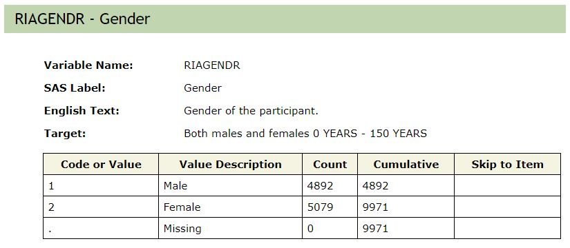
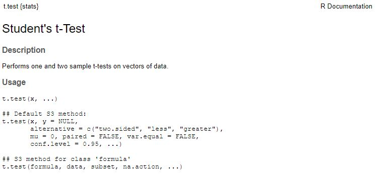
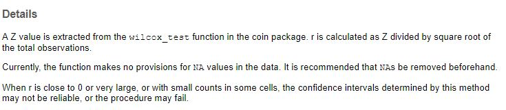

# The R team tries t-tests and their alternatives

## Achievements to unlock

Leslie is ready to move on to her next inferential statistical test. Kiara explains that today they will be working on t-tests, which are used to compare two means to see if they are different from another. The test is often used to compare the mean of some variable across two groups. For example, it might be used to compare the mean income of college graduates and people who have not graduated from college. A t-test can also be used like the goodness-of-fit chi-squared was to compare the mean from one group to a population mean. For example, the t-test could be used to see if the mean age in a sample is the same as the mean age in the population that the sample was taken from.

Leslie remembers that the t-statistic has come up before when they were looking at the confidence intervals; it was used in place of $z$ when sample sizes are small. Kiara explains that the t-statistic is also used as the test statistic for a t-test. A t-test is used to compare the means of two groups to see whether they are different. Kiara explains that there are several versions of the t-test to use in different situations. Today they will discuss the **one-sample t-test**, **independent samples t-test**, and **dependent samples t-test**. The three tests all compare two means, but each test is used in a different situation, similar to how the goodness-of-fit chi-squared and the chi-squared test of independence were used in two different situations. 

Like with the chi-squared test, the NHST process will be used to organize the statistical testing. Also like with chi-squared, they will check the assumptions of each t-test and discuss alternate analysis methods when the assumptions are not met. 

Kiara puts together a list of achievements for the day:

* Achievement 1: Understanding the relationship between one categorical variable and one continuous variable using bar graphs, frequencies, and percents 
* Achievement 2: Comparing a sample mean to a population mean with a one sample t-test
* Achievement 3: Comparing two unrelated sample means with an independent samples t-test
* Achievement 4: Comparing two related sample means with a dependent samples t-test 
* Achievement 5: Computing and interpreting an effect size for significant t-tests
* Achievement 6: Examining and checking the underlying assumptions for using the t-test 
* Achievement 7: Identifying and using alternate tests for when t-test assumptions are not met

Follow Nancy, Kiara, and Leslie through the examples and exercises to test some relationships.

## The vexing vitals problem

At the end of their chi-squared day, Nancy had mentioned to Leslie that the t-test has something to do with beer. Leslie brings this up and, after a few minutes of discussion about their favorite beverages, they veer into talking about nutrition and health. Leslie describes a recent conversation with her parents where they were concerned about the health implications of high blood pressure after her dad had a recent physical exam. Leslie, Nancy, and Kiara all think they have normal blood pressure but are not sure because they have not paid close attention. Leslie says the conversation with her parents, who do not seem to be getting any younger, made her realize that she not have a good understanding of the relationship of blood pressure (or other vital signs if she is being honest) to the health behaviors she and some of her friends participate in like drinking alcohol, marijuana use, smoking, or physical activity. 

The R team decides this could be a good thing to know and they start by reading about the two blood pressure measures, systolic and diastolic. They find that systolic blood pressure is measured in millimeters of mercury or mmHG and ranges from 74 to 238, while diastolic blood pressure is also measured in mmHG and ranges from 0 to 120. Kiara does some searching and finds that the National Health and Nutrition Examination Survey (NHANES) conducted regularly by the the Centers for Disease Control and Prevention (CDC) collects blood pressure from participants. Before they read more, they go to the CDC website and explore the NHANES data and codebook for 2015-2016 [@NHANES20152016codebook]. 

To get started, Kiara downloads and saves the 2015 - 2016 NHANES data set in a *csv* file so they have a local copy that is easy to open. She wants to make sure the Leslie knows about the <span style="font-family:Lucida Console, monospace;font-weight:bold">RNHANES</span> package she used for the download that allows access to most NHANES data in R directly from the CDC website with a single command (see Box \@ref(#ch6kiara)). Follow along with the example by downloading the **nhanes_2015-2016_ch6.csv** data from edge.sagepub.com/harris1e or using the more reproducible method in Box \@ref(ch6kiara).

```{r}
# import nhanes 2015-2016
nhanes.2016 <- read.csv("data/nhanes_2015-2016_ch6.csv")
```

Nancy notices a lull in activity and jumps in to write the code for the first graph. Because the two blood pressure measures are measured along a continuum, she considers each of the graphs from Section \@ref(achievement 2:-graphs-for-a-single-continuous-variable) that were appropriate for continuous variables and chooses a **histogram** so that they can easily see the shape of the distribution. She looks up the name of the blood pressure variables in the codebook [@NHANES20152016codebook] and finds that systolic blood pressure is variable BPXSY1. 

```{r fig.cap="Distribution of systolic blood pressure in mmHg for 2015-2016 NHANES participants."}
# open tidyverse for graphing with ggplot2
library(tidyverse)

# graph systolic blood pressure variable BPXSY1
sbp.histo <- nhanes.2016 %>% 
  ggplot(aes(x = BPXSY1)) +
  geom_histogram(fill = "#7463AC", color = "white") +
  theme_minimal() + 
  labs(x = "Systolic blood pressure (mmHg)",
       y = "NHANES participants") 
sbp.histo  
```

Leslie suggests that it looks like most people are between 100 and about 150. She finds that the CDC defines [@MeasuringBloodPressurecdcgov] normal systolic blood pressure as below 120mmHg, at-risk between 120-139, and high as 140 and above. Viewing these ranges in the histogram might be useful, so she searches for how to fill ranges with different colors and creates a histogram with purple representing normal systolic blood pressure and gray representing at-risk or high systolic blood pressure:

```{r fig.cap="Distribution of systolic blood pressure in mmHg for 2015-2016 NHANES participants."}
# graph systolic bp BPXSY1
sbp.histo <- nhanes.2016 %>% 
  ggplot(aes(x = BPXSY1, fill = BPXSY1 > 120)) +
  geom_histogram(color = "white") +
  theme_minimal() + 
  scale_fill_manual(values = c("#7463AC","gray"),
                    labels=c("Normal range", "At risk or high"),
                    name = "Blood pressure") +
  labs(x = "Systolic blood pressure (mmHg)",
       y = "NHANES participants") 
sbp.histo  
```

```{r fig.cap="Distribution of diastolic blood pressure in mmHg for 2015-2016 NHANES participants."}
# graph diastolic bp BPXDI1
nhanes.2016 %>%
  ggplot(aes(x = BPXDI1, fill = BPXDI1 > 80)) + 
  geom_histogram(color="white") + 
  theme_minimal() + 
  scale_fill_manual(values = c("#7463AC","gray"),
                    labels=c("Normal range", "At risk or high"),
                    name = "Blood pressure") + 
  labs(x="Diastolic blood pressure (mmHg)",
       y="NHANES participants")
```

It appears that more people are within the normal range for diastolic blood pressure than are in the normal range for systolic blood pressure. Looking at these two distributions, Leslie thinks that the mean systolic blood pressure in the sample is likely higher than the 120 threshold for healthy. Kiara agrees and says that one of the t-tests they are going to talk about today will actually help to test this hypothesis.

## Achievement 1: Understanding the relationship between one categorical variable and one continuous variable using bar graphs, frequencies, and percents 

Based on observing the histograms, Leslie has predicted that the mean systolic blood pressure in the sample is higher than 120. In addition to the histogram, she can check this with the mean and standard deviation:

```{r}
# mean and sd of systolic blood pressure
nhanes.2016 %>% 
  drop_na(BPXSY1) %>%
  summarize(m.sbp = mean(BPXSY1),
            sd.sbp = sd(BPXSY1))
```

Leslie finds that the observed mean of 120.5 is just slightly higher than the threshold of 120. While it does not seem like a big difference, she looks at the histogram again and wonders if the .5 difference is enough different from 120 to be statistically significantly different. 

```{r echo = FALSE, fig.cap="Distribution of systolic blood pressure in mmHg for 2015-2016 NHANES participants."}
sbp.histo 
```

### Unlock achievement 1: Check your understanding

Which graphs could be used to determine if the distribution of a variable is normal (check all that apply):

* bar graph 
* histogram 
* scatterplot 
* boxplot 
* line graph 

## Achievement 2: Comparing a sample mean to a population mean with a one sample t-test {#osttest}

Kiara explains that comparing the mean in the NHANES data to a hypothesized value like 120 can be done with a **one sample t-test**. The _one sample t-test_ compares a sample mean to a hypothesized or population mean. It is one of three types of t-tests:

* **one-sample t-test**: compares a mean to a population or hypothesized value  
* **independent samples t-test**: compares the means of two unrelated groups 
* **paired samples t-test**: compares the means of two related groups 

Leslie is ready to go, she looks at her notes from Section \@ref(nhst) **chi-squared** day to remind herself of the NHST process:

#. Write the null and alternate hypotheses 
#. Compute the test statistic 
#. Calculate the probability that your test statistic is at least as big as it is if there is no relationship (i.e., the null is true) 
#. If the probability that the null is true is very small, usually less than 5%, reject the null hypothesis 
#. If the probability that the null is true is not small, usually 5% or greater, retain the null hypothesis 

### NHST Step 1: Write the null and alternate hypothesis

The first step is to write the null hypothesis for statistical testing. Kiara reminds Leslie that the null hypothesis is usually a statement that claims there is **no difference** or **no relationship** between things. In this case, the null hypothesis is stating that the mean systolic blood pressure of adults in the US is 120. The NHANES data are a sample drawn from the US population, so the NHANES data should have the same characteristics as the population from which it was drawn.  In this case, the null hypothesis should state that the mean in the population (that the sample came from) is equal to the hypothesized value of 120. Leslie writes the following:

H0: There is no difference between mean systolic blood pressure in the US and the cutoff for normal blood pressure, 120 mmHG.

HA: There is no difference between the mean systolic blood pressure in the US and the cutoff for normal blood pressure, 120 mmHG.

Kiara thinks those sound great and they move on to step 2.

### NHST Step 2: Compute the test statistic 

The one-sample t-test uses the t-statistic (sort of like a z-statistic) as the test statistic:

$$
\begin{equation}
t=\frac{\bar{x}-\mu}{\frac{s}{\sqrt{n}}}
 (\#eq:onesampt)
\end{equation}
$$

In the formula for $t$, the $\bar{x}$ represents the mean of the variable to be tested, $\mu$ is the population mean or hypothesized value, $s$ is the sample standard deviation, and $n$ is the sample size. Leslie remembers the $z$ statistic calculations and notices how similar this is. The difference is that the denominator is the **standard error** rather than the **standard deviation**. Kiara reminds her that the **standard error** approximates the **standard deviation of the sampling distribution**. So, $z$ shows how many sample standard deviations some value is away from the mean, while $t$ shows how mand standard errors (or population standard deviations) the hypothesized value is away from the mean.

Nancy notices that they do not currently have the value of $n$ and she jumps on the laptop to add it. Leslie is confused, why would they not just us the $n$ shown in the Environment pane? Nancy tells her to wait a second for the code and then see if she can figure it out:

```{r}
# mean and sd of systolic blood pressure
nhanes.2016 %>% 
  drop_na(BPXSY1) %>%
  summarize(m.sbp = mean(BPXSY1),
            sd.sbp = sd(BPXSY1),
            n.spb = n())
```

Leslie notices that the value of $n$ in the output is lower than the 9,544 observations shown in the Environment pane. Nancy explains that `drop_na(BPXSY1)` has removed all the people from the sample who were missing data on the BPXSY1 command, which it looks like was more than 2,000 people. Leslie adds the values into the t-statistic formula and calculates $t$:


$$
\begin{equation}
t=\frac{120.5394-120}{\frac{18.61692}{\sqrt{7145}}}=2.45
 (\#eq:onesampt2)
\end{equation}
$$

With a $t$ of 2.45, the sample mean of 120.5394 is 2.45 standard errors above the hypothesized value of 120.

After she computes the $t$-statistic Kiara mentions that there are ways to do these calculations in R. In base R, the `t.test()` command is useful for getting the $t$ during a **one-sample t-test**. The command takes the name of the variable and the hypothesized or population value ($\mu$) to compare it to, like this: 

```{r}
# comparing mean of BPXSY1 to 120
t.test(nhanes.2016$BPXSY1, mu = 120)
```

The output contains a lot of information. The first row confirms the variable examined by the `t.test()` command. This appears correct. The second row starts with $t = 2.4491$, which is the same as the hand calculated value. The next part of the output is df = 7144. Kiara explains that, in this context, the degrees of freedom (df) are not computed using rows and columns like the chi-squared degrees of freedom. In this case, the df value is computed by subtracting 1 from the sample size. So, a df = 7144 would indicate the sample size is 7145. This is consistent with the $n$ of 7,145 from `summarize()`. The next number in the `t.test()` output is the p-value of .01435, which leads Leslie to step 3 of NHST. 

### NHST Step 3: Compute the probability for the test statistic (p-value) 

The t-statistic is 2.45. Like the chi-squared statistic, the t-statistic has a distribution made up of all the possible values of t and how probable each value is to occur. In the case of t, the distribution looks similar to a normal distribution. Nancy looks up from her phone and sees an opportunity to code. She plots a t-distribution with 7,144 degrees of freedom:

```{r echo=FALSE, fig.cap="T distribution with df = 7,144."}
dat<-with(density(rt(100000, 7144)),data.frame(x,y))
ggplot(data = dat, mapping = aes(x = x, y = y)) +
    geom_line()+
  theme_minimal() +
  xlab("t statistic") + ylab("Probability")
```

Kiara suggests shading in the t-statistic of 2.45 and higher in the t-distribution graph like they have been doing with other statistical tests. Nancy adds the shading to represent the probability of getting a t-statistic that is 2.45 or greater **if the null hypothesis were true**. 

```{r echo=FALSE, fig.cap="T distribution (df = 7,144) shaded for values of 2.45 or higher."}
ggplot(data = dat, mapping = aes(x = x, y = y)) +
    geom_line()+
    geom_area(mapping = aes(x = ifelse(x >= 2.45 , x, 0)), fill = "#7463AC") + 
  ylim(0,.5) + xlim(-5, 5) +
  theme_minimal() +
  xlab("t statistic") + ylab("Probability")

```

The shaded section of the distribution is very small, indicating that a t-statistic of 2.45 or greater has a low probability **when the null hypothesis is true**. The output from the t-test quantifies this probability with the p-value of .014. The interpretation of this value is that there is a 1.4% probability that a t-statistic would be 2.45 or greater **if the null hypothesis were true**. That is, there is a 1.4% probability of a t-statistic equal to, or greater than, 2.45 for a sample this large from a population where the mean systolic blood pressure was 120. 

Usually a t-statistic, or any statistic, with a probability of occurring of less than 5% of the time is considered to be  **statistically significant**. For the $t$ distribution, the cutoff for values that would be occur less than 5% of the time are shown by the shaded areas. The shaded areas together make up the **critical region** or **rejection region** for the null hypothesis since the values of $t$ in these shaded areas happen so infrequently when the null hypothesis is true that is seems more likely that it should be rejected. The t-statistics falling into this critical region therefore suggest a **statistically significant** result.


```{r echo=FALSE, fig.cap="T distribution (df = 7,144) with 2.5% shaded in each tail of the distribution."}

dat<-with(density(rt(100000, 7144)),data.frame(x,y))
ggplot(data = dat, mapping = aes(x = x, y = y)) +
    geom_line() +
    geom_ribbon(data = subset(dat, x < -1.96), aes(ymax = y), ymin=0,
              fill="#7463AC") +
  geom_ribbon(data = subset(dat, x > 1.96), aes(ymax = y), ymin=0,
              fill="#7463AC") +
  ylim(0,.5) + xlim(-5, 5) +
  theme_minimal() +
  xlab("t statistic") + ylab("Probability")

```

Any value of the t-statistic that is in the shaded tales of the distribution happens less with a probability less than 5% **when the null hypothesis is true**. 

### NHST Steps 4 & 5: Interpret the probability and write a conclusion 

In this case, the t-statistic is in the rejection region, so there is sufficient evidence to reject the null hypothesis in favor of the alternate hypothesis. Even though the difference between the mean systolic blood pressure of 120.5 and the hypothesized value of 120 is small, it is statistically significant. The probability of this sample coming from a population where the mean systolic blood pressure is actually 120 is just 1.4%. This sample is likely to be from a population with a higher mean blood pressure.

Leslie summarizes the results of this t-test: 

> The mean systolic blood pressure in a sample of 7,145 people was 120.5 (sd = 18.62). A one-sample t-test found this mean to be statistically significantly different from the hypothesized mean of 120 [t(7144) = 2.45; p = .014]. The sample likely came from a population with a mean systolic blood pressure higher than 120.

### Unlock achievement 2: Check your understanding

Interpret the results of the same one-sample t-test conducted after limiting the NHANES sample to people 65 years old or older:

```{r}
# subset data frame to 65+ years old
nhanes.2016.65plus <- nhanes.2016 %>%
  filter(RIDAGEYR >= 65) 

# comparing mean of BPXSY1 to 120
t.test(x = nhanes.2016.65plus$BPXSY1, mu = 120)
```

## Achievement 3: Comparing two unrelated sample means with an independent samples t-test {#indepsamp}

Leslie thinks this is cool for checking to see how well your sample represents a population, but asks if the t-test can be used for anything else. Kiara explains that there are two additional types of t-test. Instead of comparing one mean to a hypothesized or population mean, the **independent samples t-test** compares the means of two groups to each other. For example, the NHANES data set includes sex measured in two categories: males and females. We might be interested in whether the mean systolic blood pressure is the same for males and females in the population. That is, do males and females in the sample come from populations where they have the same mean systolic blood pressure? 

Kiara suggests the independent samples t-test can be used to find out if this is the case. Before conducting NHST, Leslie starts with some descriptive and visual EDA. She notes that they now have the blood pressure variable measured on a continuum and treated as continuous, and the sex variable that is categorical. Since they are comparing mean blood pressure across groups, she decides to start with some group means:

```{r}
# compare means of BPXSY1 across groups
# sex variable is RIAGENDR
nhanes.2016 %>% 
  drop_na(BPXSY1) %>%
  group_by(RIAGENDR) %>%
  summarize(m.sbp = mean(BPXSY1))

```

Well, it certainly looks like there may be a difference, but it is unclear who has higher or lower blood pressure since the categories of sex are not labeled clearly. Nancy slides the laptop over and does some cleaning for both the variables. She looks in the codebook to find out how the RIAGENDR variable is coded. She finds the entry in the demographics codebook:

```{r echo = FALSE, fig.cap="NHANES 2015-2016 demographics codebook: gender variable."}

```

It looks like 1 is Male and 2 is Female. Nancy adds the labels and renames the variable:

```{r}
# add labels to sex and rename variables
nhanes.2016.cleaned <- nhanes.2016 %>%
  mutate(RIAGENDR, RIAGENDR = recode_factor(.x = RIAGENDR, 
                                            `1` = 'Male',
                                            `2` = 'Female')) %>%
  rename(sex = RIAGENDR) %>%
  rename(systolic = BPXSY1)


```

Once the recoding is done, Nancy updates the means calculations with the new data frame name and variable names:

```{r}
# compare means of systolic by sex
nhanes.2016.cleaned %>% 
  drop_na(systolic) %>%
  group_by(sex) %>%
  summarize(m.sbp = mean(systolic))
```

It appears that males have a higher mean systolic blood pressure than females. Leslie thinks a graph might help give a little more perspective, so she looks back at Section \@ref(catcont) and decides on a density plot:

```{r}
box.sex.bp <- nhanes.2016.cleaned %>%
  ggplot(aes(x = systolic, 
             fill = sex)) +
  geom_density(alpha = .8) +
  theme_minimal() +
  labs(x = "Systolic blood pressure") +
  scale_fill_manual(values = c('gray', '#7463AC'),
                    name = "Sex") 
box.sex.bp 
```

The density plot shows distributions that are a little right skewed, with the distribution for males shifted to the right of the distribution for females showing higher values overall but not by a lot. Now that she knows what to look for, Leslie is ready for the independent samples t-test. She uses the NHST to organize her work:

#### NHST Step 1: Write the null and alternate hypotheses

H0: There is no difference in mean systolic blood pressure for males and females in the US population 

HA: There is a difference in mean systolic blood pressure for males and females in the US population 

#### NHST Step 2: Compute the test statistic {#indepttest.tval}

The test statistic for the independent samples t-test is a little more complicated to calculate since it now includes the means from both the groups in the numerator and the standard errors from the groups in the denominator. In the formula, $\bar{x_1}$ is the mean of one group and $\bar{x_2}$ is the mean of the other group; the difference between the means makes up the numerator. So, the larger the difference between the group means, the larger the numerator will be and the larger the $t$-statistic will be!

The denominator includes the variances for the first group, $s^2_1$, and for the second group, $s^2_2$ along with the sample sizes for each group, $n_1$ and $n_2$. 

$$
\begin{equation}
t=\frac{\bar{x_1}-\bar{x_2}}{\sqrt{\frac{s_1^2}{n_1}+\frac{s_2^2}{n_2}}}
 (\#eq:indept)
\end{equation}
$$

Nancy adds the variance and $n$ to the summarize statistics:

```{r}
# compare means of systolic by sex
nhanes.2016.cleaned %>% 
  drop_na(systolic) %>%
  group_by(sex) %>%
  summarize(m.sbp = mean(systolic),
            var.sbp = var(systolic),
            n = n())
```

Leslie substitutes them into the t-statistic formula:

$$
\begin{equation}
t=\frac{122.1767 - 118.9690}{\sqrt{\frac{18.14654^2}{3498}+\frac{18.92703^2}{3647}}}=7.31
 (\#eq:indept)
\end{equation}
$$

After watching Leslie substitute in the values and do the math, Nancy types a line of code:

```{r indepttest.ch6}
# compare systolic blood pressure for males and females
t.test(formula = nhanes.2016.cleaned$systolic ~ nhanes.2016.cleaned$sex)
```

This time, instead of the first argument being `x =`, Nancy has typed `formula =`. In R, a formula typically (but not always) has a single variable on the left, followed by a `~` (i.e., tilde), followed by one or more objects that somehow predict or explain whatever was on the left hand side. In a lot of statistical tests, the object on the Left-Hand-Side (LHS) of the formula is the **outcome** or **dependent variable** while the object(s) on the Right-Hand-Side (RHS) of the formula are the **predictors** or **independent variables**. In this case, systolic blood pressure is the **outcome** being explained by **sex**. 

The hand calculation and `t.test()` output both show a t-statistic of 7.31, which is consistent with what Leslie calculated. The degrees of freedom are 7,143, which is the sample size of 7,145 minus two because there are two groups. In the case of the **independent samples t-test**, the degrees of freedom are computed as n - k, where n is the sample size and k is the number of groups. Leslie notices that there is a 95% confidence interval in the `t.test()` output. Kiara explains that this is the 95% confidence interval around the **difference between the two groups**. So, in the sample, the difference between male systolic blood presure (m = 122.1767) and female systolic blood pressure (m = 118.9690) is `r 122.1767 - 118.969`, in the population this sample came from, the difference between male and female blood pressure is likely to be between 2.35 and 4.07 (the 95% confidence interval). Kiara notes that the range does not contain zero, so in the population, the difference between male and female blood pressure is not likely to be zero. Based on the difference in the sample and the other characteristics of the sample, there is likely some difference between male and female blood pressure in the population. 

Leslie takes a look at the help documentation for `t.test()` to see what else it has to offer. She notices that the help documentation calls the t-test, "Student's t-Test" (Figure \@ref(fig:studentt)). Leslie asks Kiara why the test is called **Student's** t-test? She wonders if it is because it is one of the first statistical tests taught to students? Kiara says no, that this was a pseudonym used by the statistician who first developed the t-test and that it has to do with the **beer** Nancy mentioned at the end of chi-squared day. Nancy brought one of her books from grad school to share with Leslie so she can read the story of William Gossett, the Guiness brewery, and the t-test (see Box \@ref(ch6leslie)).

```{r studentt, echo = FALSE, fig.cap="NHANES 2015-2016 demographics codebook: gender variable."}

```

#### NHST Step 3: Compute the probability for the test statistic (p-value) 

The p-value in this case is shown in _scientific notation_, so Leslie converts it: p = .0000000000002886. Kiara suggests using p < .05 instead since the longer version of the p-value number is more difficult to read and takes up a lot of space. The value of this t-statistic would happen with a probability of much less than 5% **if the null hypothesis were true**. 

#### NHST Steps 4 & 5: Interpret the probability and write a conclusion 

In this case, the t-statistic is in the rejection region, so there is sufficient evidence to reject the null hypothesis in favor of the alternate hypothesis. Even though the difference between the mean systolic blood pressure for males and females is small, it is statistically significant. The probability of this sample coming from a population where the means for males and females are equal is very low, it would happen about 1.4% of the time. This sample is likely to be from a population where males and females have different mean systolic blood pressure.

Leslie summarizes the interpretation: 

> There is a statistically significant difference [t(7143) = 7.31; p < .05] between the mean systolic blood pressure for males (m = 122.2) and females (m = 119.0). The sample is from the US population indicating that males in the US likely have a higher mean systolic blood pressure than females in the US. The difference between male and female mean systolic blood pressure is `r 122.1767 - 118.969` in the sample. In the population this sample came from, the difference between male and female blood pressure is likely to be between 2.35 and 4.07 (d = `r round(122.1767 - 118.969, 2)`; 95% CI: 2.35-4.07). 

### Unlock achievement 3: Check your understanding

Conduct the same independent samples t-test on the sample created in the previous section of people 65+ years old. Interpret your results.

## Achievement 4: Comparing two related sample means with a dependent samples t-test {#depttest}

Kiara mentions that sometimes the means to compare will be related. This usually happens in one of two ways, either the same people are measured twice or people are siblings or spouses or co-workers or have some other type of relationship. Leslie remembers this from learning about the assumptions of chi-squared. Kiara explains that it may seem strange to measure the same people twice, but often people will be measured before and after some sort of intervention and the measures are compared to see if they changed. 

Kiara goes on to explain that the dependent samples t-test works a little differently from the independent samples t-test. In this case, the formula uses **the mean of the differences between the first and second measures**. So, for example, if Leslie's systolic blood pressure was measured to be 110 on the first measure and 112 on the second measure, the difference between the two measures is 2. If Leslie were measured as having 115 first and 110 second, the difference between the two measures is -5. The numerator for the paired t-test would take the mean of those differences and subtract 0 since zero would be the mean difference when two measures are the same. The denominator is also for the difference between the means rather than for the each mean (Equation \@ref(dept)). 

$$
\begin{equation}
t=\frac{\bar{d}-0}{\sqrt{\frac{s_d^2}{n}}}
 (\#eq:dept)
\end{equation}
$$

In the dependent samples t-test formula (Equation \@ref(dept)), the $\bar{d}$ is the mean of the differences between the measures, the $s^2_d$ is the variance of the mean difference between the measures, and $n$ is the sample size.

In the case of the systolic blood pressure measurement for NHANES, the measure is taken up to four times for each person to ensure that it is accurate. In this case, Kiara notes, these measures should be the same or very similar since they are measures of the same person. So, if they are measured accurately there would not be much of a difference between blood pressure measure 1 and blood pressure measure 2. She suggests that they start with a little EDA to examine the data. Leslie looks confused. Kiara clarifies that they should look at some visual and descriptive statistics before they conduct the t-test, EDA being Explortory Data Analysis. Leslie nods and takes a look at the codebook to see what the variable names are for the other measures of systolic blood pressure. She finds the second measure of systolic blood pressure is BPXSY2. To conduct the paired samples t-test, she thinks renaming this variable to be easier to remember is a good start, and then she wants to make the $d$ variable, which is the difference between the first systolic blood pressure measure and the second one of BPXSY2. 


```{r fig.cap="Difference between measure 1 and 2 for systolic blood pressure (mmHg)."}
# rename second systolic measure and create diff variable for
# difference between measure 1 and 2 for systolic BP
nhanes.2016.cleaned <- nhanes.2016 %>%
  mutate(RIAGENDR, RIAGENDR = recode_factor(.x = RIAGENDR, 
                                            `1` = 'Male',
                                            `2` = 'Female')) %>%
  rename(sex = RIAGENDR) %>%
  rename(systolic = BPXSY1) %>%
  rename(systolic2 = BPXSY2) %>% 
  mutate(diff.syst = systolic - systolic2)
```

Now that there is a variable, *diff.syst*, measuring the difference between the first and second systolic blood pressure measures, Leslie can check the descriptive statistics and visualize the distribution of this variable.

```{r}
# mean of the differences
nhanes.2016.cleaned %>% 
  drop_na(diff.syst) %>%
  summarize(m.diff = mean(diff.syst))
```

The mean difference between the first and second systolic blood pressure measures was `r round(mean(nhanes.2016.cleaned$diff.syst),2)`, which is no zero, but it is pretty small. So, on average, the systolic blood pressure measure was `r round(mean(nhanes.2016.cleaned$diff.syst),2)` different between the first measure and the second on the same person in the NHANES 2015-2016 data set. Leslie creates a histogram to check out the distribution of the differences:

```{r}
# histogram of the differences between first and second 
# blood pressure measures
nhanes.2016.cleaned %>%
  ggplot(aes(diff.syst)) + 
  geom_histogram(fill = "#7463AC", color = "white") + 
  theme_minimal() + 
  labs(x="Difference between measure 1 and 2",
       y="NHANES participants")

```

The distribution of differences looks close to normal and the center is near 0, but maybe not exactly 0. The mean difference is .54. If measures 1 and 2 were exactly the same for each person, the mean difference would be 0. Using the NHST process, Leslie tests to see if the .54 mean difference is significantly different from the 0 she would expect to see if the values were exactly the same for the first and second measures of systolic blood pressure on each person:

### NHST for the dependent samples t-test

#### NHST Step 1: Write the null and alternate hypotheses

H0: There is no difference between measures 1 and 2 for systolic blood pressure  

HA: There is a difference between measures 1 and 2 for systolic blood pressure 

#### NHST Step 2: Compute the test statistic

Leslie substitutes the mean, standard deviation, and sample size of the difference between the measures into the formula for the paired t-test statistic. First she needs the variance and sample size:

```{r}
# var and sample size of the difference variable
nhanes.2016.cleaned %>%
  drop_na(diff.syst) %>%
  summarize(m.sbp = mean(diff.syst),
            var.sbp = var(diff.syst),
            n = n())
```

Leslie notices that the sample size is smaller this time; it looks like 7,101 people had data for both measures available. 

$$
\begin{equation}
t=\frac{.5449937-0}{\sqrt{\frac{23.99083}{7101}}}=9.38
 (\#eq:dept2)
\end{equation}
$$

Kiara asks Leslie what she expects to find with a t-statistic this large. In light of the significant tests for the one-sample and independent samples t-tests, Leslie thinks this is likely to be a _statistically significant_ result as well. Kiara suggests using the `t.test()` command again, but this time with the `paired = TRUE` option since the default for the command is an independent samples test. Leslie tries it: 

```{r eval = FALSE}
# paired t-test for systolic measures 1 and 2
t.test(x = nhanes.2016.cleaned$systolic, 
       y = nhanes.2016.cleaned$systolic2, 
       paired = TRUE)
```

The test statistic produced by `t.test()` is consistent with the one Leslie calculated by hand. Using R is so much faster, but Leslie feels good knowing she can compute the statistics correctly using the basic descriptive statistics she knows how to do. R is becoming more manageable to Leslie but she is also starting to feel better about what goes into the statistics she learned in her earlier class. The t-test is just a clever use of means and standard deviations and sample sizes...there is no magic required!

#### NHST Step 3: Compute the probability for the test statistic (p-value) 

Once again, the p-value is shown in scientific notation as $<2.2e-16$ which is well below .05. Just as Leslie suspected the probability of finding a mean difference of .54 between the two measures in the sample is much lower than 5% if there were no difference between the measures in the population that the sample came from.

#### NHST Steps 4 & 5: Interpret the probability and write a conclusion 

Once again, the $t$-statistic has a low probability and is in the rejection region, so there is sufficient evidence to reject the null hypothesis in favor of the alternate hypothesis. Even though the mean difference between the first and second measures is small, it is statistically significant. The probability of the sample coming from a population where the measures are equal is very low. This sample is likely to be from a population where systolic blood pressure is not measured consistently over time. 

Leslie sees the confidence interval and asks Kiara if this is the range where the difference between the first and second measures is for the population? Kiara confirms and adds one more piece of information. Because the difference statistic is calculated by subtracting the second measure of systolic blood pressure from the first measure, Kiara mentions that the mean difference is **positive**, indicating that the first measure of systolic blood pressure tends to be higher than the second measure. 

Leslie summarizes the interpretation: 

> The mean difference between systolic blood pressure measures is statistically significantly different from zero [t(7100) = 9.38; p < .05]. The positive difference of .54 indicates that systolic blood pressure is significantly higher for the first measure compared to the second measure. While the mean difference in the sample is .54, the mean difference between the first and second measures in the population is likely between .43 and .66 ($d$ = .54; 95% CI: .43-.66).

Kiara wants to bring up one more point. She explains to Leslie that the mean difference is quite small and does not seem to be reason to worry. While it is not zero, as it would be if the measures were completely consistent, it is .54 on average, which is not a large clinical difference. This example and the small but significant differences for the one-sample and independent samples t-tests demonstrate that results can be statistically significant but not clinically meaningful. 

Kiara suggests that they review the formulas for the three t-statistics to look for reasons why the $t$-statistics were large and therefore the results of these three t-tests were all significant. 

$$
\begin{equation}
t=\frac{\bar{x}-\mu}{\frac{s}{\sqrt{n}}}
 (\#eq:onesampt)
\end{equation}
$$

$$
\begin{equation}
t=\frac{\bar{x_1}-\bar{x_2}}{\sqrt{\frac{s_1^2}{n_1}+\frac{s_2^2}{n_2}}}
 (\#eq:indept)
\end{equation}
$$

$$
\begin{equation}
t=\frac{\bar{d}-0}{\sqrt{\frac{s_d^2}{n}}}
 (\#eq:dept)
\end{equation}
$$

Leslie notes a lot of similarities. Things that would make the $t$-statistic larger across all of these formulas include: larger differences between the means, smaller standard deviations, and larger sample size. Since the differences between the means were not all that big for any of the three tests, and the standard deviations or variances were relatively large, Leslie thinks the main reason for the $t$-statistics to be large enough to be statistically significant was the large sample size, $n$. Larger sample sizes result in smaller denominator values which, in turn, result in larger t-statistics. Kiara agrees that that is probably the culprit since the differences were so small with .5, 3.21, and .54 differences between means all being statistically significant without really being all that clinically different or important.

### Unlocking achievement 4: Check your understanding

Match each type of t-test to its description:

t-tests: 

* One-sample  
* Dependent samples 
* Independent samples 

descriptions: 

* Compares means of two unrelated groups 
* Compares a single mean to a population or hypothesized value 
* Compares two related means 

## Achievement 5: Computing and interpreting an effect size for significant t-tests {#cohensd}

Leslie thinks that the small differences between means being statistically significant suggests that reporting statistical significance might be misleading. She thinks that, especially where differences between means are small, it would be useful to have something to report that is about the size of the difference or the strength of the relationship. Kiara explains that what she is looking for is called **effect size** and it gives some idea of how strong a statistically significant relationship is [@sullivan2012using]. That is, a difference in mean systolic blood pressure of .54 is *statistically significant* but is it really a big enough difference to suggest that one group is different from the other in an important way? Kiara mentions that some people have argued that effect sizes are even more important than p-values since p-values only report whether a difference or relationship from a sample is likely to be true in the population, while effect sizes provide information about the strength or size of a difference or relationship [@sullivan2012using; @fritz2012effect; @mays2009call]. In addition, in analyses of large samples, p-values usually reach statistical significance, even for very small differences and very weak relationships [@sullivan2012using].

The effect size statistic usually reported with a t-test is **Cohen's d**. Like standardized residuals with chi-squared analyses, **Cohen's d** is computed when the test results are **statistically significant**. Cohen's $d$ can be computed for each t-test using a slightly different formula that works for the research question being examined. Kiara shows Leslie the three formulas and Nancy contributes the R code for each test. Before they begin, Kiara wants to explain how the value of $D$ is classified: 

* Cohen's $d = .2$ to $d< .5$ is a **small** effect size 
* Cohen's $d = .5$ to $d< .8$ is a **medium** effect size 
* Cohen's $d \ge .8$ is a **large** effect size 

### Cohen's d for one-sample t-tests

The formula for $Cohen's d$ for a one-sample t-test is [@sullivan2012using]:

$$
\begin{equation}
d=\frac{m - \mu}{s}
 (\#eq:donesamp)
\end{equation}
$$

Where $m$ is the sample mean, $\mu$ is the hypothesized or population mean, and $s$ is the sample standard deviation. This seems familiar to Leslie and she asks how this is different from the calculation of $z$. Kiara agrees that this looks very familiar, including having the standard deviation in the denominator, but reminds Leslie that the numerator for $z$ is different and refers her back to Section \@ref(zscore.section) as a refresher. Leslie decides to go back and look later, for now she is interested in computing the effect size for the one-sample t-test in Section \@ref(osttest). 

$$
\begin{equation}
d=\frac{120.5 - 120}{18.62}=.027
 (\#eq:donesamp2)
\end{equation}
$$

The effect size is less than .03, which does not even get close to the **small** effect size value of .2. Nancy shows Leslie how to use R to get the value by first installing the <span style="font-family:Lucida Console, monospace;font-weight:bold">lsr</span> package and then writing the code. The `cohensD()` function can be used to compute effect size for each of the three t-tests. For the one-sample test, there are three arguments to use: `x =` takes the vector that contains the variable to be tested and `mu =` takes the hypothesized or population mean.

```{r}
# cohen's d effect size for one sample t
lsr::cohensD(x = nhanes.2016.cleaned$systolic, mu = 120)

```

Leslie notices that there is a slight difference in the values between the hand-calculation and the R calculation. Kiara suggests this is due to rounding error. Both the 120.5 and the 18.62 are rounded for the sake of easier hand calculations while R can keep many digits in memory while computing the value of $d$. 

Leslie adds the effect size to the interpretation of results from the one-sample t-test:

> The mean systolic blood pressure in a sample of 7,145 people was 120.5 (sd = 18.62). A one-sample t-test found this mean to be statistically significantly different from the hypothesized mean of 120 [t(7144) = 2.45; p = .014]. The sample likely came from a population with a mean systolic blood pressure higher than 120. While the sample mean was statistically significantly different from 120, the difference was relatively small with a small effect size of $d = .03$. 

### Cohen's d for independent samples t-tests {#d.indep.ttest}

The formula for $Cohen's d$ for an independent samples t-test is [@salkind2010encyclopedia]:

$$
\begin{equation}
d=\frac{m_1 - m_2}{s_{pooled}}=\frac{m_1 - m_2}{\sqrt{\frac{s_1^2+s_2^2}{2}}}
 (\#eq:dindsamp)
\end{equation}
$$

Where $m_1$ and $m_2$ are the sample means and $s_1^2$ and $s_2^2$ are the sample variances. Leslie goes ahead and uses the formula to compute the effect size for the independent samples t-test in Section \@ref(indepsamp):

```{r}
# compare means of systolic by sex
nhanes.2016.cleaned %>% 
  drop_na(systolic) %>%
  group_by(sex) %>%
  summarize(m.sbp = mean(systolic),
            var.sbp = var(systolic))
```

$$
\begin{equation}
d=\frac{122.1767 - 118.9690}{\sqrt{\frac{329.2968+358.2324}{2}}}=.173
 (\#eq:dindsamp2)
\end{equation}
$$

The effect size is .173, which is close to the **small** effect size value of .2 but the effect of sex on systolic blood pressure is not quite even a small effect. Nancy shows Leslie how to use R to get the value, this time entering a formula (see Box \ref(ch6nancy)) for `x = ` and the data frame name for the `data = ` argument. 

```{r}
# cohen's d effect size for indep sample t
lsr::cohensD(x = systolic ~ sex, 
             data = nhanes.2016.cleaned)

```

Again there is there is a slight difference in the values between the hand-calculation and the R calculation likely again due to rounding error. Leslie adds the effect size to the interpretation of results from the independent samples t-test:

> There is a statistically significant difference [t(7143) = 7.31; p < .05] between the mean systolic blood pressure for males (m = 122.2) and females (m = 119.0). The sample is from the US population indicating that males in the US likely have a higher mean systolic blood pressure than females in the US. The difference between male and female mean systolic blood pressure is `r 122.1767 - 118.969` in the sample. In the population this sample came from, the difference between male and female blood pressure is likely to be between 2.35 and 4.07 (d = `r round(122.1767 - 118.969, 2)`; 95% CI: 2.35-4.07). The effect size for the relationship between sex and systolic blood pressure was small $d=.17$.

### Cohen's d for paired samples t-tests

The formula for $Cohen's d$ for a paired samples t-test is:

$$
\begin{equation}
d=\frac{m_{diff}-0}{s_{diff}}
 (\#eq:dpairsamp)
\end{equation}
$$

Where $m_{diff}$ is mean difference between the two measures, in this case systolic and systolic2, and $s_{diff}$ is the standard deviation of the differences between the two measures. Leslie goes ahead and uses the formula to compute the effect size for the paired samples t-test in Section \@ref(depttest). 

```{r}
# var and sample size of the difference variable
nhanes.2016.cleaned %>%
  drop_na(diff.syst) %>%
  summarize(m.sbp = mean(diff.syst),
            sd.sbp = sd(diff.syst))
```

$$
\begin{equation}
d=\frac{.5449937-0}{4.898043}=.111
 (\#eq:dpairsamp2)
\end{equation}
$$

The effect size is .111, which is not quite up to the **small** effect size value of .2. Nancy shows Leslie how to use R to get the value, this time entering each blood pressure measure as a separate vector: 


```{r}
# cohen's d effect size for indep sample t
lsr::cohensD(x = nhanes.2016.cleaned$systolic, 
             y = nhanes.2016.cleaned$systolic2, 
             method = "paired")

```

The value is the same as the hand calculation. Leslie adds the effect size to the interpretation of results from the one-sample t-test:

> The mean difference between systolic blood pressure measures is statistically significantly different from zero [t(7100) = 9.38; p < .05]. The positive difference of .54 indicates that systolic blood pressure is significantly higher for the first measure compared to the second measure. While the mean difference in the sample is .54, the mean difference between the first and second measures in the population is likely between .43 and .66 ($d$ = .54; 95% CI: .43-.66). The effect size for the comparison of the two systolic blood pressure measures is very small $d = .11$ suggesting that the difference is statistically significant but it is also small.

## Achievement 6: Examining and checking the underlying assumptions for using the t-test

Just like chi-squared, the t-tests have to meet a few assumptions before they can be used. The first assumption for the t-test is that the data are normally distributed. For the one-sample t-test, the single variable being examined should be normally distributed. For the independent samples t-test and the paired samples t-test the data within each of the two groups should be normally distributed. There are several ways to assess normality. Visually, a histogram or a QQ-plot is useful for identifying normal and non-normal data distribution. Statistically, a Shapiro-Wilk test can be used. 

#### Testing normality 

For the one-sample t-test comparing systolic blood pressure to a hypothesized population mean of 120, the histogram to determine whether a t-test was appropriate would look like this:

```{r fig.cap="Distribution of systolic blood pressure in mmHg for 2015-2016 NHANES participants"}
# graph systolic bp 
nhanes.2016.cleaned %>% 
  ggplot(aes(x = systolic)) + 
  geom_histogram(fill = "#7463AC", col = "white") + 
  theme_minimal() + 
  labs(x="Systolic blood pressure (mmHg)",
       y="NHANES participants") 
```

The histogram does not look quite like a normal distribution. The data appear right skewed and it seems like there may be two peaks, which Kiara mentions is called **bimodal** for having two modes. Another way to visually check normality is with a QQ-plot, or quantile-quantile plot. This plot is made up of points below which a certain percentage of the observations fall. On the x-axis are normally distributed values with a mean of 0 and a standard deviation of 1. On the y-axis are the observations from the data. If the data are normally distributed, the values will form a diagonal line through the graph. 

```{r echo = FALSE, fig.cap="Distribution of systolic blood pressure in mmHg for 2015-2016 NHANES participants"}
# graph systolic bp
nhanes.2016.cleaned %>%
  drop_na(systolic) %>%
  ggplot(aes(sample = systolic)) + 
  stat_qq(color = "#7463AC") + 
  geom_abline(aes(intercept = mean(systolic), 
              slope = sd(systolic))) +
  theme_minimal() + 
  labs(x = "Theoretical normal distribution",
       y = "Observed values")
  
```

Consistent with the right-skewed histogram, the higher observed values at the top of the graph are further from the line representing normality. In this case, the visual evidence is enough to state that this assumption is **not met**. However, if the graphs showed the data were closer to normal, computing skewness (see Equation \@ref(skew)) or kurtosis (see Equation \@ref(kurtosis)), or using a statistical test like the **Shapiro-Wilk** test for normality, which tests the null hypothesis that the data are normally distributed. 

The different statistical checks of normality are useful in different situations. Since the mean of a variable is sensitive to skew (see Section \@ref(median) for a reminder), the measure of skewness is good to check when the statistical test is working with means, like the t-tests. In tests where the focus is on variance, it is a good idea to examine kurtosis (see Section \@ref(mean.spread)), since variance is sensitive to the distribution more or fewer observations in the tails of the distribution than a normal distribution would habe (e.g., being platykurtic or leptokurtic). The **Shapiro-Wilk** test is an inferential test that tests the null hypothesis that the data are normally distributed. The **Shapiro-Wilk** test is sensitive to even small deviations from normality and and is not useful for sample sizes above 5,000 because it will always find non-normality. Given these limitations, Shapiro-Wilk is useful for testing normality in smaller samples when it is important that small deviations from normality are identified.

With all of that information, Leslie thinks that checking the **skewness** is a good idea before moving along to the other t-tests. She goes back to her notes from the code chunk \@ref(c2main22) and copies the code:

```{r}
# skewness of systolic bp
semTools::skew(object = nhanes.2016.cleaned$systolic)
```

She looks back at Section \@ref(median) to remind her of the cutoffs for skewness that are a problem and she finds that $z$ values outside the range -7 to 7 are problematic with large samples like this one. The $z$ here is 36.94, so skew is definitely a problem! The data are not normal and this assumption is failed. Leslie is satisfied with this assumption checking and moves on to the other t-tests.

Normality is checked for _each group_ for the independent samples t-test and paired samples t-test. Kiara explains that histograms can be shown together on the same x and y axes using different colors, or on separate plots. Leslie thinks plotting them separately would be best to be able to see the shape clearly for each group. Kiara copies the `ggplot()` code from earlier and adds a `facet_grid()` option that plots each group as a "facet" with the facets identified by the sex variable. Nancy jumps in to add to the conversation about `facet_grid()`. She shows Leslie that `facet_grid(sex ~ .)` will put one category of sex *per row* while `facet_grid(. ~ sex)` will put one category of sex *per column*.

```{r  eval = FALSE, fig.cap="Distribution of systolic blood pressure in mmHg for 1,000 2015-2016 NHANES participants."}
#graph systolic bp by sex
nhanes.2016.cleaned %>%
  ggplot(aes(x = systolic)) + 
  geom_histogram(fill = "#7463AC", col = "grey") + 
  facet_grid(. ~ sex) + 
  theme_minimal() + 
  labs(x="Systolic blood pressure (mmHg)",
       y="NHANES participants")
  
```

The two separate groups look right skewed, like the overall distribution. A qq-plot with facets might be able to confirm:

```{r  eval = FALSE, fig.cap = "Distribution of systolic blood pressure in mmHg for 2015-2016 NHANES participants."}
#graph systolic bp
nhanes.2016.cleaned %>%
  drop_na(systolic) %>%
  ggplot(aes(sample = systolic)) + 
  stat_qq(color = "#7463AC") +
  facet_grid(. ~ sex) + 
  geom_abline(aes(intercept = mean(systolic), 
              slope = sd(systolic))) +
  theme_minimal() + 
  labs(x = "Theoretical normal distribution",
       y = "Observed values")
```

The groups clearly _fail the assumption of normal distribution_. The skewness statistic can help to confirm this statistically for each of the two groups.

```{r}
# statistical test of normality for systolic bp by sex
nhanes.2016.cleaned %>%
  drop_na(systolic) %>%
  group_by(sex) %>%
  summarize(z.skew = semTools::skew(object = systolic)[3])
```

The $z$ for skew is far outside the acceptable range of -7 to 7 for this sample size, so both groups are skewed and this confirms the graphs. The skew is likely to impact the means for the groups, so these data are not appropriate for the t-test with this assumption failed. Leslie moves on to the final type of t-test.

Testing normality for the paired-samples t-test is similar to the other t-tests. Use a graph and test for skewness of the diff.syst variable to see if the differences between the first and second measures are normally distributed.

```{r  fig.cap="Distribution of differences in systolic blood pressure readings \nfor 2015-2016 NHANES participants."}
#graph systolic difference between systolic and systolic2
nhanes.2016.cleaned %>%
  ggplot(aes(x = diff.syst)) + 
  geom_histogram(fill = "#7463AC", col = "white") + 
  theme_minimal() + 
  labs(x = "Difference between measures of systolic blood pressure (mmHg)",
       y = "NHANES participants")
```

Leslie notes that this distribution looks more normal than any of the previous ones. She tries a qq-plot to see if her observation holds:

```{r  fig.cap="Distribution of differences in systolic blood pressure measures for 2015-2016 NHANES participants."}

#graph difference between systolic and systolic2
nhanes.2016.cleaned %>% 
  drop_na(diff.syst) %>%
  ggplot(aes(sample = diff.syst)) + 
  stat_qq(color = "#7463AC") + 
  geom_abline(aes(intercept = mean(diff.syst), 
              slope = sd(diff.syst))) +
  theme_minimal() + 
  labs(x = "Theoretical normal distribution",
       y = "Observed values")
  
```

Leslie is a little disappointed that the variable does not look normally distributed in this plot, but decides to try a statistical test of the variable from the small sample data frame to check one more time:

```{r}
# statistical test of normality for difference variable
semTools::skew(object = nhanes.2016.cleaned$diff.syst)
```

Despite the promising histogram, the qq-plot and $z$ for skew of 8.09 suggest that the difference variable is not normally distributed. The data have failed this assumption. Boo.

Leslie notes that _none_ of t-tests met the _normal distribution_ assumption! While failing this assumption would be enough of a reason to choose another test, Kiara explains that there is one additional assumption to test for the independent samples t-test. The second assumption is the assumption of **homogeneity of variances** or **equal variances across groups**. So, not only do the data need to be normally distributed, but the data should be equally spread out in each group. Leslie reviews the graphs thinks this might actually be an easier assumption to meet.

Kiara mentions that **Levene's Test** is widely used to test the assumption of equal variances. The null hypothesis is that **the variances are equal** while the alternate is that at least two of the variances are different. The **car** package in R has a Levene's test command that can be used to test for equal variances. Nancy installs the car package and writes some code to test this assumption:

```{r}
# equal variances for systolic by sex
car::leveneTest(y = systolic ~ sex, data = nhanes.2016.cleaned)
```

The Levene's test finds that there is no statistical reason to reject the null hypothesis for _sex_; the variances of systolic blood pressure for men and women are not statistically significantly different (p = .06). So, the independent samples t-test meets the assumption of **homogeneity of variances**.

So, overall, none of the tests passed all assumptions. All of the tests failed the assumption of normal distribution.

Nancy summarizes the assumptions for the tests to make sure Leslie has them all:

#### one-sample t-test assumptions

* continuous variable 
* independent observations 
* normal distribution 

#### independent-samples t-test assumptions 

* continuous variable and two independent groups 
* independent observations 
* normal distribution in each group 
* equal variances for each group 

#### dependent-samples t-test assumptions 

* continuous variable and two dependent groups 
* independent observations  
* normal distribution of differences 

Leslie asks Nancy what the difference is between independent observations and independent groups. Nancy explains that independent observations is the assumption that the people in your data are not related to one another in any important way. Things that might violate this assumption are having siblings or spouses in a data set or measuring the same person multiple times. Independent groups is the assumption that two groups are not related to one another. If one group was made up of all the spouses of another group, the two groups would not be independent.

Leslie expresses some disappointment that none of the statistical tests passed the assumptions. Kiara explains that each test has a variation for when the assumptions are not met.

### Unlocking achievement 5: Check your understanding

Which independent samples t-test assumption appears to be violated by the data in the graph shown? 

```{r  echo = FALSE, fig.cap="Distribution of data violating a t-test assumption."}
nhanes.2016.cleaned %>%
  filter(INDFMPIR < 5) %>%
  drop_na(sex) %>%
  ggplot(aes(x = INDFMPIR)) + 
  geom_histogram(fill = "#78A678", col = "white") + 
  facet_grid(. ~ sex) +
  xlab("Some characteristic") +
  theme_minimal() 
  
```

* continuous variable and two independent groups 
* independent observations 
* normal distribution in each group 
* equal variances for each group 

## Achievement 7: Identifying and using alternate tests for when t-test assumptions are not met

Nancy introduces Leslie to the alternate tests she can use when the assumptions fail:

* one-sample t-test -> Sign test 
* paired-samples t-test -> Wilcoxon signed rank test
* independent-samples t-test -> Mann-Whitney U or Kolmogorov-Smirnoff 

### Alternative to one-sample t-test failing assumptions: Sign test

When the data failed the assumption of normality for a one-sample t-test, the median could be examined rather than the mean, just like in descriptive statistics when the variable is not normally distributed. The **sign test** tests whether the **median** of a variable is equal to some hypothesized value. Before conducting a sign test, Leslie remembers that EDA is an important step and examines the median value of the systolic variable.

```{r}
# examine median for systolic variable
median(nhanes.2016.cleaned$systolic, na.rm = TRUE)

```

Now that she has a little information about the variable, Leslie puts on her NHST hat to try this new test:

#### NHST Step 1: Write the null and alternate hypotheses

H0: The median systolic blood pressure in the US population is 120.

HA: The median systolic blood pressure in the US population is not 120.

The median systolic blood pressure is 118. This is close but a little lower than the 120 hypothesized to be the median value. Nancy reminds Leslie and Kiara that the median value is exactly in the middle with the same number of observations above as below it. Leslie opens the BSDA library and tests the median of 118 against the hypothesized median of 120. 

#### NHST Step 2: Compute the test statistic 

Leslie looks up the _Sign test_ and finds that it is conducted using the `SIGN.test()` command from the <span style="font-family:Lucida Console, monospace;font-weight:bold">BSDA</span> package. She installs the BSDA package and then loads it to conduct the test. Nancy lets her know that she will need to add the `md = 120` argument to the code since the `SIGN.test()` can be used in other settings. The `md =` option in the `SIGN.test()` indicates the hypothesized value to test. 

```{r}
# conduct median test
BSDA::SIGN.test(nhanes.2016.cleaned$systolic, md = 120)
```

The test-statistic for the sign test is $s$ = 3004.

#### NHST Step 3: Compute the probability for the test statistic (p-value) 

The p-value is shown in scientific notation in the output as $<2.2e-16$ which is well below .05. 

#### NHST Steps 4 & 5: Interpret the probability and write a conclusion 

The probability is extremely low of finding a median systolic blood pressure of 118 in the sample if the null hypothesis were true and the population had a mean of 120. Leslie notes that the output also includes a 95% confidence interval of 116 to 118. In this case, she says, the confidence interval suggests that this sample likely came from a population where the median systolic blood pressure was between 116-118. So, the median in the sample is 118 and the median in the population the sample came from is likely between 116-118. She pulls all the information together and writes the interpretation of results: 

> The median systolic blood pressure for NHANES participants was 118. A sign test comparing the median to a hypothesized median of 120 had a statistically significant (s = 3004; p < .05) result. The sample with a median systolic blood pressure of 118 is unlikely to have come from a population with a median systolic blood pressure of 120. The 95% confidence interval indicates this sample likely came from a population where the median systolic blood pressure was between 116 and 118.

Leslie asks about the list of confidence intervals at the end of the output. Kiara and Nancy think those can be ignored for now, but may come back later.

### Alternative when the paired-samples t-test fails assumptions: Wilcoxon signed-ranks test

The Wilcoxon signed-rank test is an alternative to the _paired-samples t-test_ when the continuous variable is not normally distributed. The Wilcoxon test determines if two related samples come from populations with the same distribution. That is, instead of comparing the mean difference to zero, the test compares the overall distributions of the two groups. Nancy creates graphs of the two systolic measures to see how the distributions look:

```{r echo = FALSE}

dist.syst <- nhanes.2016.cleaned %>%
  drop_na(systolic) %>%
  ggplot(aes(x = systolic)) +
  geom_histogram(fill = '#7463AC', color = "White")+
  theme_minimal() +
  ylab("First systolic measure")
dist.syst2 <- nhanes.2016.cleaned %>%
  drop_na(systolic2) %>%
  ggplot(aes(x = systolic2)) +
  geom_histogram(fill = '#7463AC', color = "White")+
  theme_minimal() +
  ylab("Second systolic measure")

gridExtra::grid.arrange(dist.syst, dist.syst2)

```

The distributions look similar but not exactly the same. Since the paired t-test is all about examining the distribution of the differences, Kiara thinks it is important to consider way the alternative test works. She and Leslie look up the test and make a list of the steps used to compute the test statistic:

* Step 1: Find the differences between the two paired measures (measure 1 - measure 2)

* Step 2: Put the absolute values of the differences in order from smallest to largest and give each one a rank

* Step 3: Sum the ranks for all the _positive_ differences

* Step 4: Sum the ranks for the _negative_ differences 

The test statistic for the Wilcoxon test is $T$ and is the smaller of the _Step 3_ and _Step 4_ values. So, if the sum of the ranks of all the positive differences is smaller, that is $T$, and if the sum of the ranks of the negative values is smaller, that is $T$. The distribution of $T$ is approximately normal when the sample is more than 20 [@gravetter2009statistics], which is much of the time. Because it approximates a normal distribution, a $z$ statistic can be used to test whether the $T$ is statistically significant. The $z$ statistic has the regular cutoff values of -1.96 and 1.96 for statistical significance ($p < .05$) and is computed like this for $T$:

$$
\begin{equation}
z=\frac{T - \frac{n(n+1)}{4}}{\sqrt{\frac{n(n+1)(2n+1)}{24}}}
 (\#eq:wilcoxztest)
\end{equation}
$$

Now that they have some idea of the test statistic and how it is used, Leslie starts the NHST process:

#### NHST Step 1: Write the null and alternate hypotheses

The null and alternate hypotheses are:

H0: There is no difference in the distribution of systolic blood pressure measures taken at time 1 and time 2 in the US population.

HA: There is a difference in the distribution of systolic blood pressure measures taken at time 1 and time 2 in the US population.

#### NHST Step 2: Calculate the test statistic

The `wilcox.test()` function in base R can be used to test this null hypothesis. Kiara reminds Leslie to include the `paired = TRUE` argument in the code:

```{r}
# test the distribution of SBP by time period
wilcox.test(nhanes.2016.cleaned$systolic,
                  nhanes.2016.cleaned$systolic2, 
                  paired = TRUE)
```

So, the smallest sum of ranks is $T$ = 9549959.

#### NHST Step 3: Compute the probability for the test statistic (p-value) 

The p-value is shown in scientific notation in the output as $<2.2e-16$ which is well below .05. 

#### NHST Steps 4 & 5: Interpret the probability and write a conclusion 

The resulting output is similar to the output for many of the tests. Leslie writes her interpretation:

> We used a Wilcoxon signed-rank test to determine whether systolic blood pressure measured at time 1 and time 2 had the same distribution. The resulting test statistic and p-value indicated that the sample came likely from a population where there was a difference in the distributions of the two measures ($T = 9,550,000; p < .05$). 

The distributions Nancy graphed above look quite similar, but have enough minor differences to reach statistical significance using the Wilcoxon signed rank test. The difference is _statistically significant_ but does not appear large enough to be concerned about the measurement strategy for NHANES being consistent.

Note that this test, the Mann-Whitney U, the K-S test, and the Kruskal-Wallis test are often interpreted as testing for _equal medians_. While none of these tests examine medians directly, the ordering and ranking of values is similar to how medians are identified, so there is some logic to this interpretation. However, if the distribution shape or spread (or both) are different, interpreting the results as comparing medians can be misleading. Remember to conduct visual and descriptive analyses before (or with) inferential analyses in order to interpret your results accurately. The Wilcoxon signed rank test should be accompanied by a histogram or boxplot comparing the groups to support or clarify the statistical results.

### Alternative when the independent-samples t-test normality assumption fails: Mann-Whitney U test 

This test is an alternative to the independent-samples t-test when the continuous variable is not normally distributed. This test also relaxes the variable type assumption and can be used for ordinal variables in addition to continuous variables. Similar to the Wilcoxon signed-rank test, the Mann-Whitney U test puts all the values for the continuous (or ordinal) variable in order, assigns each value a rank, and compares ranks across the two groups [@gravetter2009statistics]. The formula for the test statistic includes the sums of the ranks, $R$, for each group along with the sample size $n$. 

Group 1: 

$$
\begin{equation}
U_1=n_1{n_2}+\frac{n_1(n_1+1)}{2}-\sum{R_1}
 (\#eq:mannwhit)
\end{equation}
$$

Group 2: 

$$
\begin{equation}
U_2=n_1{n_2}+\frac{n_2(n_2+1)}{2}-\sum{R_2}
 (\#eq:mannwhit2)
\end{equation}
$$


Like the Wilcoxon signed-rank test, the lower of the two U statistics is used as the test statistic for the Mann-Whitney U test. Also like the Wilcoxon signed-rank test, the distribution for the Mann-Whitney U approximates normality as long as the sample size is greater than 20. So, again, a z-score can be computed in order to determine its corresponding p-value:

$$
\begin{equation}
z=\frac{U - m_U}{s_U}=\frac{U - \frac{n_1\cdot{n_2}}{2}}{\sqrt\frac{n_1{n_2}(n_1+n_2+1)}{12}}
 (\#eq:mannwhitz)
\end{equation}
$$


Where $m$ and $s$ are the mean and standard deviation of $U$.

Leslie is starting to remember the NHST by heart and uses it to organize a Mann-Whitney U test of systolic blood pressure by sex: 

#### Step 1: Write the null and alternate hypotheses

H0: There is no difference in systolic blood pressure values for males and females in the US population.

HA: There is a difference in systolic blood pressure values for males and females in the US population.

#### Step 2: Compute the test statistic 

As if the similar process was not confusing enough, this test is also called the **Wilcoxon rank-sum test**---which is not the same as the **Wilcoxon signed-ranks test**--although the same R command used in the Wilcoxon rank-sum test can be used here with a formula (see Box \@ref(ch6nancy)) and with `paired = FALSE`:

```{r}
# test the distribution of systolic by sex
u.syst.by.sex <- wilcox.test(nhanes.2016.cleaned$systolic ~ nhanes.2016.cleaned$sex,
            paired = FALSE)
u.syst.by.sex

```

#### Step 3: Calculate the probability that your test statistic is at least as big as it is if there is no relationship (i.e., the null is true) 

The p-value is shown in scientific notation in the output as $<2.2e-16$ which is well below .05. 

#### Steps 4 & 5:  Interpret the probability and write a conclusion 

Leslie reviews the distribution one more time writes the final conclusion:

```{r fig.cap="Distribution of systolic blood pressure in mmHg for 2015-2016 NHANES participants."}
# graph systolic bp by sex
nhanes.2016.cleaned %>%
  ggplot(aes(x = systolic)) + 
  geom_histogram(fill = "#7463AC", col = "white") + 
  facet_grid(sex ~ .) + 
  theme_minimal() + 
  labs(x="Systolic blood pressure (mmHg)",
       y="NHANES participants") 
  
```

> A Mann-Whitney U test comparing systolic blood pressure for males and females in the US found a _statistically significant difference_ between the two groups (W = 7,186,882; p < .05). Histograms demonstrate the differences with notably more females at the lower end with systolic blood pressure below 100 compared to males along with some other differences between the distributions.

### Effect size for Mann-Whitney U

She is curious as to whether these alternative tests have effect sizes like the t-test did. Kiara says one effect size that can be used with Mann-Whitney U is $r$ [@fritz2012effect], which is computed using the $z$ statistic from the Mann-Whitney $U$ test and dividing by the square root of the sample size:

$$
\begin{equation}
r=\frac{z}{\sqrt{n}}
 (\#eq:mannwhiteffect)
\end{equation}
$$

For the current analysis, the effect size for the comparison of male and female systolic blood pressure can be determined using the $z$ from the $U$ test. Unfortunately, the `u.syst.by.sex` object does not include the $z$ statistic used to determine the p-value. Fortunately, Nancy knows a super secret way to get z-statistics from p-values! She introduces the team to `qnorm()`, which finds the z-score that corresponds to a given p-value. 

```{r}
# use qnorm to find z from p-value
qnorm(u.syst.by.sex$p.value)
```

The z-score is negative and a large value. Because effect size is about the size or strength and not the direction (positive or negative) of a relationship, the absolute value can be used to get the effect size $r$ with the sample size from earlier (see Section \@ref(indepttest.tval)):


$$
\begin{equation}
r=\frac{9.280266}{\sqrt{7145}}=.110
 (\#eq:mannwhiteffect2)
\end{equation}
$$

Consistent with the effect size from the t-test comparing males and females (see Section \@ref(d.indep.ttest)), this is a pretty small effect size, with $r$ effects being classified as:

* $r$ = .1 to $r \lt$ .3 is small 
* $r$ = .3 to $r \lt$ .5 is medium 
* $r \ge$ .5 is large 

As usual, Nancy has some R code to use instead of the hand calculations, although she notes that the code is a little tricky this time because the value of $n$ used in the calculations is the entire $n$ without considering the missing values. Leslie asks how she knows this and Nancy shows her the help documentation, which has a section with extra details about the test (Figure \@ref(fig:mannr.details)).

```{r mannr.details, echo = FALSE, fig.cap="wilcoxonR help documentation Details section."}

```

Leslie asks Nancy how they should deal with this? Nancy suggests that they install the <span style="font-family:Lucida Console, monospace;font-weight:bold">rcompanion</span> package first, then create a new data frame without the NA values for systolic, and use the new data frame with the `wilcoxonR()` command to get the $r$. Leslie sighs and installs the new package. Then she writes the code:

```{r}
# new data frame with no NA
nhanes.2016.cleaned.noNA <- nhanes.2016.cleaned %>%
  drop_na(systolic)

# use new data frame to get r
rcompanion::wilcoxonR(x = nhanes.2016.cleaned.noNA$systolic, 
                      g = nhanes.2016.cleaned.noNA$sex)
```

The value is consistent with the hand calculations and they all breathe a sigh of relief. That was a tricky one! Leslie adds the effect size to the full interpretation:

> A Mann-Whitney U test comparing systolic blood pressure for males and females in the US found a _statistically significant difference_ between the two groups (W = 7,186,882; p < .05). Histograms demonstrate the differences with notably more females at the lower end with systolic blood pressure below 100 compared to males along with some other differences between the distributions. The effect size was small, ($r$ = .11), indicating a weak relationship between sex and systolic blood pressure.

### Alternative when the independent-samples t-test variance assumption fails: The Kolmogorov-Smirnov (or KS) test

The KS test is an alternative to the independent-samples t-test when the homogeneity of variances assumption is _not met_. That is, KS is used when the variances in the two groups are different whether or not the normality assumption is met. When variances are unequal, the larger variance has a bigger influence on the size of the t-statistic, so one group is dominating the t-statistic calculations:

$$
\begin{equation}
t=\frac{\bar{x_1}-\bar{x_2}}{\sqrt{\frac{s_1^2}{N_1}+\frac{s_2^2}{N_2}}}
 (\#eq:mannwhitz)
\end{equation}
$$

Unlike the Wilcoxon rank-sum and Mann-Whitney U, the K-S test compares the the distributions of the groups. Leslie senses it is time for the NHST again:

#### NHST Step 1: Write the null and alternate hypotheses

H0: The distribution of systolic blood pressure for males and females is the same in the US population.

HA: The distribution of systolic blood pressure for males and females is not the same in the US population.

#### NHST Step 2: Compute the test statistic

The `ks.test()` command is used to test the null hypothesis. Unfortunately, `ks.test()` takes two vectors as arguments, one vector for each group. So, a little additional data management is needed to separate the males from the females. There are many ways to do this! Nancy suggest the try something new from the <span style="font-family:Lucida Console, monospace;font-weight:bold">tidyverse</span>. The `pull()` function is useful for getting a single variable out of a data frame as a stand alone vector. With `pull()` use the `var =` argument with the name of the variable to pull out into its own vector. Nancy demonstrates for Leslie and 

```{r}
# get vectors for male and female systolic
males.systolic<- nhanes.2016.cleaned %>% 
  filter(sex == "Male") %>%
  pull(var = systolic)

females.systolic <- nhanes.2016.cleaned %>% 
  filter(sex == "Female") %>%
  pull(var = systolic)
```

Now that Leslie has two vectors, **males.systolic** and **females.systolic**, she can compare them using `ks.test()`.

```{r}
# conduct the test
ks.test(x = males.systolic, 
        y = females.systolic)
```

#### Step 3: Calculate the probability that your test statistic is at least as big as it is if there is no relationship (i.e., the null is true) 

The p-value is shown in scientific notation in the output as $<2.2e-16$ which is well below .05. 

#### Steps 4 & 5:  Interpret the probability and write a conclusion 

The K-S test comparing the distribution of systolic blood pressure for males and females in the US found a _statistically significant difference_ between the two groups (D = .11; p < .05). The test statistic, $D$ is the maximum distance between the empirical cumulative distribution functions, which are a special type of probability distribution showing the cumulative probability of the values of the variables. To examine the difference between the ECDF for males and females, graph the two ECDF curves:

```{r fig.cap="ECDF of systolic blood pressure in mmHg for 2015-2016 NHANES participants."}
nhanes.2016.cleaned %>%
  ggplot(aes(x = systolic, color = sex)) +
  stat_ecdf(size = 1) + 
  theme_minimal() + 
  labs(x="Systolic blood pressure (mmHg)",
       y="Cumulative probability of value") +
  scale_color_manual(values=c("gray", "#7463AC"), name = "Sex") 
  
```

At the widest gap between these two curves, the cumulative probability of systolic blood pressure for male and female are .11 apart, giving a test statistic of D = .11. The probability of getting a test statistic this large or larger is determined by examining the KS distribution. In this case, the probability of .11 difference between the two was very tiny (p < .05) if the null hypothesis were true, so the difference between the distributions for males and females would be reported as statistically significant. Leslie rolls her eyes. Kiara explains that it is good to have some awareness of what statistical tests are actually doing, but that details like what the ECDF is showing are not important for the final reporting of the statistical test.

Leslie thinks that sound about right and asks if there is an effect size to consider for the KS test. Kiara says that she read on a message board that the KS $D$ statistic could be used as an effect size in addition to using it for significance testing, but that she could not find any published papers or book chapters to confirm this, so she thinks just using descriptive information and graphs are probably the best approach. Leslie agrees and writes the final interpretation:

> A KS test comparing systolic blood pressure for males and females found a statistically significant difference between the two groups (D = .11; p < .05). This sample likely came from a population where males and females had different systolic blood pressure.

### Unlocking achievement 6: Check your understanding

Next to each non-parametric test, put the parametric test is is an alternative for. Use: one-sample t-test, independent samples t-test, and paired samples t-test.

* K-S test 
* Mann-Whitney U test 
* Wilcoxon rank sum test 
* Wilcoxon signed-rank test 

## Chapter summary

### Achievements unlocked in this chapter: Recap

After reading this chapter and following along, Leslie (and you) has learned and practiced: 

#### Achievement 1 recap: Using graphics and descriptive statistics to make a prediction

Prior to conducting inferential statistical tests like chi-squared, it is useful to get some idea of the characteristics and relationships in your data. Descriptive statistics and graphs, or exploratory data analysis (EDA), can serve two purposes: (1) understand the people, things, or phenomena you are studying better, and (2) make an educated prediction about the likely results of a statistical test, which can help identify issues if (or when) the test is not properly conducted.

#### Achievement 2 recap: One sample t-test

The t-test compares means to determine if one mean is statistically significantly different from another. There are three types of t-test: one sample, independent samples, paired samples. The one sample t-test compares the mean of one variable to a hypothesized or population mean. Significant results indicate that the difference between the means likely reflects a difference in means from the populations the samples came from.

#### Achievement 3 recap: Independent samples t-test

The independent samples t-test compares means from two unrelated groups (e.g., males and females). Significant results indicate that the difference between the means likely reflects a difference in means from the populations the samples came from.

#### Achievement 4 recap: Paired samples t-test

The paired samples t-test compares means from related groups (e.g., pre and post measures on the same person). Significant results indicate that the difference between the means likely reflects a difference in means from the populations the samples came from.

#### Achievement 5 recap: Introducing assumptions

Statistical tests rely on underlying assumptions about the characteristics of the data. When these assumptions are not met, the results may not reflect the true relationships among the variables. 

#### Achievement 6 recap: Sign test, Mann-Whitney U, and other alternative tests when assumptions are not met

When assumptions are not met for t-tests, there are several alternative tests that compare medians or distributions rather than means. 

### Chapter exercises 

The coder and hacker exercises are an opportunity to apply the skills from this chapter to a new scenario or a new data set. The coder edition will evaluate your application of the commands learned in this chapter (and earlier chapters) to similar scenarios to those in the chapter; the hacker edition will evaluate your use of the procedures from this chapter in new scenarios, usually going a step beyond what was explicitly explained. 

Before picking the coder or hacker version, check your knowledge. We recommend the coder edition if you answer all 5 multiple choice questions correctly by your third try and the hacker edition if you answer at least 3 of the 5 multiple choice questions correctly on your first try the rest correctly on your first or second try.

Q1: Which of the following tests would be used to test the mean of a continuous variable to a population mean? 

a. one-sample t-test 
b. independent samples t-test 
c. chi-squared t-test 
d. paired samples t-test  

Q2: What is the primary purpose of the three t-tests?

a. Comparing means among groups 
b. Comparing medians among groups 
c. Examining the relationship between two categorical variables 
d. Identifying normally distributed data 

Q3: Which of the following assumptions does NOT apply to all three t-tests? 

a. Independent observations 
b. Normal distribution of continuous variable  
c. Homogeneity of variances 
d. Includes one continuous variable  

Q4: Which t-test would you use to compare mean BMI in sets of two brothers? 

a. one-sample t-test 
b. independent samples t-test 
c. chi-squared t-test 
d. paired samples t-test 

Q5: When an independent samples t-test does not meet the assumption of normality, what is an appropriate alternative test? 

a. Sign test 
b. Levene's test 
c. Mann-Whitney U test 
d. paired samples t-test 

#### Chapter exercises: Coder edition 

Depending on your score in the knowledge check, choose either the coder or hacker edition of the chapter exercises. Use the NHANES data from this chapter and the appropriate tests to examine diastolic blood pressure for Males and Females. 

1) Open the 2015 - 2016 NHANES data using the strategy shown in this chapter 
2) Clean the sex, diastolic blood pressure measure 1, and diastolic blood pressure measure 2 so they have clear variable names, category labels, and missing value coding 
3) (**A1**) Use graphics and descriptive statistics to examine diastolic blood pressure *measure 1* on its own and by participant sex
4) (**A1**) Use graphics and descriptive statistics to examine diastolic blood pressure *measure 2* on its own 
5) (**A1**) Based on the graphs and statistics from questions 3 and 4, make predictions about what you would find when you compare the mean DBP from measure 1 and measure 2
6) (**A1**) Based on the graphs and statistics from questions 3 and 4, make predictions about what you would find when you compare the mean DBP from measure 1 by sex
7) (**A3**, **A5**, **A6**) Select and use the appropriate t-tests to compare diastolic measure 1 for Males and Females, interpret your results using the test statistics and p-value along with a graph showing the two groups. Check assumptions for this test. If the assumptions were not met, conduct and interpret the appropriate alternate test. 
8) (**A4**, **A5**, **A6**) Select and use the appropriate t-tests to compare the means of diastolic measure 1 and measure 2, interpret your results using the test statistics and p-value. Check assumptions for this test. If the assumptions were not met, conduct and interpret the appropriate alternate test. 

#### Chapter exercises: Hacker edition

Complete #1 through #8 of the coder edition, then complete the following:

9) (**A2**, **A5**) Restrict the data to a subset of people under 50 years old. Using the appropriate test, compare their mean diastolic blood pressure to the normal threshold of 80. Interpret your results and check the test assumptions. If the test does not meet assumptions, conduct and interpret the appropriate alternate test. 
10) (**A2**, **A5**) Restrict the data to a subset of people 50+ years old. Using the appropriate test, compare their mean diastolic blood pressure to the normal threshold of 80. Interpret your results and check the test assumptions. If the test does not meet assumptions, conduct and interpret the appropriate alternate test. 

#### Instructor note

Solutions to exercises can be found on the book website, along with *Ideas for Gamification* for those who want to *take it further*.

### BOXES

#### Kiara's reproducibility resource: importing NHANES data directly into R with RNHANES {#ch6kiara}


There is an R package developed that accesses the NHANES data directly so that it can be imported into R for analyses with a single line of code [@IntroductiontoRNHANES]. The package is <span style="font-family:Lucida Console, monospace;font-weight:bold">RNHANES</span> and includes the function `nhanes_load_data()` for loading the NHANES data sets. The function `nhanes_load_data()` takes three arguments for basic importing, `file_name =`, `year =`, and `demographics =`.

The file name is found in the list of data files on the NHANES website. For example, the file name for the file with blood pressure data in it is **BPX**. The year argument takes the range when the data were collected. In this case, the data were collected from 2015-2016, so this is the value to enter for year. Finally, the `demographics =` argument is logical and takes TRUE in order to include demographic variables in the download or FALSE to exclude demographic variables. Demographic variables include age, education, sex, and many other characteristics of the participants that are often useful. 

Unfortunately, the <span style="font-family:Lucida Console, monospace;font-weight:bold">RNHANES</span> package only accesses NHANES data prior to 2015, so a blood pressure file from 2014 or earlier could be downloaded by installing <span style="font-family:Lucida Console, monospace;font-weight:bold">RNHANES</span> and then using this code:

```{r eval = FALSE}
# import nhanes 2013-2014 BPX file with demographics
nhanes.2013 <- RNHANES::nhanes_load_data(file_name = "BPX",
                                         year = "2013-2014",
                                         demographics = TRUE)
```

For the 2015-2016 data, the <span style="font-family:Lucida Console, monospace;font-weight:bold">RNHANES</span> package developer has a new version of the on GitHub to access the data. This package can be used the same as the CRAN version of <span style="font-family:Lucida Console, monospace;font-weight:bold">RNHANES</span>, with the one difference being that it should be installed directly from GitHub using the <span style="font-family:Lucida Console, monospace;font-weight:bold">devtools</span> package and `install_github()` function. First, install the <span style="font-family:Lucida Console, monospace;font-weight:bold">devtools</span> package, then use this code for accessing the NHANES 2015-2016 via this developer version of <span style="font-family:Lucida Console, monospace;font-weight:bold">RNHANES</span>:

```{r eval = FALSE}
# installing new RNHANES package from GitHub
devtools::install_github("silentspringinstitute/RNHANES") 

# import nhanes 2015-2016 BPX file with demographics
nhanes.2013 <- RNHANES::nhanes_load_data(file_name = "BPX",
                                         year = "2015-2016",
                                         demographics = TRUE)
```

Importing the NHANES data directly from the internet into a code file increases reproducibility since the data will be the same regardless of who uses the code. Once a data file is downloaded and accessed from a local location, any changes to the data file either locally or in the online version can result in inconsistent results.

#### Leslie's stats stuff: what does the t-test have to do with beer? {#ch6leslie}


Leslie reads the materials Nancy has provided and learns that the t-test was developed by William Sealy Gosset who was hired by the Irish beer brewer Guiness in 1900 along with a group of promising young scientists in order to apply scientific expertise to improve the brewing process [@box1987guinness;@cals2018student;@connelly2011t]. Among the scientists, Gosset stood out for having experience with math and was recruited by the other scientists (who were mainly chemists) to analyze the data during and after seven years of experiments to better understand the influence of weather and soil on growing barley [@box1987guinness]. It was during these seven years that Gosset, with help from Karl Pearson (another great statistician), developed the t-test in order to handle the small samples and the limitations of using sample values of $s$ and $m$ rather than population values of $\sigma$ and $\mu$. Gosset's analyses identified the barley that produced the highest yield and quality, allowing Guiness to identify and purchase the best barley for their growing area. Guiness restricted publication of Gosset's work showing any ties to the Guiness brewery but the board agreed that he could publish with a pseudonym and he chose *Student* [@box1987guinness]. *So, the widely used t-test was developed in order to make beer better.* 

#### Nancy's fancy code: formulas in R {#ch6nancy}


R uses the tilde, or `~`, to separate the right hand side and left hand side of a formula. A formula typically contains one variable that is being explained or predicted by one or more other variables. For example, income and sex may aid in explaining smoking status so a formula might be `smoking.status ~ income + sex`. 

In a formula in R, the variable that is being explained is on the left hand side of the formula. The variables that are explaining are on the right hand side of the formula. The tilde that separates the right and left sides of the formula can usually be read as "is dependent on" or "is explained by." For example, in the Mann-Whitney U test explained earlier, the formula in the parentheses is systolic blood pressure explained by sex:

```{r eval = FALSE}
# compare systolic blood pressure by sex
wilcox.test(formula = nhanes.2016.cleaned$systolic ~ nhanes.2016.cleaned$sex)
```

There may be other ways of reading the `~`, but for this chapter and the next few chapters, try these two choices. Use the help documentation by typing `?tilde` at the R prompt to learn more. 


