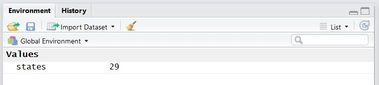
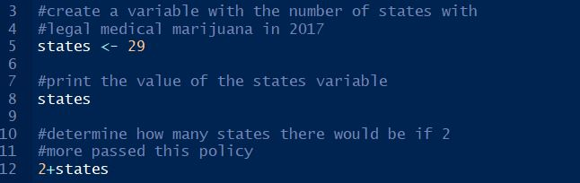
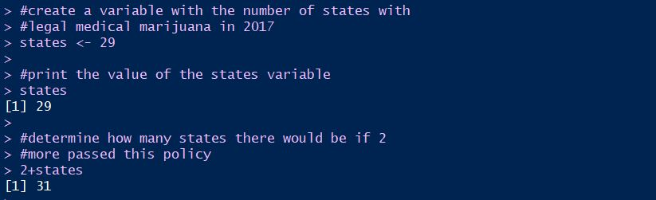
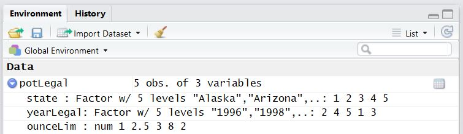
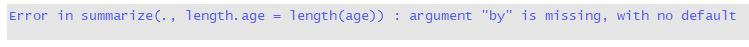

# The R team prepares data for analysis and visualization in R 

## Choosing and learning R

Leslie had been wanting to learn R for a year when she saw a flyer in the hallway near her advisor's office for a new local chapter of **R-Ladies** in her area and decided to try it (see Box \@ref(ch1rladies)). At the R-Ladies event she meets Nancy, an experienced data scientist who loves coding, and Kiara, a data management guru whose passion is increasing research reproducibility. During a break, Leslie starts a conversation with Nancy and Kiara about their experiences with R and what they like about R compared to other traditional statistics software options she has been learning in her degree program. Nancy thinks about it for a few minutes and then comes up with her top three reasons: **cost**, **contributors**, and **community**. 

First, she explains, the cost of R cannot be beat. R is **free** while licenses for other statistics software can cost hundreds of dollars for individuals and many thousands for businesses. While large successful businesses and universities can often afford these licenses, the cost can be an insurmountable burden for small businesses, non-profits, students, teachers, and researchers. Kiara adds that the cost of the tools we use in data science is a social justice issue [@sullivan2011free; @krishnaswamy2012free]. That is, students, researchers, and professionals in settings with limited resources, especially those in developing countries, have just as much access to R as an executive in a fancy high rise office building in the middle of downtown San Francisco. 

The second thing about R that Nancy loves are the contributors. She explains that R is not only free but it is also **open source** and anyone can contribute to it. Leslie looks confused. Nancy explains that anyone can write a **package** in the R language and contribute the package to a repository that is accessible online. Packages are small pieces of software that are often developed to do one specific thing or a set of related things. Kiara gives the example of a package she uses a lot called <span style="font-family:Lucida Console, monospace;font-weight:bold">tidyverse</span>. The <span style="font-family:Lucida Console, monospace;font-weight:bold">tidyverse</span> package includes commands that are useful for common data management tasks like recoding variables. By using code that someone else has written and made available, Kiara does not have to write long programs from scratch to do the typical things she does on a regular basis. Leslie asks how everyone could possibly have access to software written by anyone in the world? 

Kiara explains that people write packages like <span style="font-family:Lucida Console, monospace;font-weight:bold">tidyverse</span> and submit them to the **Comprehensive R Archive Network**, also known as CRAN. Volunteers and resources from the R Foundation are used to review and reject or accept new packages and add them to the CRAN [@CRANRepositoryPolicy-2019-01-08] so that everyone using R can access all the packages. Kiara pulls up the **contributed packages** website and shows Leslie that, as of today, there are more than 14,000 packages on the CRAN [@TheComprehensiveRArchiveNetwork-2018-09-10]. Leslie is still a little confused about the idea of a package. Kiara says to think of a package as a computer program that you open when you want to do a specific thing. For example, when you want to make a slide show, you might open the Microsoft PowerPoint program. Using packages in R to do a data management or analysis task is like using PowerPoint to make a slide show. But, unlike PowerPoint, anyone in the world can write a package and contribute it to the CRAN for anyone in the world to use.

Nancy says she has saved the best for last. The R **community** is her absolute favorite thing about R. She explains that the R community is inclusive and active online and R community groups like R-Ladies Global [@RLadiesGlobal] specifically support voices that are underrepresented in the R community and in data science. R users love to share their new projects and to help one another. Kiara agrees enthusiastically and explains that she looks at (and posts to) the #rstats hashtag often on Twitter and keeps learning great new features of R and R packages this way.

Kiara agrees with all of these reasons and wants to add two more benefits of using R. The first is that R makes the best graphics! She explains that R is extraordinary for its ability to create high quality visualizations of data. The code is extremely flexible, allowing users to customize graphics in nearly any way they can imagine. The second reason is that R is a great tool for conducting analyses that are **reproducible** by someone else. The R community is actively building and supporting new packages and other tools that support reproducible workflows (e.g., RStudio  [@RStudio]). Reproducibility is becoming a more important part of science as the scientific community faces the problem of more and more poor and unethical scientific practices being found in published research in recent years [@steen2013has] (see Box \ref(ch1kiara3)). 

Leslie thinks this all sounds great but that there must be a catch. She asks Nancy and Kiara to tell her what is challenging about working in R. Nancy and Kiara look at each other for a minute and smile. Kiara says there are a few things that are challenging about R and they are related to the reasons that R is great. The first challenge, she explains, is that the contributors to R can be anyone from anywhere. With such a broad range of people creating packages for R, the packages end up not all following the same format or rules. This means that learning R can be tricky sometimes when a command or package does not work the way other similar packages do, or in a way that seems logical. Nancy agrees and adds that, since R is open source, there is also no company behind the product that will provide tech support. Kiara agrees but reminds Leslie that there is a very active community of R users that solutions to problems can often be solved relatively quickly with a tweet, email, or question posted to a message board. 

Leslie is convinced and wants to learn more R. Kiara and Nancy have enjoyed the conversation so much that they offer to meet with Leslie regularly to teach her R and to learn from her and each other as well. Before the end of the evening, the three had devised a plan to teach Leslie all of their tricks in R. Nancy has been watching a lot of 1980s TV lately and suggests that they call themselves the R-Team after the A-Team whose theme song says that *they can solve the problems that no one else can*. 

## Learning R with publicly available data

Before the evening ends, Kiara recommends that they use publicly available data so that they are learning strategies and tools that will be useful in the real world instead of using clean fake data. Nancy thinks this is a great idea and is especially interested in data about current issues that are in the news. She suggests that the first data they work with is on marijuana policy since several states have legalized medicinal and recreational marijuana in the past few years and she recently came across marijuana legalization questions in a large national publicly available data set called the General Social Survey [@GSS]. 

Nancy suggests that this first day of R be about getting used to using R and preparing data for analysis. The R-team agrees that they will work on preparing data for analysis and using marijuana legalization data to practice the new skills. Kiara puts together a list of things that she thinks they could cover in their first meeting.

## Achievements to unlock

Kiara's outline for Leslie includes the foundational skills she will need to get started in R:

* The tricky weed problem: Exploring public support for marijuana legalization
* Achievement 1: Storing and retrieving information in R
* Achievement 2: Using reproducible research practices 
* Achievement 3: Understanding and changing data types
* Achievement 4: Entering or loading data into R
* Achievement 5: Identifying and treating missing values 
* Achievement 6: Building a basic bar graph
* Achievement 7: Subsetting a data set 
* Achievement 8: Recoding and other data wrangling
* Chapter summary

Follow the R-Team through the examples and exercises to write your first R code.

## The tricky weed problem

### Marijuana legalization

Before their first meeting, Nancy reads about the recent timeline for marijuana legalization. She learns that California became the first state to legalize medical marijuana in 1996 [@TimelineofcannabislawsintheUnitedStatesWikipedia-2019-04-14]. She also learned that marijuana use remains illegal under federal law, but 29 states and the District of Columbia had legalized marijuana at the state level for medical or recreational use or both by 2017. With new ballot measures at the state level being introduced and passed by voters on a regular basis, as of 2017 there appeared to be momentum for a nationwide shift toward legalization. In 2017, Jeff Sessions was appointed as Attorney General of the United States. Sessions did not support legalization and regularly expressed interest in prosecuting medical marijuana providers. Despite this difficult climate, in 2018, Michigan voters approved a ballot measure to legalize recreational cannabis, and voters in Oklahoma, Misouri, and Utah passed ballot measures legalizing medical marijuana. In 2018, Vermont was also the first state to legalize recreational marijuana via the state legislature [@VermontgovernorsignsmarijuanalegalizationbillTheHill-2019-04-18]. 

In 2019, Sessions was replaced as Attorney General by William Barr, who testified that he would not pursue marijuana companies that complied with state laws and was supportive of expanding marijuana manufacturing for scientific research  [@TrumpAttorneyGeneralPickPutsMarijuanaEnforcementPledgeInWriting-2019-04-18], but he did not indicate his support, or lack of support, for additional legalization. With the existing federal policy and the unstable legal environment, it is unclear what will happen next for marijuana policy. Nancy passes this information along to Leslie and Kiara.

Nancy explains that, with the exception of Vermont, legalization policy changes has primarily happened through successful ballot initiatives. She suggests that learning more about support among voters for legalization can help understand what is likely to  happen next. Leslie and Kiara agree. 

Kiara has looked up the General Social Survey, or GSS. She finds that it is a large survey of United States residents conducted each year since 1972, with all of the data available for public use. The GSS data explorer [@GSS] allows people who want to use the data to create a free account and browse the different data that has been collected in the surveys, which have changed over time. In several years, including 2018, the GSS survey included a question asking the survey participants whether they support marijuana legalization. Kiara uses the Data Explorer to select the marijuana legalization question and a question about age. Leslie wonders why Kiara is interested in age. Kiara explains that, since marijuana legalization is primarily up to voters so far, the success of ballot initiatives in the future will depend on the support of people of voting age. If younger people are more supportive, this suggests that over time the electorate will become more supportive as the less supportive older voters are no longer with us. Leslie finds that to be logical, although a little morbid.

Kiara is also interested in how the voting legalization and age questions were worded in the GSS and what the response options were.

> Do you think the use of marijuana should be legal or not?

Below the question, the different response options are listed: legal, not legal, don't know, no answer, not applicable. 

Kiara finds the age variable and notices that the actual question is not shown and is just listed as "RESPONDENT'S AGE." The variable is recorded as whole numbers ranging from 18 to 88. At the bottom of the web page about the age variable, the GSS Data Explorer shows that age was recorded as 89 for anyone 89 years old or older. 

Nancy is eager to get started and put her love of coding to work. She creates a graph about marijuana legalization to get them started:

```{r c1intro1, echo=FALSE, error=FALSE, message=FALSE, warning=FALSE, fig.cap="Support for marijuana legalization among participants in the 2016 General Social Survey."}
#bring in data from the web
library("data.table")
gss.2016 <- fread("data/WeedLegalByAgeGSS2016.csv")

#recode "89 OR OLDER" to a value in age
#recode DK and IAP to NA in grass
#turn into factor and numberic
gss.2016$age[gss.2016$age == "89 OR OLDER"] <- 89
gss.2016$grass[gss.2016$grass == "IAP"] <- NA
gss.2016$grass[gss.2016$grass == "DK"] <- NA
gss.2016$grass <- as.factor(gss.2016$grass)
gss.2016$age <- as.numeric(gss.2016$age)

#categorize age to 5 categories using tidyverse
library("tidyverse")
gss.2016 <- gss.2016 %>%
mutate(agecat = ifelse(age<30,"18-29",
                      ifelse(age>=30 & age<60, "30-59",
                             ifelse(age>=60 & age<75, "60-74",
                                           "75+"))))
gss.2016$agecat <- as.factor(gss.2016$agecat)

#make a bar graph of support for grass by age group
library(ggplot2)
library(scales)
library(ggthemes)
levels(gss.2016$grass) <- c("Yes", "No") 

ggplot(subset(gss.2016, !is.na(gss.2016$grass)), aes(x=grass, fill=grass)) +
  geom_bar(aes(y = 100*(..count..)/sum(..count..))) +
  labs(x="Should marijuana be legal?", y="Percentage of total responses")+
  theme_minimal() +
  scale_fill_manual(values=c("#78A678", '#7463AC'), guide=FALSE)
  

```

Leslie examines the graph. She sees that the x-axis across the bottom is labeled with the marijuana question and the two response categories. She notices that the y-axis is the percentage of people who responded. The green bar with the Yes label goes up to just past 60 on the y-axis, indicating that just over 60 percent of people support legalization. The purple bar stops just under 40, so just under 40 percent of people do not think marijuana should be legal. 

Although there looks like a lot of support for marijuana legalization from this first graph, Leslie thinks it may not be that simple, depending on **who** supports marijuana legalization. Are the supporters voters? Do they live in states that have not yet passed legalization policy or in the states that have already legalized it? In addition to answering these important questions, one thing that might provide a little more information about the future is to examine support by the age of the supporter. If supporters tend to be older voters, support for legalization may weaken as the population ages. If supporters are younger voters, support for legalization may strengthen as the population ages. Nancy is delighted at a second chance (already) to jump right in write some additional code so that the graph includes age groups as well: 

```{r c1intro2,echo=FALSE, fig.cap = "Support for marijuana legalization by age group among participants in the 2016 General Social Survey."}

legalize.bar <- gss.2016 %>% 
  drop_na(grass) %>%
  drop_na(age) %>% 
  mutate(grass = factor(grass, levels = c("Yes", "No"))) %>%
  ggplot(aes(x = agecat, group = grass,
             y = 100*(..count..)/sum(..count..), 
             fill = grass)) + 
  geom_bar(position = 'dodge') +
  theme_minimal() +
  scale_fill_manual(values = c("#78A678", '#7463AC'), name = "Should marijuana\nbe legal?") +
    labs(x = "Age group (in years)",
         y = "Percentage of total responses") 
legalize.bar


```

The R team see a pretty clear pattern in the graph. The x-axis now shows the age groups, while the y-axis shows the percent of people. The bar colors represent Yes (green) and No (purple). Leslie sees that the percent of people in the youngest age group who support legalization looks like it is three times the percent in that young age group who do not support legalization. In the oldest age group those who do not support legalization is a much larger group. Leslie notes that, as those in the younger categories age, it seems like overall support will continue to rise and marijuana legalization ballot initiatives will continue to be supported in elections. 

Kiara explains to Leslie that visual representations of data like the graphs shown above can be powerful tools for understanding and communicating with data. Although the two graphs presented may look simple, there is a lot going on behind the scenes. The remainder of this chapter will focus on *how* to **prepare data** for analyses and visualization in R. Preparing data for analysis is *data management*, so Kiara will be the primary guide (with help from Nancy since she loves to code) for this first day while Leslie learns.

Kiara lets Leslie know that she will use R and R Studio for examples and that she highly recommends Kiara follow along with R and R Studio on her own computer. To make sure that Leslie can follow along, Kiara has written instructions on how to install R and R Studio on a computer (see Box \@ref(ch1kiara1).

## Achievement 1: Observations and variables 

### Defining observations and variables

Before Kiara begins with data management tasks, she thinks a few vocabulary terms would be useful to discuss. Kiara explains that data scientists are usually interested in the characteristics and behaviors of humans and organizations. To understand these things, scientists often measure and record information about people people or organizations. For example, a data scientist working on political science might be interested in understanding whether income is related to voting. To get this information, she could ask a group of people whether they voted in the most recent election and what they earned in income in the most recent year. In this case, each person is an **observation** and there are two variables, **income** and **voting behavior**.

Leslie thinks she has it and summarizes her understanding for Kiara. She says that the people being measured are **observations** and the information about each person are **variables**. Kiara nods in agreement and emphasizes that the concepts of **observations** and **variables** are key concepts in data science, so it is worth taking a few more minutes to think about before moving on. Kiara thinks a visual representation of observations and variables might be useful. She explains that, in a typical data set, observations are the rows and variables are the columns. So, for the example of voting and income, a data set might look like this:

```{r c1main1, echo = FALSE}
# example data frame
income <- c("34000", "123000", "21500")
voted <- c("yes", "no", "no")
vote.example <- data.frame(income, voted)
vote.example

```

In this very small data set, there are three **observations** (the rows) and two **variables** (the columns). The first observation is a person with an income of 34000 and a **yes** for voted. The second observation is a person with an income of 123000 and a **no** for voted. The third observation is a person with an income of **21500** and a **no** for voted. The two **variables** are *income* and *voted*. 

### Entering and storing variables in R

Now that they have the basic idea for observations and variables, Kiara moves into talking about R. She explains that R is an objected oriented (OO) language where information is stored as **objects** and then data management and analyses are done on the stored objects. Before an object can be used in data management or analyses in R, it has to be stored in the R environment. 

Information is stored as objects in R by **assigning** the information a name, which can be a single letter or some combinations of letters and numbers that will serve as the name of the object. Assigning an object to a name is done by using an arrow like this: `<-`. The arrow separates the name of the object on the left from the object itself on the right, like this: `name <- object`. An object can be as simple as one letter or number. An object can also be as complex as several data sets combined together.

Since this is their first task in R, Kiara has Leslie try storing the value of 29, the number of states with legal medical marijuana as of 2017, as an object called "states" by typing the following at the R prompt (`>`) in the Console pane of the R Studio window. Leslie has read about the panes in an email from Kiara ealier (see Box \@ref(ch1kiara2)) and types the following at the `>` prompt:

```{r c1main2 }
states <- 29
```

When Leslie tried typing the code and pressing Enter, she noticed that running the `states <- 29` code did not seem to result in anything actually happening in the Console window. Kiara explains that this is because what is happening is storing the object, which does not have a result to display. Specifically, R is storing the number 29 as an object called "states" for Leslie to use in her work. While nothing happened in the Console, something did happen. Kiara explains that the "states" object is now stored under the Environment tab in the top right pane of the R Studio window. Looking at the tab Leslie notices that the window shows *states* and its value of *29* under a heading titled *values*.

```{r echo = FALSE, fig.cap="Environment window in R Studio showing the newly created states variable and its value."}

```


Leslie notices that there is a **History** tab next to the **Environment** tab in the upper right pane. She clicks on the History tab and is surprised to see `states <- 29`. Kiara explains that this tab holds all of the code run since the History pane was last cleared. Nancy says this is one of her favorite parts of R; you can double-click on any of the code shown in the History window and R will send the code to the Console, ready to run again. There is no need to type anything twice! Kiara thinks Leslie would benefit from more information about the various panes in R Studio and writes out some information during a break. She tells Leslie to check out Box \@ref(ch1kiara2) to learn more about the four panes and how each pane is useful. 

Leslie will check that out later, for now she is excited to try double clicking on the `states <- 29` code in the History pane. As soon as she does the code was sent to the Console, ready to run again. Leslie is delighted! This seems like a great feature. To see the value of the states object created in the Console pane, Kiara has Leslie type the name of the object at the R prompt and press enter:

```{r c1main3}
states
```

Now the value of states appears!

To demonstrate using the states object in a mathematical expression, Kiara tells Leslie to try typing the expression `2 + states` at the R prompt and pressing Enter:

```{r c1main4}
2 + states
```

Leslie notes that 31 is printed in the Console. This is the value of `2 + 29`. Before they go on, Kiara wants to explain a few vocabulary terms to Leslie. When Leslie enters code and running the code results in something being displayed on the screen, the thing that is displayed is the **output**. For example, the 31 printed after running the code above is **output**. 

### Unlock achievement 1: Check your understanding

Assign your age in years to an object with your name. Add 5 to the object and press Enter to see how old you will be in 5 years.

## Achievement 2: Using reproducible research practices

Before getting too far into coding, Kiara wants Leslie to be thinking about how to choose things like object names so that they are useful not only **right now** but in the future for anyone (including the original author) who is using the R code. Kiara has learned this lesson well in her many years of coding. 

### Using comments to organize and explain code

For example, the meaning of the code above, `states <- 29`, `states`, and `2 + states`, may seem obvious right now while they are new, but in a few weeks it might be less clear why states has a value of 29 and what this object means. One way to keep track of the purpose of code is to write short explanations in the code while coding. For this to work, the code needs to be written in the **Source** pane, which is opened by creating a new **Script** file. To create a new Script file, Kiara tells Leslie to go to the File menu in the upper left corner of R Studio and choose **New File** from the choices. Then, from the New File menu, choose **R Script**. Nancy suggests using the shortcut command of **Control-Shift-n**. Leslie tries the shortcut and a new blank file opens that says **Untitled1** at the top. This is a **Script** file in the Source pane that can be used for writing code.

Kiara wants to pause here for a minute and give Leslie a little more information about the difference between writing R code in the **Console** and writing R code in a **Script** file. She explains that the difference is mostly about being able to edit and save code; code written in the Console at the `>` prompt is executed immediately and not able to be edited or saved. Leslie suggests that the History pane saves the code, which Kiara confirms is true, but the History pane cannot be saved as a code file and shared, nor can code in the History pane be edited. 

A **Script** file, however, is a text file similar to something written in the **Notepad** text editor on a Windows computer or the **Cocoa** text editor on a Mac computer. A Script file can be edited, saved, and shared just like any text file. When Script files are saved they have the **.R** file extension. 

Kiara opens a new Script window and shows Leslie how to include information about the code in by typing comments that explain what the code is for, like this:

```{r c1main5, eval=FALSE}
# create an object with the number of states with 
# legal medical marijuana in 2017
states <- 29

# print the value of the states object
states

# determine how many states there would be if 2
# more passed this policy
2 + states
```

Each line of code is preceded by a short statement of its purpose. These statements are called **comments** and the practice of adding comments to your code is called **commenting** or **annotation**. The practice of commenting or annotating is one of the most important habits to develop in R. 

In R, comments are denoted by a hashtag `#`, which notifies R that the text following the `#` on the same line is a comment and not something to be computed or stored. Comments are not necessary for code to run, but are important for describing and remembering what the code does. Annotation is a **best practice** of coding. When writing and annotating code, keep *two* goals in mind: 

* Write clear code that does not need a lot of comments, and
* Include useful comments where needed so that anyone (including future you) can use your code

Kiara explains that clear R code with useful annotation will help Leslie's work be *reproducible*, which is one of the most important characteristics of good data science. Kiara has collected some information about *reproducible research* for Leslie (see Box \@ref(ch1kiara3)).

Before moving on Leslie tries writing the code and comments above in the Script file she has open in the Source pane (see Box \@ref(ch1kiara2)). She finishes writing the code but then is not sure how to run the code to check her work. Kiara explains that the code can be run in several ways. One way is to highlight all the code at once and click on *Run* at the top right corner of the Source pane. To run one line of code at a time, highlighting the line of code or putting the cursor anywhere in the line of code and clicking *Run* also works. The keyboard shortcut for *Run* is Control-Enter, so putting the cursor on a line of code and pressing Control-Enter will run the code on that line. Leslie highlights all of her code and clicks on Run in the upper right corner of the pane.

```{r echo = FALSE, fig.cap="Source pane in R Studio showing R commands and comments."}

```

Leslie finishes writing the code and comments, highlights all of the code, and clicks on **Run** at the top of the Source pane. In the Console window you she sees the code and the output from the code like this:

```{r echo = FALSE, fig.cap="Console pane in R Studio showing R commands, comments, and results."}

```

### Including a prolog to introduce a code file

Before moving on to more statistics and R code, Kiara wants Leslie to add one more thing to her code, a **prolog**. She explains that a prolog is a set of comments at the top of a code file that provides information about what is in the file. Including a prolog is another *best practice* for coding. There are many features a prolog can have, including:

* Project name 
* Project purpose 
* Name(s) of data set(s) used in project 
* Location(s) of data set(s) used in project
* Code author name (you!)
* Date code created 
* Date last time code was edited

Kiara gives Leslie two examples, one formal and one informal. The formal prolog might be set apart from the code that follows by a barrier of hashtags, like this:

```{r c1main6, eval=FALSE}

# PROLOG   ################################################################

# PROJECT: NAME OF PROJECT HERE #
# PURPOSE: MAJOR POINT(S) OF WHAT I AM DOING WITH THE DATA HERE #
# DIR:     list directory(-ies) for files here #
# DATA:    list dataset file names/availability here, e.g., #
#          filename.correctextention #
#          somewebaddress.com #
# AUTHOR:  AUTHOR NAME(S) #
# CREATED: MONTH dd, YEAR #
# LATEST:  MONTH dd, YEAR #
# NOTES:   indent all additional lines under each heading, #
#          & use the apostrophe hashmark bookends that appear  #
#          KEEP PURPOSE, AUTHOR, CREATED & LATEST ENTRIES IN UPPER CASE, # 
#          with appropriate case for DIR & DATA, lower case for notes #
#          If multiple lines become too much, #
#          simplify and write code book and readme. #
#          HINT #1: Decide what a long prolog is. #
#          HINT #2: copy & paste this into new script & replace text. #

# PROLOG   ###############################################################

```

An informal prolog might just include:

```{r eval=FALSE}

####################################
# Project name
# Project purpose
# Code author name
# Date last edited
# Location of data used
####################################

```

Kiara has Leslie write a prolog at the top of her code file in the Source pane. Leslie's code in the Source pane now looks like this:

```{r c1main7, eval = FALSE}

###########################################
# Project: Chapter one
# Purpose: Code examples for Chapter one 
# Author: Leslie 
# Edit date: April 19, 2019
# No external data files used
###########################################

# create a variable with the number of states with 
# legal medical marijuana in 2017
states <- 29

# print the value of the states variable
states

# determine how many states there would be if 2
# more passed this policy
2 + states

```

Before continuing, Kiara suggest Leslie saves her R code file using the save icon at the top left side of the Source pane or through the File menu.

Leslie saves it as analysis.R on her desktop and looks up just in time to see Kiara cringe. When saving a file, Kiara explains, include information in the file name that is a reminder of what is contained in the file. For example, a file name with date_project_author will make identifying the most recent file created for a project easier. In this case, Leslie might save the file as: **113017_chap1_leslie.R**.

Leslie resaves her file and they move on. 

### Naming objects 

In addition to annotating code, using a prolog, and including useful information in a file name, Kiara suggests to Leslie that she name objects so they are easy to understand. It is much easier to guess what might be in an object called **states** than what might be in an object called **var123**. 

#### Naming constants

Kiara explains that there are recommended methods for naming objects in R that depend on the type of object [@GooglesRStyleGuide-2019-04-17]. There are several types of objects in R. The **states** object is a *constant* because it is a single numeric value. The recommended format for constants is starting with a "k" and then using camel case. Camel case is capitalizing the first letter of each word in the object name. Leslie thinks she gets it and wants to correct the naming of the states object. Kiara says she can either make an entirely new object from scratch, like this: 

```{r c1main8}
# make a new object with well-formatted name
kStates <- 29
```

Or, she can assign the existing states object to a new name, like this:

```{r c1main9}
# assign states object a new name
kStates <- states
```

Leslie notices that this uses the same format with the `<-` as assigning the value of 29 to the states, Kiara explains that this arrow assigns whatever is on the right side of the arrow to the object name on the left. In this case, the states object is assigned to the kStates object name. Leslie notices that states and kStates are now both listed in the environment. This seems unnecessary since they both hold the same information. Kiara shows her how to remove an object using the `rm()` command:

```{r c1main10}
# remove the states object
rm(states)
```

This looks different from what they have been doing so far since it includes a command, `rm()`, and the name of an object **states**. Kiara says that this format is common in R, having some instruction or command for R and a set of parentheses like `command()`. Then, inside the parentheses, there is typically the name of one or more objects to apply the command to, so `command(object)` is a common thing to see when using R. The information inside the parentheses is called an **argument**, so the **states** variable is the argument entered into the `rm()` command. Sometimes R commands will need one argument to work, sometimes commands will require multiple arguments. Arguments do not all have to be objects, some are just additional instructions for R about how the command should work. Leslie is a little confused by this, but Kiara says it will become more clear as they learn more commands.

#### Naming variables

Another type of object is a variable. Variables are measures of some characteristic for each observation in a data set. For example, income and voted are both variables. Variable objects are named using **dot case** or **camel case**. Dot case puts a dot between words in a variable while camel case capitalizes each word in the variable name. For example, if Leslie measured the number of medical marijuana perscriptions filled by each cancer patient in a data set during a year, she could use dot case and call the variable filled.script.month or use camel case and call it filledScriptMonth. Kiara mentions that dot case is the preferred method of naming objects but camel case is frequently used and there are other naming conventions used by some R users (see Box \@ref(ch1kiara4)).

#### Naming functions

Functions are objects that perform a series of R commands to do something in particular. They are usually written when someone has to do the same thing multiple times and wants to make the process more efficient. Kiara explains that functions are a more advanced skill that they will cover later. For now she just wants to give the naming format for a function, which is camel case with the first letter capitalized. So, for example, a function that multiplies everything in your data set by 2 might be called **MultiplyByTwo** or something similar.  

Kiara explains to Leslie that when she is first starting to code it is a good time to develop a coding style and begin using a consistent way of annotating code and the recommended way of naming things. Kiara prefers dot case for variable names and using underscores for filenames and Leslie agrees, so the code examples throughout this text will use these styles along with the recommended styles for constants and functions.

### Unlock achievement 2: Check your understanding

Open a new script file (or modify the existing file if you have been following along) and create a prolog. Make a constant named kIllegalNum and assign it the value of *21*. Subtract 2 from the variable and check the value.

## Achievement 3: Understanding and changing data types

Kiara explains to Leslie that objects like the month variable are interpreted by R as one of several **data types**. To see what data type months is, Kiara demonstrates the `class()` command, like this:

```{r c1main11}
# identify data type for states object
class(x = kStates)
```

### Numeric data type

In the case of the kStates constant, R prints the data type **numeric** from the `class()` command. The numeric data type is the default that R assigns to constants and variables that contain only numbers. The numeric data type can hold whole numbers and numbers with decimal places, so it is the most appropriate data type for variables measured along a continuum, or **continuous** variables. For example, height and temperature can be both measured on a continuous scale and would be numeric data type in R.

Follow along with Leslie as she uses her preferred naming style to create a constant that contains the ounces of medical marijuana legally available to purchase per person in Rhode Island, then identify the data type. Annotate this new code.

```{r c1main12}
# assign Rhode Island limit for medical marijuana
# in ounces per person
kOuncesRhode <- 2.5

# identify the data type for ouncesRhode
class(x = kOuncesRhode)
```

### Integer data type 

The **integer** data type is similar to numeric but only contains whole numbers. There are true integers that can only be measured in whole numbers, like the number of cars parked in a lot. There are also things measured as integers like age in years. When a whole number is assigned to a variable name in R the default type is numeric. To change the variable type to integer, use the R command `as.integer()`. The `as.integer()` command can also be used to truncate numbers with decimal places. Note that truncation is not the same as rounding! Truncation cuts off everything after the decimal place. For example, truncating the value 8.95 would leave 8. Rounding goes to the nearest whole number, so 8.95 would round to 9.

Kiara explains to Leslie that the default integer type is not always the best type for the data and has her explore the integer data type:

```{r c1main13}
# assign the value of 4 to a constant called kTestInteger
# make it an integer
kTestInteger <- as.integer(x = 4)
```

```{r c1main14}
# use class() to determine the data type of kTestInteger
class(x = kTestInteger)
```

```{r c1main15}
# use as.integer() to truncate the variable ouncesRhode
as.integer(x = kOuncesRhode)
```

```{r c1main16}
# multiply the testInteger and ouncesRhode variables
kTestInteger * kOuncesRhode
```

```{r c1main17}
# multiply kTestInteger and integer ouncesRhode variable
kTestInteger * as.integer(x = kOuncesRhode)
```

```{r}
# type the variable name to see what is currently saved
# in the variable
kOuncesRhode
```

### Logical data type

The **logical** data type includes the values of TRUE and FALSE. The values of TRUE and FALSE can be assigned to a logical constant, like this:

```{r c1main18}
# create the variable
kTestLogical <- TRUE

# print the value of the constant
kTestLogical

# check the constant type
class(x = kTestLogical)

```

**Logical** constants can also be created as the result of some expression, such as:

```{r c1main19}
# store the result of 6 > 8 in a constant called kSixEight
kSixEight <- 6 > 8

# print kSixEight
kSixEight

# determine the data type of kSixEight
class(x = kSixEight)
```

Because six is not greater than eight, the expression 6 > 8 is FALSE, which is assigned to the kSixEight constant.

### Character data type

The **character** data type includes letters, words, or numbers that cannot logically be included in calculations (e.g., a zip code). Kiara has Leslie try creating a few character constants:

```{r c1main20}
# make constants 
kFirstName <- "Nancy"
kLastName <- "Newman"

# check the data type
class(x = kFirstName)

# create a zipcode constant
# check the data type
kZipCode <- "97405"
class(x = kZipCode)
```

### Factor data type

In addition to the data types above, the **factor** data type is used for constants and variables that are made up of data elements that fall into categories. Variables measured in categories are **categorical**. 

Examples of categorical variables can include variables like religion, marital status, age group, etc. There are two types of categorical variables: ordinal and nominal. Ordinal variables contain categories that have some logical order. For example, categories of age can logically be put in order from younger to older: 18-25, 26-39, 40-59, 60+. Nominal variables have categories that have no logical order. Religious affiliation and marital status are examples of nominal variable types because there is no logical order to these characteristics (e.g., Methodist is not inherently greater or less than Catholic). 

NOTE: Some letters and words are already used by R and will cause some confusion if used as object names. For example, the uppercase `T` and `F` are used in the code as shorthand for `TRUE` or `FALSE` so are not useful as object names. When possible, use words and abbreviations that are not common mathematical terms.

### Unlocking achievement 3: Check your understanding

Check the data type for the kIllegalNum constant you created to unlock achievement 1. 

## Acheivement 4: Entering or loading data into R

Usually when social scientists collect information to answer a question, they collect more than one number or word. As a result, there are groups of data elements to be stored together. There are many ways to enter and store information like this. One commonly used object type is a **vector**. A **vector** is a set of data elements that are the same type (numeric, logical, etc). Each entry in a vector is called a **member** or **component** of the vector. Vectors are commonly used to store variables.

### Creating vectors for different data types 

The format for a vector uses the `c()` for concatenate. The parentheses are filled with the elements of the vector separated by commas. If the members of the vector are meant to be saved as character type variables, use single or double quotes around each member. Kiara demonstrates character, numeric, and logical vectors:

```{r c1main21}
char.vector <- c('Oregon','Vermont','Maine')    # creates character vector charVector
char.vector                                     # prints vector

nums.1.to.4 <- c(1,2,3,4)                       # creates numeric vector nums1to4
nums.1.to.4                                     # prints vector nums1to4

logic.vector <- c(T, F, F, T)                   # creates logical vector logicVector
logic.vector                                    # prints vector logicVector

```

Nancy chimes in with her favorite thing, a coding trick. This one is for creating new objects and printing them in one command by adding parentheses around the code that creates the object:

```{r c1main22}
# create and print vectors
( char.vector <- c('Oregon', 'Vermont', 'Maine') )
( nums.1.to.4 <- c(1, 2, 3, 4) )                      
( logic.vector <- c(T, F, F, T) )              
```

The next thing Kiara covers is how vectors can be combined, added to, subtracted from, subsetted, and other operations. She gives examples of each of these with comments that explain what is happening with each line of code.

```{r c1main23}
# add 3 to each element in the x vector
nums.1.to.4 + 3  

# add 1 to the 1st element of x, 2 to the 2nd element, etc
nums.1.to.4 + c(1, 2, 3, 4)     

# multiply each element of x by 5
nums.1.to.4 * 5     

# subtract 1 from each element and then divide by 5
(nums.1.to.4 - 1) / 5           

# make a subset of the vector including numbers > 2
nums.1.to.4[nums.1.to.4 > 2]                 
```

So far the results of these operations are just printed in the Console. Leslie asks how to keep the results. Kiara explains that the results can be assigned to a new vector using the assignment arrow. For example:

```{r c1main24}
# add three to number vector and save
# as new vector
( nums.1.to.4.plus.3 <- nums.1.to.4 + 3 )

# divide number vector by 10 and save
# as new vector
( nums.1.to.4.div.10 <- nums.1.to.4 / 10 )

```

The results show the original vector with 3 added to each value and the result of that addition divided by 10. Kiara explains that it is possible to do multiple computations on a single vector:

```{r c1main25}
# add 3 and divide by 10 for each vector member 
( nums.1.to.4.new <- (nums.1.to.4 + 3) / 10 )                  
```

### Creating a matrix to store data in rows and columns

In addition to the **vector** format, Kiara explains that R also uses the **matrix** format to store information. A matrix is information, or data elements, stored in a rectangular format with rows and columns. Coders can perform operations on matrices like with vectors.

The R command for producing a matrix is, surprisingly, **matrix**. The matrix command takes arguments to enter the data, `data = `,  and to specify the number of rows, `nrow = `, and columns, `ncol = `, like this:

```{r c1main26}
# create and print a matrix
( policies <- matrix(data = c(1, 2, 3, 4, 5, 6),          # data in the matrix 
                     nrow = 2,                            # number of rows 
                     ncol = 3,                            # number of columns 
                     byrow = TRUE) )                      # fill the matrix by rows 

```

Say a matrix includes the number of states with policies legalizing medical, recreational, and both types of marijuana that were in effect in 2013 and 2014. Leslie asks about naming the rows and columns so she can remember what they are. Kiara starts to explain when Nancy jumps in to write the code, which uses `dimnames()` to assign names to rows and columns, like this:

```{r c1main27}
# add names to the rows and columns of the matrix
dimnames(policies) <- list(
  c("2013", "2014"),                                # row names
  c("medical", "recreational", "both")              # column names
)

# print the policies matrix
policies                                           
```

Now Leslie can find specific data elements in her matrix, such as the number of states with legal medical marijuana policies in 2014.

Instead of the number of policies per year, perhaps Leslie has a vector of policy types for each year:

```{r c1main28}
# vector of policy types
policy.2013.and.2014 <- c('medical', 'medical', 'both', 'recreational',
                       'medical', 'both', 'both')

# data type
class(x = policy.2013.and.2014)

```

Leslie notices that R assigned the character type. Kiara explains that she can use the `as.factor()` command to change the variable type to factor instead:

```{r c1main29}
# change the data type to factor
policy.2013.and.2014 <- as.factor(x = policy.2013.and.2014)
class(x = policy.2013.and.2014)

```

### Creating a data frame

Similar to a matrix format, the data frame format has rows and columns of data. In the data frame format, rows are **observations** and columns are **variables**. Data frames are often entered outside of R into a spreadsheet or other type of file and then imported into R for analysis. However, R users can also enter a data frame into R using vectors or matrices. For example, if Kiara looked up five states, the year they made medical marijuana legal, and the limit per person in ounces for possession of medical marijuana, she could enter this data into three vectors and combine them into a data frame using the `data.frame()` command, like this:

```{r c1main30}
# state, year enacted, personal oz limit medical marijuana
# create vectors
state <- c('Alaska', 'Arizona', 'Arkansas', 'California', 'Colorado')
year.legal <- c('1998', '2010', '2016', '1996', '2000')
ounce.lim <- c(1, 2.5, 3, 8, 2)

# combine vectors into a data frame
# name the data frame potLegal
pot.legal <- data.frame(state, year.legal, ounce.lim)

```

Here is the first instance of including more than one argument for a command in R. The `data.frame()` command has three arguments: state, year.legal, and ounce.lim. This time all of the arguments are objects, but that will not always be the case. In fact, some arguments will be commands with their own arguments! 

After entering and running these code lines, Kiara suggests that Leslie check the **Environment** pane, where she should now see a new entry called **pot.legal**. To the right of the label "pot.legal" Leslie sees "5 obs. of 3 variables" indicating she entered five **observations** and three **variables.** The blue and white circle with a triangle in it to the left of "pot.legal" allows Leslie to expand this entry to see more information about what is contained in the pot.legal object, like this:

```{r echo = FALSE, fig.cap="Environment window in R Studio showing the newly created data frame."}

```

She notices that the state variable was assigned the variable type of **factor**, which is incorrect. Names of states are unique and not categories. Leslie changes the name variable to a character variable using the `as.character()` command.

Because the state variable is now part of a data.frame object, Kiara explains to Leslie that she will have to identify both the data frame and the variable in order to change it. To do this, enter the name of the data frame first, a `$` to separate, and the variable name, like this:

```{r c1main31}
# change state variable frome pot.legal data.frame
# to a character variable
pot.legal$state <- as.character(x = pot.legal$state)

# check the variable type
class(x = pot.legal$state)

```

Now that Leslie has a data frame, there are many options open for data management and analyses. For example, she can examine basic information about the variables in her data by using the `summary()` command. The summary command requires at least one argument that identifies the object that should be summarized, like this:

```{r c1main32}
# summarize the data frame
summary(object = pot.legal)
```

This output looks a little confusing to Leslie, so Kiara explains what she is seeing. The top row includes the names of the three variables in the **data frame**. Below each variable is some information about that data frame. What is shown there depends on the data type of the variable. The state variable is a character variable, so the information below "state" shows how many observations there are for this variable in the "Length:5" row. The next row shows the class of the state variable with "Class :character" and the **Mode** or most common value of the variable, which does not make sense for this variable because it is a character variable. Leslie is curious about this use of **mode** since she had learned it before as a measure of **central tendency**; Kiara explains that **mode** is one of the descriptive statistics they will talk about next time they meet.

The next column of information is for *year.legal*, which is a factor variable. This entry shows each of the categories of the factor and how many observations are in that category. For example, 1996 is one of the categories of the factor and there is one observation that is 1996. Likewise, 2016 is one of the categories of the factor and there is one observation in this category. Kiara mentions that this output format shows up to six rows of information for each variable in a data frame and many variables will have more than six categories. When this is the case, the six categories with the most observations in them will be shown in the output.  

Finally, the ounce.lim column of information shows "Min. :1.0" which indicates that the minimum value of this variable is 1. This column also shows "Max. :8.0" for the maximum value of 8 and a few other **descriptive statistics** that the team will cover more in Chapter 2. 

### Importing data frames from outside sources

Kiara mentions that, while typing data directly into R is possible and sometimes necessary, most of the time analysts like Leslie will open data from an outside source. R is unique among statistical software packages in that it has the capability of importing and opening data files saved in most formats. Some formats open directly in the base version of R. Other data formats require the use of an R package, which Kiara reminds Leslie is a special program written to do something specific in R. 

To know what format a data file is saved in, examine the file extension. Common file extensions for data files include:

* **.csv**: comma separated values 
* **.txt**: text file 
* **.xls** or **.xlsx**: Excel file 
* **.sav**: SPSS file 
* **.sasb7dat**: SAS file 
* **.xpt**: SAS transfer file 
* **.dta**: Stata file 

### Importing a comma separated values (csv) file 

Kiara adds that, in addition to knowing which kind of file it is, Leslie will need to know the location of the file. R can open files saved locally on a computer, in an accessible shared location, or directly from the internet. The file analyzed at the beginning of this chapter was saved in the csv format online. There are several possible ways to read in this type of file; the most straightforward way is with the `read.csv()` command, however, Kiara warns that this command may result in misreading of variable names when the data set is saved online, try it to see:

```{r c1main33, eval=FALSE}
# read the GSS 2016 data from the web
gss.2016 <- read.csv(file = "data/WeedLegalByAgeGSS2016.csv")

# examine the contents of the file
summary(object = gss.2016)
```

The `summary()` command output shows two column headings, **ï..grass** and **age**. These two column headings are the two variables in the data set. Under each of these heading are two more columns separated by colons. The column before the colon lists the values that are present in the variable. The column after the colon lists the number of times the value is present in the variable. So, the information under the **ï..grass** column heading shows that **DK** is one of the values of the **ï..grass** variable and this value occurs 110 times. 

Kiara advises Leslie that the `fread()` command in the <span style="font-family:Lucida Console, monospace;font-weight:bold">data.table</span> package or the `read_csv()` command in the <span style="font-family:Lucida Console, monospace;font-weight:bold">tidyverse</span> package may be more useful for opening csv files from online sources. To install one of these packages, go to the Tools menu in R Studio and select **Install Packages...**. Type "data.table" in the dialog box that opens. For other ways to install packages, see Box \ref(ch1nancy).

Once a package is installed, Kiara explains that there are two ways Leslie can use it. If she is going to use more than one or two functions from the package, she can open it with the `library()` command. In this case `library(data.table)` opens the <span style="font-family:Lucida Console, monospace;font-weight:bold">data.table</span> package for use. Once the package is opened, Leslie can use the commands defined in the package. Also useful, explains Kiara, is the documentation for each package that shows all the commands available [@data-table-doc; @CRANPackagesByName-2019-04-20]. This is the common practice for opening and using packages most of the time in R.

However, when using a function from the package one time, it is not necessary to open the package and leave it open. Instead, there is another way to open a package temporarily just to use a function. To temporarily open a package in order to use a command from the package, add the package name before the command name and separate with two colons, like this: `package.name::command()`. 

Leslie uses the temporary way with the `::` to open the <span style="font-family:Lucida Console, monospace;font-weight:bold">data.table</span>package and uses the **Fast and friendly file finagler** `fread()` command from the package to open the GSS data file. She then uses the summary command to see what is in the file:

```{r c1main34}
# bring in GSS 2016 data
gss.2016 <- data.table::fread(input = "data/WeedLegalByAgeGSS2016.csv")

# examine the contents of the file
summary(object = gss.2016)
```

It looks like both the grass and the age variable were imported as character variables. Leslie thinks grass should be a factor and age should be numeric. Kiara agrees and Leslie writes the code:

```{r c1main35}
# change grass and age data types
gss.2016$grass <- as.factor(x = gss.2016$grass)
gss.2016$age <- as.numeric(x = gss.2016$age)

# check summary
summary(object = gss.2016)
```


Before they move on, Kiara wants to mention another important feature  of the `::` way of opening a package for use. Occasionally there are command names that are the same in two different packages. If both packages are opened at the same time in an R file, there will be a **namespace** conflict where R cannot decide which command to use. One example is the command `summarize()` is included as part of the <span style="font-family:Lucida Console, monospace;font-weight:bold">dplyr</span> package and the <span style="font-family:Lucida Console, monospace;font-weight:bold">Hmisc</span> package. When both packages are open, using the `summarize()` command results in an error. Kiara explains that the <span style="font-family:Lucida Console, monospace;font-weight:bold">dplyr</span> package is loaded with the <span style="font-family:Lucida Console, monospace;font-weight:bold">tidyverse</span> and loads the <span style="font-family:Lucida Console, monospace;font-weight:bold">Hmisc</span>:

```{r c1main36}
# load Hmisc
library(package = "Hmisc")
```

<span style="font-family:Lucida Console, monospace;font-weight:bold">Hmisc</span> loads without a problem. Kiara types the `summarize()` command to try to get the length of the age variable from the gss.2016 data frame. Kiara notes that this code is a little more complicated than what they have looked at so far and they will go through the formatting soon, but for now, this is just to demonstrate the how the use of the `summarize()` command results in a conflict when both <span style="font-family:Lucida Console, monospace;font-weight:bold">dplyr</span> and <span style="font-family:Lucida Console, monospace;font-weight:bold">Hmisc</span> are open: 

```{r c1main37, eval=FALSE}
# use the summarize command
gss.2016 %>% 
  summarize(length.age = length(x = age))
```

The result of running her code is an error message:

```{r echo = FALSE, fig.cap="Namespace error with summarize command."}

```

Kiara mentions that this is relatively rare, but it is a good thing to keep in mind when a command does not run. Leslie asks what can be done at this point. Kiara says there are a couple of ways to check to see if a **namespace** conflict is occuring. The first is to use the `conflicts()` command:

```{r c1main38}
# check for conflicts 
conflicts()
```

Among the conflicts, Leslie sees the `summarize()` command. Kiara says the easiest to do to address the conflict is to use the `::` and specify which package to get the `summarize()` command from. To use the `summarize()` from <span style="font-family:Lucida Console, monospace;font-weight:bold">dplyr</span>, the code would then look like this:  

```{r c1main39}
# use summarize from dplyr
gss.2016 %>% 
  dplyr::summarize(length.age = length(x = age))

```

The command now works to find the length of the age variable. Another way to check and see if a command is in conflict after an error message is to use the `environment()` command and check which package is the source for `summarize()`. Kiara writes the code to do this: 

```{r c1main40}
# check source package for summarize
environment(fun = summarize)
```

The output shows that the namespace for `summarize()` is the <span style="font-family:Lucida Console, monospace;font-weight:bold">Hmisc</span> package instead of the <span style="font-family:Lucida Console, monospace;font-weight:bold">dplyr</span> package. Use of the `::` works to fix this but another strategy would be to **detach** the <span style="font-family:Lucida Console, monospace;font-weight:bold">Hmisc</span> package before running `summarize()`, like this:

```{r c1main41}
# detach Hmisc
detach(name = package:Hmisc)

# try summarize 
gss.2016 %>% 
  summarize(length.age = length(x = age))
```

This works too! If the conflicting package is not needed again, this method of addressing the namespace conflict will avoid additional conflicts in the document.

### Cleaning data types in an imported file 

After that long detour, Kiara goes back to the task at hand. She notes for Leslie that, while the variable names look good after loading with `fread()`, the variables both seem to be **character** data type. Most data sets have a codebook that lists all the variables and how they were measured. This information can help to identify what data type is appropriate for a variable and other information about the data. Check the codebook for the General Social Survey (GSS) [@gss2016codebook] to determine what data types these variables are. For example, on page 304 of the codebook it shows the measurement of the variable grass, which has five possible responses:

*Do you think the use of marijuana should be made legal or not?*

* Should 
* should not 
* Don't know 
* No answer 
* Not applicable 

Variables with categories are categorical and should be **factor** type variables in R. 

The codebook is unclear regarding the age variable measurement. Kiara suggests Leslie use the `head()` command to get more information. The `head()` command shows the first six entries in a data frame. 

```{r c1main42}
# first six observations in the gss.2016 data set
head(x = gss.2016)

```

Leslie finds that the age variable appears to be measured in years.

So, the grass variable should be changed to a **factor** while the age variable should be either **numeric** or **integer**. When in doubt choosing between numeric and integer, numeric is more flexible.

Because Leslie is not changing the contents of the variables, she keeps the same variable names. To do this, she uses the arrow to assign the variable with the new assigned type back to the same variable name. Notice the data frame name and variable name on the left of the assignment arrow `<-` are exactly the same as on the right. when new information is assigned to an existing variable, it over-writes whatever was saved in that variable.

```{r c1main43}
# change the variable type for the grass variable
gss.2016$grass <- as.factor(x = gss.2016$grass)

# change the variable type for the age variable
gss.2016$age <- as.numeric(x = gss.2016$age)

# examine the variable types and summary to 
# check the work
class(x = gss.2016$grass)
class(x = gss.2016$age)
summary(object = gss.2016)

```

Leslie uses class and summary to check and confirm that the variables are now the correct type.

### Unlock achievement 4: Check your understanding

Use `fread()` to open the GSS 2016 data set. Look in the environment pane to find the number of observations and the number and types of variables in the data frame.

## Achievement 5: Identifying and treating missing values

In addition to making sure the variables used are an appropriate type, Kiara explains that it is also important to make sure that missing values are treated appropriately by R. In R, missing values are recorded as **NA** which stands for *no answer*. Researchers code missing values coded in many different ways when collecting and storing data. Some of the more common ways to denote missing values are:

* blank
* 777, -777, 888, -888, 999, -999 or something similar
* a single period
* -1
* NULL
* {width=15px}.

Other responses like "Don't know" or "Inapplicable" may sometimes be treated as missing or treated as response categories depending on what is most appropriate given the characteristics of the data and the analysis goals.

### Recoding missing values to NA

In the summary of the GSS data the grass variable has five possible values: DK (don't know), IAP (inapplicable), LEGAL, NOT LEGAL, and NA (no answer). According to NORC, the DK, IAP, and NA are all missing values. However, R only treats **NA** as missing. So, before conducting any analyses, the DK and IAP values should be converted to NA to be treated as missing in any analyses. That is, the grass variable should be **recoded** so that its missing values are all **NA**.

There are many ways to recode variables in R. Kiara's favorite data management package is the <span style="font-family:Lucida Console, monospace;font-weight:bold">tidyverse</span> package. She shows Leslie how to install the package by going to the **Tools** menu and choosing **Install packages...** and typing <span style="font-family:Lucida Console, monospace;font-weight:bold">tidyverse</span> in the box that pops up. Leslie installs <span style="font-family:Lucida Console, monospace;font-weight:bold">tidyverse</span>. Kiara closes her laptop to show Leslie a one of her laptop stickers. It shows the <span style="font-family:Lucida Console, monospace;font-weight:bold">tidyverse</span> logo in a hexagon. Kiara explains that the R community likes to advertise the packages they use and like with hexagonal laptop stickers. It is not unusual, she says, to see a laptop covered in stickers like this one:

```{r echo = FALSE, fig.cap="Tidyverse hex laptop sticker."}
knitr::include_graphics("graphics/tidyverse-sticker.png")
```

After that short tangent, Kiara explains that installing <span style="font-family:Lucida Console, monospace;font-weight:bold">tidyverse</span> means that R now has access to the <span style="font-family:Lucida Console, monospace;font-weight:bold">tidyverse</span> package. However, in order to use the package, it needs to be opened. To open the <span style="font-family:Lucida Console, monospace;font-weight:bold">tidyverse</span> [@tidyversepackageRDocumentation-2019-04-20], Kiara shows Leslie the `library()` command. The library command is used to open an R package so that the commands in the package can be used. While the <span style="font-family:Lucida Console, monospace;font-weight:bold">tidyverse</span> package only has to be installed one time, it has to be opened before it can be used in an R file. Leslie types the `library("tidyverse")` command and runs it:

```{r c1main44}
# open tidyverse package
library("tidyverse")
```

If the <span style="font-family:Lucida Console, monospace;font-weight:bold">tidyverse</span> package is not installed, the library command will show an error. 

Kiara shows Leslie the pipe feature, `%>%`, that is available in the <span style="font-family:Lucida Console, monospace;font-weight:bold">tidyverse</span> and useful for data management and other tasks. The `%>%` works to send or *pipe* information through a command or set of commands. In this case, Kiara says, they will pipe the gss.2016 data set into a `mutate()` command that can be used to recode values. The `mutate()` command takes the name of the variable to recode and then information on how to recode it. Kiara thinks it might just be best to show Leslie the code and walk through it:   

```{r c1main45}
# use tidyverse pipe to change DK to NA
gss.2016 <- gss.2016 %>% 
  mutate(grass = na_if(x = grass, y = "DK"))

# check the summary, there should be 110 + 3 in the NA categorya
summary(object = gss.2016)
```

Kiara walks Leslie through the code. First is the `gss.2016 <-` which indicates that whatever happens on the right hand side of the `<-` will be assigned to the gss.2016 object name. The first thing after the arrow is `gss.2016 %>%` which indicates that the gss.2016 data is being piped into whatever comes on the next line, in this case, it is being piped into the `mutate()` command. The `mutate()` command on the next line uses `na_if()` to make the grass variable equal to **NA** if the grass variable is currently coded as **DK**.

Leslie is a little confused but tries to summarize. She believes the command is changing the **DK** values in the grass variable to **NA**, which is the R shorthand for missing. Kiara says that is correct and it is completely fine to be confused. It takes a while to get used to the way R works and the way different command structures like the `%>%` work. Kiara thinks maybe adding the IAP recoding to the command might be useful for reinforcing the ideas. She adds to her code to replace IAP with NA:

```{r c1main46}
# use tidyverse pipe to change DK and IAP to NA
gss.2016 <- gss.2016 %>% 
  mutate(grass = na_if(x = grass, y = "DK")) %>%
  mutate(grass = na_if(x = grass, y = "IAP"))

# check the summary, there should now be 110 + 911 + 3 in the NA category
summary(object = gss.2016)
```

That works!

Leslie finds the summary information accurate, with zero observations coded as DK or IAP. However, the DK and IAP category labels are still listed even though there are no observations with these coded values. Kiara explains that R will keep all the different levels of a factor during a recode, so Leslie will need to remove unused categories with the `droplevels()` command if she no longer needs them. Leslie wants to try this herself and adds a line of code to Kiara's code:

```{r c1main47}
# use tidyverse pipe to change DK and IAP to NA
gss.2016 <- gss.2016 %>% 
  mutate(grass = na_if(x = grass, y = "DK")) %>%
  mutate(grass = na_if(x = grass, y = "IAP")) %>%
  mutate(grass = droplevels(x = grass))

# check the summary
summary(object = gss.2016)
```

Leslie is pretty excited that she figured it out! She asks Kiara if she could do the change of data type for the grass and age variables in the same set of commands as the recoding of NA values. Kiara thinks this is a great idea and suggests that they do one more recoding task and can combine the `as.factor()` and `as.numeric()` commands with everything. 

The additional recoding command is to create the age categories shown in the second bar graph at the beginning. The age variable currently holds the age in years rather than age categories. The graph Kiara made at the beginning included age in four categories: 

* 18-29 
* 30-59 
* 60-74 
* 75+ 

Kiara suggests naming the categorical age variable age.cat. She shows Leslie a new command, `cut()`, which can be used to divide a continuous variable into categories by cutting it into pieces and adding a label to each piece. Leslie adds the `as.numeric()` and `as.factor()` to the `mutate()` commands in the set of data management tasks and then asks Kiara for help with the `cut()` command. Kiara explains that cut takes a variable like _age_ as the first argument, so it would look like `cut(age,...`. 

The second thing to add after the variable name is a vector made up of the **breaks**. Breaks specify the lower and upper limit of each category of values. The first entry is the lowest value of the first category, the second entry is the upper value of the first category, the third entry is the upper value of the second category, and so on. The command now looks like `cut(age, breaks = c(-Inf, 29, 59, 74, Inf),`. Leslie notices that the first and last values in the vector are -Inf and Inf. She guesses that these are negative infinity and positive infinity. Kiara confirms that this is correct and lets Leslie know that this is for convenience rather than looking up what the smallest and largest value are. It also makes the code more flexible in case there is a new data point with a smaller or larger value.

The final thing to add is a vector made up  of the **labels** for the categories, with each label inside quote marks. The final cut command would include these three things. Leslie gives it a try:

```{r c1main48}
# use tidyverse to change data types and recode 
gss.2016 <- gss.2016 %>% 
  mutate(age = as.numeric(x = age)) %>%
  mutate(grass = as.factor(x = grass)) %>%
  mutate(grass = na_if(x = grass, y = "DK")) %>%
  mutate(grass = na_if(x = grass, y = "IAP")) %>%
  mutate(grass = droplevels(x = grass)) %>%
  mutate(age.cat = cut(x = age, 
                       breaks = c(-Inf, 29, 59, 74, Inf),
                       labels = c("< 30", "30 - 59", "60 - 74", "75+" )))

summary(object = gss.2016)
```

Kiara thinks this looks great and they are ready to try the last task for today, making a bar graph. First, though, she asks Leslie to practice putting all her code together and adding a prolog. Leslie comes up with this:

```{r c1main49}
##########################################################
# Project: Chapter one
# Purpose: Clean GSS 2016 data 
# Author: Leslie 
# Edit date: April 20, 2019
# Data: GSS 2016 subset of age and marijuana use variables
##########################################################

# bring in GSS 2016 data from the web and examine it
library("data.table")
gss.2016 <- fread(file = "data/WeedLegalByAgeGSS2016.csv")
summary(object = gss.2016)

# use tidyverse to change data types and recode
library("tidyverse")
gss.2016 <- gss.2016 %>% 
  mutate(age = as.numeric(x = age)) %>%
  mutate(grass = as.factor(x = grass)) %>%
  mutate(grass = na_if(x = grass, y = "DK")) %>%
  mutate(grass = na_if(x = grass, y = "IAP")) %>%
  mutate(grass = droplevels(x = grass)) %>%
  mutate(age.cat = cut(x = age, 
                       breaks = c(-Inf, 29, 59, 74, Inf),
                       labels = c("< 30", "30 - 59", "60 - 74", "75+" )))

# check the summary
summary(object = gss.2016)
```

### Unlock achievement 5: Check your understanding

Describe what `mutate()`, `na_if()`, and `%>%` did in the final code Leslie wrote.

## Achievement 6: Building a basic bar graph

Leslie is now ready to finish up their first R day by creating the graph from the beginning of the chapter. Kiara introduces here to a new R package called <span style="font-family:Lucida Console, monospace;font-weight:bold">ggplot2</span> to create this graph. The <span style="font-family:Lucida Console, monospace;font-weight:bold">ggplot2</span> package [@ggplot2packageRDocumentation-2019-04-21] is part of the <span style="font-family:Lucida Console, monospace;font-weight:bold">tidyverse</span>, so creating the graph will use some of the <span style="font-family:Lucida Console, monospace;font-weight:bold">tidyverse</span> skills from the data management. Before Kiara shows Leslie how to make the first graph, she examines it one more time:

```{r c1main50, echo=FALSE, fig.cap="Support for marijuana legalization among participants in the 2016 General Social Survey."}
# make a bar graph of support for grass by age group
bar.grass.support <- gss.2016 %>%
  mutate(grass = recode_factor(grass, 
                            "LEGAL" = "Yes", 
                            "NOT LEGAL" = "No")) %>%
  drop_na(grass) %>%
  ggplot(aes(x=grass, fill=grass)) +
  geom_bar(aes(y = (..count..)/sum(..count..))) +
  labs(x="Should marijuana be legal?", y="Percentage of responses")+
  scale_y_continuous(labels=scales::percent) + 
  theme_minimal() +
  scale_fill_manual(values=c("#78A678", "#7463AC"), guide=FALSE)
bar.grass.support

```

Kiara points out the features of the graph: 

* Both axes have titles 
* Y-axis is a percentage 
* X-axis is labeled as Yes and No rather than LEGAL and NOT LEGAL 
* Includes an overall title
* The background for the graph is white with a light gray grid
* The Yes bar is green, the No bar is purple

Leslie needs a new package to build this graph. Specificall, <span style="font-family:Lucida Console, monospace;font-weight:bold">ggplot2</span> is a widely used graphics package where the gg stands for "Grammar of Graphics."

Leslie finds the Tools menu and selects **Install Packages...** to install the package. Then she opens it with the `library()` command:

```{r c1main51}
# open graphing packages
library(package = "ggplot2")
```

With Kiara's help, Leslie starts with a basic plot using the `ggplot()` command from the <span style="font-family:Lucida Console, monospace;font-weight:bold">ggplot2</span> package. Kiara advises her to start by storing the graph in a new object with a new name. Leslie chooses **legalize.bar**. Kiara says to follow a similar structure to the data management from above. Start by piping the **gss.2016** data. Kiara says the data will be piped into the `ggplot()` command this time. The `ggplot()` command needs to know which variable or variables from the gss.2016 will be placed on the axes. In the grammar of graphics, this information is considered **aesthetics** and is included in the `aes()` command within the `ggplot()` command. There is only one variable for this graph, the **grass** variable, which is on the x-axis. Kiara helps Leslie write the commands she needs. After the basics of the graph are included in the `ggplot()` command, the graph type is added in a new **layer**. 

Kiara explains that graphs build with `ggplot()` are built in layers. The first layer starts with `ggplot()` and contains the basic information about which data are being graphed and which variables are included. The next layer typically gives the graph type, or **geometry** in the grammar of graphics language, and starts with `geom_` followed by one of the available types. In this case, Leslie is looking for a bar graph, so the `geom_bar()` is the geometry for this graph. Leslie starts to write this by adding a `%>%` after the line with `ggplot()` on it, but Kiara stops her. The `geom_bar()` is not a new command, but is a layer of the plot and so is added with a `+` instead of a `%>%`. Leslie types:

```{r c1main52, fig.cap="Support for marijuana legalization among participants in the 2016 General Social Survey."}
# make a bar graph for grass variable
legalize.bar <- gss.2016 %>% 
  ggplot(aes(x = grass)) + 
  geom_bar()

# show the graph
legalize.bar
```

Leslie is excited that it worked, even though it looks wrong. Kiara is excited, too, this is a great result for the first use of `ggplot()`. One of the first things Leslie notices is there are three bars instead of two. The missing values are shown as a bar in the graph. In some cases Leslie may be interested in including the missing values as a bar, but for this graph she is interested in comparing the Yes and No values and wants to drop the NA bar from the graphic. 

### Omitting NA from a graph

Kiara explains that there are many ways to remove the NA bar from the graph, but the easiest is adding `drop_na()` to the set of commands. In this case, the NA should be dropped from the grass variable. Leslie gives it a try:

```{r c1main53, fig.cap="Support for marijuana legalization among participants in the 2016 General Social Survey."}
# make a bar graph for grass variable
legalize.bar <- gss.2016 %>% 
  drop_na(grass) %>%
  ggplot(aes(x = grass)) + 
  geom_bar()

# show the graph
legalize.bar
```

### Working with color in a bar graph

Well that was easy! Leslie wants to work on the look of the graph next. She notices that there is a light gray background instead of white and that the bars are dark gray instead of green and purple. Kiara introduces Leslie to the concept of `fill =`. To fill the bars with color based on which category of the grass variable they are, the **aesthetic** needs to have `fill =` specified. Leslie looks at Kiara with a blank stare. Kiara reaches over to Leslie's keyboard and adds `fill = grass` to the aesthetic so that the bars will each be filled with a different color for each category of the grass variable.

```{r c1main54, fig.cap="Support for marijuana legalization among participants in the 2016 General Social Survey."}
# make a bar graph for grass variable
legalize.bar <- gss.2016 %>% 
  drop_na(grass) %>%
  ggplot(aes(x = grass, fill = grass)) + 
  geom_bar()

# show the graph
legalize.bar
```

Leslie is not sure that is any closer to correct since the colors are not right and there is now a legend to the right of the graph that is redundant with the x-axis. Kiara tells her not to worry, they can fix both of these things with a single added layer. The `scale_fill_manual()` layer allows the selection of colors for whatever is included in the `fill =` command and it also has a `guide = ` option to specify whether the legend appears or not. Kiara adds the `scale_fill_manual()` command with the options for Leslie: 

```{r c1main55, fig.cap="Support for marijuana legalization among participants in the 2016 General Social Survey."}
# make a bar graph for grass variable
legalize.bar <- gss.2016 %>% 
  drop_na(grass) %>%
  ggplot(aes(x = grass, fill = grass)) + 
  geom_bar() +
  scale_fill_manual(values = c("#78A678", '#7463AC'), 
                    guide = FALSE)

# show the graph
legalize.bar
```

Leslie is pretty excited, this is starting to look good! Leslie wonders about the values 78A678 and 7463AC. Kiara says those are **RGB** or red-green-blue codes that specify colors. She tells Leslie that the Color Brewer 2.0 website is a great place to find RGB codes for colors that work well for different sorts of graphs and are colorblind safe and work with printing or copying [@ColorBrewer]. The names of colors can also be used, for example, after replacing the codes with the words "green" and "purple," the graph will look like this:

```{r c1main56, fig.cap="Support for marijuana legalization among participants in the 2016 General Social Survey."}
# make a bar graph for grass variable
legalize.bar <- gss.2016 %>% 
  drop_na(grass) %>%
  ggplot(aes(x = grass, fill = grass)) + 
  geom_bar() +
  scale_fill_manual(values = c("green", 'purple'), 
                    guide = FALSE)

# show the graph
legalize.bar
```

Yikes! Leslie thinks the RGB codes are much better and changes the commands back to show the original green and purple. 

Leslie decides that next she would like to remove the gray background and add the labels to the x-axis and y-axis. Kiara lets her know that the background is part of a theme and that there are many themes to choose from [@Completethemesggthemeggplot2-2019-04-16]. The theme that Kiara used in the original graph is the *minimal* theme, which uses minimal color so that printing the graph requires less ink. This sounds great to Leslie. Kiara says this theme can be applied by adding another layer using `theme_minimal()`. She says yet another layer for the labels can be added using the `labs()` command with text entered for `x = ` and `y = `. Nancy is starting to get bored and really wants to help with the coding, so she asks Leslie if she can take over and Leslie can direct her. Leslie thinks that sounds great and directs her to add the theme and the labels. Nancy adds the theme layer and the labels layer and runs the code.

```{r c1main57, fig.cap="Support for marijuana legalization among participants in the 2016 General Social Survey."}
# make a bar graph for grass variable
legalize.bar <- gss.2016 %>% 
  drop_na(grass) %>%
  ggplot(aes(x = grass, fill = grass)) + 
  geom_bar() +
  scale_fill_manual(values = c("#78A678", '#7463AC'), 
                    guide = FALSE) +
  theme_minimal() +
  labs(x = "Should marijuana be legal?", 
       y = "Percentage of responses")

# show the graph
legalize.bar
```

This looks great but Leslie is starting to get tired of this graph and the code seems really complicated, Nancy was so fast at the coding even though it looked confusing to Leslie. Leslie starts to think that she is in over her head. It all seems so complicated.

Kiara reassures her that she is in good company and everyone feels this way when they start to learn `ggplot()`. Like many things, `ggplot()` (and R) will make more sense with practice and time. Kiara encourages her to make the last two changes that are needed. First, the y-axis should be a percentage. Second, the labels on the x-axis should be Yes and No.

### Using special variables in graphs

To get the y-axis to show percent rather than count, the y-axis uses **special variables** with double periods around them. Special variables are statistics computed from a data set; the *count* special variable counts the number of observations in the data set. Nancy sees that Leslie is tired and thinks that now is her opportunity to do some more coding. She slides the laptop away from Leslie and adds the special variables to the aesthetics using `..count..` to represent the frequency of a category and `sum(..count..)` to represent the sum of all the frequencies. She multiplies by 100 to get a percent: 

```{r c1main58, fig.cap="Support for marijuana legalization among participants in the 2016 General Social Survey."}
# make a bar graph for grass variable
legalize.bar <- gss.2016 %>% 
  drop_na(grass) %>%
  ggplot(aes(x = grass, 
             y = 100*(..count..)/sum(..count..), 
             fill = grass)) + 
  geom_bar() +
  theme_minimal() +
  scale_fill_manual(values = c("#78A678", '#7463AC'), 
                    guide = FALSE) +
    labs(x = "Should marijuana be legal?",
         y = "Percentage of responses")

# show the graph
legalize.bar

```

The last thing to do is to recode the levels of the grass variable to be Yes and No. Kiara can sense that Leslie is about done for the day, so she nods at Nancy and Nancy goes ahead and adds the final line needed with `mutate()` and `recode_factor()` to create the graph:

```{r c1main59, fig.cap="Support for marijuana legalization among participants in the 2016 General Social Survey."}
# make a bar graph for grass variable
legalize.bar <- gss.2016 %>% 
  drop_na(grass) %>%
  mutate(grass = recode_factor(.x = grass, 
                               `LEGAL` = "Yes", 
                               `NOT LEGAL` = "No")) %>%
  ggplot(aes(x = grass, 
             y = 100*(..count..)/sum(..count..), 
             fill = grass)) + 
  geom_bar() +
  theme_minimal() +
  scale_fill_manual(values = c("#78A678", '#7463AC'), 
                    guide = FALSE) +
  labs(x = "Should marijuana be legal?",
       y = "Percentage of responses")

# show the graph
legalize.bar

```

Kiara wants to show Leslie one more trick to add the age.cat variable into the graphic, but she realizes Leslie has had about enough `ggplot()`. She tells Nancy what she wants and Nancy writes the code with Leslie looking over her shoulder. She changes the x-axis variable in the aesthetics to be `x = age.cat`, removes the `guide = FALSE` from the `scale_fill_manual()` layer, and adds `position = 'dodge'` in the `geom_bar()` layer. The `position = 'dodge'` makes the bars for Yes and No in each age category show side-by-side. 

```{r c1main60, fig.cap="Support for marijuana legalization among participants in the 2016 General Social Survey."}
# adding dodge to show bars side-by-side, remove legend
legalize.bar <- gss.2016 %>% 
  drop_na(grass) %>%
  drop_na(age) %>% 
  mutate(grass = recode_factor(.x = grass, 
                               `LEGAL` = "Yes", 
                               `NOT LEGAL` = "No")) %>%
  ggplot(aes(x = age.cat, 
             y = 100*(..count..)/sum(..count..), 
             fill = grass)) + 
  geom_bar(position = 'dodge') +
  theme_minimal() +
  scale_fill_manual(values = c("#78A678", '#7463AC')) +
  labs(x = "Should marijuana be legal?",
       y = "Percentage of total responses") 
legalize.bar
```

Finally the full graph appears. Leslie is overwhelmed by what seems to be hundreds of layers in `ggplot()` to create a single graph. Kiara and Nancy both reassure her that this is complicated coding and she will start to understand it more as she practices in subsequent chapters. But, Kiara says, it is fun to see the power of R early on so that there is something to look forward to.

### Unlock achievement 6: Check your understanding

Think about the number of missing values for grass and age. Run the summary command to confirm. If 1824 of the 2867 observations had values for both grass and age, 32 observations were missing age, and 1024 observations were missing grass. How many observations were missing values for both? 

Now try some visual changes to the graph. Change the *No* bar to the official R-Ladies purple color *#88398a* and change the *Yes* bar to the color *gray40*. Change the theme to another theme from the <span style="font-family:Lucida Console, monospace;font-weight:bold">ggplot2</span> themes available online (see reference [@Completethemesggthemeggplot2-2019-04-16]).  

## Chapter summary

### Achievements unlocked in this chapter: Recap

After reading this chapter and following along, Leslie has learned and practiced:

#### Achievement 1 recap: Storing and retrieving information in R

R is an object-oriented language where information is stored as objects that can then be used in calculations and other procedures. Information is assigned to an object using the <- which puts the information on the right of the arrow into an object name included on the left of the arrow. To print the object in R, type its name and use one of the methods for running code. 

Data is stored in many formats including vectors for single variables and matrix and data frame formats for rows and columns. In data frames, rows typically hold observations (e.g., people, organizations), while columns typically hold variables (e.g., age, revenue).

#### Achievement 2 recap: Using reproducible research practices 

It is important to think about how to write and organize R commands so that they are useful not only **right now** but in future for anyone (including the original author) to use. Some of the practices to start with are using comments to explain code, limiting lines of code to 80 characters, naming variables with logical names and consistent formatting, naming files with useful human and machine readable information, and including a prolog in each code file.

#### Achievement 3 recap: Understanding and changing data types 

Most statistics are only appropriate for certain types of data. There are several data types in R, with the more commonly used ones being numeric, integer, factor, character, and logical. The class command can be used to check a data type and the appropriate as command (e.g., `as.factor()`) can be used to change data types. 

####  Achievement 4 recap: Entering or loading data into R

R is unique is its ability to load data from most file formats. Depending on what file type the data are saved in, a different R command can be used. For example, `read.csv()` will read in a data file saved in the comma separated values (CSV) format. 

#### Achievement 5 recap: Identifying and treating missing values  

In addition to making sure the variables used are an appropriate type, Kiara explains that it is also important to make sure that missing values are treated appropriately by R. In R, missing values are recorded as **NA** which stands for *no answer*. Researchers code missing values coded in many different ways when collecting and storing data. Some of the more common ways to denote missing values are blank,  777, -777, 888, -888, 999, -999, a single period, -1, NULL. Other responses like "Don't know" or "Inapplicable" may sometimes be treated as missing or treated as response categories depending on what is most appropriate given the characteristics of the data and the analysis goals. There are many ways to recode these values to be NA instead.

#### Achievement 6 recap: Building a basic bar graph

One of the biggest advantages to using R is the ability to make custom graphics. The <span style="font-family:Lucida Console, monospace;font-weight:bold">ggplot2</span>, or grammar of graphics, package is useful for making many types of graphs, including bar graphs. The `ggplot()` command takes the name of the data frame object and the name of the variable within the data frame that you would like to graph. Layers following the inital command are used to change the look of the graph and refine its elements.

### Chapter exercises 

The coder and hacker chapter exercises below are an opportunity to apply the skills from this chapter to a new scenario or a new data set. The coder edition will evaluate your application of the commands learned in this chapter (and earlier chapters) to similar scenarios to those in the chapter; the hacker edition will evaluate your use of the procedures from this chapter in new scenarios, usually going a step beyond what was explicitly explained. 

Before picking the coder or hacker version, check your knowledge. We recommend the coder edition if you answer all 5 multiple choice question correctly by your third try and the hacker edition if you answer at least 3 of the 5 multiple choice questions correctly on your first try the rest correctly on your first or second try.

Q1: Which R data type is most appropriate for a categorical variable? 

a. numeric 
b. factor 
c. integer 
d. character 

Q2: Which of the following opens the ggplot2 library?

a. install.packages("ggplot2") 
b. library(ggplot2) 
c. summary(ggplot2)
d. open(ggplot2)

Q3: The block of text at the top of a code file that introduces the project is called:

a. library 
b. summary 
c. prolog
d. pane 

Q4: In a data frame including information on the age and height of 100 people, the people are the _____________ and age and height are the _____________.

a. observations, variables 
b. variables, observations 
c. data, factors 
d. factors, data 

Q5: The results of running R commands show in which pane:

a. source
b. environment
c. history 
d. console

#### Chapter exercises: Coder edition

Use the National Health and Nutrition Examination Survey (NHANES) data to examine marijuana use in the U.S. Spend a few minutes looking through the NHANES website [@NHANES] before you begin. Complete the following tasks to explore whether age is related marijuana use in the US. Visit edge.sagepub.com/harris1e to complete the multiple choice questions and download the materials for the assignment.

1) (**A3**) Open the 2013-2014 NHANES data file saved as **nhanes_2013_ch1.csv** with the book materials at edge.sagepub.com/harris1e
2) (**A2**) Examine the data types for DUQ200, RIDAGEYR, RIAGENDR and fix data types if needed based on the NHANES codebook
3) (**A4**) Based on the NHANES codebook, code missing values appropriately for DUQ200, RIDAGEYR, RIAGENDR
4) (**A5**) Create a bar graph showing the percentage of NHANES participants answering yes and no to marijuana use 
5) (**A7**) Recode age into a new variable called age.cat with 5 categories: 18-29, 30-45, 46-59, 60-79, 80+
6) (**A6**) Create a bar graph of marijuana use by age group
7) (**A1**) Add a prolog and comments to your code
8) (**A1**) Following the final set of R commands in your code file, use comments to describe what you found. Given what you found and the information in the chapter, what do you predict will happen with marijuana legalization in the next 10 years? Write your prediction in comments at the end of your code file. 

#### Chapter exercises: Hacker edition

Read the coder instructions and complete #1 - 5 from the coder edition. Then:

6) (**A5**) Create a bar graph of marijuana use by age group and sex with side-by-side bars
7) (**A1**) Add a prolog and comments to your code 
8) (**A1**) Following the final set of R commands in your code file, use comments to describe what you found in no more than a few sentences. Given what you found and the information in the chapter, what do you predict will happen with marijuana legalization in the next 10 years? Write your prediction in comments at the end of your code file. 

#### Instructor note

Solutions to exercises can be found on the book website, along with *Ideas for Gamification* for those who want to *take it further*.

### BOXES

#### Kiara's reproducibility resource: installing R and R Studio {#ch1kiara1}


To follow along with this text, install R and R Studio. R can be downloaded from The Comprehensive R Archive Network [@TheComprehensiveRArchiveNetwork-2015-12-19]. Once R has been installed, then install RStudio [@RStudio]. RStudio is an IDE, or interactive development environment, which in this case makes R much easier to use.

Open RStudio (not R) and make sure that everything has installed correctly. There should be a window open on the bottom left hand side of the RStudio screen that says "Console" in small bold print in the top left corner. RStudio automatically finds R and runs it for your within this console window.

Check to see if R is working properly by typing in the following commands (shown in shading) at the R > prompt in the console on the left. Press Enter after typing each command to get the results shown:

```{r c1end1}
2+2
(4+6)/2
10^2
a <- 3
a
```

#### Kiara's reproducibility resource: R Studio is a pane {#ch1kiara2}


When you open R Studio for the first time you will notice it is divided into four sections. Each of these section is a **pane** in the R Studio window. The default panes are the Source (top left), Console (bottom left), Environment & History (top right), and Files & Plots & Packages & Help & Viewer (bottom right). The panes you will use most throughout this text are the source, console, environment, history, help, and plots.

* **Source**: Write R commands here
* **Console**: Results of running commands will usually show up here
* **Environment**: Shows what objects you currently have open and available in R 
* **History**: Keeps a running list of the commands you have used so far
* **Help**: Find information on commands and packages you are using
* **Plots**: View graphs you create

If you would like to choose and organize your visible panes, use the **View** menu and choose **Panes** to see all the available options.

#### Nancy's fancy code: working with R packages {#ch1nancy}


The basic R functions included with R can do a lot, but not everything. Additional functions are included in **packages** developed by researchers and others around the world and contributed to the R open-source platform. We will use many of these packages throughout this text. One that was used to create the plots above was <span style="font-family:Lucida Console, monospace;font-weight:bold">ggplot2</span>. To use a package, you will have to install it. There are two ways to install an R package. The first is to use the Tools menu and select **Install Packages...**. Then choose or type the exact name of the pacakage you want to install. 

The second way is to use the R `install.packages()` command, like this:

```{r c1end2, eval = FALSE}
install.packages(pkgs = "ggplot2")
```

Please note that you only have to install a package **ONE TIME**. Reinstalling it every time you use R will take you a lot of processing power and slow you down.

Once you install <span style="font-family:Lucida Console, monospace;font-weight:bold">ggplot2</span>, you have to open it. Unlike installing, you will have to open the package every time you want to use it. This is similar to other programs you use on your computer. When you first get a new program like R or Microsoft Word, you install it once. However, you have to open the program every time you want to use it. Use the `library()` command to open a package:

```{r c1end3}
library(package = "ggplot2")
```

Once a package is open, you can use its functions. Try making a graph from one of the data sets built in to R. The USArrests data set includes information on assaults, murder, rape, and percentage of the population living in urban areas for all 50 states. Don't worry if the code seems confusing now, the <span style="font-family:Lucida Console, monospace;font-weight:bold">ggplot2</span> commands are complicated and will continue to be explored and repeated throughout the upcoming chapters. 

```{r c1end4, fig.cap="Urban population and assaults at the state level."}
# pipe the data set into ggplot
# in the aesthetics provide the variable names for the x and y axes
# choose a geom for graph type
# add axis labels with labs
# choose a theme for the overall graph look
USArrests %>%
  ggplot(aes(x = UrbanPop, y = Assault)) + 
  geom_point() +                                                     
  labs(x = "Percent of state population living in urban areas",
       y = "Number of reported assualts per 100,000 annually") +         
  theme_minimal()                                                    
```

#### Kiara's reproducibility resource: reproducible research {#ch1kiara3}


The scientific standard for building evidence is replication, which is repeating scientific studies from the beginning and comparing results to see if you get the same thing. While replication is ideal, it can be very time consuming and expensive. One alternative to replication is reproducibility. Reproducing a study is re-analyzing the data to determine if you get the same results. Reproducibility requires, at a minimum, accessible data and clear instructions for data management and analysis [@coding2share].

Science is currently facing a reproducibility crisis. Recent research has found:

* 20% to 80% of papers published in a sample of journals included an unclear or unknown sample size [@RefWorks:2234]
* up to 40% of papers per journal in a sample of journals included unclear or unknown statistical tests [@RefWorks:2234]
* approximately 6% of p-values reported incorrectly in a sample of psychology papers [@RefWorks:2187]
* 11% of p-values were incorrect in a sample of medical papers [@RefWorks:2191]
* just 21% of 67 drug studies and 40-60% of 100 psychological studies were successfully reproduced [@RefWorks:2184; @RefWorks:2188; @RefWorks:2189]
* 61% of economics papers were reproducible [@RefWorks:2209]

As you make your way through this text, you will find tips on how to format the code you write to manage and analyze your data. Writing, formatting, and annotating your code clearly can increase reproducibility.

#### Kiara's reproducibility resource: naming variables {#ch1kiara4}


Using useful names for variables in code will improve clarity. For example, a variable named bloodPressure probably contains blood pressure information, while a variable named var123 could be anything. There are a few widely-used practices for naming variables you may want to follow:

* Use nouns for variable names like age, income, religion
* Use dot case (preferred) or camel case to separate words in multiple word variable names:
    + blood.pressure uses dot case
    + bloodPressure is camel case with capital letters starting each word
    
#### R-Ladies {#ch1rladies}

R-Ladies is a global group with chapters in cities around the world. The mission of R-Ladies is to increase gender diversity in the R community. To learn more, visit the R-Ladies Global website [@RLadiesGlobal] and the R-Ladies Global Twitter feed [@RLadiesGlobalTwitter-2019-04-24].


